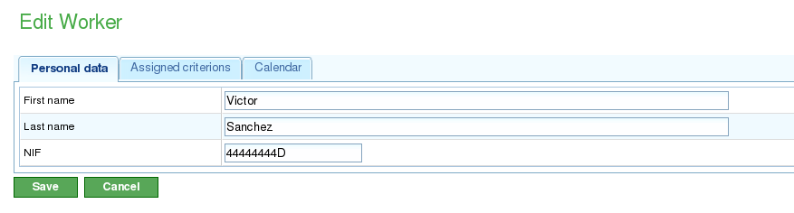
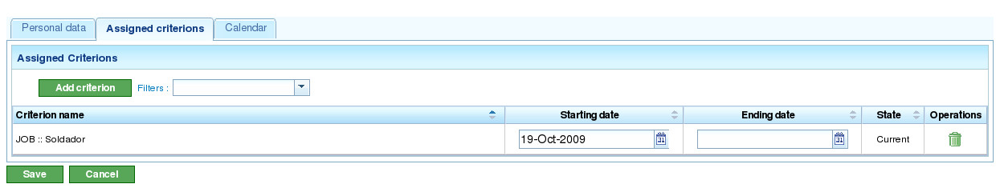
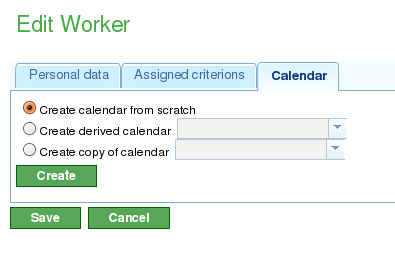
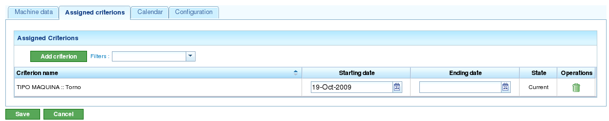
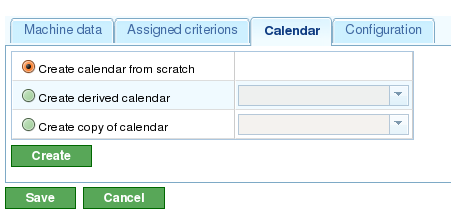

Xestión de recursos
###################

.. _recursos:
.. contents::

A aplicación xestiona dous tipos de recursos diferentes: recursos traballadores e recursos máquinas.

Os recursos traballadores representan os traballadores das empresas. As características principais son:

   * Satisfarán un ou varios criterios de tipo xenérico ou tipo traballador.
   * Son asignables específicamente a unha tarefa.
   * Son asignables como parte da asignación xenérica a unha tarefa que requira un criterio que satisfai o traballador.
   * Disporán de un calendario por defecto ou específico se así o decide o usuario.

Os recursos máquina representan as máquinas das empresas. As características principais son:

   * Satisfarán un ou varios criterios de tipo xenérico ou tipo máquina.
   * Son asignables específicamente a unha tarefa.
   * Son asignables como parte da asignación xenérica a unha tarefa que requira un criterio que satisfai a máquina.
   * Disporán de un calendario por defecto ou específico se así o decide o usuario.
   * Contará un unha pantalla de configuración na que se poderá establecer un valor *alfa* que represente a relación entre máquina e traballador.

      * O *alfa* representa canto tempo dun traballador é necesario para que a máquina funcione. Por exemplo, un alfa de 0.5 indica que de cada 8 horas de máquina son necesarias 4 de un traballador.
      * É posible asignar un *alfa* de xeito específico a un traballador, é dicir, elíxese o traballador que estará ocupado esa porcentaxe do seu tempo coa máquina.
      * Ou ben, é posible facer unha asignación xenérica en base a un criterio, de xeito que se asigna unha porcentaxe do uso a todos os criterios que satisfán ese criterio e teñen tempo dispoñible. O funcionamento da asignación xenérica será a mesma que a explicada para asignacións xenéricas a tarefas.

O usuario poderá crear, editar e invalidar (nunca borrar definitivamente) traballadores da empresa dende a pestana de "Recursos". Dende dita pestana existen as seguintes operacións:

   * Listado de traballadores: Os traballadores amosaranse listados e paxinados, dende onde poderán xestionar os seus datos.
   * Listado de máquinas: As máquinas amosaranse listados e paxinados, dende onde poderán xestionar os seus datos.

Xestión de traballadores
========================

A xestión de traballadores realizarase dende a pestana de "Recursos" e a operación de "______". Dende a lista de recursos é posible editar cada un dos traballadores premendo na icona estándar de edición.

Unha vez na edición dun recurso, o usuario poderá acceder ás seguintes pestanas:

1) Pestana de datos de traballador. Esta pestana permitirá editar os datos básicos de identificación do traballador.

      * Nome
      * Apelidos
      * DNI

2) Pestana de criterios. Dende este punto poderase configurar os criterios que un traballador satisfai. O usuario poderá asignar calquera valor de criterio de tipo traballador ou xenérico que así considere a un traballador. É importante, para que a aplicación sexa utilizada en todo o seu valor, que os traballadores satisfagan criterios. Para asignar criterios o usuario debe:

   i. Premer no botón "______".

   ii. Buscar o criterio que desexa engadir e seleccionar o que encaixe coa súa procura.

   iii. Premer no botón de engadir.

   iv. Seleccionar data de inicio do criterio dende o momento que deba aplicarse.

   v. Seleccionar a data de fin de aplicación do criterio ó recurso. Dita data non é obrigatoria indicando que o criterio é indefinido.

3)  Pestana de calendario. Pestana dende a que se pode configurar un calendario específico para a máquina. Cada máquina disporá de un calendario por defecto asignado, sen embargo, será posible asignar un calendario específico para cada un a partir da creación dun baleiro, copia a partir dun existente ou creación a partir dun calendario derivado.

A asignación de recursos explícase na sección de asignación de recursos.

Xestión de máquinas
===================

As máquinas son recursos a todos os efectos, polo cal, tal e como sucede cos traballadores, as máquinas serán administrables e asignables a tarefas. A asignación de recursos tratarase na sección de asignación. Neste punto explicaranse as características específicas das máquinas.

As máquinas son administradas dende a sección de recursos. En dita sección existe unha operación chamada "Listado de máquinas" que permitirá a visualización das máquinas que dipoñen nunha empresa. A partir deste listado poderáse editar ou borrar unha máquina.

A edición dunha máquina o sistema maosará unha serie de pestanas dende as cales se permitirá administrar a seguinte información:
1) Pestana de datos da máquina. Pestana para a eEdición de datos identificativos das máquinas. Os datos modificables nesta pestana son:

   i Nome.
   ii Código da máquina.
   iii Descrición da máquina.

.. figure:: images/machine-data.png
   :scale: 70

2) Pestana de criterios. Tal e como se comentou na anterior sección de recursos traballadores, esta será a pestana na que se poden engadir criterios que satisfán as diversas máquinas do sistema. Os criterios que serán asignables ás máquinas serán aqueles que se identificaran como criterios de máquina ou xenéricos. Non se poderán asignar criterios de traballadores. Para asignar criterios o usuario deberá:

   i. Premer no botón "______".

   ii. Buscar o criterio que desexa engadir e seleccionar o que encaixe coa súa procura.

   iii. Premer no botón de engadir.

   iv. Seleccionar data de inicio do criterio dende o momento que deba aplicarse.

   v. Seleccionar a data de fin de aplicación do criterio ó recurso. Dita data non é obrigatoria indicando que o criterio é indefinido.

3)  Pestana de calendario. Pestana dende a que se pode configurar un calendario específico para a máquina. Cada máquina disporá de un calendario por defecto asignado, sen embargo, será posible asignar un calendario específico para cada un a partir da creación dun baleiro, copia a partir dun existente ou creación a partir dun calendario derivado.

4) Pestana de configuración de máquinas: Dende esta pestana será posible configurar a relación das máquinas cos recursos traballadores existentes. Unha máquina disporá de un alfa que indicará a relación entre a máquina e os recursos implicados, tal e como xa se comentou, un alfa de 0.5 indicará que se consumirá traballo de 0.5 persoas para cada xornada completa de máquina. O sistema, a partir dun alfa, crea automáticamente asignacións á traballadores que estean dalgún xeito relaciondao coa máquina unha vez se asigna unha máquina a unha tarefa. A forma de relacionar un traballador con unha máquina pódese facer de dous xeitos:

   i Asignando específicamente un rango de datas nas que o traballador se desexa asignar a unha máquina. Será unha asignación específica de modo que o sistema asignará automáticamente horas ó traballador cando se planifique a máquina.
   ii Asignando específicamente criterios que se desexa satisfagan os traballadores que sexan asignados ás máquinas. Deste xeito farase unha asignación xenérica ós traballadores que satisfan os criterios.
