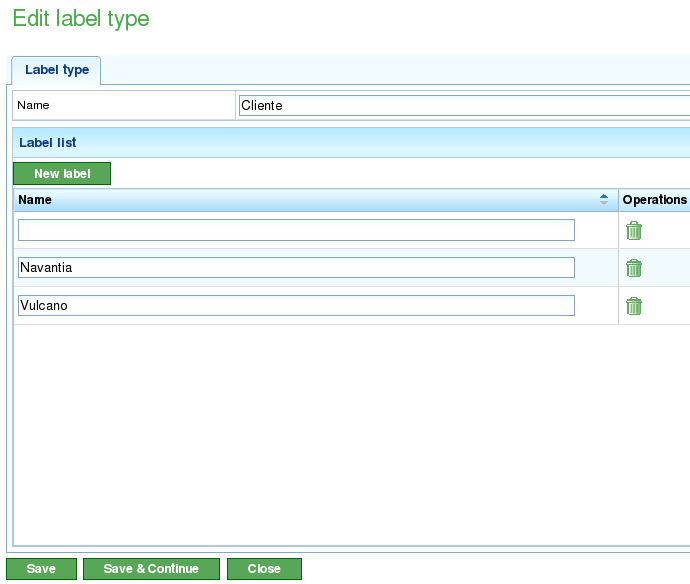

Etiquetas
#########

.. contents::

As etiquetas son entidades que se utilizan na aplicación para a organización conceptualmente de tarefas ou elementos de pedido.

As etiquetas categorizanse segundo os tipos de etiquetas. Unha etiqueta só pertencerá a un tipo de etiqueta, sen embargo, nada impide crear tantas etiquetas similares que pertenzan a tipos de etiquetas diferentes.

Tipos de etiquetas
==================

Os tipos de etiquetas utilizanse para agrupar tipoloxías de etiquetas que os usuarios desexen xestionar na aplicación. Exemplos de tipos de etiquetas posibles:

   i. Cliente: O usuario podería estar interesado en etiquetar as tarefas, pedidos ou elementos de pedido en base ó cliente que os solicitou.
   ii. Zona: O usuario podería estar intersado en etiquetar as tarefas, pedidos ou elementos de pedido en base á zona na que se realizan.

A administración de tipos de etiquetas xesiontarase dende a opción de menú de "Administración". Será dende esta opción, dende a que o usuario poderá editar tipos de etiqueta, crear novos tipos de etiqueta ou engadir etiquetas a tipos de etiquetas. Dende dita operación poderá accederse ó listado de etiquetas.

.. figure:: images/tag-types-list.png
   :scale: 50

Dendo o listado de tipos de etiquetas será posible:

   i. Crear novo tipo de etiquetas.
   ii. Editar un tipo de etiquetas existente.
   iii. Borrar un tipo de etiquetas con todas as súas etiquetas.

Tanto a edición como a creación de etiquetas comparten formulario. Dende dito formulario o usuario poderá, asignar un nome ó tipo de etiquetas, crear ou borrar etiquetas e almacenar os cambios. Para realizar esto:

   i. O usuario debería seleccionar unha etiqueta a editar ou premer no botón de creación de unha nova.
   ii. O sistema amosará un formulario con unha entrada de texto para o nome e un listado de entradas de texto coas etiquetas existentes e asignadas.
   iii. Se o usuario desexa engadir unha nova etiqueta debe premer no botón "______".
   iv. O sistema amosará unha nova fila ó listado con unha entrada de texto baleira que o usuario debe editar.
   v. O usuario introduce un nome para a etiqueta.
   vi. O sistema engade o nome ó listado.
   vii. O usuario preme en "______" para gardar e saír ou "______ e ______" para gardar e continuar editando o formulario.

Etiquetas
=========

As etiquetas son entidades que pertencen a un tipo de etiqueta. Estas entidades poden ser asignadas a elementos de pedido. O feito de asignar unha etiqueta a un elemento de pedido fará que todos os elementos descendentes dese elemento herden a etiqueta á que pertencen. O feito de contar con unha etiqueta asignada permitirá que eses elementos saian filtrados nos puntos nos que se ofrecerá a posibilidade de procura:

   i. Procura de tarefas no diagrama de Gantt.
   ii. Procura de elementos de pedido no listado de elementos de pedido.
   iii. Filtrados para informes.

A asignación de etiquetas a elementos de pedido será cuberta no capítulo de pedidos.