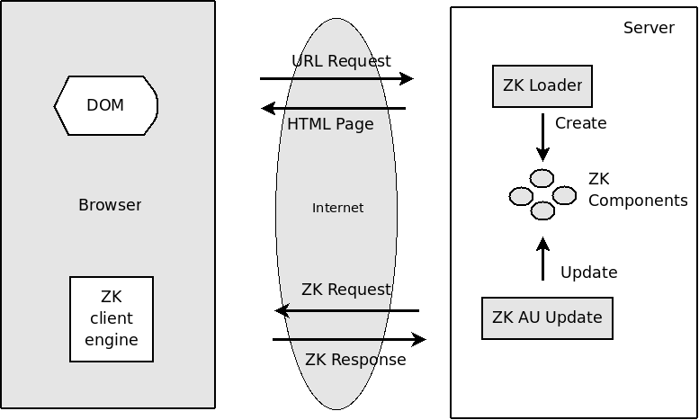
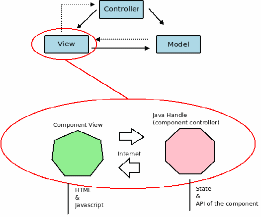

Guía de Arquitectura
#####################

Arquitectura basada en capas
============================

A aplicación LibrePlan utiliza unha arquitectura de organización do código baseada en capas. Consiste en organizar o software nunha serie de divisións horizontais lóxicas. Estas divisións horizontais organízanse xerarquicamente de forman que descansa cada unha na capa que ten debaixo. Así ata a capa máis profunda. Nesta estruturación séguense os seguintes preceptos:
   - Cada capa ten un conxunto de responsabilidades que corresponden a un determinado nivel de abstracción.
   - Unha capa ofrece servizos a capa de nivel superior.
   - Unha capa usa os servizos ofertados pola capa de nivel inferior.

As capas de que consta LibrePlan son as seguintes:
   - Capa de presentación - interfaz web.
   - Capa de interfaz servizos web.
   - Capa de lóxica de negocio.
   - Capa de persitencia.

A continuación se explicará brevemente cada unha destas capas.

Capa de presentación - interfaz web
-----------------------------------

A capa de interfaz web corresponde coa parte do programa que se encarga de implementar as páxinas HTML/Javascript que permiten aos usuarios realizar as operacións necesarias para planificar a empresa.

Dentro da interfaz web se fai uso do patrón MVC (Model-View-Controller) para estruturar cada unha das pantallas.

No patrón MVC distínguense 3 partes estruturais.
   - **Vista (View)**. A vista inclúe os compoñentes software que se encargan de representar os widgets dos que se compón a
     interfaz gráfica. No caso dunha aplicación de escritorio os widgets da vista se renderizan pintándose a través das librerías
     gráficas do sistema operativo. No caso dunha aplicación como ésta, unha aplicación con interfaz web, os widgets se renderizan a
     través de HTML/Javascript e esta renderización e levada a cabo polo navegador web do usuario que accede a aplicación.
   - **Modelo (Model)**. O modelo encapsula por unha banda os datos que se xestionan a través da vista e ofrece o controlador
     operacións para actuar sobre eles. Na arquitectura está representado por clases que teñen xestionado o seu ciclo de vida a través
     do contedor de inxeción de dependencias que se usa *Spring framework*. Son clases conversacionais que rexistran o estado de
     interacción do usuario cunha determinada pantalla na que esté operando.
   - **Controlador (Controller)**. O controlador é o compoñente software - materializado en LibrePlan nunha clase de orientación a
     obxectos - que se encarga de atender as notificacións, peticións procedentes da vista e de solicitar ao modelo que realice as
     operacións pertinentes acordes coas ordes que o usuario emite ao programa a través da interfaz.

É unha capa que non ten ningunha por enriba, é dicir, interactúa directamente co usuario.

Capa de interfaz de servizos web
--------------------------------

A capa de servizos web é unha capa paralela a capa de interfaz web que ofrece servicios web REST para ofrecer funcionalidades de exportación/importación de datos dunha instalación da aplicación co exterior. Conténplanse dous tipos de comunicacións a través de servizos web:
   - **Integración con outras aplicacións**. Quedarían englobados aquí os ERP que desexen interactuar con LibrePlan.
   - **Integración con outras instalacións de LibrePlan**. Dúas instalacións de LibrePlan en sendas empresas permiten interactuar
     para a subcontratación de pedidos e o reporte de avances dos mesmos.

Capa de lóxica de negocio
-------------------------

A capa de lóxica de negocio atópase por debaixo da capa de interfaz web e dos servizos web. É unha capa que está constituida por clases que capturan as regras existentes no dominio da aplicación - planificación de empresas do naval -. Nela existen dous tipos de clases:
   - **Entidades**. Son clases que representan conceptos que teñen persistencia no dominio. Quere dicir esto que representan datos
     que se van almacenar. Ademáis, levan asociado comportamento que ten que ver cos datos que representa a entidade.
   - **Clases de comportamento**. Nalgúns caso pode haber clases que teñen únicamente comportamento e non datos. Esto se deseña na
     arquitectura cando se quere reutilizar o comportamento entre varias entidades ou cando desacoplalo da entidade proporciona maior
     flexibilidade e esta é requerida.

Aplícase, por tanto, na arquitectura o patrón de deseño *Domain Model* [1]_. Básicamente consiste en que sexan os obxectos do dominio os que capturen o comportamento de maneira que a reutilización deste comportamento se leva a cabo a través destes obxectos. Como estes obxectos son usados polas capas superiores e teñen o comportamento embebido neles conséguese esta reutilización independentemente do servicio no cal se usan. Esto evita que se cometan erros e se duplique código.

.. [1] Patterns of enterprise application architecture. Martin Fowler.

Capa de persistencia
--------------------

A capa de persistencia atópase por debaixo da capa de lóxica de negocio e é a encargada da gravación das entidades na base de datos. Na aplicación utilízase unha solución ORM - Object Relational Mapping - para o mapeo das clases que representan os obxectos do dominio a súa representación en táboas de bases de datos relacionais. Esta solución ORM se encarga tanto de convertir a entidades as consultas que se lanzan sobre o sistema de persistencia como de facer a tradución das entidades ás filas correspondentes das táboas da base de datos.

A solución arquitectónica usada na capa de persistencia permite que o programa se poida executar sobre diferentes bases de datos.

Non se inclúen directamente sentencias SQL no código do programa, senón que en base a unha linguaxe propia do ORM se traducen as sentencias SQL adecuadas a cada sistema xestor de base de datos.

O ORM utilizado é Hibernate.

Tecnoloxías usadas e relación con cada capa
===========================================

Spring Framework
----------------

Spring Framework principalmente é un framework que proporciona un contedor de inxección de depedencias que permite a implementación do patrón de deseño IoC [2]_.

Resumidamente este principio de deseño permite desacoplar, é dicir, facer independentes, unhas parte dun programa de outras. Facendo independentes unhas partes de outras propicia que a arquitectura do programa permita cousas como cambiar unha determinada implementación por outra e que as cousas sigan a funcionar. Por exemplo, LibrePlan permite a sustitución do ORM que implementa agora mesmo a persistencia, Hibernate, por outro ORM ou outra solución de almacenamento como usar directamente JDBC.

A través do contedor de inxección de dependencias tamén se permite xestionar o ciclo de vida dos obxectos que se crean recorrendo ao contedor - *beans* de Spring -. Por exemplo, pódese configurar que un *bean* teña ámbito *Singleton* [3]_ ou ben que se devolva unha nova instancia da clase do *bean* cada vez que se solicita unha nova referencia ao contedor.

Ademáis de cómo contedor lixeiro de inxección de dependencias Spring Framework úsase na aplicación con outras finalidades:

   - **Cómo xestor das transaccións para Hibernate**. Utilízase Spring para a xestión das transacción a través do ORM que se usa na
     arquitectura Hibernate. De maneira declarativa a través de Spring se abren e xestionan as sesións de persistencia de Hibernate e
     se manexan as transaccións das operacións coa base de datos.
   - **Como planificador de tarefas**. Hai determinadas operacións que hai que executar periódicamente durante a execución da aplicación e, para elo, a través de Spring faise uso do *scheduler Quartz* [4]_.
   - **Nos tests de unidade Spring TestContext**. Para a realización das probas de unidade úsase o framework *JUnit*. Agora ben, non se fai directamente senón a través da sección de Spring denominada como *Spring TestContext*. Con esta parte permítese utilizar *JUnit* de forma declarativa sen anotacións e, incluso, ser agnósticos de JUnit xa que permite que sexa sustituido por outro framework como *TestNG*.

.. [2] Inversion de control
.. [3] Ver http://en.wikipedia.org/wiki/Singleton_pattern
.. [4] Ver http://www.opensymphony.com/quartz/

Framework ZK
------------

Na interfaz web para proporcionar a experiencia de usuario desexada elixiouse o uso do framework ZK. ZK é un framework Java/Javascript construido sobre a especificación de Servlets. Desta maneira, para desplegar a aplicación web necesítase un contedor de Servlets.

ZK defínese como un framework orientado a eventos baseado en compoñentes que ten por obxectivo permitir a programación de interfaces ricos na web. ZK está composto por un motor AJAX orientado a eventos, un conxunto de compoñentes XUL [5]_ ou XHTML e unha linguaxe de etiquetas denominada ZUML - *ZK User interface Modeling Language* - que permite especificar como se compoñen as distintas páxinas dunha aplicación web mediante a escritura de ficheiros ZUML.

A filosofía de traballo co framework ZK consiste en representar a aplicación a través de compoñentes ricos XUL e XHTML e en manipular
estes compoñentes a través da captura dos eventos que son disparados froito da interacción do usuario coa aplicación. Isto consiste en
trasladar o modelo de programación levado a cabo nas aplicacións de escritorio á web. AJAX é usado como medio de comunicación entre os
eventos lanzados froito da interacción de usuario e o contedor de Servlets. A utilización de AJAX por parte do framework para levar a cabo esta comunicación é transparente para o programador, o cal permite incrementar a produtividade ao verse o programador libre de non ter que xestionar todos estes eventos a través da tecnoloxía AJAX. Desta maneira, co framework ZK simplifícase o desenvolvemento de aplicacións ricas AJAX dos modos seguintes:

   - O motor orientado a eventos permite utilizar o modelo de programación intuitivo do escritorio e levalo a web. Os compoñentes XUL e XHTML proporcionan ao usuario bloques para a construción de interfaces web reutilizables e que fan esta labor vistosa e produtiva.
   - A utilización do linguaxe de etiquetas ZUML permite ao desenvolvedor especificar como son as pantallas da aplicación web dunha maneira comparable a como se pode especificar como é unha páxina HTML estática.

Ademais de presentar todas as vantaxes anteriores para o desenvolvedor de cara o resultado co usuario, unha característica que debe ser apreciada é a capacidade do framework de proporcionar interfaces ricas que, sen lugar a dúbidas, aumentan a experiencia do usuario en varios frontes:

   - Por unha banda, os compoñentes XUL e XHTML son compoñentes baseados en AJAX e con Javascript que manipula o DOM. Isto permite que os cambios que hai nunha páxina se efectúen manipulando o HTML e non tendo que recargar toda a páxina, o cal fai que o tempo de resposta e a experiencia do usuario mellore considerablemente.
   - A través de Javascript tanto os compoñentes proporcionados polo framework, como os que pode implementar o desenvolvedor, poden proporcionar efectos e formas de interacción dinámicos que fan a experiencia máis produtiva e intuitiva. Por exemplo, pódese citar o efecto de arrastrar e soltar, elementos dinámicos á hora de despregar listados, mostrar elementos, etc...
   - ZK está baseado en HTML e Javascript e soporta os principais navegadores do mercado. Debido a isto ten como vantaxe este framework que pode ser accedida a súa funcionalidade avanzada usando un navegador estándar.

Esquema de funcionamento AJAX
~~~~~~~~~~~~~~~~~~~~~~~~~~~~~

Agora explicarase moi brevemente a través dunha figura como ZK implementa o comportamento descrito, como transparentemente ao
usuario e coa utilización de Ajax leva o modelo baseado en eventos do escritorio á web.

   Diagrama de arquitectura de ZK framework.

Pódense observar no diagrama 3 partes:
   - ZK Loader. É conxunto de Servlet Java que se encarga de responder as peticións normais HTTP do navegador web.
   - ZK AU Engine. Conxunto de Servlets que se encarga de recibir/responder as peticións Ajax.
   - ZK Client Engine. Código Javascript que se encarga de actualizar o DOM e capturar os eventos do usuario.

O mecanismo representado é o seguinte:
   1. O ZK Loader interpreta unha petición entrante e xera a correspondente páxina HTML, incluíndo HTML, CSS, código Javascript usando compoñentes ZK no lado do servidor.
   2. O ZK Loader envía unha páxina HTML ao cliente e ao ZK Client Engine. O ZK Client Engine reside na parte do cliente para monitorizar os eventos Javascript enviados polo browser.
   3. Se calquera evento Javascript é lanzado, o ZK Client Engine envía estes eventos, a través de peticións Ajax, ao ZK AU Engine.
   4. O ZK AU Engine recibe as peticións AJAX, actualiza as propiedade dos compoñentes ZK e envía a resposta Ajax de volta a parte cliente.
   5. O ZK Client Engine recibe a resposta e actualiza os cambios indicados na árbore DOM do browser.

O uso de ZK abrangue únicamente á capa de presentación - interfaz web - de maneira que é fai que a aplicación sexa independente deste framework en capas inferiores.

Unha característica arquitectónica de ZK remarcable é que un framework centrado no servidor. Esta frase significa que os widgets que conforman as páxinas dunha aplicación web existen como obxectos na parte servidora (contedor de Servlets) e é o propio framework o que xestiona toda a complexidade de por en comunicación o navegador de usuario coa parte servidora. A captura de eventos no navegador, o seu transporte ata o servidor, a comunicación dos cambios que se fagan no servidor nun widget ata o navegador e a modificación do DOM para reflexar estes cambios é feito de forma transparente polo framework ZK.

Esto fai que sexa fácil aplicar o patrón MVC, explicado con anterioridade. En particular ZK ocúpase exclusivamente da parte de vista e interven un pouco na parte do controlador. O programador toma o control dende o controlador ata o modelo. O diagrama seguinte explica como se materializa con ZK o patrón MVC.

   Patrón MVC aplicado en ZK framework

A parte de vista, a cargo de ZK, como se ve, está formada por dúas partes: A parte servidora, e a parte HTML/Javascript. A parte servidora está constituida por obxectos Java que representan os widgets presentes no navegador nunha determinada páxina e a parte de HTML/Javascript é a renderización do widget a través de elementos HTML e JS.

.. [5] XUL. XML-based User interface Language. Aplicación de XML para describir unha interfaz de usuario. É usada por Firefox.

Timeplot
--------

TODO
----
   * Ferramentas

      * Ferramentas externas: Cutycap
      * JFreeChart.
      * YUI. Libreria Javascript para compoñentes.
      * JasperReports para informes.
      * Jgrapht. Grafo de tarefas.

   * Servicios web REST.

      * JAX-RS API.
      * Apache CXF.

   * Framework Spring security. Para autenticación.
   * Hibernate Validator para validacións.
   * Framework auxiliares:

      * JODA
      * Gettext para internacionalizacion.
      * Apache Math.

Relación das capas cos paquetes e módulos do proxecto
=====================================================

Proxecto organizados en módulos: Definicion de modulo.

   * Modulo libreplan-business
     Concepto de servidor. Abarca as capas de loxica de negocio e persistencia.
   * Modulo libreplan-webapp.
     Toda a interfaz e servicios conversacionais e servicios web.
   * Modulo ganttzk.
     Modulo para compoñentes ZK de

