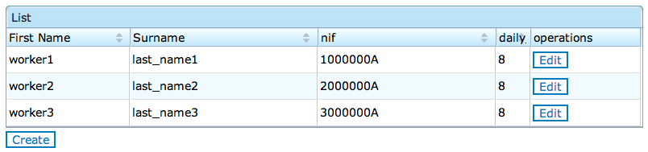
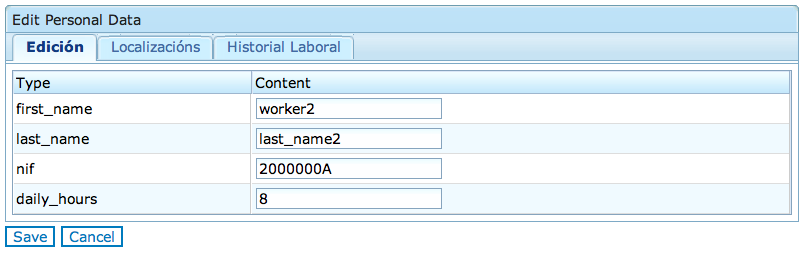
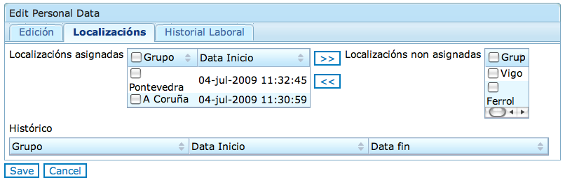
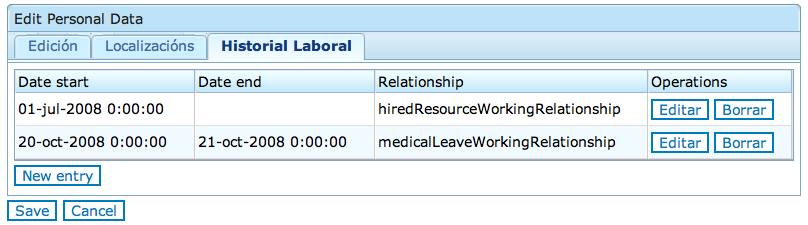
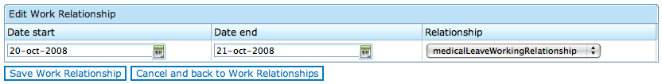
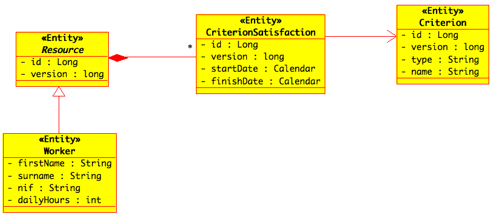
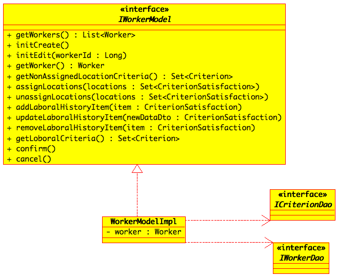
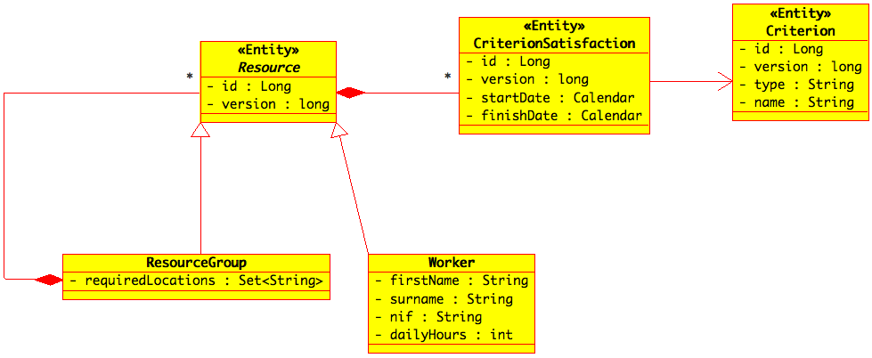

Guía de Desenvolvemento
#######################

Introdución
===========

Arquitectura Model-View-Controller
==================================

Capa de lóxica de negocio
=========================

  * FIXME[¿Recomendar usar sempre tipo de acceso property para as propiedades persistentes das entidades? - Importante para id (para que getId non inicialice o proxy) e version (para poder definir getVersion da maneira que requiren os reattachments en pasos intermedios)]
  * FIXME[¿recomendar que setId e setVersion sexan privados, para que só Hibernate lles poida dar valor?]

  * FIXME[Comenta-lo uso de DTOs]

  * FIXME[Insistir en que na realización dos métodos dos DAOs (xenérico e concretos) é preciso facer try-catch para converti-las excepcións de runtime de Hibernate á xerarquía de Spring]

Capa Web
========

Conversacións
=============

Conceptos xerais
----------------

Unha **conversación** representa un caso de uso no que o usuario emprega unha serie de **pasos** para editar/crear un ou varios obxectos persistentes, e finalmente executa un paso para confirmar ou cancela-los cambios. Como exemplo de conversación, **podemos** considera-la edición/creación dos datos dun traballador, na que o usuario emprega unha serie de pasos para modifica-la información básica do traballador (e.g. nome) e modifica/elimina/engade datos da súa historia laboral (e.g. data de contratación) ou das súas localizacións de traballo.

Dende o punto de vista dun usuario final, unha conversación ten que cumprir dúas propiedades:

  * **Detección de información obsoleta**. Mentres o usuario está a editar un obxecto persistente, outro usuario concorrentemente pode estar a editar ese mesmo obxecto. Nesta situación, se non se toma ningunha medida, o usuario que confirme máis tarde, sobrescribe os cambios feitos polo primeiro. A detección de información obsoleta ten que acadarse como mínimo no paso de confirmación.
  * **Atomicidade**. Se o usuario elixe cancela-los cambios, ningún deles se debe materializar na base de datos. Se elixe confirmalos, todos eles se deben materializar na base de datos. A maneira máis sinxela e práctica de acadar esta semántica consiste en que só se modifique a base de datos no paso de confirmación.

Dende o punto de vista do desenvolvedor, a realización dunha conversación:

   * Ten que garanti-la semántica (detección de información obsoleta e atomicidade) esperada polo usuario.
   * Contén como **estado** os datos que o usuario está a editar ou crear.
   * Normalmente dispón dun conxunto de operacións (pasos), que se poden invocar de acordo o seguinte **protocolo**:

       # Paso inicial: unha operación (de varias posibles) para inicia-la conversación (e.g. carga-lo obxecto persistente ou crear unha versión inicial, dependendo de se edita ou se crea).
       # Pasos intermedios: un conxunto de operacións que manipulan o estado.
       # Paso final: unha operación (de varias posibles) para remata-la conversación, normalmente: confirmación (para materializa-los cambios na base de datos) ou cancelación (para descarta-los cambios).

Conceptos específicos a Hibernate
---------------------------------

Existen varias estratexias para realizar conversacións con Hibernate: *session-per-request-withdetached-objects*, *session-per-conversation* e extende-lo contexto de persistencia con JPA (con ou sen EJB 3.0). No contexto do proxecto, a opción mais viable é a estratexia *session-per-requestwith-detached-objects*, que se basea en modela-lo estado da conversación como obxectos en estado *detached*. Esta estratexia é a que se asumirá no resto do documento.

Para logra-la propiedade de detección de información obsoleta, as entidades que conforman o estado da conversación empregarán o campo *version*, de tipo *long/Long*. A `figura 1`_ amosa a definición do campo *version* na entidade *Resource*. A `figura 2`_ amosa a especificación do campo *version* no ficheiro de mapping (o tipo de acceso por defecto as propiedades persistentes é *property*). O método *setVersion* definiuse como privado para que só Hibernate o poida invocar, evitando así posibles erros de programación.

::

 public abstract class Resource {
     ...
     private long version;
     ...
     public Long getVersion() {
         return version;
     }
     private void setVersion(Long version) {
         this.version = version;
     }
     ...
 }

_`Figura 1`. Definición do campo version nunha entidade.

Deste xeito, cando se actualicen en base de datos os obxectos que conforman o estado da conversación (*no* commit do paso de confirmación), Hibernate pode detectar se a versión do obxecto é igual que a que hai en base de datos. Se é a mesma, o obxecto actualízase en base de datos e increméntase a versión. Noutro caso, Hibernate lanza a excepción *org.hibernate.StaleObjectStateException*, que Spring converte a *org.springframework.dao.OptimisticLockingFailureException* (en adiante, *OptimisticLockingFailureException*). Esta última excepción debe capturarse dende a capa Web (seguramente de maneira xenérica, é dicir, común a tódolos casos de uso) para informar ó usuario de que outro usuario estaba a actualiza-los mesmos datos e confirmou antes que el.

::

 <class name="Resource">
   ...
   <!-IMPORTANT: type="java.lang.Long" must be specified (otherwise,
      Hibernate infers type="integer".
   -->
   <version name="version" type="java.lang.Long"/>
   ...
 </class>

_`Figura 2`. Especificación do campo version no ficheiro de mapping.

Para logra-la propiedade de atomicidade, só o último paso debe modifica-la base de datos. Dependendo da complexidade da conversación, esta propiedade require mais o menos esforzo de codificación. O caso mais sinxelo corresponde a unha conversación que teña a seguinte estrutura:

  * Paso inicial: carga o obxecto persistente de base de datos en caso de edición, ou crea una versión inicial en memoria no caso de creación. En ambos casos, o obxecto quedará en memoria e forma parte do estado da conversación. No primeiro caso, o obxecto estará en estado *detached* e no segundo en estado *transient*.
  * Pasos intermedios: validan as modificacións feitas polo usuario e modifican o estado en memoria (se é posible; en outro caso, infórmase ó usuario). No caso mais sinxelo, non é necesario pasa-lo obxecto de estado *detached*/*transient* a *persistent*, é dicir, engadilo na sesión de Hibernate.
  * Paso de confirmación: valida todo o estado é materialízao na base de datos. Para materializa-lo estado na base de datos, é preciso pasa-lo obxecto de estado *detached*/*transient* a *persistent*, é dicir engadilo na sesión de Hibernate. O paso de *detached* a *transient* coñécese có nome de *reattachment*. Existen varias formas de lograr tanto o *reattachment* coma o paso de *transient* a *persistent*. A forma mais consolidada e xeral consiste no uso da operación *Session::saveOrUpdate*, que contempla ambos casos. A operación *IGenericDao::save* (e a súa realización por defecto *GenericDaoHibernate::save*) proporciona esta semántica. En consecuencia, e para simplifica-lo texto, referirémonos sempre como reattachment ó uso de *IGenericDao::save* (tanto si o obxecto era *detached* coma se era *transient*). É importante darse conta que có modo normal de traballo con Spring e Hibernate, Hibernate non lanza as consultas de actualización/inserción/eliminación no momento de invocar a *IGenericDao::save*, senón que o obxecto corresponde engádese á sesión e planifícase para actualización/inserción na base de de datos cando se faga o *commit* (Spring) da transacción.

O apartado `Un exemplo inicial`_ explica como realizar unha conversación na que é posible emprega-la anterior estrutura. As conversacións máis complexas requiren emprega-la técnica de reattachment en pasos intermedios. O apartado `Técnicas avanzadas`_ discute as técnicas **necesarias**.

Un exemplo inicial
------------------

Nesta sección preséntase un exemplo do caso máis sinxelo de realización dunha conversación, é dicir, unha na que non hai que facer *reattachment* en pasos intermedios. Para elo considerarase o caso de uso de edición dos datos dun traballador. Este caso de uso está **inspirado** nun caso de uso real do proxecto, simplificado e modificado con respecto á realización real para explicar só os aspectos relativos á realización dunha conversación, sen complexidades adicionais.

_`Figura 3` : Listado de traballadores.

Neste exemplo, para crear ou edita-los datos dun traballador, o usuario accede a unha pantalla que lle amosa un listado cós traballadores existentes (`figura 3`_). A continuación, utiliza o botón Create para crear un novo traballador, ou o botón *Edit* dun traballador existente para edita-los seus datos.
Ambos botóns inician a conversación de creación ou edición do datos dun traballador. En ambos casos, o usuario accede a un *wizard* que contén tres pestanas para edita-los datos do traballador, un botón *Save* para confirmar tódolos cambios e un botón *Cancel* para cancela-los cambios. A primeira das pestanas (`figura 4`_) permite edita-los datos básicos do traballador. A segunda pestana (`figura 5`_) dispón de botóns para engadir ou eliminar localizacións do traballador. A terceira pestana (`figura 6`_) dispón de botóns para engadir, eliminar ou editar items da historia laboral (data de contratación, baixas laborais, etc.) do traballador. A `figura 7`_ amosa a edición/creación dun item da historia laboral do traballador. Unha vez que o usuario completa a edición dos datos, remata a conversación pulsando en *Save* (para materializa-los datos na base de datos) ou en *Cancel* (para descartalos). En ambos casos, vólvese ó listado xeral de traballadores (`figura 3`_).

_`Figura 4`: Edición dos datos básicos dun traballador.

_`Figura 5`: Edición das localizacións dun traballador.

_`Figura 6`: Edición da historia laboral dun traballador.

_`Figura 7`: Edición/creación dun item da historia laboral dun traballador.

A `figura 8`_ amosa as entidades que modelan os datos dun traballador. Un traballador é un tipo de recurso (*Resource*). A clase *Worker* contén os datos básicos do traballador. Cada traballador ten un conxunto de *CriterionSatisfaction* asociados (relación bidireccional 1:N). Unha instancia de *CriterionSatisfaction* modela de maneira xenérica algún tipo de situación laboral dun recurso nun intervalo temporal. En particular, cada localización dun traballador e cada item da súa historia laboral modélase coma una instancia de *CriterionSatisfaction*. En consecuencia, os *CriterionSatisfaction* dun recurso representan a súa situación laboral ó longo do tempo. Cada *CriterionSatisfaction* está asociado cunha instancia dun *Criterion*. Un *Criterion* representan unha clase de situación laboral, coma por exemplo, contratación ou baixa médica, no caso de relacións laborais, ou Coruña ou Pontevedra no caso de localizacións. Finalmente, é importante entender que os datos dun traballador veñen dados por unha instancia da clase *Worker* e os seus *CriterionSatisfaction* asociados. As instancias de *Criterion* son globais a tódolos traballadores, dado que representan clases de situacións laborais.

_`Figura 8`: Entidades que modelan os datos dun traballador.

A `figura 9`_ amosa a estrutura do modelo (sección 4) que representa a interacción do usuario para crear/edita-los datos dun traballador. A interface do modelo ven dada por *IWorkerModel*. *WorkerModelImpl* realiza a interface *IWorkerModel*. A clase *WorkerModelImpl* modélase como un servizo de Spring con estado, que entre outras cousas, contén o traballador en creación/edición.

_`Figura 9`: Modelo para a edición dos datos dun traballador.

A continuación coméntase o protocolo da conversación. Cando o usuario desexa visualiza-lo listado de traballadores (`figura 3`_), o controlador invoca a operación *IWorkerModel::getWorkers*. Se o usuario pulsa o botón Create ou o botón Edit dun traballador, o controlador invoca o método *IWorkerModel::initCreate* ou *IWorkerModel::initEdit*, respectivamente, iniciándose así a conversación para crear ou edita-los datos dun traballador. No primeiro caso, inicialízase o atributo worker de *WorkerModelImpl* creándose un *Worker* en memoria que non ten ningún *CriterionSatisfaction* asociado. No segundo caso, inicialízase o atributo worker recuperándose o *Worker* da base de datos mediante o DAO *IWorkerDao*. Sempre que o controlador precisa mostralos datos (e.g. datos básicos, localizacións e items da historia laboral) do worker en edición/creación, invoca *IWorkerModel::getWorker*, que devolve o worker almacenado en *WorkerModelImpl*. Resource dispón de métodos para devolve-los conxuntos de localizacións actuais e pasadas (`figura 5`_), e os items da historia laboral (`figura 6`_). Estes métodos son simples operacións de conveniencia que retornan o subconxunto [#]_ apropiado dos *CriterionSatisfaction* do recurso (traballador).

.. [#] O controlador pode ordenar (e.g. por data de inicio) este subconxunto empregando un java.util.TreeSet.

Para mostra-la lista ordenada de localizacións non asignadas actualmente ó traballador (`figura 5`_), o controlador invoca a *IWorkerModel:getNonAssignedLocationCriteria*. Cada vez que o usuario selecciona un conxunto de localizacións para asignar ou des-asignar, o controlador invoca a *IWorkerModel::assignLocations* ou *IWorkerModel::unassignLocations*. Cada vez que o usuario engade, modifica ou elimina un item da historia laboral (`figura 6`_), o controlador invoca *IWorkerModel::addLaboralHistoryItem*, *IWorkerModel::updateLaboralHistoryItem* ou *IWorkerModel::removeLaboralHistoryItem*. Para poder mostra-la lista desplegable (ordenada) do formulario da `figura 7`_, o controlador invoca *IWorkerModel::getLaboralCriteria*. A edición dos datos básicos (`figura 4`_) non supón ningunha interacción especial con *IWorkerModel* (os datos básicos non se validan ata o paso de confirmación). Finalmente, cando o usuario remata o proceso de edición de datos, se pulsa o botón Save, o controlador invoca a operación *IWorkerModel::confirm*. Esta operación materializa o atributo worker de *WorkerModelImpl* na base de datos. Se decide pulsa-lo botón Cancel, o controlador invoca a operación *IWorkerModel::cancel* para resetea-lo estado. En ambos casos (confirmación ou cancelación), o controlador invoca posteriormente a operación *IWorkerModel::getWorkers* para amosa-lo listado de traballadores.

A continuación coméntase a realización dalgunhas operacións de *IWorkerModel* na clase *WorkerModelImpl*. A `figura 10`_ amosa a realización da operación *getWorkers*. Esta operación simplemente delega no método homólogo do DAO *IWorkerDao*. Obsérvese que se empregou a anotación *@Transactional* có atributo *readOnly = true*. Tódalas operacións de *WorkerModelImpl* correspondentes a un paso inicial ou intermedio, e que usen directa ou indirectamente DAOs, empregarán esta mesma anotación, dado que: (1) os métodos dos DAOs só se poden empregar no contexto dunha transacción (*@Transactional*), e (2) as operacións correspondes a un paso inicial ou intermedio non modifican a base de datos (*readOnly = true*).

::

 @Transactional(readOnly = true)
 public List<Worker> getWorkers() {
     return workerDao.getWorkers();
 }

_`Figura 10`: *WorkerModelImpl::getWorkers*.

A `figura 11`_ amosa a operación *WorkerModelImpl::initEdit*. A operación inicializa o atributo worker cargando a instancia de *Worker* a partir do identificador do traballador. Dado que as relacións en Hibernate por defecto son *lazy* (independentemente da cardinalidade), o *worker* non terá inicializada a colección (*java.util.Set*) de *CriterionSatisfaction*. Sen embargo, as operacións correspondentes ós pasos intermedios precisan traballar cós *CriterionSatisfaction* do traballador, e cós *Criterion* asociados a cada *CriterionSatisfaction*. Do mesmo, xeito, a capa vista tamén asume que pode navegar polos *CriterionSatisfaction* (e *Criterion*) do traballador que devolve o método *WorkerModelImpl::getWorker*. Por este motivo, o código recorre a lista de *CriterionSatifaction* (a primeira iteración causa que a lista se inicialice) e invoca un método que non sexa get<<Clave>> sobre cada *Criterion* asociado, para inicializa-lo proxy do *Criterion* asociado ó *CriterionSatisfaction* desa iteración. O método *get<<Clave>>* é o único método que non causa a inicalización dun proxy, suxeito a que se empregue o tipo de acceso property para a clave (que é o tipo de acceso por defecto para tódalas propiedadespersistentes). É importante observar que esta incialización faise dende *WorkerModelImpl* no canto de facela dende un método de negocio da entidade Resource, dado que son as clase modelo as que coñecen as relacións que é preciso inicializar para levar a cabo a conversación.

::

  @Transactional(readOnly = true)
  public void initEdit(Long workerId) {
     worker = (Worker) workerDao.findExistingEntity(workerId);
     for (CriterionSatisfaction c : worker.getCriterionSatisfactions()) {
        c.getCriterion().getName();
     }
   }

_`Figura 11`: WorkerModelImpl::initEdit.

O método *getWorker* (`figura 12`_) simplemente devolve o atributo *worker*. A `figura 13`_ amosa a realización do método *updateLaboralHistoryItem*. O método recibe un *CriterionSatisfaction* que actúa como Data Transfer Object (DTO) [#]_ , é dicir contén os datos do formulario de edición (`figura 7`_) así como o identificador do *CriterionSatisfaction* (o valor do atributo version é irrelevante). Obsérvese que non sería correcto que a operación recibise o *CriterionSatisfaction* destino modificado polo controlador, dado que se a modificación non é correcta e o usuario na corrixe, o estado do worker quedaría inconsistente e podería afectar a validacións de interaccións posteriores. A operación *Resource::updateCriterionSatisfaction*comproba se é posible modifica-lo *CriterionSatisfaction* do worker cós datos recibidos no DTO. En caso de selo, copia os atributos do DTO no *CriterionSatisfaction* do worker, excepto os atributos *id* e *version*. Neste exemplo, a comprobación que realiza o método *updateCriterionSatisfaction* só se reduce a iterar por tódolos *CriterionSatisfaction* do worker (excepto o *CriterionSatisfaction* obxectivo) e comprobar que non haxa ningunha incompatibilidade cós datos recibidos no DTO (e.g. o rango temporal do DTO non debe solaparse con outros *CriterionSatisfaction*). En consecuencia, non se require facer un reattachment do worker na sesión de Hibernate, dado que a lóxica do método *updateCriterionSatisfaction* só itera polo conxunto *CriterionSatisfaction* asociados, que xa están cargados en memoria (no caso da edición do traballador, *WorkerModelImpl::initEdit* provoca a inicialización do conxunto de *CriterionSatisfaction* inicial, e tanto na edición coma na creación, os items da historia laboral vanse engadindo ó conxunto *CriterionSatisfaction* con *WorkerModelImpl::addLaboralHistoryItem*). Finalmente, tamén e importante darse conta que o método *Resource::updateCriterionSatisfaction* levanta a excepción *ResourceConstraintException* en caso de que non sexa posible actualiza-lo item da historia laboral (a capas vista/controlador deben notificar este error ó usuario final).

.. [#] Neste caso é posible reusa-la entidade *CriterionSatisfaction* coma un DTO, dado que esta entidade contén tódolos datos necesarios. Noutro caso, sería necesario definir unha clase pura DTO, é dicir, unha clase non persistente que contén os datos necesarios.

::

  public Worker getWorker() {
      return worker;
  }

_`Figura 12`: *WorkerModelImpl::getWorker*

::

  public void updateLaboralHistoryItem(CriterionSatisfaction newDataDto)
      throws ResourceConstraintException {
      worker.updateCriterionSatisfaction(newDataDto);
  }

_`Figura 13`: *WorkerModelImpl::updateLaboralHistoryItem.*

A `figura 14`_ mostra o código da operación *WorkerModelImpl::confirm*. O código encárgase de tres aspectos: (1) valida-los datos básicos do traballador mediante *Worker::validateBasicData* (que pode devolver *ResourceConstraintException*), (2) actualiza-lo worker e os seus *CriterionSatisfaction* asociados en base de datos e (3) resetea-lo estado. Con respecto ó primeiro aspecto, é importante recordar que a edición dos datos básicos do traballador non supónningunha interacción con *IWorkerModel*. Por contra, durante a edición dos datos básicos do traballador, o controlador modifica directamente o obxecto retornado por *IWorkerModel::getWorker* (o estado da conversación). En consecuencia, no paso de confirmacióné preciso valida-los datos básicos. É importante observar que se os valores dos datos básicos influíran no resto de validacións (e.g. nos items da historia laboral), o controlador non debería traballar directamente có obxecto retornado por *IWorkerModel::getWorker*, senón empregar un DTO cós datos básicos do traballador e pasalo como parámetro en *IWorkerModel::confirm* (dado que valores erróneos nos datos básicos poderían influír negativamente noutras validacións mentres o usuario non os corrixa), de maneira similar a como se fixo con *IWorkerModel::updateLaboralHistoryItem* (`figura 13`_). Así mesmo, tamén sería preciso facer unha validación de tódolos datos do traballador (datos básicos e conxunto de *CriterionSatisfaction*) en *WorkerModelImpl::confirm*.

Con respecto ó segundo aspecto, o código invoca a operación *IGenericDao::save*, que como se explicou anteriormente (apartado `Conceptos específicos a Hibernate`_), causa un *reattachment* do *worker* na sesión de Hibernate, de maneira que cando se faga o commit da transacción, Hibernate engadirá ou actualizará o *worker* na base de datos. Dado que se pretende que tamén se actualicen en base de datos (actualizándose/engadíndose/elimándose) os *CriterionSatisfaction* asociados ó *worker*, é preciso facer que o reattachment do worker se propague en cascada ós *CriterionSatisfaction* asociados. Para elo, basta empregar unha opción de cascada no mapping da relación entre Resource e *CriterionSatisfaction* que como mínimo inclúa *save-update*. Ademais, como cada instancia dun *CriterionSatisfaction* só se referenciada dende un só recurso, e dende ningunha outra entidade, para provocar que os *CriterionSatisfaction* eliminados (items da historia laboral) no só se desasocien do traballador en edición, senón que tamén se eliminen da base de datos automaticamente, é posible emprega-la opción *delete-orphan*. A `figura 15`_ amosa o uso da opción *all-delete-orphan*, que é sinónima de tódalas opcións de cascada (concretamente é sinónimo de “*all*, *delete-orphan*”). Obsérvese tamén que o paso de confirmación non emprega o elemento *readOnly = true* na anotación *@Transactional*.

::

 @Transactional
 public void confirm() throws ResourceConstraintException {
     worker.validateBasicData();
     workerDao.save(worker);
     resetState();
 }

 private void resetState() {
     worker = null;
 }

_`Figura 14`: WorkerModelImpl::confirm.

::

  <class name="Resource">
      ...
      <set name="criterionSatisfactions" inverse="true"
           cascade="all-delete-orphan">
           <key column="resourceId" not-null="true"/>
           <one-to-many class="org.libreplan...CriterionSatisfaction"/>
      </set>
      ...
  </class>

_`Figura 15`: Uso de opcións de cascada na relación entre *Resource* e *CriterionSatisfaction*.

A `figura 16`_ amosa a operación *WorkerModelImpl::cancel*, que simplemente resetea o estado de *WorkerModelImpl*, descartando os cambios feitos.

::

  public void cancel() {
     resetState();
  }

_`Figura 16`: *WorkerModelImpl::cancel*

Coma se explicou no apartado `Conceptos específicos a Hibernate`_, se dous usuarios están editando os datos dun mesmo traballador concorrentemente, un confirmará (*IWorkerModel::confirm*) os datos antes que o outro. O paso de confirmación (`figura 14`_), provoca un *reattachment* do *worker* en edición, que se propaga en cascada ós *CriterionSatisfaction* asociados debido ó uso da opción de cascada ilustrada na `figura 15`_ (en particular, debido a semántica asociada a *save-update*). É importante entender que Hibernate sempre considera como *dirty* os obxectos dos que se fai un reattachment, tanto se se modificaron coma se non (cando se fai un reattachment dun obxecto, Hibernate non sabe se foi modificando antes de facelo reattachment, polo que sempre o considera *dirty*). Neste caso, isto quere dicir que o paso de confirmación sempre provoca unha actualización dos datos básicos do traballador e a actualización/inserción/eliminación dos *CriterionSatisfaction* asociados, cós conseguintes incrementos de versión no *worker* e nos *CriterionSatisfaction* que xa existían, tanto se se modificaron coma senón. En consecuencia, o usuario que execute o paso de confirmación en segundo lugar, recibirá a excepción *OptimisticLockingFailureException*, dado que o número de versión do seu *worker* e menor que o actual en base de datos. Esta excepción debe capturarse dende a capa Web (seguramente de maneira xenérica) para informar ó usuario de que outro usuario estaba a actualiza-los datos do mesmo traballador e confirmou os cambios antes que ela/el.

::

  @Transactional(readOnly = true)
  public void updateLaboralHistoryItem(CriterionSatisfaction newDataDto)
      throws ResourceConstraintException {
      workerDao.checkVersion(worker);
      worker.updateCriterionSatisfaction(newDataDto);
  }

_`Figura 17`: Mellora de WorkerModelImpl::updateLaboralHistoryItem.

*IGenericDao* proporciona a operación *checkVersion* que permite detecta-la anterior situación de concorrencia sen esperar ó paso de confirmación. A `figura 17`_ amosa unha mellora ó método *WorkerModelImpl::updateLoaboralHistoryItem*, que a diferencia da versión anterior (`figura 13`_), invoca primeiramente ó método *IGenericDao::checkVersion*. Este método lanza unha consulta á base de datos para comprobar se o número de versión do obxecto recibido como parámetro é o mesmo que en base de datos. En caso negativo, lanza a excepción *OptimisticLockingFailureException*. Se a clave ou a versión da entidade é *null*, ou a entidade non existen en base de datos, o método considera a comprobación correcta. Isto permite trata-la creación e a edición de obxectos de maneira unificada (e.g. na `figura 17`_ o traballador pasado a *IGenericDao::checkVersion* pode ser un traballador en creación ou un en edición). O método require que a entidade pasada como parámetro dispoña dos métodos *getId* (para devolve-la clave) e *getVersion* (para devolve-lo campo *version*). Esta mesma idea pódese aplicar ó resto de métodos correspondentes a pasos intermedios de modificación (e.g. *addLaboralHistoryItem*, *removeLaboralHistoryItem*, etc.), ou incluso, a calquera paso intermedio. Desta maneira, cada vez que se intenta executar un paso intermedio, compróbase se ten sentido permitir que o usuario continúe editando os datos.

Finalmente queda por tratar un aspecto ó que aínda non se lle prestou atención: a asociación dunha instancia de *Criterion* cada vez que o controlador ten que crear unha instancia de *CriterionSatisfaction*, é dicir, cada vez que invoca a *IWorkerModel::assignLocations*, *IWorkerModel::addLaboralHistoryItem* ou *IWorkerModel::updateLaboralHistoryItem*. O encargado de facer esta asociación é o controlador, dado que é este quen se encarga de crea-las instancias de *CriterionSatisfaction* que se pasan ás anteriores operacións. O controlador asigna o *Criterion* apropiado a partir dos *Criterion* retornados por *IWorkerModel::getLaboralCriteria* e *IWorkerModel::getNonAssignedLocationCriteria*. A `figura 18`_ amosa a realización destes dous métodos na clase *WorkerModelImpl*. Os métodos fan uso dos atributos privados *laboralCriteria* e *locationCriteria*. O primeiro representa co conxunto total de *Criterion* que modelan clases de situacións laborais (e.g. contratación, baixa médica, etc.). O segundo representa o conxunto total de *Criterion* que modelan localizacións. Ambos atributos son inicializados en cada un dos pasos iniciais da conversación mediante o método privado *initCriteria*, que recupera os dous conxuntos de *Criterion* da base de datos. O método *WorkerModelImpl::getLaboralCriteria* simplemente devolve o atributo *laboralCriteria*, mentres que o método *WorkerModelImpl.getNonAssignedLocationCriteria* devolve o subconxunto de localizacións actualmente non asignadas.

É importante darse conta que o código da `figura 18`_ garante que tódolos *CriterionSatisfaction* do traballador usarán a mesma instancia de *Criterion* por cada tipo de *Criterion* que empreguen. Neste caso, esta garantía non é necesaria. Sen embargo, é unha boa práctica non ter obxectos duplicados en memoria, e ademais algúns mappings de Hibernate requiren esta garantía á hora de executa-lo paso de confirmación. Por exemplo, se a relación entre *CriterionSatisfaction* e *Criterion* fose 1:N e unidireccional (un *CriterionSatisfaction* dispón dun conxunto de *Criterion*) e se empregase unha táboa intermedia para mapea-la relación [#]_, o paso de confirmación produciría *org.hibernate.NonUniqueObjectException* (en adiante NonUniqueObjectException) se hai máis dunha instancia dun mesmo tipo de *Criterion* entre os *CriterionSatisfaction* do traballador. Existen casos máis complexos, nos que incluso é necesario garantir non só que non haxa instancias repetidas, senón tamén que estean engadidas na sesión de Hibernate. No apartado `Técnicas avanzadas`_  presentarase unha mellora á solución da `figura 18`_ para garantir adicionalmente este último aspecto.

.. [#] Sería preciso empregar unha táboa intermedia se as instancias de *Criterion* puideran ter relacións exclusivas con varias entidades.

::

 private Set<Criterion> laboralCriteria;
 private Set<Criterion> locationCriteria;

 @Transactional(readOnly = true)

 public void initEdit(Long workerId) {
    worker = (Worker) workerDao.findExistingEntity(workerId);
    for (CriterionSatisfaction c : worker.getCriterionSatisfactions()) {
       c.getCriterion().getName();
    }
    initCriteria();
 }

 @Transactional(readOnly = true)
 public void initCreate() {
    worker = new Worker();
    initCriteria();
 }

 public Set<Criterion> getLaboralCriteria() {
    return laboralCriteria;
 }

 public Set<Criterion> getNonAssignedLocationCriteria() {
    Set<Criterion> nonAssignedLocationCriteria =
        new HashSet<Criterion>(locationCriteria);

    nonAssignedLocationCriteria.removeAll(worker.getCurrentLocationCriteria());

    return nonAssignedLocationCriteria;
 }

 private void initCriteria() {
    laboralCriteria = criterionDao.findLaboralCriteria();
    locationCriteria = criterionDao.findLocationCriteria();
 }

 private void resetState() {
    worker = null;
    laboralCriteria = null;
    locationCriteria = null;
 }

_`Figura 18`: Xestión do conxunto total de *Criterion* da historia laboral e localizacións en
*WorkerModelImpl*.

Técnicas avanzadas
------------------

Reattachment de obxectos modificados en pasos intermedios
~~~~~~~~~~~~~~~~~~~~~~~~~~~~~~~~~~~~~~~~~~~~~~~~~~~~~~~~~

Para ilustra-la necesidade de facer *reattachments* en pasos intermedios, así como unha serie de problemas asociados que poder ser necesario ter en conta, a `figura 19`_ engade unha entidade con respecto ó diagrama que amosa a `figura 8`_. A nova entidade, *ResourceGroup*, representa un grupo de recursos e ten unha relación bidireccional 1:N con *Resource* (un grupo de recursos está formado por varios recursos e un recurso só pode pertencer a un grupo). Cada grupo de recursos impón unha serie de localizacións actuais obrigatorias ós seus membros en total, é dicir, o grupo debe ter “presencia” nesas localizacións. En consecuencia, o conxunto de localizacións obrigatorias do grupo debe estar contido no conxunto total das localizacións actuais dos seus recursos. As localizacións obrigatorias están modeladas inicialmente [#]_ coma un conxunto de nomes (e.g. A Coruña, Pontevedra, etc.), e corresponden ó atributo *name* dos *Criterion* que representan localizacións.

.. [#] Máis adiante, as localizacións obrigatorias modelaranse coma un conxunto de Criterion.

_`Figura 19`: Adición da entidade ResourceGroup o diagrama da `figura 8`_.

Por simplicidade e consistencia coa interface gráfica do apartado `Un exemplo inicial`_ (figuras 3-7), asumirase que a creación dos datos dun traballador non ten que encargarse da asignación ó grupo de traballo, senón que isto último faise dende outro caso de uso (e.g. xestión de grupos). En consecuencia, a restrición de localizacións obrigatorias só afecta á des-asignación de localizacións (`figura 5`_) no caso de edición dos datos dun traballador. A `figura 20`_ amosa o código relevante dun “primeiro intento” para contemplar esta nova restrición. Por unha banda, a operación *WorkerModelImpl::unassignLocations* (`figura 20`_), despois de comprobar se a versión do *worker* segue sendo a mesma que en base de datos, elimina as localizacións recibidas por parámetro do conxunto de *CriterionSatisfaction* do *worker* mediante o método *Resource:removeCriterionSatisfactions*. Posteriormente, no caso de edición dos datos do traballador, compróbase se o grupo ó que pertence o traballador segue cumprindo a restrición de localizacións obrigatorias, e en caso negativo, vólvense a engadi-las localizacións que se pretendían des-asignar ó traballador. A comprobación da restrición de localizacións obrigatorias faise a través do método *ResourceGroup::validateLocations* (`figura 21`_). Este método calcula o conxunto de localizacións actuais (aquelas con data final non especificada ou superior á data actual) como o conxunto das localizacións actuais de tódolos recursos do grupo, e comproba se contén as localizacións obrigatorias do grupo.

::

 @Transactional(readOnly = true)
  public void unassignLocations(Set<CriterionSatisfaction> locations)
     throws ResourceConstraintException {
     workerDao.checkVersion(worker);
     worker.removeCriterionSatisfactions(locations);

     if (isEditing()) {
	try {
             worker.getResourceGroup().validateLocations();
	} catch (ResourceConstraintException e) {
             worker.addCriterionSatisfactions(locations);
             throw e;
        }
     }
 }

_`Figura 20`: *WorkerModelImpl::unassignLocations* (primeiro intento).

::

 public void validateLocations() throws ResourceConstraintException {

    Set<String> locationNames = new HashSet<String>();

    for (Resource r : resources) {
        locationNames.addAll(r.getCurrentLocationNames());
    }
    if (!locationNames.containsAll(requiredLocationNames)) {
        throw new ResourceConstraintException(...);
    }
 }

_`Figura 21`: *ResourceGroup::validateLocations*.

A solución anterior non é correcta dado que cando se execute a liña *worker.getResourceGroup().validateLocations()* no método *WorkerModelImpl::unassignLocations* (`figura 20`_), produciríase a excepción *org.hibernate.LazyInitializationException* (en adiante *LazyInitializationException*), dado que, por exemplo, o método *WorkerModelImpl:initEdit* non inicializa a referencia ó *ResourceGroup* (é un proxy sen inicializar). Poderíase pensar que unha solución a este problema consiste en facer que *WorkerModelImpl::initEdit* inicialice tamén a referencia ó *ResourceGroup*. Aínda así, cando se executase a iteración sobre os recursos do grupo no método *ResourceGroup::validateLocations* (`figura 21`_), produciríase outra vez *LazyInitializationException*, dado que o *ResourceGroup* non ten inicializada a colección (*java.util.Set*) de recursos. De novo, podería pensarse en modificar *WorkerModelImpl::initEdit* para que tamén inicializase os recursos do grupo (e os *CriterionSatisfaction*/*Criterion* de cada un deles). No obstante, esta solución non é correcta dado que tanto o *ResourceGroup* coma os seus recursos (cós seus *CriterionSatisfaction*) acabarán en memoria, como parte do estado de *WorkerModelImpl*, de maneira que as validacións faranse contra as localizacións dos traballadores en memoria, que poden ser distintas ás que hai en base de datos. Para elo, basta pensar en dúas conversacións concorrentes que modifican as localizacións de dous traballadores distintos dun mesmo grupo. Se unha conversación elimina a localización A do traballador 1 e outra a mesma localización A do traballador 2, de maneira que a localización A era obrigatoria e ningún outro recurso do grupo tiña esa localización, ambas conversacións confirman os cambios (porque en memoria sempre hai un traballador que está na localización A), deixando a base de datos nun estado inconsistente (ningún traballador do grupo estará na localización A). Outra solución alternativa a forza-la carga do *ResourceGroup*, e os seus recursos asociados, consiste en facer un *reattachment* (e aplica-las técnicas que se comentan mais adiante) do *worker* no método *WorkerModelImpl::unassignLocations* antes de navegar ó *ResourceGroup*. No obstante, isto conduce ó mesmo problema: o *ResourceGroup* e os seus recursos asociados rematan formando parte do estado da conversación (o que se poría de manifesto nos seguintes pasos da conversación). Finalmente, tamén é importante darse conta de que ambas alternativas conducen a ter como estado da conversacións obxectos persistentes que non son editados pola conversación, o que conceptualmente quizais non é correcto.

::

 @Transactional(readOnly = true)
 public void unassignLocations(Set<CriterionSatisfaction> locations)
     throws ResourceConstraintException {

     workerDao.checkVersion(worker);
     worker.removeCriterionSatisfactions(locations);

     if (isEditing()) {

        workerDao.save(worker);
        ResourceGroup resourceGroupFromDb =
            resourceGroupDao.findExistingEntity(
                 worker.getResourceGroup().getId());
        try {
            resourceGroupFromDb.validateLocations();
        } catch (ResourceConstraintException e) {
            worker.addCriterionSatisfactions(locations);
            throw e;
        }
     }
 }

_`Figura 22`: *WorkerModelImpl::unassignLocations* (segundo intento).

As `figura 22`_ presenta unha nova versión de *WorkerModelImpl::unassignLocations* que solventa os problemas anteriores. A diferencia da solución anterior, o ResourceGroup non se obtén por navegación a partir do worker, senón que se recupera da base de datos a partir do seu identificador. En consecuencia, a comprobación faise sempre contra os datos reais que hai na base de datos. Con respecto ó código da `figura 22`_, é importante destacar varios aspectos:

   * A invocación *worker.getResourceGroup().getId()* non provoca que o proxy do *ResourceGroup* asociado ó *worker* se inicialize, dado que o método *get<<Clave>>* é o único método que non provoca a inicialización dun proxy (sempre que o tipo de acceso da clave sexa *property*).
   * Para que o método *ResourceGroup::validateLocations* (`figura 21`_) funcione correctamente, no caso de edición dos datos do traballador, o *worker* que se está a editar debe ser un dos recursos do atributo resources. Para que isto sexa posible, é preciso que cando Hibernate lance a consulta correspondente á inicialización do conxunto resources, o worker xa estea engadido na sesión de Hibernate (de maneira que Hibernate descarte o obxecto coa mesma clave retornado pola consulta), é dicir, é preciso facer un *reattachment* (*IGenericDao::save*) do *worker*. Por este motivo, o método *WorkerModelImpl::unassignResources* fai un *reattachment* do *worker* antes de face-la validación.
   * En xeral, o *reattachment* deberíase facer dende as clases modelo, dado que son elas as que definen o estado da conversación, maximizando así a reusabilidade dos métodos de negocio das entidades.
   * Emprégase a anotación *@Transactional* có elemento *readOnly = true*. Por unha banda, o uso desta anotación é conceptualmente correcto dado que se accede á base de datos e non se pretende realizar ningunha modificación. Por outra banda, o uso desta anotación é necesario, dado que a operación *IGenericDao::save* causa a execución de *Session::saveOrUpdate*. Como xa se dixo, esta operación provoca un *reattachment* do obxecto pasado como parámetro. Como mínimo, isto provoca que Hibernate considere ó obxecto pasado como parámetro como *dirty*, de maneira que cando Spring faiga o *commit* da transacción, Hibernate, en principio, faría un *flush* de sesión, o que provocaría que os obxectos *dirty* (e os novos) se actualicen en base de datos. Dado que un paso intermedio dunha conversación non debería modifica-la base de datos, é preciso indicarlle a Hibernate que non faga o flush. Para elo, basta emprega-lo elemento *readOnly = true*. Este elemento provoca que Spring fixe o modo de *flush* da sesión de Hibernate a *FlashMode.MANUAL*, de maneira o *flush* non ocorre a menos que o desenvolvedor o provoque explicitamente (e.g. *Session::flush*).

Finalmente, na `figura 23`_ móstrase a nova versión do paso de confirmación. A diferencia da versión anterior (`figura 14`_), agora é preciso valida-las localizacións do *worker*, dado que aínda que se validaron en *WorkerModelImpl::unassignLocations*, entre a última execución deste paso e a execución do paso de confirmación, outra conversación concorrente puido altera-las localizacións doutro traballador do mesmo grupo, de maneira que a condición de validación das localizacións xa non se cumpra. Neste punto, o lector pode pensar en que, dado que é preciso facer esta comprobación no paso de confirmación, pódese simplifica-la realización de *WorkerModelImpl::unassignLocations* de maneira que no se faga ningunha comprobación nese paso. Desta forma, non sería preciso facer un reattachment en *WorkerModelImpl::unassignLocations*, e o código non tería que tratar coas complexidades asociadas ós reattachments en pasos intermedios (que se comentan a continuación). Como contrapartida, non se advertiría ó usuario de posibles erros nas localizacións ata o paso de confirmación. En calquera caso, a efectos de ilustra-los posibles problemas (e as solucións) que poden provoca-los reattachments en pasos intermedios, no resto do apartado, asumirase que é preciso face-lo reattachment en *WorkerModelImpl::unassignLocations* (e.g. como parte dos requisitos é preciso informar de posibles errores canto antes ó usuario final).

Tamén é importante observa-lo uso do elemento *rollbackFor* na anotación *@Transactional*. Por defecto, Spring fai un rollback cando un método anotado con *@Transactional* levanta unha excepción de runtime, pero non cando se produce unha excepción checked. Asumindo que a excepción *ResourceConstraintException* sexa checked, o comportamento por defecto, non é suficiente para o correcto funcionamento de *WorkerModelImpl::confirm*, dado que se o método *ResourceGroup::validateLocations* levanta a excepción *ResourceConstraintException*, o worker e os seus *CriterionSatisfaction* actualizaranse en base de datos, dado que antes fíxose un *reattachment* do *worker* (recórdese que no paso de confirmación non se emprega *readOnly = true*). Para provocar que Spring faga un rollback se se produce a excepción *ResourceConstraintException*, emprégase o elemento *rollbackFor*, que permite especificar unha ou varias excepcións para as que Spring debe facer un rollback (adicionalmente, Spring segue facendo rollback das excepcións de runtime, a menos que se exclúan có elemento *noRollbackFor*).

::

  @Transactional(rollbackFor = {ResourceConstraintException.class})
  public void confirm() throws ResourceConstraintException {

     worker.validateBasicData();
     workerDao.save(worker);

     if (isEditing()) {
         ResourceGroup resourceGroupFromDb =
             resourceGroupDao.findExistingEntity(
                  worker.getResourceGroup().getId());
         resourceGroupFromDb.validateLocations();
     }
     resetState();

  }

_`Figura 23`: *WorkerModelImpl::confirm*.

Desafortunadamente, o uso de *readOnly = true* para facer reattachments en pasos intermedios non é suficiente en determinados escenarios, coma o caso deste exemplo. Neste caso, o reattachment do *worker* ocorre en cascada ós *CriterionSatisfaction*, o que da lugar ós seguintes problemas:

 * Pode haber novos *CriterionSatisfaction*, correspondentes a localizacións ou items da historia laboral engadidos polo usuario. Estes *CriterionSatisfaction* non terán o identificador xerado, polo que *IGenericDao::save* (*Sesssion::saveOrUpdate*) terá que xeralo. Asumino que as entidades empreguen a estratexia *native*, Hibernate usará unha secuencia ou fará unha inserción na táboa na que se mapea a entidade *CriterionSatisfaction*, dependendo de se a base de datos soporta secuencias ou columnas contador, respectivamente. No primeiro caso, o único efecto lateral consiste en “n” incrementos na secuencia correspondente. Este efecto lateral pódese considerar irrelevante. No segundo caso, os novos *CriterionSatisfaction* teríanse que engadir á base de datos. Este efecto lateral, por contra, é incompatible coa semántica asociada a un paso intermedio (ademais, provoca unha excepción, dado que a inserción de obxectos é incompatible coa semántica asociada a *readOnly = true*).

 * Aínda que se consiga xera-lo identificador dos obxectos novos nos pasos intermedios que fagan *reattachments* (e.g. empregando unha base de datos que dispoña de secuencias), independentemente do tipo de base de datos, o paso de confirmación (`figura 23`_) provocará unha excepción. Para entende-lo motivo, é preciso recordar que cando se invoca *Session::saveOrUpdate*, Hibernate sincroniza os obxectos que xa existían coa base de datos mediante sentencias *UPDATE ... WHERE id = ? AND version = ?* (e os novos mediante *INSERT*), é dicir, engade a comprobación do número de versión na sentenza *UPDATE*. Se o obxecto que vai a sincronizar coa base de datos é un obxecto novo (e.g. un *CriterionSatisfaction*) có identificador xerado, Hibernate non tentará engadilo, senón actualizalo, dado que dispón de identificador, e en consecuencia, asume que é un obxecto que existe en base de datos. Consecuentemente, lanzará unha sentencia *UPDATE*, que fallará porque non hai ningún obxecto na base de datos con ese identificador.

As `figura 24`_, `figura 25`_ e `figura 26`_ amosan unha posible solución ós problemas anteriores. Por unha banda, no mapping de *CriterionSatisfaction* emprégase a estratexia *hilo* (`figura 24`_) para a xeración de identificadores. Conceptualmente, esta estratexia é similar a *sequence*, pero funciona con calquera base de datos. A realización de hilo emprega unha táboa (*table*) que conceptualmente emula unha secuencia, e ademais emprega un algoritmo que non necesita acceder á base de datos cada vez que é preciso xerar un identificador (usa un rango, de tamaño *max_lo*, de identificadores en memoria, e cando se acaba, colle outro rango da táboa subxacente). No mapping de *CriterionSatisfaction* tamén se define version coma *java.lang.Long* (no canto de *long*) para que poida toma-lo valor null. Hibernate considera que as entidades con clave ou *version* con valor *null* son *transient*.

::

  <class name="CriterionSatisfaction">
       ...
       <id access="field" name="id">
           <generator class="hilo">
               <param name="table">crisat_hilo</param>
               <param name="max_lo">100</param>
           </generator>
       </id>
       <version name="version" type="java.lang.Long"/>
       ...
  </class>

_`Figura 24`: Uso da estratexia *hilo* para a xeración de identificadores.

A `figura 25`_ amosa os cambios feitos sobre a entidade *Resource*. Por unha banda, defínese o atributo booleano *newObject*, que especifica se o obxecto é *transient* ou non. Este atributo non é persistente e pódeselle dar valor mediante o método *setNewObject*. Os métodos *getVersion* e *setVersion* permiten acceder á propiedade *version*, que agora ten tipo de acceso *property* (`figura 24`_). O método *getVersion* devolve *null* se o atributo *newObject* é true, de maneira que Hibernate asumirá que o obxecto é *transient* [#]_ aínda que a clave non sexa *null*.

.. [#] Hibernate considera que unha entidade é transient se a clave ou o campo version son null.

A `figura 26`_ amosa a operación *WorkerModelImpl::addLaboralHistoryItem*. Antes de engadi-lo item da historia laboral, a operación establece o atributo *newObject* do item a *true*. Na operación *WorkerModelImpl::assignLocations* sería preciso face-lo mesmo para as novas localizacións. A invocación a *setNewObject* en *WorkerModelImpl::addLaboralHistoryItem* e *WorkerModelImpl::assignLocations* farán que as instancias novas (é dicir, *transient*) de *CriterionSatisfaction* teñan o atributo *newObject* a *true*, e en consecuencia, o método *getVersion* sobre elas devolverá *null*.

::

  private boolean newObject;
  private Long version;

  public void setNewObject(boolean newObject) {
    this.newObject = newObject;
  }

  public Long getVersion() {
      if (newObject) {
           return null;
      } else {
           return version;
      }
  }

  private void setVersion(Long version) {
      this.version = version;
  }

_`Figura 25`: Estratexia de *version* == *null* para instancias “*transient*”. (*CriterionSatisfaction*).

::

  @Transactional(readOnly = true)
  public void addLaboralHistoryItem(CriterionSatisfaction item)
    throws ResourceConstraintException {

    workerDao.checkVersion(worker);
    item.setNewObject(true);
    worker.addCriterionSatisfaction(item);
  }

_`Figura 26`: Nova versión de *WorkerModelImpl::addLaboralHistoryItem*

Cada vez que se fai un *reattachment* do *worker* (recordemos que se propaga en cascada ós *CriterionSatisfaction*) en *WorkerModelImpl::unassignLocations* (`figura 22`_), xenéranse os identificadores dos *CriterionSatisfaction* *transient*, aínda que xa foran xerados como consecuencia dun *reattachment* anterior, dado que o método *getVersion* devolve *null* (e en consecuencia, Hibernate asume que os obxectos son transient). Tendo en conta que cada o identificador é de tipo *java.lang.Long* (64 bits) e que cada entidade pode usa-la súa propia táboa para a estratexia hilo, o posible desaproveitamento de identificadores non parece un problema [#]_.

.. [#] Unha maneira de minimiza-lo desaproveitamento de identificadores consiste en engadi-lo atributo booleano *beforeSave* e o método *setBeforeSave*, de maneira que *getVersion* só devolva *null* se *newObject* e *beforeSave* son *true*, e que o paso de confirmación invoque a *setBeforeSave* sobre cada obxecto transient antes de face-lo *reattachment* (no exemplo, o desenvolvedor, no paso de confirmación, tería que iterar polos *CriterionSatisfaction* e invocar a *setBeforeSave* sobre tódolos obxectos con *newObject* a *true*).

No paso de confirmación (`figura 23`_), cando se fai o *reattachment* do *worker*, Hibernate volve a considera-los *CriterionSatisfaction* novos como *transient* (dado que *getVersion* segue devolvendo *null*), de maneira que xenera os identificadores destes obxectos outra vez, e planifica a inserción dos obxectos na base de datos para o momento no que se faga o commit da transacción.

A estratexia hilo e a técnica de redefinición de *getVersion* tamén é preciso aplicalas sobre a clase *Resource*, dado que no caso de creación dos datos dun traballador, o *worker* é un obxecto *transient* durante os pasos intermedios. En consecuencia, a operación *WorkerModel::initCreate* ten que invocar a *setNewObject* sobre o *worker* creado. A `figura 27`_ amosa esta operación.

::

  public void initCreate() {
     worker = new Worker();
     worker.setNewObject(true);
     initCriteria();
  }

_`Figura 27`: WorkerModelImpl::initCreate.

Finalmente, é importante coñecer que Hibernate ofrece un alternativa a técnica de reattachment mediante o método *Session::merge*. O uso deste método coñécese con nome de *merging*. A técnica de merging é necesaria cando non é posible saber no código se o obxecto do que se vai a facer un *reattachment* xa está engadido na sesión de Hibernate. Se efectivamente o estivese, e se intenta facer un *reattachment*, Hiberante lanza a excepción *NonUniqueObjectException*. Nestes caso, é preciso emprega-la técnica de merging mediante a operación *Session::merge*. Este método recibe o obxecto *detached* (ou *transient* ) e devolve a referencia que se debe de empregar a partir dese momento para actuar sobre el. O método copia o estado do obxecto pasado como parámetro á sesión de Hibernate. A referencia pasada como parámetro débese descartar e a referencia retornada refírese o obxecto que está na sesión de Hibernate. O feito de ter que traballar coa referencia retornada pode complica-lo código, polo que unha boa estratexia é intentar face-lo *reattachment* dende as clases modelo antes de cargar, directa (mediante un DAO) ou indirectamente (navegación a través dunha relación *lazy*), calquera obxecto da base de datos, como se amosou no exemplo usado nesta sección.

Reattachment de obxectos non modificados en pasos intermedios
~~~~~~~~~~~~~~~~~~~~~~~~~~~~~~~~~~~~~~~~~~~~~~~~~~~~~~~~~~~~~

Na sección anterior, o conxunto de localizacións obrigatorias do grupo modelouse coma un conxunto de nomes de localizacións (`figura 19`_ e `figura 21`_). Sen embargo, a opción máis coherente có modelo de obxectos sería modela-lo conxunto de localizacións obrigatorias coma un conxunto de *Criterion* (*Set<Criterion>*). A `figura 28`_ amosa a nova versión de *ResourceGroup::validateLocations* asumindo esta nova (e mellor) opción de modelado.

::

  public void validateLocations() throws ResourceConstraintException {

      Set<Criterion> locations = new HashSet<Criterion>();

      for (Resource r : resources) {
         locations.addAll(r.getCurrentLocationCriteria());
      }

      if (!locations.containsAll(requiredLocations)) {
         throw new ResourceConstraintException();
      }
  }

_`Figura 28`: Versión de *ResourceGroup::validateLocations*, modelando as localización obrigatorias coma *Set<Criterion>*.

É importante observar que para que o código mostrado na `figura 28`_ funcione é vital que as referencias que manteñen os *CriterionSatisfaction* ós *Criterion* de tódolos traballadores do grupo sexan consistentes, é dicir, non debe haber máis dunha instancia dun *Criterion* dun mesmo tipo. Na sección `Un exemplo inicial`_ empregouse unha técnica (`figura 18`_) para tentar acadar esta semántica. Sen embargo, a solución alí presentada só é válida para garantir esta semántica nos *CriterionSatisfaction* do traballador en edición. Para entendelo basta examina-la realización da operación *WorkerModelImpl::unassignLocations* (`figura 22`_). Esta operación recupera da base de datos ó *ResourceGroup* do traballador, e posteriormente invoca a *ResourceGroup::validateLocations* (`figura 28`_). Cando *ResourceGroup::validateLocationscomeza* a iterar polos recursos do grupo, estes obtéñense da base de datos (nunha soa consulta), excepto o traballador en edición/creación (dado que se lle fixo un *reattachment* en *WorkerModelImpl::unassignLocations*). Sobre cada recurso, invócase *Resource::getCurrentLocationCriteria*, que itera por tódolos *CriterionSatisfaction* do recurso da iteración actual para devolve-los *Criterion* correspondentes ás localización actuais do recurso. En cada iteración, excepto para o traballador en edición, os *CriterionSatisfaction* do recurso da iteración, así coma os seus *Criterion* asociados, vanse recuperando da base de datos e engadindo á sesión de Hibernate (dado que a sesión actúa como caché de primeiro nivel, cada tipo de *Criterion* só se recupera unha vez da base de datos). En consecuencia, os *Criterion* recuperados da base de datos non serán consistentes cós *Criterion* do traballador en edición, dado que estes estaban en memoria, pero non na sesión de Hibernate. Este problema tamén se pon de manifesto en *WorkerModelImpl::confirm* (`figura 23`_).

Para solucionar este problema é preciso que antes de que se invoque *ResourceGroup::validateLocations* en *WorkerModelImpl::unassignLocations* e *WorkerModelImpl::confirm*, tódolos *Criterion* do traballador en edición estean na sesión de Hibernate. É dicir, é preciso facer un *reattachment* destes Criterion. A `figura 29`_ presenta unha nova realización das operacións *WorkerModelImpl::unassignLocations* e *WorkerModelImpl::confirm*. A diferencia das versións anteriores, agora o *reattachment* do *worker* faise mediante o método privado *WorkerModelImpl::reattachWorker*, que ademais de facer un *reattachment* do *worker* (e os seus *CriterionSatisfaction* asociados), tamén fai un *reattachment* dos *Criterion* correspondentes a localizacións e situacións laborais. En realidade, chegaría con facer un *reattachment* de aqueles que usa o traballador en edición. Para elo, bastaría con iterar polos *CriterionSatisfaction* do traballador e facer un *reattachment* de cada *Criterion*. Certamente, esta posibilidade é correcta. No obstante, dado que a clase *WorkerModelImpl* cachea como parte do estado tódolos *Criterion* correspondentes ás situacións laborais e localizacións nos atributos *laboralCriteria* e *locationCriteria*, por consistencia, optouse por facer un *reattachment* de todos eles.

Para face-lo *reattachment* dos *Criterion* non se emprega *IGenericDao::save*, dado que este método causa a execución de *Sesssion.saveOrUpdate*, que deixa o obxecto en estado *dirty* (aínda que non se modifique). En consecuencia, se se empregase *IGenericDao::save* sobre os *Criterion* no paso de confirmación, os *Criterion* actualizaríanse na base de datos (facendo que os seus números de versión se incrementen). Para evitar este problema, emprégase *IGenericDao::reattachUnmodifiedEntity*, que causa a execución de *Sesssion.lock(LockMode.NONE, entity)*. Este método causa o reattachment da entidade pasada como parámetro, pero a diferencia de *Session.saveOrUpdate*, a entidade non se considera *dirty*.

Como alternativa a *LockMode.NONE*, é posible empregar *LockMode.READ*, que adicionalmente lanza unha consulta para comproba-lo número de versión do obxecto pasado como parámetro a *Session.lock* (só a primeira vez que se fai un *reattachment*). No obstante, o uso de *LockMode.NONE*, en xeral, parece suficiente e máis eficiente (no se lanza ningunha consulta).

Con respecto á semántica da operación *Session.lock*, convén destacar:

  * É posible invocar esta operación máis dunha vez co mesmo obxecto (o reattachment só ocorre a primeira vez).
  * O *reattachment* que causa *Session.lock* pódese propagar ás entidades relacionadas coa opción de cascada *lock* ou unha que a inclúa (e.g. *all*, *all-delete-orphan*). Sen embargo, a semántica do modo de bloqueo (*LockMode.XXX*) só se aplica a entidade pasada como parámetro.
  * A entidade pasada como parámetro non debe estar modificada (pero se se modifica unha vez que se lle fixo o *reattachment*, considérase *dirty*).

Como se indicou anterioremente, o método *WorkerModelImpl::reattachWorker* non precisa facer un reattachment de tódolos *Criterion* correspondentes ás situacións laborais e localizacións, senón que chega con facer un *reattachment* de aqueles que usa o traballador en creación/edición. Esta observación conduce de maneira natural a outra solución alternativa que garante a unicidade de instancias de *Criterion* do mesmo tipo. A `figura 30`_ amosa a nova solución. Agora non se precisa manter como estado da conversación os atributos *laboralCriteria* e *locationCriteria*, de maneira que desaparece o método *initCriteria* e simplifícase o método *resetState* (`figura 18`_) .

Os métodos *WorkerModelImpl::getLaboralCriteria* e *WorkerModelImpl::getNonAssignedLocationCriteria* recuperan da base de datos tódolos *Criterion* correspondentes a situacións laborais e localizacións. Para garanti-la consistencia cós *Criterion* do traballador en edición/creación, antes de recupera-los *Criterion* da base de datos, ambos métodos fan un rettachment (*WorkerModelImpl::reattachWorkerCriteria*) dos *Criterion* que ten o traballador en edición/creación. Para garanti-la consistencia de *Criterion* que demanda o método *Resource::validateLocations* (`figura 28`_) entre o traballador en edición e o resto de traballadores do grupo, o método *WorkerModelImpl::reattachWorker*, fai o reattachment do traballador e os seus *Criterion*. Ademais, esta alternativa, con respecto á da `figura 29`_, non cachea o conxunto total de *Criterion* durante a conversación, de maneira que permitiría detectar cambios concorrentes (novos *Criterion*, *Criterion* modificados ou *Criterion* eliminados) durante o transcurso da conversación.

::

  @Transactional(readOnly = true)
  public void unassignLocations(
    Set<CriterionSatisfaction> locations)
    throws ResourceConstraintException {

    workerDao.checkVersion(worker);
    worker.removeLocations(locations);

    if (isEditing()) {

      reattachWorker();
      ResourceGroup resourceGroupFromDb =
        resourceGroupDao.findExistingEntity(
          worker.getResourceGroup().getId());
      try {
        resourceGroupFromDb.validateLocations();
      } catch (ResourceConstraintException e) {
        worker.addLocations(locations);
        throw e;
      }
    }
  }

  @Transactional(rollbackFor = {ResourceConstraintException.class})
  public void confirm() throws ResourceConstraintException {

    worker.validateBasicData();
    reattachWorker();

    if (isEditing()) {
      ResourceGroup resourceGroupFromDb =
        resourceGroupDao.findExistingEntity(
          worker.getResourceGroup().getId());
      resourceGroupFromDb.validateLocations();
    }

     resetState();
  }

  private void reattachWorker() {
    reattachCriteria(laboralCriteria);
    reattachCriteria(locationCriteria);
    workerDao.save(worker);
  }

  private void reattachCriteria(Set<Criterion> criteria) {
    for (Criterion c : criteria) {
      criterionDao.reattachUnmodifiedEntity(c);
    }
  }

_`Figura 29`: *Reattachment* do *worker* (inclusive os *CriterionSatisfaction*) e os *Criterion*.

::

  public Set<Criterion> getLaboralCriteria() {

    reattachWorkerCriteria();

    return criterionDao.findLaboralCriteria();
  }

  public Set<Criterion> getNonAssignedLocationCriteria() {
    reattachWorkerCriteria();

    Set<Criterion> nonAssignedLocationCriteria =
      new HashSet<Criterion>(criterionDao.findLocationCriteria());

      nonAssignedLocationCriteria.removeAll(worker.getCurrentLocationCriteria());

      return nonAssignedLocationCriteria;

  }

  private void reattachWorker() {

    workerDao.save(worker);
    reattachWorkerCriteria();

  }

  private void reattachWorkerCriteria() {

    for (CriterionSatisfaction c : worker.getCriterionSatisfactions()) {
       criterionDao.reattachUnmodifiedEntity(c.getCriterion());
    }
  }
  private void resetState() {
    worker = null;
  }

_`Figura 30`: Consistencia de instancias de *Criterion* sen necesidade de manter como estado tódalas instancias de *Criterion*.

Bloqueos pesimistas
~~~~~~~~~~~~~~~~~~~

Na sección `Técnicas Avanzadas`_ fíxose énfase en garantir que a validación das localizacións do traballador en edición fose compatible coa edición concorrente de outros membros do mesmo grupo, recuperando o *ResourceGroup* (e os seus recursos) da base de datos antes de valida-las localizacións, tanto en *WorkerModelImpl::unassignLocations* coma en *WorkerModelImpl::confirm*. Esta técnica é suficiente para facer fronte a edición concorrente de varios traballadores dun mesmo grupo, sempre e cando non ocorra que dúas o máis conversacións executen **xunto á vez** o método *WorkerModelImpl::confirm*. Para entendelo basta pensar en dúas conversacións (conversación 1 e conversación 2) que modifican os datos de dous traballadores (traballador 1 e traballador 2) dun mesmo grupo concorrentemente, de maneira que ambas tentan quita-la localización obrigatoria A dos respectivos traballadores, sendo eles os únicos que teñen esta localización actualmente.

Imaxinemos a seguinte secuencia de pasos:

  * A conversación 1 elimina a localización A do traballador 1 (*WorkerModelImpl::unassignLocations*).
  * A conversación 2 fai o mesmo co traballador 2 (pódeo facer porque en base de datos, o traballador 1 aínda ten a localización A).
  * As dúas conversacións executan **xunto á vez** o método *WorkerModelImpl::confirm* (`figura 29`_). Neste caso ambas verían aínda hai outro traballador coa localización A, de maneira que ambas poderían confirma-los cambios, quedando o grupo sen ningún recurso na localización A.

Para solucionar este problema, pódese empregar *IGenericDao::lock* sobre o grupo do traballador en edición na operación *WorkerModelImpl::confirm* (`figura 31`_). Esta operación causa a execución de *Session.lock(LockMode.UPGRADE, entity)*. O modo *LockMode.UPGRADE* provoca que se lance unha sentencia *SELECT ... WHERE id = ? AND version = ? FOR UPDATE*. A cláusula *FOR UPDATE* establece un bloqueo de escritura sobre as filas afectadas, o que provoca que calquera outra transacción concorrente non poia escribir ou establecer outro bloqueo de escritura sobre esas filas. En consecuencia, se dúas conversacións executan a operación *WorkerModelImpl::confirm* concorrentemente, a primeira que execute o método *IGenericDao::lock* bloqueará á outra no mesmo método ata que remate a primeira transacción. Deste xeito, na secuencia de pasos plantexada anteriormente, cando as dúas conversacións executen o paso de confirmación á vez, unha executará antes o método *IGenericDao::lock* (impedindo que a outra avance ó chegar a este mesmo método) e superará con éxito a validación (porque hai outro traballador en base de datos que ten a localización A). Cando a transacción do paso de confirmación desta conversación remate, continúase coa execución do paso de confirmación da outra conversación, que xa non superará a validación, dado que non hai outro traballador en base de datos coa localización A.

::

  @Transactional(rollbackFor = {ResourceConstraintException.class})
  public void confirm() throws ResourceConstraintException {

    worker.validateBasicData();
    reattachWorker();

    if (isEditing()) {
      ResourceGroup resourceGroupFromDb =
      resourceGroupDao.findExistingEntity(
        worker.getResourceGroup().getId());
      resourceGroupDao.lock(resourceGroupFromDb);
      resourceGroupFromDb.validateLocations();
    }

    resetState();
  }

_`Figura 31`: Versión de *WorkerModelImpl::confirm* que contempla a posible concorrencia na confirmación de varias conversacións que actúan sobre traballadores dun mesmo grupo.

Finalmente, é importante resaltar dous aspectos:

  * O uso de *LockMode.UPGRADE* é incompatible coa semántica de *readOnly = true* en *@Transactional*, de maneira que *IGenericDao::lock* só se pode empregar nun paso de confirmación.
  * O uso de *IGenericDao::lock* non é específico ó concepto de conversación, senón que é un mecanismo que se pode aplicar para soluciona-los problemas de concorrencia que non son abordables có control de versións (no exemplo, cando se edita un traballador, non se modifica o *ResourceGroup* asociado, e en consecuencia, non se incrementa o número de versión do *ResourceGroup*).

Convencións de nomeado
----------------------

Nomeado das operacións da conversación
~~~~~~~~~~~~~~~~~~~~~~~~~~~~~~~~~~~~~~~~~

Para nomea-las operacións dunha clase modelo que represente unha conversación, empregaranse as seguintes convencións:

  * Se só hai unha operación para inicia-la conversación, empregarase o nome init (e.g. *IWorkerModel::init*). Se a conversación se pode iniciar con distintas operacións, empregaranse nomes con prefixo init (e.g. *IWorkerModel::initCreate*, *IWorkerModel::initEdit*, etc.).
  * Se só hai unha operación para finaliza-la conversación con éxito, empregarase o nome confirm (e.g. *IWorkerModel::confirm*). Se é posible remata-la conversación con éxito con distintas operacións, empregaranse nomes con prefixo confirm.
  * A operación para cancela-los cambios chamarase cancel (e.g. *IWorkerModel::cancel*).

Documentación do protocolo da conversación
~~~~~~~~~~~~~~~~~~~~~~~~~~~~~~~~~~~~~~~~~~

Na interface do modelo débense documenta-los seguintes aspectos relativos á semántica da conversación:

  * Estado da conversación. Refírese a entidade ou entidades manipuladas na conversación. Unha realización particular da interface pode manter adicionalmente calquera outro obxecto que precise.
  * Pasos independentes da conversación: especifica as operacións que non están involucradas na conversación.
  * Protocolo da conversación:

     * Paso inicial: indica as operacións (exclusivas) que permiten inicia-la conversación.
     * Pasos intermedios: especifica os métodos que se invocan unha vez iniciada a conversación e antes de que se execute o paso final.
     * Paso final: conxunto de operacións (exclusivas) que rematan a conversación.

A `figura 32`_ ilustra o estilo de documentación que se deberá seguir para documenta-lo protocolo dunha conversación, aplicado ó exemplo de *IWorkerModel*.

::

 /**
 * This interface contains the operations to create/edit a worker. The
 * creation/edition process of a worker is conversational.  
 *
 * <strong>Conversation state</strong>: the <code>Worker</code> instance and
 * the associated <code>CriterionSatisfaction</code> instances. Some of the
 * <code>CriterionSatisfaction</code> instances represent laboral history items
 * (e.g. paternity leave) and others represent locations.  
 *
 * <strong>Non conversational steps</strong>: <code>getWorkers</code> (to
 * return all workers).
 *  
 *
 * <strong>Conversation protocol:</strong>
 * <ul>
 * <li>
 * Initial conversation step: <code>initCreate</code> (to create
 * a worker) or (exclusive) <code>initEdit</code> (to edit an existing
 * worker).
 * </li>
 * <li>
 * Intermediate conversation steps: <code>getWorker</code> (to return the
 * worker being edited/created), <code>getNonAssignedLocationCriteria</code>
 * (to return all non-assigned locations), <code>assignLocations</code> (to
 * assign a set of locations), <code>unassignLocations</code> (to unassign a
 * set of locations), <code>addLaboralHistoryItem</code> (to add a laboral
 * history item), <code>updateLaboralHistoryItem</code> (to update a laboral
 * history item), <code>removeLaboralHistoryItem</code> (to remove a laboral
 * history item), <code>getLaboralCriteria</code> (to return all
 * <code>Criterion</code> instances representing laboral relationships).
 * </li>
 * <li>
 * Final conversational step: <code>confirm</code> (to save the worker being
 * edited/created) or (exclusive) <code>cancel</code> (to discard changes).
 * </li>
 * </ul>
 *
 * @author ...
 */

_`Figura 32` : Exemplo de documentación da semántica dunha conversación (*IWorkerModel*).

Outros aspectos
~~~~~~~~~~~~~~~

 * Cando unha operación reciba un parámetro cuxo tipo sexa unha entidade que actúa coma un DTO, o nome do parámetro usará o sufixo Dto (e.g. parámetro *newDataDo* na operación *updateLaboralHistoryItem* da `figura 13`_ ). FIXME[Quizais sexa preciso mover isto á sección 3 máis adiante]


