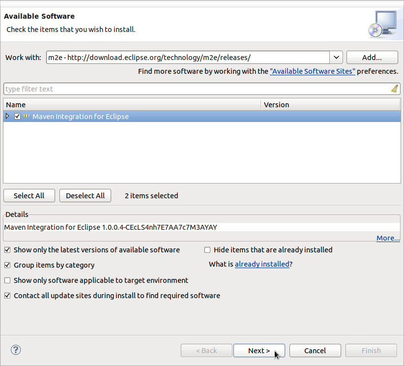
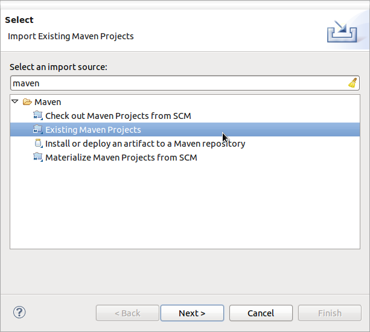
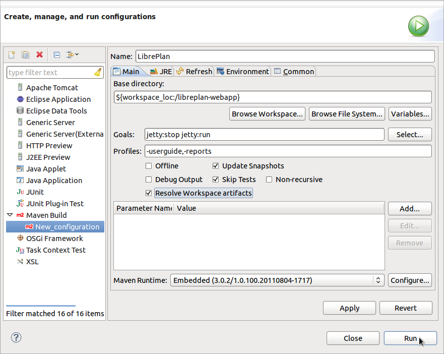
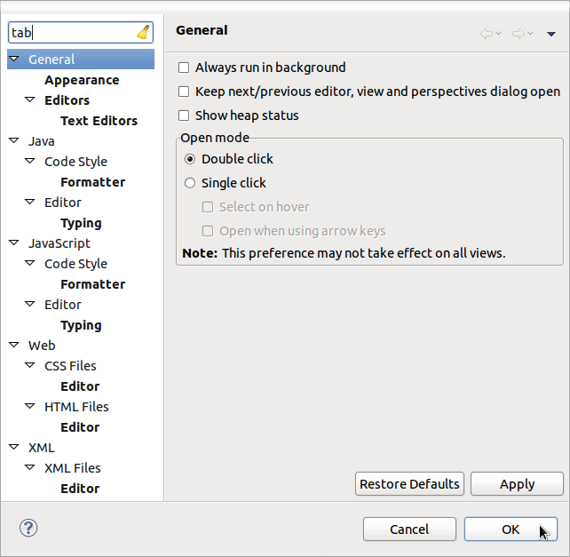
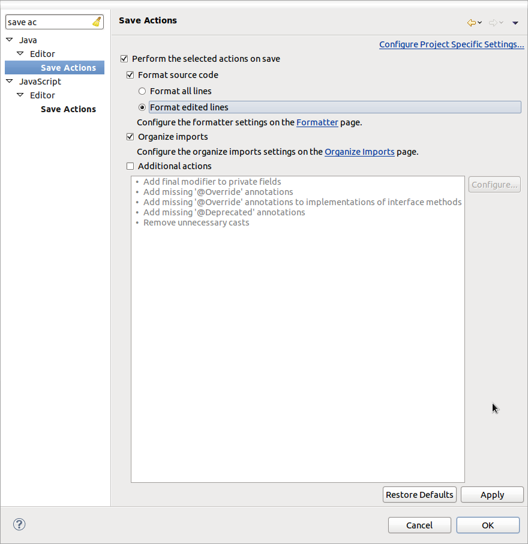

How To Start Development With Eclipse
=====================================

.. sectnum::

:Author: Manuel Rego Casasnovas
:Contact: rego@igalia.com
:Date: 16/12/2011
:Copyright:
  Some rights reserved. This document is distributed under the Creative
  Commons Attribution-ShareAlike 3.0 licence, available in
  http://creativecommons.org/licenses/by-sa/3.0/.
:Abstract:
  Quick guide to start the development of LibrePlan_ using Eclipse_ IDE.
  As this is the most common way of work among LibrePlan developers team.

.. contents:: Table of Contents

Download LibrePlan source code
------------------------------

You need to download LibrePlan_ source code to start hacking on it. You have two
options:

a) Clone Git repository (recommended)::

    $ git clone git://navalplan.git.sourceforge.net/gitroot/navalplan/navalplan libreplan

b) Download last version source code::

    $ wget http://downloads.sourceforge.net/project/navalplan/files/LibrePlan/libreplan_1.2.0.tar.gz
    $ tar -xzvf libreplan_1.2.0.tar.gz

You should review ``HACKING`` file to check that you have installed all the
requirements.

Download Eclipse Java EE
------------------------

* Go to download Eclipse page: http://www.eclipse.org/downloads/

* Download Eclipse IDE for **Java EE Developers** for your architecture

.. figure:: img/libreplan-download-eclipse.png
   :alt: Eclipse downloads webpage
   :width: 100%

   Eclipse downloads webpage

Install Ecliplse
----------------

* Go to ``/opt/`` (or any other folder when you want to install Eclipse)::

  # cd /opt/

* Uncompress downloaded file and set proper permissions::

  # tar -xzvf ~/Downloads/eclipse-jee-indigo-SR1-linux-gtk-x86_64.tar.gz
  # chown -R root:root eclipse/

* Add symbolic link to launch Eclipse::

  # cd /usr/local/bin/
  # ln -s /opt/eclipse/eclipse

Install Eclipse Maven plugin (m2e)
----------------------------------

* Run Eclipse::

  $ eclipse

* Choose your workspace folder (or accept the default one) and mark to don't ask
  about it again

* Go to *Help* > *Install New Software...*

* Click in option *Add* and set the following values and click *Ok*:

  * Name: m2e
  * Location: http://download.eclipse.org/technology/m2e/releases/

* Click *Next* to install plugin

   Install Eclipse Maven plugin (m2e)

* Accept license agreements and click *Finish*

* Restart Eclipse once plugin installation has finished

Import LibrePlan project
------------------------

* Go to *File* > *Import*

* Select as import source *Maven* > *Exising Maven Projects* and click *Next*

   Import LibrePlan as Maven project

* Set as *Root Directory* the path where you downloaded LibrePlan source code

* Then mark all projects and click *Finish*

.. figure:: img/libreplan-poms.png
   :alt: Import LibrePlan from existent path
   :width: 100%

   Import LibrePlan from existent path

* It is recommended to close ``libreplan`` project (right click over the project
  and choose *Close*)

Configure project to run
------------------------

* Go to *Run* > *Run Configurations...*

* Create a new *Maven Build* called *New_configuration*

* Change the following values:

  * Name: LibrePlan
  * Base directory: Choose ``libreplan-webapp`` folder in your workspace
  * Goals: ``jetty:stop jetty:run``
  * Profiles (optional): ``-userguide,-reports`` (to disable userguide and
    reports profiles to save compilation time as they are not mandatory to run
    LibrePlan)
  * Mark the following checkboxes (recommended):

    * Resolve Workspace artifacts
    * Update Snapshots
    * Skip Tests

   Configure how to run LibrePlan in Eclipse

* Click *Run* and application will be available at
  http://localhost:8080/libreplan-webapp/

Configure Eclipse to follow coding style guidelines
---------------------------------------------------

* Go to *Window* > *Preferences*

* Look for the different options to use always spaces instead of tabs and use 4
  spaces size for indentation

   Eclipse Preferences window

* Create new profile to follow the coding style guidelines

.. figure:: img/libreplan-eclipse-profile.png
   :alt: New profile based on Eclipse default one
   :width: 100%

   New profile based on Eclipse default one

* Configure *Save Actions* marking the following options:

  * Perform the selected actions on save
  * Format source code
  * Format edited lines
  * Organize imports

   Save Actions configuration

.. _LibrePlan: http://www.libreplan.com/
.. _Eclipse: http://www.eclipse.org
