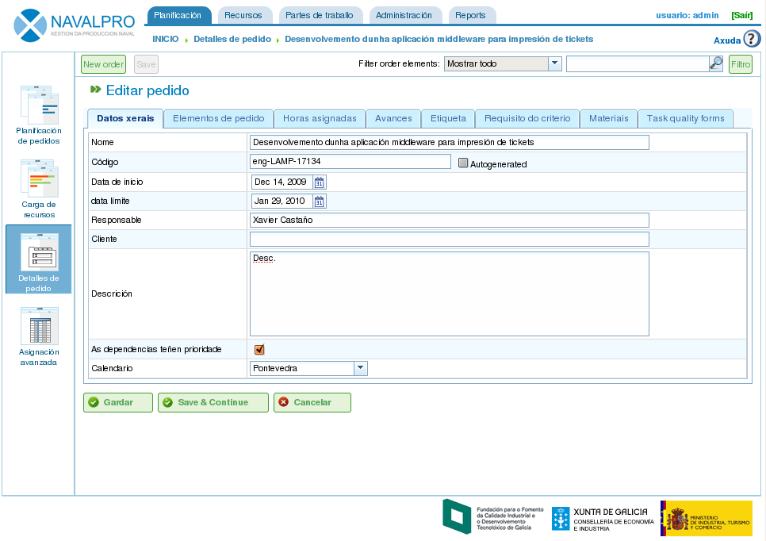
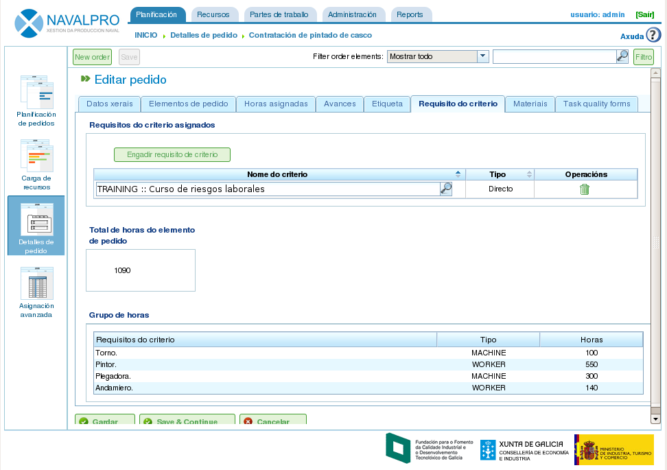
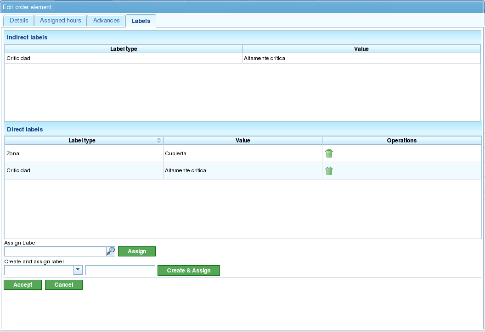
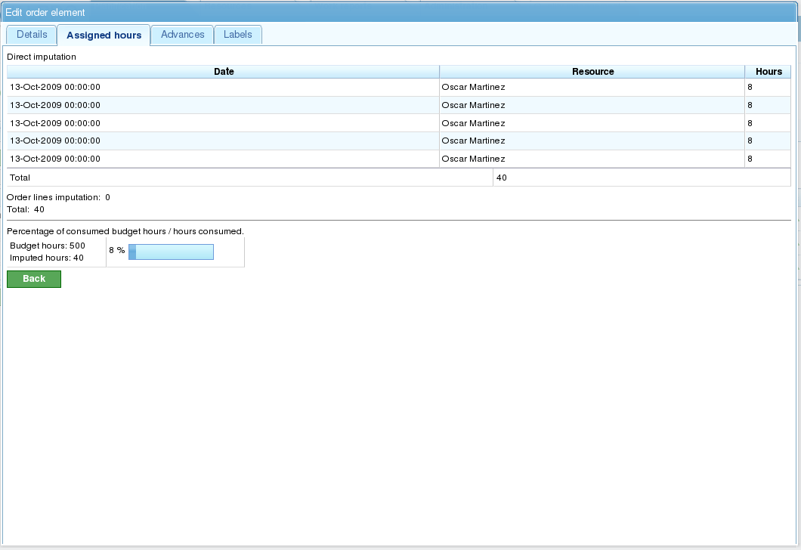

Pedidos e elementos de pedidos
##############################

.. contents::

Os pedidos son as entidades que describirán os traballos a realizar por parte dos usuarios que utilicen a aplicación.
Cada pedido corresponderase cos proxectos que as empresas van a ofrecerlles ós seus clientes.

Un pedido está formado por unha ou varias liñas de pedido. Cada liña de pedido corresponderase coa estructuración que se desexe realizar sobre os traballos dentro dese pedido. As liñas de pedido organizanse de xeito xerárquico sen limitacións de profundidade. O feito de que as liñas de pedido se organicen de xeito xerárquico marcará o funcionamento de diversas características herdables, tal como as etiquetas.

Nas seguintes seccións describiranse as operacións que un usuario pode realizar cos pedidos e as liñas de pedidos.

Pedido
======

Un pedido é un proxecto ou traballo que un cliente lle solicita a unha empresa. O pedido para o planificador identifica a entidade de proxecto dentro da empresa. A diferencia das aplicacións de xestión globais, "Navalpro" só necesita utilizar certos datos dos pedidos. Estes datos son:

* Nome do pedido
* Código do pedido.
* Importe total do pedido
* Data de comezo estimada
* Data de finalización
* Responsable
* Descrición

Sen embargo, o propio pedido está relacionado con outras entidades que finalmente o dotarán de unha maior riqueza:
* Horas asignadas ó pedido.
* Avances imputados ó pedido.
* Etiquetas.
* Criterios asignados ó pedido.
* Materiais
* Formularios de calidade

Para editar ou crear un pedido é posible realizalo dende varios puntos da aplicación:

* Accedendo á perspectiva de "Lista de pedidos" dentro da vista global de empresa.

   * A edición realízase premendo no botón de editar sobre o pedido elixido.
   * A creación realízase premendo en "Novo pedido".

* Accedendo a un pedido no diagrama de Gantt e cambiando de perpectiva á de detalles de pedido.

Dende a edición de pedido é posible acceder ás seguintes pestanas:

* Edición dos datos de pedidos. Dende dita pantalla é posible editar os datos básicos do pedido. Actualmente:

  * Nome
  * Código
  * Data de comezo estimada
  * Data de finalización
  * Responsable
  * Cliente
  * Descrición

* Listado de elementos de pedido. Dende o listado de elenentos de pedido é posible realizar varias operacións:

  * Crear novos elementos de pedido.
  * Subir nun mesmo nivel da xerarquía un elemento de pedido.
  * Baixar nun mesmo nivel da xerarquía un elemento de pedido.
  * Indentar un elemento de pedido, ou o que é o mesmo mover cara abaixo na xerarquía, cambiando de nivel o elemento.
  * Des-indentar un elemento de pedido, ou o que é o mesmo mover cara arriba na xerarquía, cambiando de nivel o elemento.
  * Filtrar os elementos de pedido.
  * Borrar elementos de pedido.
  * Mover arrastrando e soltando un elemento de pedido na xerarquía.

.. figure:: images/order-elements-list.png
   :scale: 70

* Horas asignadas. Pantalla na que se amosan as horas totais imputadas ó proxecto, tratándose de unha pantalla de visualización onde se agrupan as horas imputadas ós elementos de pedido.

.. figure:: images/order-assigned-hours.png
   :scale: 70

* Avances. Pantalla na que se permiten imputar tipos de avances e medidas de avances ó pedido. Ver sección de "Avances" para o funcionamento da mesma.

* Etiquetas. Pantalla na que se permite asignar etiquetas a un pedido e coñecer as etiquetas directas e indirectas que xa foron asignadas. Ver capítulo de "Etiquetas" para coñecer o funcionamento da mesma.

.. figure:: images/order-labels.png
   :scale: 70

* Criterios. Pantalla na que se poden asignar os criterios que se desexan aplicar globalmente a todas as tarefas de un pedido. Estes criterios serían aplicados de xeito automático a todos os elementos de pedido, excepto que estes fosen invalidados explícitamente. Asimesmo, pódense visualizar os grupos de horas dos elementos de pedidos agrupados por criterios, o cal permite coñecer os criterios que se esixen ó longo de un pedido.

* Materiais. Pantalla na que se pode asignar o material dispoñible no sistema ó pedido. O material será seleccionable de entre as categorías de material que existen na aplicación. Os materiais son xestionados do seguinte modo:

   * O usuario selecciona a pestana que se amosa na zona inferior da pantalla chamada "Búsqueda de materiais".
   * O usuario pode introducir un texto para a procura de materiais ou seleccionar as categorías para as que se desexa amosar materiais.
   * O sistema filtra os resultados.
   * O usuario selecciona os materiais que desexa (para seleccionar máis de un material o usuario pode premer no botón "Ctrl" que permite a selección múltiple no listado.
   * O usuario preme en "Asignar".
   * O sistema amosa o listado de materiais xa asignado ó pedido.
   * O usuario selecciona as unidades e o estado que desexa asignarlle ó pedido.
   * O usuario preme en "Gardar" ou "Gardar e Continuar".
   * Se o usuario desexa xestionar a recepción de material, o sistema permite premer en "Dividir" para cambiar o estado dunha cantidade parcial de materiais.

.. figure:: images/order-material.png
   :scale: 70

* Calidade. É posible asignar un formulario de calidade ó pedido co obxectivo de ser cumplimentado para asegurar a realización de certas actividades asociadas ó pedido.

.. figure:: images/order-quality.png
   :scale: 70

Edición de elementos de pedido
===============================

A edición de elementos de pedido realizarase dende a pestana de listado de elementos de pedido a partir da icona de edición. Se o usuario preme na icona de edición, o sistema amosa unha nova pantalla dende a que o usuario pode realizar o seguinte:

* Editar a información do elemento de pedido.
* Visualización de horas imputadas a elemento de pedido.
* Xestionar os avances dos elementos de pedido.
* Xestionar as etiquetas do pedido.
* Xestionar os criterios esixidos polo elemento de pedido.
* Xestionar os materiais.
* Xestionar os formularios de calidade.

Edición da información do elemento de pedido
--------------------------------------------

A edición de información de elemento de pedido inclúe a edición dos seguintes datos:

* Nome do elemento de pedido.
* Código do elemento de pedido.
* Data de inicio do elemento de pedido.
* Data estimada de fin do elemento de pedido.
* Horas totais do elemento de pedido. Estas horas poden ser calculadas a partir dos grupos de horas engadidas ou introducidas directamente neste punto que se repartiran entre os grupos de horas, creando algún novo se as porcentaxes non coinciden coas porcentaxes iniciais.
* **Grupos de horas**: É posible engadir un ou varios grupos de horas ó elemento de pedido. **O significado destes grupos de horas** é o establecemento dos requirimentos que se lle esixirán ós recursos que vaian a ser asignados para realizalas.
* Criterios: É posible engadir criterios que se deben satisfacer para poder se asignado xenéricamente para realizar dito elemento de pedido.

Xestión de avances dos elementos de pedido
------------------------------------------

A introdución de tipos de avances e xestión dos avances dos elementos de pedido foi descrita no capítulo de "Avances".

Xestión de etiquetas do pedido
------------------------------

As etiquetas, tal e como se describen no capítulo adicado ás mesmas, son entidades que permiten categorizar os elementos de pedido. Deste xeito, o usuario poderá agrupar información de planificación ou pedidos en base a elas.

Un usuario pode asignar etiquetas directamente a un elemento de pedido ou ben a un ascendente na xerarquía dese elemento de pedido. A partir do momento no que se asignar unha etiqueta dun dos dous xeitos anteriores, tanto o elemento de pedido como a tarefa de planificación asociada estarán asociadas a dita etiqueta, sendo utilizadas para posteriores filtrados.

Tal e como se pode ver na imaxe, dende a pestana de **etiquetas**, o usuario poderá realizar as seguintes operacións:

* Visualización das etiquetas que un elemento do pedido terá asociadas por herdanza dun elemento de pedido superior na xerarquía á que lle foi asignada directamente. A tarefa de planificación asociada a cada elemento de pedido terá as mesmas etiquetas asociadas.
* Visualización das etiquetas que un elemento do pedido ten asociadas directamente a través do seguinte formulario de asignación de etiquetas inferior.
* Asignar etiquetas existentes: Un usuario poderá asignar etiquetas existentes a partir da procura dunha entre as existentes no formulario inferior ó listado de etiquetas directas. Para buscar unha etiqueta chega con premer na icona coa lupa ou escribir o inicio da etiqueta na entrada de texto para que o sistema amose as opcións dispoñibles.
* Crear e asignar etiquetas novas: Un usuario poderá crear novas etiquetas asociadas a un tipo de etiquetas existente dende dito formulario. Para relizar a operación é necesario que seleccione un tipo de etiqueta á que se asociará e se introduza o valor da etiqueta para o tipo seleccionado. Premendo en "Navalpro e Navalpro" o sistema xa a creará automáticamente e a asigna ó elemento de pedido.

Visualización de horas imputadas a elementos de pedido
------------------------------------------------------

A pestana de "Horas Navalpro" permite visualizar os partes de traballo asociados a un elemento de pedido e ó mesmo tempo permite visualizar cantas horas das presupostadas están xa realizadas.

A pantalla está dividida en dúas partes:

* Listado de partes de traballo: O usuario verá o listado de partes de traballo que están asociados ó elemento de pedido podendo comprobar a data e hora, recurso e número de horas adicadas á tarefa.
* Uso das horas presupostadas: O sistema calcula o total de horas adicadas á tarefa e as contrasta coas que estaban presupostadas.
