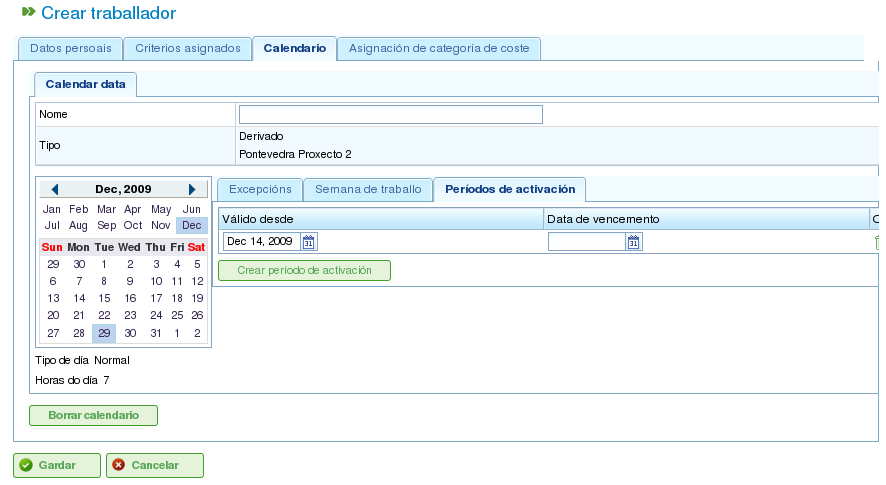

Calendaris
##########

.. contents::

Els calendaris són entitats del programa que defineixen la capacitat de treball dels recursos. Un calendari consisteix en una sèrie de dies al llarg de l'any, amb cada dia dividit en hores de treball disponibles.

Per exemple, un dia festiu podria tenir 0 hores de treball disponibles. Per contra, un dia de treball típic podria tenir 8 hores designades com a temps de treball disponible.

Hi ha dues maneres principals de definir el nombre d'hores de treball en un dia:

*   **Per dia de la setmana:** Aquest mètode estableix un nombre estàndard d'hores de treball per a cada dia de la setmana. Per exemple, els dilluns normalment poden tenir 8 hores de treball.
*   **Per excepció:** Aquest mètode permet desviacions específiques del programa estàndard per dia de la setmana. Per exemple, el dilluns 30 de gener podria tenir 10 hores de treball, substituint el programa estàndard dels dilluns.

Administració de calendaris
============================

El sistema de calendaris és jeràrquic, permetent crear calendaris base i derivar-ne de nous, formant una estructura en arbre. Un calendari derivat d'un calendari de nivell superior heretarà els seus horaris diaris i les excepcions tret que s'hagin modificat explícitament. Per gestionar els calendaris de manera eficaç, és important entendre els conceptes següents:

*   **Independència dels dies:** Cada dia es tracta de manera independent, i cada any té el seu propi conjunt de dies. Per exemple, si el 8 de desembre de 2009 és un dia festiu, això no significa automàticament que el 8 de desembre de 2010 també ho sigui.
*   **Dies laborables basats en el dia de la setmana:** Els dies laborables estàndard es basen en el dia de la setmana. Per exemple, si els dilluns normalment tenen 8 hores de treball, tots els dilluns de totes les setmanes de tots els anys tindran 8 hores disponibles tret que es defineixi una excepció.
*   **Excepcions i períodes d'excepció:** Es poden definir excepcions o períodes d'excepció per desviar-se del programa estàndard per dia de la setmana. Per exemple, podeu especificar un sol dia o un rang de dies amb un nombre d'hores de treball disponibles diferent de la regla general per a aquests dies de la setmana.

.. figure:: images/calendar-administration.png
   :scale: 50

   Administració de calendaris

L'administració de calendaris és accessible a través del menú "Administració". Des d'allà, els usuaris poden realitzar les accions següents:

1.  Crear un nou calendari des de zero.
2.  Crear un calendari derivat d'un existent.
3.  Crear un calendari com a còpia d'un existent.
4.  Editar un calendari existent.

Creació d'un nou calendari
---------------------------

Per crear un nou calendari, feu clic al botó "Crear". El sistema mostrarà un formulari on podeu configurar el següent:

*   **Seleccionar la pestanya:** Trieu la pestanya amb la qual voleu treballar:

    *   **Marcar excepcions:** Definiu excepcions al programa estàndard.
    *   **Hores de treball per dia:** Definiu les hores de treball estàndard per a cada dia de la setmana.

*   **Marcar excepcions:** Si seleccioneu l'opció "Marcar excepcions", podeu:

    *   Seleccionar un dia específic al calendari.
    *   Seleccionar el tipus d'excepció. Els tipus disponibles són: vacances, malaltia, vaga, dia festiu i dia festiu laborable.
    *   Seleccionar la data de finalització del període d'excepció. (No cal canviar aquest camp per a excepcions d'un sol dia.)
    *   Definir el nombre d'hores de treball durant els dies del període d'excepció.
    *   Eliminar excepcions prèviament definides.

*   **Hores de treball per dia:** Si seleccioneu l'opció "Hores de treball per dia", podeu:

    *   Definir les hores de treball disponibles per a cada dia de la setmana (dilluns, dimarts, dimecres, dijous, divendres, dissabte i diumenge).
    *   Definir distribucions d'hores setmanals diferents per a períodes futurs.
    *   Eliminar distribucions d'hores prèviament definides.

Aquestes opcions permeten als usuaris personalitzar completament els calendaris segons les seves necessitats específiques. Feu clic al botó "Desa" per emmagatzemar qualsevol canvi realitzat al formulari.

.. figure:: images/calendar-edition.png
   :scale: 50

   Edició de calendaris

.. figure:: images/calendar-exceptions.png
   :scale: 50

   Afegir una excepció a un calendari

Creació de calendaris derivats
-------------------------------

Un calendari derivat es crea a partir d'un calendari existent. Hereta totes les característiques del calendari original, però podeu modificar-lo per incloure opcions diferents.

Un cas d'ús comú per als calendaris derivats és quan teniu un calendari general per a un país, com Espanya, i necessiteu crear un calendari derivat per incloure dies festius addicionals específics d'una regió, com Galícia.

És important tenir en compte que qualsevol canvi realitzat al calendari original es propagarà automàticament al calendari derivat, tret que s'hagi definit una excepció específica al calendari derivat. Per exemple, el calendari d'Espanya podria tenir una jornada laboral de 8 hores el 17 de maig. No obstant això, el calendari de Galícia (un calendari derivat) podria no tenir hores de treball aquell mateix dia perquè és un dia festiu regional. Si el calendari espanyol es modifica posteriorment per tenir 4 hores de treball disponibles per dia per a la setmana del 17 de maig, el calendari gallec també canviarà per tenir 4 hores de treball disponibles per a cada dia d'aquella setmana, excepte el 17 de maig, que romandrà com a dia no laborable a causa de l'excepció definida.

.. figure:: images/calendar-create-derived.png
   :scale: 50

   Creació d'un calendari derivat

Per crear un calendari derivat:

*   Aneu al menú *Administració*.
*   Feu clic a l'opció *Administració de calendaris*.
*   Seleccioneu el calendari que voleu utilitzar com a base per al calendari derivat i feu clic al botó "Crear".
*   El sistema mostrarà un formulari d'edició amb les mateixes característiques que el formulari utilitzat per crear un calendari des de zero, excepte que les excepcions proposades i les hores de treball per dia de la setmana es basaran en el calendari original.

Creació d'un calendari per còpia
---------------------------------

Un calendari copiat és un duplicat exacte d'un calendari existent. Hereta totes les característiques del calendari original, però podeu modificar-lo de manera independent.

La diferència clau entre un calendari copiat i un calendari derivat és com es veuen afectats pels canvis en l'original. Si el calendari original es modifica, el calendari copiat roman sense canvis. No obstant això, els calendaris derivats es veuen afectats pels canvis realitzats a l'original, tret que es defineixi una excepció.

Un cas d'ús comú per als calendaris copiats és quan teniu un calendari per a una ubicació, com "Pontevedra", i necessiteu un calendari similar per a una altra ubicació, com "A Coruña", on la majoria de les característiques són les mateixes. No obstant això, els canvis en un calendari no han d'afectar l'altre.

Per crear un calendari copiat:

*   Aneu al menú *Administració*.
*   Feu clic a l'opció *Administració de calendaris*.
*   Seleccioneu el calendari que voleu copiar i feu clic al botó "Crear".
*   El sistema mostrarà un formulari d'edició amb les mateixes característiques que el formulari utilitzat per crear un calendari des de zero, excepte que les excepcions proposades i les hores de treball per dia de la setmana es basaran en el calendari original.

Calendari predeterminat
------------------------

Un dels calendaris existents pot ser designat com a calendari predeterminat. Aquest calendari s'assignarà automàticament a qualsevol entitat del sistema que es gestioni amb calendaris tret que s'especifiqui un calendari diferent.

Per configurar un calendari predeterminat:

*   Aneu al menú *Administració*.
*   Feu clic a l'opció *Configuració*.
*   Al camp *Calendari predeterminat*, seleccioneu el calendari que voleu utilitzar com a calendari predeterminat del programa.
*   Feu clic a *Desa*.

.. figure:: images/default-calendar.png
   :scale: 50

   Configuració d'un calendari predeterminat

Assignació d'un calendari als recursos
---------------------------------------

Els recursos només es poden activar (és a dir, tenir hores de treball disponibles) si tenen assignat un calendari amb un període d'activació vàlid. Si no s'ha assignat cap calendari a un recurs, el calendari predeterminat s'assigna automàticament, amb un període d'activació que comença a la data d'inici i no té data de caducitat.

.. figure:: images/resource-calendar.png
   :scale: 50

   Calendari del recurs

No obstant això, podeu eliminar el calendari que s'ha assignat prèviament a un recurs i crear un nou calendari basat en un existent. Això permet una personalització completa dels calendaris per a recursos individuals.

Per assignar un calendari a un recurs:

*   Aneu a l'opció *Editar recursos*.
*   Seleccioneu un recurs i feu clic a *Editar*.
*   Seleccioneu la pestanya "Calendari".
*   Es mostrarà el calendari, juntament amb les seves excepcions, hores de treball per dia i períodes d'activació.
*   Cada pestanya tindrà les opcions següents:

    *   **Excepcions:** Definiu excepcions i el període al qual s'apliquen, com ara vacances, dies festius o dies laborables diferents.
    *   **Setmana laboral:** Modifiqueu les hores de treball per a cada dia de la setmana (dilluns, dimarts, etc.).
    *   **Períodes d'activació:** Creeu nous períodes d'activació per reflectir les dates d'inici i fi dels contractes associats al recurs. Vegeu la imatge següent.

*   Feu clic a *Desa* per emmagatzemar la informació.
*   Feu clic a *Eliminar* si voleu canviar el calendari assignat a un recurs.

   Assignació d'un nou calendari a un recurs

Assignació de calendaris a projectes
--------------------------------------

Els projectes poden tenir un calendari diferent del calendari predeterminat. Per canviar el calendari d'un projecte:

*   Accediu a la llista de projectes a la vista general de l'empresa.
*   Editeu el projecte en qüestió.
*   Accediu a la pestanya "Informació general".
*   Seleccioneu el calendari a assignar del menú desplegable.
*   Feu clic a "Desa" o "Desa i continua".

Assignació de calendaris a tasques
------------------------------------

De manera similar als recursos i els projectes, podeu assignar calendaris específics a tasques individuals. Això us permet definir calendaris diferents per a etapes específiques d'un projecte. Per assignar un calendari a una tasca:

*   Accediu a la vista de planificació d'un projecte.
*   Feu clic dret sobre la tasca a la qual voleu assignar un calendari.
*   Seleccioneu l'opció "Assignar calendari".
*   Seleccioneu el calendari a assignar a la tasca.
*   Feu clic a *Accepta*.
