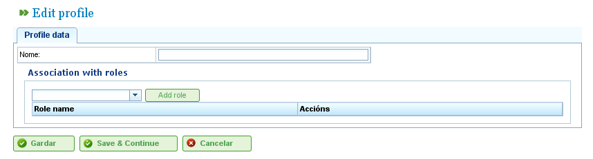

Gestió d'Usuaris
#################

.. _tareas:
.. contents::

Gestió d'Usuaris
================

El sistema de LibrePlan permet als administradors gestionar perfils d'usuari, autoritzacions i usuaris. Els usuaris s'assignen a perfils d'usuari, que poden tenir una sèrie de rols predefinits que concedeixen accés a les funcions del programa. Els rols són autoritzacions definides dins de LibrePlan. Alguns exemples de rols inclouen:

*   **Administració:** Un rol que s'ha d'assignar als administradors per permetre'ls realitzar operacions administratives.
*   **Lector de Serveis Web:** Un rol necessari perquè els usuaris puguin consultar els serveis web del programa.
*   **Escriptor de Serveis Web:** Un rol necessari perquè els usuaris puguin escriure dades a través dels serveis web del programa.

Els rols estan predefinits dins del sistema. Un perfil d'usuari consisteix en un o més rols. Els usuaris han de tenir rols específics per realitzar determinades operacions.

Els usuaris poden ser assignats a un o més perfils, o a un o més rols directament, cosa que permet concedir autoritzacions específiques o genèriques.

Per gestionar els usuaris, seguiu aquests passos:

*   Aneu a "Gestionar usuaris" al menú "Administració."
*   El programa mostra un formulari amb una llista d'usuaris.
*   Feu clic al botó d'editar per a l'usuari desitjat o feu clic al botó "Crear."
*   Apareixerà un formulari amb els camps següents:

    *   **Nom d'usuari:** El nom d'inici de sessió de l'usuari.
    *   **Contrasenya:** La contrasenya de l'usuari.
    *   **Autoritzat/No autoritzat:** Una configuració per habilitar o deshabilitar el compte de l'usuari.
    *   **Correu electrònic:** L'adreça de correu electrònic de l'usuari.
    *   **Llista de Rols Associats:** Per afegir un nou rol, els usuaris han de cercar un rol a la llista de selecció i fer clic a "Assignar."
    *   **Llista de Perfils Associats:** Per afegir un nou perfil, els usuaris han de cercar un perfil a la llista de selecció i fer clic a "Assignar."

.. figure:: images/manage-user.png
   :scale: 50

   Gestió d'Usuaris

*   Feu clic a "Desar" o "Desar i continuar."

Gestió de Perfils
-----------------

Per gestionar els perfils del programa, els usuaris han de seguir aquests passos:

*   Aneu a "Gestionar perfils d'usuari" al menú "Administració."
*   El programa mostra una llista de perfils.
*   Feu clic al botó d'editar per al perfil desitjat o feu clic a "Crear."
*   Apareix un formulari al programa amb els camps següents:

    *   **Nom:** El nom del perfil d'usuari.
    *   **Llista de Rols (Autoritzacions):** Per afegir un rol al perfil, els usuaris han de seleccionar un rol de la llista de rols i fer clic a "Afegir."

   Gestió de Perfils d'Usuari

*   Feu clic a "Desar" o "Desar i continuar", i el sistema emmagatzemarà el perfil creat o modificat.
