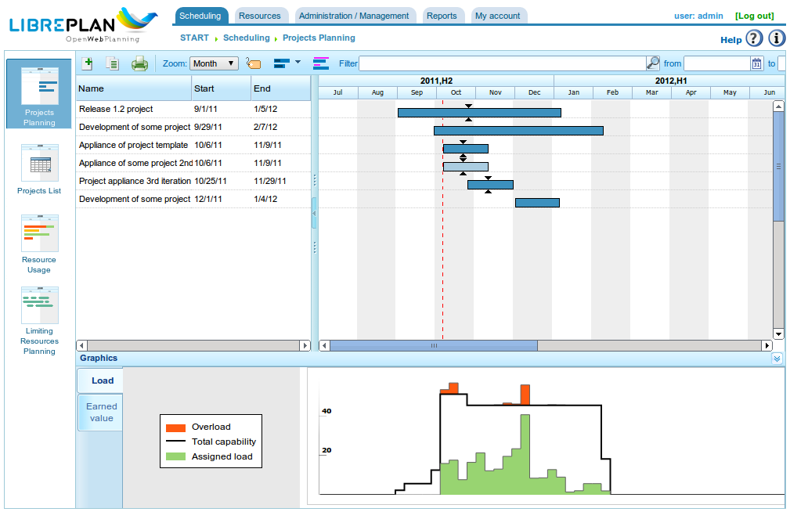

Úvod
####

.. contents::

Tento dokument popisuje funkce LibrePlan a poskytuje uživatelům informace o tom, jak aplikaci konfigurovat a používat.

LibrePlan je webová aplikace s otevřeným zdrojovým kódem pro plánování projektů. Jejím hlavním cílem je poskytnout komplexní řešení pro správu projektů ve firmě. Pokud potřebujete jakékoli konkrétní informace o tomto softwaru, kontaktujte vývojový tým na http://www.libreplan.com/contact/

   Přehled společnosti

Přehled společnosti a správa zobrazení
=======================================

Jak je znázorněno na hlavní obrazovce programu (viz předchozí snímek obrazovky) a v přehledu společnosti, uživatelé mohou zobrazit seznam plánovaných projektů. To jim umožňuje pochopit celkový stav společnosti z hlediska projektů a využití zdrojů. Přehled společnosti nabízí tři různá zobrazení:

* **Zobrazení plánování:** Toto zobrazení kombinuje dvě perspektivy:

   * **Sledování projektů a času:** Každý projekt je znázorněn Ganttovým diagramem, který uvádí datum zahájení a ukončení projektu. Tyto informace jsou zobrazeny vedle dohodnutého termínu. Poté je proveden srovnání mezi procentem dosaženého pokroku a skutečným časem věnovaným každému projektu. To poskytuje jasný obraz o výkonnosti společnosti v libovolném okamžiku. Toto zobrazení je výchozí vstupní stránkou programu.
   * **Graf využití zdrojů společnosti:** Tento graf zobrazuje informace o alokaci zdrojů napříč projekty a poskytuje souhrn využití zdrojů celé společnosti. Zelená barva označuje, že alokace zdrojů je nižší než 100 % kapacity. Černá čára představuje celkovou dostupnou kapacitu zdrojů. Žlutá barva označuje, že alokace zdrojů překračuje 100 %. Je možné mít celkově nedostatečné přidělení a zároveň přetížení konkrétních zdrojů.

* **Zobrazení zatížení zdrojů:** Tato obrazovka zobrazuje seznam pracovníků společnosti a jejich konkrétní přidělení úkolů nebo obecná přidělení na základě definovaných kritérií. Chcete-li toto zobrazení zobrazit, klikněte na *Celkové zatížení zdrojů*. Příklad najdete na následujícím obrázku.
* **Zobrazení správy projektů:** Tato obrazovka zobrazuje seznam firemních projektů a umožňuje uživatelům provádět následující akce: filtrovat, upravovat, mazat, vizualizovat plánování nebo vytvořit nový projekt. Chcete-li toto zobrazení zobrazit, klikněte na *Seznam projektů*.

.. figure:: images/resources_global.png
   :scale: 50

   Přehled zdrojů

.. figure:: images/order_list.png
   :scale: 50

   Hierarchická struktura prací

Správa zobrazení popsaná výše pro přehled společnosti je velmi podobná správě dostupné pro jednotlivý projekt. K projektu lze přistupovat několika způsoby:

* Klikněte pravým tlačítkem myši na Ganttův diagram projektu a vyberte *Naplánovat*.
* Vstupte do seznamu projektů a klikněte na ikonu Ganttova diagramu.
* Vytvořte nový projekt a změňte aktuální zobrazení projektu.

Program nabízí pro projekt následující zobrazení:

* **Zobrazení plánování:** Toto zobrazení umožňuje uživatelům vizualizovat plánování úkolů, závislosti, milníky a další. Další podrobnosti najdete v části *Plánování*.
* **Zobrazení zatížení zdrojů:** Toto zobrazení umožňuje uživatelům kontrolovat přidělené zatížení zdrojů pro projekt. Barevné kódování je konzistentní s přehledem společnosti: zelená pro zatížení nižší než 100 %, žlutá pro zatížení rovné 100 % a červená pro zatížení nad 100 %. Zatížení může pocházet z konkrétního úkolu nebo ze sady kritérií (obecné přidělení).
* **Zobrazení úprav projektu:** Toto zobrazení umožňuje uživatelům upravovat podrobnosti projektu. Další informace najdete v části *Projekty*.
* **Zobrazení pokročilého přidělení zdrojů:** Toto zobrazení umožňuje uživatelům přidělovat zdroje s pokročilými možnostmi, jako je zadání hodin za den nebo přidělených funkcí k provedení. Další informace najdete v části *Přidělení zdrojů*.

Co dělá LibrePlan užitečným?
=============================

LibrePlan je univerzální plánovací nástroj vyvinutý k řešení výzev v průmyslovém plánování projektů, které nebyly dostatečně pokryty stávajícími nástroji. Vývoj LibrePlan byl také motivován touhou poskytnout svobodnou, open-source a zcela webovou alternativu k proprietárním plánovacím nástrojům.

Základní koncepty, na nichž program stojí, jsou následující:

* **Přehled společnosti a více projektů:** LibrePlan je specificky navržen tak, aby uživatelům poskytoval informace o více projektech prováděných v rámci společnosti. Proto je ze své podstaty programem pro více projektů. Zaměření programu není omezeno na jednotlivé projekty, i když jsou dostupná i specifická zobrazení pro jednotlivé projekty.
* **Správa zobrazení:** Přehled společnosti nebo zobrazení více projektů je doplněn různými zobrazeními uložených informací. Například přehled společnosti umožňuje uživatelům zobrazovat projekty a porovnávat jejich stav, zobrazovat celkové zatížení zdrojů společnosti a spravovat projekty. Uživatelé mají také přístup k zobrazení plánování, zobrazení zatížení zdrojů, zobrazení pokročilého přidělení zdrojů a zobrazení úprav projektu pro jednotlivé projekty.
* **Kritéria:** Kritéria jsou systémovou entitou, která umožňuje klasifikaci zdrojů (lidských i strojních) i úkolů. Zdroje musí splňovat určitá kritéria a úkoly vyžadují splnění konkrétních kritérií. Jde o jednu z nejdůležitějších funkcí programu, protože kritéria tvoří základ obecného přidělování a řeší významnou výzvu v průmyslu: časovou náročnost správy lidských zdrojů a obtížnost odhadů zatížení společnosti v dlouhodobém horizontu.
* **Zdroje:** Existují dva typy zdrojů: lidské a strojní. Lidské zdroje jsou pracovníci společnosti, kteří se používají při plánování, sledování a řízení pracovní zátěže společnosti. Strojní zdroje, závislé na lidech, kteří je obsluhují, fungují podobně jako lidské zdroje.
* **Přidělení zdrojů:** Klíčovou funkcí programu je schopnost přidělovat zdroje dvěma způsoby: konkrétně a obecně. Obecné přidělení je založeno na kritériích potřebných k dokončení úkolu a musí být splněno zdroji schopnými tato kritéria splnit. Pro pochopení obecného přidělení zvažte tento příklad: Jan Novák je svářeč. Obvykle by byl Jan Novák konkrétně přidělen k plánovanému úkolu. LibrePlan však nabízí možnost vybrat libovolného svářeče ve společnosti, aniž by bylo nutné specifikovat, že přidělenou osobou je Jan Novák.
* **Řízení zatížení společnosti:** Program umožňuje snadné řízení zatížení zdrojů společnosti. Toto řízení se vztahuje na střednědobý i dlouhodobý horizont, protože v programu lze spravovat aktuální i budoucí projekty. LibrePlan poskytuje grafy, které vizuálně znázorňují využití zdrojů.
* **Štítky:** Štítky se používají k kategorizaci úkolů projektu. Pomocí těchto štítků mohou uživatelé seskupovat úkoly podle konceptu a umožnit pozdější přehled jako skupiny nebo po filtrování.
* **Filtry:** Protože systém přirozeně zahrnuje prvky, které označují nebo charakterizují úkoly a zdroje, lze používat filtry kritérií nebo štítků. To je velmi užitečné pro přehled kategorizovaných informací nebo generování specifických přehledů na základě kritérií nebo štítků.
* **Kalendáře:** Kalendáře definují dostupné produktivní hodiny pro různé zdroje. Uživatelé mohou vytvářet obecné firemní kalendáře nebo definovat specifičtější kalendáře, což umožňuje vytváření kalendářů pro jednotlivé zdroje a úkoly.
* **Projekty a prvky projektů:** Práce vyžadovaná zákazníky je v aplikaci zpracovávána jako projekt, strukturovaná do prvků projektu. Projekt a jeho prvky sledují hierarchickou strukturu s *x* úrovněmi. Tento strom prvků tvoří základ pro plánování práce.
* **Pokrok:** Program dokáže spravovat různé typy pokroku. Pokrok projektu lze měřit jako procento, v jednotkách, vůči dohodnutému rozpočtu a dalšími způsoby. Odpovědnost za určení, který typ pokroku se má použít pro srovnání na vyšších úrovních projektu, leží na vedoucím plánování.
* **Úkoly:** Úkoly jsou základními prvky plánování v programu. Slouží k plánování práce, která má být provedena. Klíčové charakteristiky úkolů zahrnují: závislosti mezi úkoly a potenciální požadavek na splnění konkrétních kritérií před přidělením zdrojů.
* **Pracovní výkazy:** Tyto výkazy, podávané pracovníky společnosti, uvádějí odpracované hodiny a úkoly přiřazené k těmto hodinám. Tyto informace umožňují systému vypočítat skutečný čas potřebný k dokončení úkolu ve srovnání s rozpočtovaným časem. Pokrok lze poté porovnat se skutečně použitými hodinami.

Kromě základních funkcí nabízí LibrePlan další funkce, které jej odlišují od podobných programů:

* **Integrace s ERP:** Program může přímo importovat informace z podnikových ERP systémů, včetně projektů, lidských zdrojů, pracovních výkazů a konkrétních kritérií.
* **Správa verzí:** Program dokáže spravovat více verzí plánování a zároveň umožňuje uživatelům prohlížet informace z každé verze.
* **Správa historie:** Program nemaže informace; pouze je označí jako neplatné. To umožňuje uživatelům prohlížet historické informace pomocí filtrů podle data.

Konvence použitelnosti
======================

Informace o formulářích
-----------------------
Před popisem různých funkcí přidružených k nejdůležitějším modulům musíme vysvětlit obecnou navigaci a chování formulářů.

Existují v podstatě tři typy editačních formulářů:

* **Formuláře s tlačítkem *Zpět*:** Tyto formuláře jsou součástí většího kontextu a provedené změny jsou uloženy v paměti. Změny se uplatní teprve tehdy, když uživatel explicitně uloží všechny podrobnosti na obrazovce, ze které formulář pocházel.
* **Formuláře s tlačítky *Uložit* a *Zavřít*:** Tyto formuláře umožňují dvě akce. První uloží změny a zavře aktuální okno. Druhá zavře okno bez uložení jakýchkoli změn.
* **Formuláře s tlačítky *Uložit a pokračovat*, *Uložit* a *Zavřít*:** Tyto formuláře umožňují tři akce. První uloží změny a ponechá aktuální formulář otevřený. Druhá uloží změny a zavře formulář. Třetí zavře okno bez uložení jakýchkoli změn.

Standardní ikony a tlačítka
----------------------------

* **Úpravy:** Obecně lze záznamy v programu upravovat kliknutím na ikonu, která vypadá jako tužka na bílém zápisníku.
* **Odsazení doleva:** Tyto operace se obecně používají pro prvky ve stromové struktuře, které je třeba přesunout na hlubší úroveň. To se provádí kliknutím na ikonu, která vypadá jako zelená šipka ukazující doprava.
* **Odsazení doprava:** Tyto operace se obecně používají pro prvky ve stromové struktuře, které je třeba přesunout na vyšší úroveň. To se provádí kliknutím na ikonu, která vypadá jako zelená šipka ukazující doleva.
* **Mazání:** Uživatelé mohou mazat informace kliknutím na ikonu koše.
* **Hledání:** Ikona lupy označuje, že textové pole vlevo od ní slouží k vyhledávání prvků.

Záložky
-------
Program používá záložky k organizaci formulářů pro editaci a správu obsahu. Tato metoda slouží k rozdělení komplexního formuláře do různých sekcí, přístupných kliknutím na názvy záložek. Ostatní záložky si zachovávají svůj aktuální stav. Ve všech případech se možnosti uložení a zrušení vztahují na všechny dílčí formuláře v různých záložkách.

Explicitní akce a kontextová nápověda
--------------------------------------

Program obsahuje komponenty, které poskytují další popisy prvků, když nad nimi myš setrvá po dobu jedné sekundy. Akce, které může uživatel provádět, jsou uvedeny na štítcích tlačítek, v nápovědných textech k nim přidružených, v možnostech navigačního menu a v kontextových nabídkách, které se zobrazují při kliknutí pravým tlačítkem myši v oblasti plánovače. Kromě toho jsou poskytovány zkratky pro hlavní operace, jako je dvojité kliknutí na prvky v seznamu nebo použití klávesových událostí s kurzorem a klávesou Enter pro přidávání prvků při navigaci formuláři.
