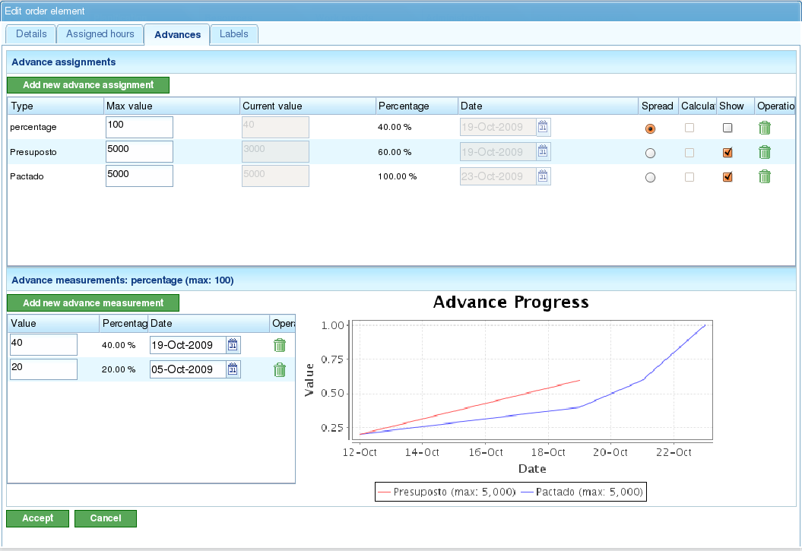

Pokrok
######

.. contents::

Pokrok projektu udává míru, do jaké je splňován odhadovaný čas dokončení projektu. Pokrok úkolu udává míru, do jaké je úkol dokončován podle jeho odhadovaného splnění.

Obecně nelze pokrok měřit automaticky. Zkušený člen personálu nebo kontrolní seznam musí určit stupeň dokončení úkolu nebo projektu.

Je důležité vzít na vědomí rozdíl mezi hodinami přidělenými úkolu nebo projektu a pokrokem tohoto úkolu nebo projektu. Přestože počet použitých hodin může být vyšší nebo nižší než očekávaný, projekt může být v sledovaný den před plánovaným nebo za plánovaným dokončením. Z těchto dvou měření mohou nastat různé situace:

*   **Spotřebováno méně hodin, než se očekávalo, ale projekt má zpoždění:** Pokrok je nižší, než bylo odhadnuto pro sledovaný den.
*   **Spotřebováno méně hodin, než se očekávalo, a projekt je před plánem:** Pokrok je vyšší, než bylo odhadnuto pro sledovaný den.
*   **Spotřebováno více hodin, než se očekávalo, a projekt má zpoždění:** Pokrok je nižší, než bylo odhadnuto pro sledovaný den.
*   **Spotřebováno více hodin, než se očekávalo, ale projekt je před plánem:** Pokrok je vyšší, než bylo odhadnuto pro sledovaný den.

Zobrazení plánování umožňuje porovnat tyto situace pomocí informací o dosaženém pokroku a použitých hodinách. Tato kapitola vysvětlí, jak zadávat informace pro sledování pokroku.

Filozofie sledování pokroku je založena na tom, že uživatelé definují úroveň, na které chtějí sledovat své projekty. Například pokud chtějí uživatelé sledovat projekty, stačí zadat informace pouze pro prvky 1. úrovně. Pokud chtějí přesnější sledování na úrovni úkolu, musí zadávat informace o pokroku na nižších úrovních. Systém poté agreguje data směrem nahoru hierarchií.

Správa typů pokroku
====================

Firmy mají různé potřeby při sledování pokroku projektu, zejména zapojených úkolů. Proto systém obsahuje "typy pokroku". Uživatelé mohou definovat různé typy pokroku pro měření pokroku úkolu. Například úkol lze měřit jako procento, ale toto procento lze také převést na pokrok v *Tunách* na základě dohody s klientem.

Typ pokroku má název, maximální hodnotu a hodnotu přesnosti:

*   **Název:** Popisný název, který uživatelé rozpoznají při výběru typu pokroku. Tento název by měl jasně naznačovat, jaký druh pokroku se měří.
*   **Maximální hodnota:** Maximální hodnota, která může být stanovena pro úkol nebo projekt jako celkové měření pokroku. Například pokud pracujete s *Tunami* a normální maximum je 4000 tun a žádný úkol nikdy nebude vyžadovat více než 4000 tun jakéhokoli materiálu, pak by 4000 bylo maximální hodnotou.
*   **Hodnota přesnosti:** Přírůstková hodnota povolená pro typ pokroku. Například pokud má být pokrok v *Tunách* měřen v celých číslech, hodnota přesnosti by byla 1. Od tohoto okamžiku lze jako měření pokroku zadávat pouze celá čísla (např. 1, 2, 300).

Systém má dva výchozí typy pokroku:

*   **Procento:** Obecný typ pokroku, který měří pokrok projektu nebo úkolu na základě odhadovaného procenta dokončení. Například úkol je z 30 % splněn ze 100 % odhadovaných pro konkrétní den.
*   **Jednotky:** Obecný typ pokroku, který měří pokrok v jednotkách bez specifikace typu jednotky. Například úkol zahrnuje vytvoření 3000 jednotek a pokrok je 500 jednotek z celkového počtu 3000.

.. figure:: images/tipos-avances.png
   :scale: 50

   Správa typů pokroku

Uživatelé mohou vytvářet nové typy pokroku takto:

*   Přejděte do části "Správa".
*   Klikněte na možnost "Spravovat typy pokroku" v nabídce druhé úrovně.
*   Systém zobrazí seznam existujících typů pokroku.
*   Pro každý typ pokroku mohou uživatelé:

    *   Upravit
    *   Odstranit

*   Uživatelé mohou poté vytvořit nový typ pokroku.
*   Při úpravě nebo vytváření typu pokroku systém zobrazí formulář s následujícími informacemi:

    *   Název typu pokroku.
    *   Maximální povolená hodnota pro typ pokroku.
    *   Hodnota přesnosti pro typ pokroku.

Zadávání pokroku podle typu
============================

Pokrok se zadává pro prvky projektu, ale lze jej také zadat pomocí zkratky z plánovacích úkolů. Uživatelé jsou zodpovědní za rozhodnutí, který typ pokroku přiřadí každému prvku projektu.

Uživatelé mohou zadat jediný výchozí typ pokroku pro celý projekt.

Před měřením pokroku musí uživatelé přiřadit zvolený typ pokroku k projektu. Například mohou zvolit procentuální pokrok pro měření pokroku celého úkolu nebo dohodnutou míru pokroku, pokud budou v budoucnu zadávána měření pokroku dohodnutá s klientem.

.. figure:: images/avance.png
   :scale: 40

   Obrazovka pro zadávání pokroku s grafickou vizualizací

Pro zadávání měření pokroku:

*   Vyberte typ pokroku, ke kterému bude pokrok přidán.
    *   Pokud žádný typ pokroku neexistuje, musí být vytvořen nový.
*   Do formuláře, který se zobrazí pod poli "Hodnota" a "Datum", zadejte absolutní hodnotu měření a datum měření.
*   Systém automaticky uloží zadaná data.

Porovnání pokroku prvku projektu
=================================

Uživatelé mohou graficky porovnávat dosažený pokrok na projektech s provedenými měřeními. Všechny typy pokroku mají sloupec s tlačítkem zaškrtnutí ("Zobrazit"). Při výběru tohoto tlačítka se pro prvek projektu zobrazí graf pokroku provedených měření.

   Porovnání několika typů pokroku
