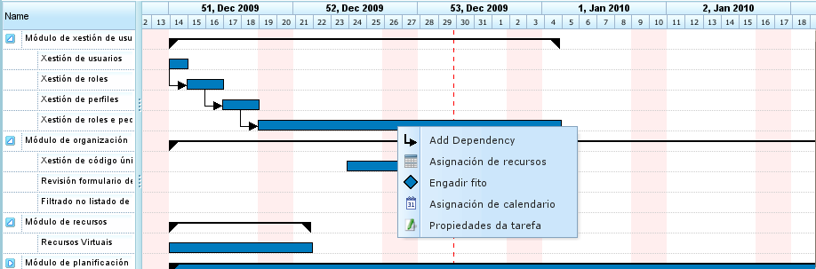

Přiřazení zdrojů
################

.. _asigacion_:
.. contents::

Přiřazení zdrojů je jednou z nejdůležitějších funkcí programu a lze jej provést dvěma různými způsoby:

*   Specifické přiřazení
*   Generické přiřazení

Oba typy přiřazení jsou vysvětleny v následujících sekcích.

Chcete-li provést libovolný typ přiřazení zdrojů, je nutné provést následující kroky:

*   Přejděte do plánovacího zobrazení objednávky.
*   Klikněte pravým tlačítkem myši na úkol, který má být naplánován.

   Nabídka přiřazení zdrojů

*   Program zobrazí obrazovku s následujícími informacemi:

    *   **Seznam kritérií ke splnění:** Pro každou skupinu hodin se zobrazí seznam požadovaných kritérií.
    *   **Informace o úkolu:** Datum zahájení a ukončení úkolu.
    *   **Typ výpočtu:** Systém umožňuje uživatelům zvolit strategii pro výpočet přiřazení:

        *   **Výpočet počtu hodin:** Vypočítá počet hodin potřebných od přiřazených zdrojů s ohledem na datum ukončení a počet zdrojů za den.
        *   **Výpočet data ukončení:** Vypočítá datum ukončení úkolu na základě počtu zdrojů přiřazených k úkolu a celkového počtu hodin potřebných k dokončení úkolu.
        *   **Výpočet počtu zdrojů:** Vypočítá počet zdrojů potřebných k dokončení úkolu do konkrétního data s ohledem na známý počet hodin na jeden zdroj.
    *   **Doporučené přiřazení:** Tato možnost umožňuje programu shromáždit kritéria ke splnění a celkový počet hodin ze všech skupin hodin a poté doporučit generické přiřazení. Pokud existuje předchozí přiřazení, systém jej odstraní a nahradí novým.
    *   **Přiřazení:** Seznam provedených přiřazení. Tento seznam zobrazuje generická přiřazení (číslo bude seznam splněných kritérií a počet hodin a zdrojů za den). Každé přiřazení lze explicitně odstranit kliknutím na tlačítko odstranění.

.. figure:: images/resource-assignment.png
   :scale: 50

   Přiřazení zdrojů

*   Uživatelé vyberou „Hledat zdroje."
*   Program zobrazí novou obrazovku tvořenou stromem kritérií a seznamem pracovníků, kteří splňují vybraná kritéria, na pravé straně:

.. figure:: images/resource-assignment-search.png
   :scale: 50

   Vyhledávání přiřazení zdrojů

*   Uživatelé mohou vybrat:

    *   **Specifické přiřazení:** Podrobnosti o této možnosti viz sekce „Specifické přiřazení."
    *   **Generické přiřazení:** Podrobnosti o této možnosti viz sekce „Generické přiřazení."

*   Uživatelé vyberou seznam kritérií (generické) nebo seznam pracovníků (specifické). Vícenásobný výběr lze provést stisknutím klávesy „Ctrl" při kliknutí na každého pracovníka/kritérium.
*   Uživatelé poté kliknou na tlačítko „Vybrat". Je důležité mít na paměti, že pokud není vybráno generické přiřazení, uživatelé musí zvolit pracovníka nebo stroj pro provedení přiřazení. Pokud je vybráno generické přiřazení, stačí, když uživatelé zvolí jedno nebo více kritérií.
*   Program poté zobrazí vybraná kritéria nebo seznam zdrojů v seznamu přiřazení na původní obrazovce přiřazení zdrojů.
*   Uživatelé musí zvolit hodiny nebo zdroje za den v závislosti na metodě přiřazení používané v programu.

Specifické přiřazení
====================

Jedná se o specifické přiřazení zdroje k úkolu projektu. Jinými slovy, uživatel rozhoduje, který konkrétní pracovník (podle jména a příjmení) nebo stroj musí být přiřazen k úkolu.

Specifické přiřazení lze provést na obrazovce zobrazené na tomto obrázku:

.. figure:: images/asignacion-especifica.png
   :scale: 50

   Specifické přiřazení zdrojů

Když je zdroj specificky přiřazen, program vytvoří denní přiřazení na základě vybraného procenta denně přiřazených zdrojů po porovnání s dostupným kalendářem zdrojů. Například přiřazení 0,5 zdrojů pro úkol o 32 hodinách znamená, že konkrétnímu zdroji je přiřazeno 4 hodiny denně k dokončení úkolu (při předpokladu pracovního kalendáře 8 hodin denně).

Specifické přiřazení strojů
----------------------------

Specifické přiřazení strojů funguje stejně jako přiřazení pracovníků. Když je stroj přiřazen k úkolu, systém uloží specifické přiřazení hodin pro zvolený stroj. Hlavní rozdíl spočívá v tom, že systém prohledá seznam přiřazených pracovníků nebo kritérií v okamžiku přiřazení stroje:

*   Pokud má stroj seznam přiřazených pracovníků, program vybírá z těch, které stroj vyžaduje na základě přiřazeného kalendáře. Například pokud je kalendář stroje 16 hodin denně a kalendář zdroje je 8 hodin, jsou ze seznamu dostupných zdrojů přiřazeny dva zdroje.
*   Pokud má stroj přiřazeno jedno nebo více kritérií, jsou generická přiřazení provedena z řad zdrojů, které splňují kritéria přiřazená stroji.

Generické přiřazení
===================

Generické přiřazení nastane, když uživatelé nezvolí zdroje konkrétně, ale přenechají rozhodnutí programu, který rozděluje zatížení mezi dostupné zdroje společnosti.

.. figure:: images/asignacion-xenerica.png
   :scale: 50

   Generické přiřazení zdrojů

Systém přiřazení vychází z následujících předpokladů:

*   Úkoly mají kritéria, která jsou vyžadována od zdrojů.
*   Zdroje jsou konfigurovány tak, aby splňovaly kritéria.

Systém však selže ne tehdy, když kritéria nebyla přiřazena, ale tehdy, když všechny zdroje splňují nepožadování kritérií.

Algoritmus generického přiřazení funguje takto:

*   Všechny zdroje a dny jsou považovány za kontejnery, do nichž se vejdou denní přiřazení hodin na základě maximální kapacity přiřazení v kalendáři úkolu.
*   Systém vyhledá zdroje, které splňují kritérium.
*   Systém analyzuje, která přiřazení mají v současné době různé zdroje splňující kritéria.
*   Zdroje, které splňují kritéria, jsou vybrány z těch, které mají dostatečnou dostupnost.
*   Pokud nejsou k dispozici volnější zdroje, přiřazení se provede zdrojům, které mají menší dostupnost.
*   Přetížení zdrojů začne až tehdy, když jsou všechny zdroje splňující příslušná kritéria přiřazeny na 100 %, dokud není dosaženo celkového potřebného množství pro provedení úkolu.

Generické přiřazení strojů
---------------------------

Generické přiřazení strojů funguje stejně jako přiřazení pracovníků. Například když je stroj přiřazen k úkolu, systém uloží generické přiřazení hodin pro všechny stroje, které splňují kritéria, jak je popsáno pro zdroje obecně. Navíc systém pro stroje provede následující postup:

*   Pro všechny stroje zvolené pro generické přiřazení:

    *   Shromáždí konfigurační informace stroje: hodnotu alfa, přiřazené pracovníky a kritéria.
    *   Pokud má stroj přiřazený seznam pracovníků, program vybere počet vyžadovaný strojem v závislosti na přiřazeném kalendáři. Například pokud je kalendář stroje 16 hodin denně a kalendář zdroje je 8 hodin, program přiřadí dva zdroje ze seznamu dostupných zdrojů.
    *   Pokud má stroj přiřazeno jedno nebo více kritérií, program provede generická přiřazení z řad zdrojů, které splňují kritéria přiřazená stroji.

Pokročilé přiřazení
===================

Pokročilá přiřazení umožňují uživatelům navrhnout přiřazení, která aplikace automaticky provede a personalizuje. Tento postup umožňuje uživatelům ručně zvolit denní hodiny věnované zdroji přiřazeným úkolům nebo definovat funkci, která se na přiřazení aplikuje.

Postup pro správu pokročilých přiřazení je následující:

*   Přejděte do okna pokročilého přiřazení. Pokročilá přiřazení lze zobrazit dvěma způsoby:

    *   Přejděte na konkrétní objednávku a změňte zobrazení na pokročilé přiřazení. V tomto případě se zobrazí všechny úkoly objednávky a přiřazené zdroje (specifické a generické).
    *   Přejděte do okna přiřazení zdrojů kliknutím na tlačítko „Pokročilé přiřazení." V tomto případě se zobrazí přiřazení ukazující zdroje (generické a specifické) přiřazené k úkolu.

.. figure:: images/advance-assignment.png
   :scale: 45

   Pokročilé přiřazení zdrojů

*   Uživatelé mohou zvolit požadovanou úroveň přiblížení:

    *   **Úrovně přiblížení větší než jeden den:** Pokud uživatelé změní přiřazenou hodnotu hodin na týden, měsíc, čtyřměsíční nebo šestiměsíční období, systém rovnoměrně distribuuje hodiny přes všechny dny zvoleného období.
    *   **Denní přiblížení:** Pokud uživatelé změní přiřazenou hodnotu hodin na den, tyto hodiny se vztahují pouze na tento den. V důsledku toho mohou uživatelé rozhodnout, kolik hodin chtějí denně přiřadit zdrojům úkolu.

*   Uživatelé mohou navrhnout funkci pokročilého přiřazení. K tomu uživatelé musí:

    *   Vybrat funkci ze seznamu výběru, který se zobrazí vedle každého zdroje, a kliknout na „Konfigurovat."
    *   Systém zobrazí nové okno, pokud je potřeba zvolené funkci konkrétně konfigurovat. Podporované funkce:

        *   **Segmenty:** Funkce, která umožňuje uživatelům definovat segmenty, na které je aplikována polynomiální funkce. Funkce na segment je konfigurována takto:

            *   **Datum:** Datum, kdy segment končí. Pokud je stanovena následující hodnota (délka), datum se vypočítá; alternativně se vypočítá délka.
            *   **Definice délky každého segmentu:** Udává, jaké procento trvání úkolu je pro segment požadováno.
            *   **Definice množství práce:** Udává, jaké procento pracovního zatížení se očekává v tomto segmentu. Množství práce musí být přírůstkové. Například pokud existuje segment 10 %, další musí být větší (například 20 %).
            *   **Grafy segmentů a kumulativních zatížení.**

    *   Uživatelé poté kliknou na „Přijmout."
    *   Program uloží funkci a aplikuje ji na denní přiřazení zdrojů.

.. figure:: images/stretches.png
   :scale: 40

   Konfigurace funkce segmentů
