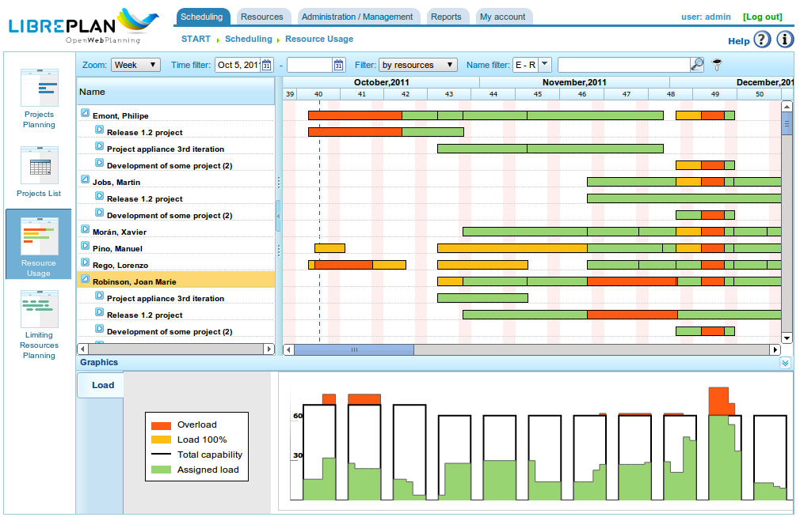
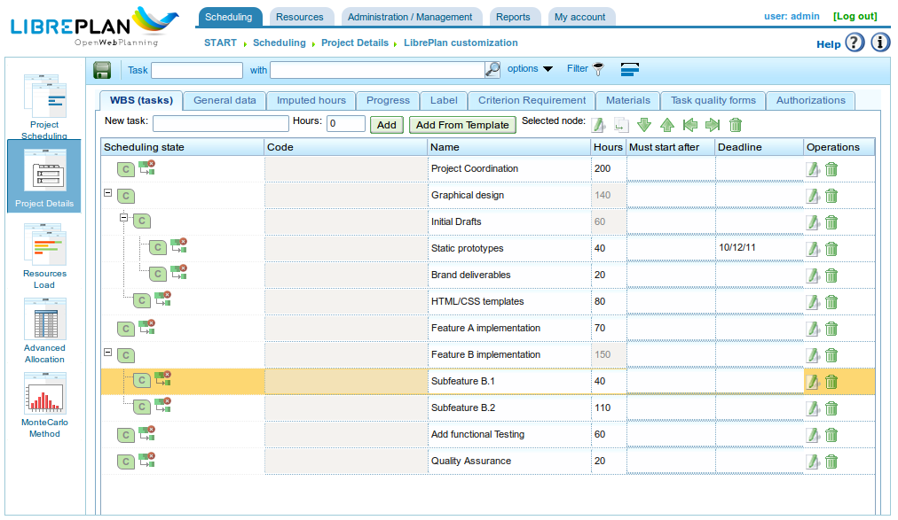

Einführung
##########

.. contents::

Dieses Dokument beschreibt die Funktionen von LibrePlan und bietet dem Benutzer Informationen zur Konfiguration und Nutzung der Anwendung.

LibrePlan ist eine quelloffene Webanwendung zur Projektplanung. Ihr Hauptziel ist die Bereitstellung einer umfassenden Lösung für das Projektmanagement von Unternehmen. Für spezifische Informationen, die Sie zu dieser Software benötigen, wenden Sie sich bitte an das Entwicklungsteam unter http://www.libreplan.com/contact/

.. figure:: images/company_view.png
   :scale: 50

   Unternehmensübersicht

Unternehmensübersicht und Ansichtsverwaltung
=============================================

Wie auf dem Hauptbildschirm des Programms (siehe vorheriger Screenshot) und der Unternehmensübersicht gezeigt, können Benutzer eine Liste der geplanten Projekte einsehen. Dies ermöglicht es ihnen, den Gesamtstatus des Unternehmens hinsichtlich Projekten und Ressourcenauslastung zu verstehen. Die Unternehmensübersicht bietet drei verschiedene Ansichten:

* **Planungsansicht:** Diese Ansicht kombiniert zwei Perspektiven:

   * **Projekts- und Zeitverfolgung:** Jedes Projekt wird durch ein Gantt-Diagramm dargestellt, das das Start- und Enddatum des Projekts angibt. Diese Informationen werden zusammen mit dem vereinbarten Liefertermin angezeigt. Anschließend wird ein Vergleich zwischen dem erzielten Fortschrittsprozentsatz und der tatsächlich für jedes Projekt aufgewendeten Zeit vorgenommen. Dies bietet ein klares Bild der Unternehmensleistung zu jedem beliebigen Zeitpunkt. Diese Ansicht ist die Standard-Startseite des Programms.
   * **Unternehmensressourcen-Auslastungsdiagramm:** Dieses Diagramm zeigt Informationen zur Ressourcenzuteilung über Projekte hinweg und bietet eine Zusammenfassung der Ressourcennutzung des gesamten Unternehmens. Grün zeigt an, dass die Ressourcenzuteilung unter 100 % der Kapazität liegt. Die schwarze Linie stellt die gesamte verfügbare Ressourcenkapazität dar. Gelb zeigt an, dass die Ressourcenzuteilung 100 % übersteigt. Es ist möglich, insgesamt eine Unterauslastung zu haben und gleichzeitig eine Überauslastung für bestimmte Ressourcen zu erfahren.

* **Ressourcenauslastungsansicht:** Dieser Bildschirm zeigt eine Liste der Mitarbeiter des Unternehmens und deren spezifische Aufgabenzuweisungen oder generische Zuweisungen basierend auf definierten Kriterien. Um auf diese Ansicht zuzugreifen, klicken Sie auf *Gesamtauslastung der Ressourcen*. Sehen Sie das folgende Bild als Beispiel.
* **Projektsadministrationsansicht:** Dieser Bildschirm zeigt eine Liste der Unternehmensprojekte, mit der Benutzer die folgenden Aktionen durchführen können: filtern, bearbeiten, löschen, Planung visualisieren oder ein neues Projekt erstellen. Um auf diese Ansicht zuzugreifen, klicken Sie auf *Projektsliste*.

   Ressourcenübersicht

   Projektstrukturplan

Die oben beschriebene Ansichtsverwaltung für die Unternehmensübersicht ist der Verwaltung für ein einzelnes Projekt sehr ähnlich. Auf ein Projekt kann auf verschiedene Weisen zugegriffen werden:

* Rechtsklick auf das Gantt-Diagramm des Projekts und Auswahl von *Planen*.
* Zugriff auf die Projektsliste und Klicken auf das Gantt-Diagrammsymbol.
* Erstellen eines neuen Projekts und Ändern der aktuellen Projektsansicht.

Das Programm bietet die folgenden Ansichten für ein Projekt:

* **Planungsansicht:** Diese Ansicht ermöglicht es Benutzern, Aufgabenplanung, Abhängigkeiten, Meilensteine und mehr zu visualisieren. Weitere Einzelheiten finden Sie im Abschnitt *Planung*.
* **Ressourcenauslastungsansicht:** Diese Ansicht ermöglicht es Benutzern, die designierte Ressourcenauslastung für ein Projekt zu überprüfen. Der Farbcode stimmt mit der Unternehmensübersicht überein: Grün für eine Auslastung unter 100 %, Gelb für eine Auslastung von 100 % und Rot für eine Auslastung über 100 %. Die Auslastung kann von einer bestimmten Aufgabe oder einem Kriteriensatz (generische Zuteilung) stammen.
* **Projektsbearbeitungsansicht:** Diese Ansicht ermöglicht es Benutzern, die Details des Projekts zu ändern. Weitere Informationen finden Sie im Abschnitt *Projekte*.
* **Erweiterte Ressourcenzuteilungsansicht:** Diese Ansicht ermöglicht es Benutzern, Ressourcen mit erweiterten Optionen zuzuteilen, z. B. Stunden pro Tag oder die zuzuteilenden Funktionen. Weitere Informationen finden Sie im Abschnitt *Ressourcenzuteilung*.

Was macht LibrePlan nützlich?
==============================

LibrePlan ist ein Allzweck-Planungswerkzeug, das entwickelt wurde, um Herausforderungen bei der industriellen Projektplanung zu bewältigen, die von bestehenden Tools nicht ausreichend abgedeckt wurden. Die Entwicklung von LibrePlan wurde auch durch den Wunsch motiviert, eine freie, quelloffene und vollständig webbasierte Alternative zu proprietären Planungstools bereitzustellen.

Die Kernkonzepte, auf denen das Programm basiert, sind folgende:

* **Unternehmens- und Multiprojektübersicht:** LibrePlan ist speziell darauf ausgelegt, Benutzern Informationen über mehrere Projekte zu liefern, die innerhalb eines Unternehmens durchgeführt werden. Daher ist es von Natur aus ein Multiprojektprogramm. Der Fokus des Programms ist nicht auf einzelne Projekte beschränkt, obwohl auch spezifische Ansichten für einzelne Projekte verfügbar sind.
* **Ansichtsverwaltung:** Die Unternehmensübersicht oder Multiprojektansicht wird von verschiedenen Ansichten der gespeicherten Informationen begleitet. Beispielsweise ermöglicht die Unternehmensübersicht Benutzern, Projekte anzuzeigen und deren Status zu vergleichen, die Gesamtressourcenauslastung des Unternehmens einzusehen und Projekte zu verwalten. Benutzer können auch die Planungsansicht, Ressourcenauslastungsansicht, erweiterte Ressourcenzuteilungsansicht und Projektsbearbeitungsansicht für einzelne Projekte aufrufen.
* **Kriterien:** Kriterien sind eine Systementität, die die Klassifizierung sowohl von Ressourcen (menschlich und maschinell) als auch von Aufgaben ermöglicht. Ressourcen müssen bestimmte Kriterien erfüllen, und Aufgaben erfordern die Erfüllung spezifischer Kriterien. Dies ist eine der wichtigsten Funktionen des Programms, da Kriterien die Grundlage der generischen Zuteilung bilden und eine bedeutende Herausforderung in der Industrie ansprechen: den zeitaufwändigen Charakter des Personalmanagements und die Schwierigkeit langfristiger Unternehmensauslastungsschätzungen.
* **Ressourcen:** Es gibt zwei Arten von Ressourcen: menschliche und maschinelle. Menschliche Ressourcen sind die Mitarbeiter des Unternehmens, die für Planung, Überwachung und Steuerung der Unternehmensarbeitsbelastung verwendet werden. Maschinenressourcen, die von den Personen abhängig sind, die sie bedienen, funktionieren ähnlich wie menschliche Ressourcen.
* **Ressourcenzuteilung:** Ein Schlüsselmerkmal des Programms ist die Möglichkeit, Ressourcen auf zwei Arten zu designieren: spezifisch und generisch. Die generische Zuteilung basiert auf den Kriterien, die zur Erfüllung einer Aufgabe erforderlich sind und von Ressourcen erfüllt werden müssen, die diese Kriterien erfüllen können. Um die generische Zuteilung zu verstehen, betrachten Sie dieses Beispiel: Johann Müller ist Schweißer. Normalerweise würde Johann Müller einer geplanten Aufgabe spezifisch zugewiesen werden. LibrePlan bietet jedoch die Möglichkeit, jeden Schweißer im Unternehmen auszuwählen, ohne angeben zu müssen, dass Johann Müller die zugewiesene Person ist.
* **Unternehmensauslastungskontrolle:** Das Programm ermöglicht eine einfache Kontrolle der Ressourcenauslastung des Unternehmens. Diese Kontrolle erstreckt sich sowohl auf die mittelfristige als auch auf die langfristige Perspektive, da aktuelle und zukünftige Projekte im Programm verwaltet werden können. LibrePlan bietet Diagramme, die die Ressourcennutzung visuell darstellen.
* **Etiketten:** Etiketten werden verwendet, um Projektaufgaben zu kategorisieren. Mit diesen Etiketten können Benutzer Aufgaben nach Konzepten gruppieren, was eine spätere Überprüfung als Gruppe oder nach Filterung ermöglicht.
* **Filter:** Da das System von Natur aus Elemente enthält, die Aufgaben und Ressourcen etikettieren oder charakterisieren, können Kriterienfilter oder Etiketten verwendet werden. Dies ist sehr nützlich zum Überprüfen kategorisierter Informationen oder zum Erstellen spezifischer Berichte basierend auf Kriterien oder Etiketten.
* **Kalender:** Kalender definieren die verfügbaren Produktivstunden für verschiedene Ressourcen. Benutzer können allgemeine Unternehmenskalender erstellen oder spezifischere Kalender definieren, was die Erstellung von Kalendern für einzelne Ressourcen und Aufgaben ermöglicht.
* **Projekte und Projektelemente:** Die von Kunden angeforderte Arbeit wird in der Anwendung als Projekt behandelt, das in Projektelemente strukturiert ist. Das Projekt und seine Elemente folgen einer hierarchischen Struktur mit *x* Ebenen. Dieser Elementbaum bildet die Grundlage für die Arbeitsplanung.
* **Fortschritt:** Das Programm kann verschiedene Arten von Fortschritt verwalten. Der Fortschritt eines Projekts kann als Prozentsatz, in Einheiten, am vereinbarten Budget und mehr gemessen werden. Die Verantwortung für die Entscheidung, welche Art von Fortschritt für den Vergleich auf höheren Projektebenen verwendet werden soll, liegt beim Planungsmanager.
* **Aufgaben:** Aufgaben sind die grundlegenden Planungselemente im Programm. Sie werden verwendet, um zu planende Arbeit zu terminieren. Wichtige Merkmale von Aufgaben sind: Abhängigkeiten zwischen Aufgaben und die potenzielle Anforderung, dass bestimmte Kriterien erfüllt werden müssen, bevor Ressourcen zugewiesen werden können.
* **Arbeitsberichte:** Diese von den Mitarbeitern des Unternehmens eingereichten Berichte enthalten die geleisteten Arbeitsstunden und die damit verbundenen Aufgaben. Diese Informationen ermöglichen es dem System, die tatsächlich für eine Aufgabe benötigte Zeit im Vergleich zur budgetierten Zeit zu berechnen. Der Fortschritt kann dann mit den tatsächlich verwendeten Stunden verglichen werden.

Zusätzlich zu den Kernfunktionen bietet LibrePlan weitere Funktionen, die es von ähnlichen Programmen unterscheiden:

* **Integration mit ERP:** Das Programm kann direkt Informationen aus ERP-Systemen des Unternehmens importieren, einschließlich Projekte, Personalressourcen, Arbeitsberichte und spezifische Kriterien.
* **Versionsverwaltung:** Das Programm kann mehrere Planungsversionen verwalten und Benutzern trotzdem ermöglichen, die Informationen jeder Version zu überprüfen.
* **Verlaufsverwaltung:** Das Programm löscht keine Informationen; es markiert sie nur als ungültig. Dies ermöglicht es Benutzern, historische Informationen mithilfe von Datumsfiltern zu überprüfen.

Benutzbarkeitskonventionen
===========================

Informationen zu Formularen
----------------------------
Bevor die verschiedenen Funktionen der wichtigsten Module beschrieben werden, müssen wir die allgemeine Navigation und das Formularverhalten erläutern.

Es gibt im Wesentlichen drei Arten von Bearbeitungsformularen:

* **Formulare mit einer Schaltfläche *Zurück*:** Diese Formulare sind Teil eines größeren Kontexts, und die vorgenommenen Änderungen werden im Arbeitsspeicher gespeichert. Die Änderungen werden erst angewendet, wenn der Benutzer explizit alle Details auf dem Bildschirm speichert, von dem das Formular stammt.
* **Formulare mit den Schaltflächen *Speichern* und *Schließen*:** Diese Formulare ermöglichen zwei Aktionen. Die erste speichert die Änderungen und schließt das aktuelle Fenster. Die zweite schließt das Fenster, ohne Änderungen zu speichern.
* **Formulare mit den Schaltflächen *Speichern und fortfahren*, *Speichern* und *Schließen*:** Diese Formulare ermöglichen drei Aktionen. Die erste speichert die Änderungen und lässt das aktuelle Formular geöffnet. Die zweite speichert die Änderungen und schließt das Formular. Die dritte schließt das Fenster, ohne Änderungen zu speichern.

Standardsymbole und -schaltflächen
------------------------------------

* **Bearbeiten:** Im Allgemeinen können Datensätze im Programm durch Klicken auf ein Symbol, das wie ein Bleistift auf einem weißen Notizbuch aussieht, bearbeitet werden.
* **Einrücken nach links:** Diese Operationen werden in der Regel für Elemente innerhalb einer Baumstruktur verwendet, die auf eine tiefere Ebene verschoben werden müssen. Dies erfolgt durch Klicken auf das Symbol, das wie ein grüner Pfeil nach rechts aussieht.
* **Einrücken nach rechts:** Diese Operationen werden in der Regel für Elemente innerhalb einer Baumstruktur verwendet, die auf eine höhere Ebene verschoben werden müssen. Dies erfolgt durch Klicken auf das Symbol, das wie ein grüner Pfeil nach links aussieht.
* **Löschen:** Benutzer können Informationen durch Klicken auf das Mülleimer-Symbol löschen.
* **Suche:** Das Lupensymbol zeigt an, dass das Textfeld links davon für die Suche nach Elementen verwendet wird.

Registerkarten
--------------
Das Programm verwendet Registerkarten, um Inhaltsbearbeitungs- und Verwaltungsformulare zu organisieren. Diese Methode wird verwendet, um ein umfassendes Formular in verschiedene Abschnitte zu unterteilen, auf die durch Klicken auf die Registerkartennamen zugegriffen werden kann. Die anderen Registerkarten behalten ihren aktuellen Status bei. In allen Fällen gelten die Speicher- und Abbrechen-Optionen für alle Unterformulare in den verschiedenen Registerkarten.

Explizite Aktionen und Kontexthilfe
-------------------------------------

Das Programm enthält Komponenten, die zusätzliche Beschreibungen von Elementen bereitstellen, wenn die Maus eine Sekunde lang darüber schwebt. Die Aktionen, die der Benutzer ausführen kann, sind auf den Schaltflächenbeschriftungen, in den zugehörigen Hilfetexten, in den Navigationsmenüoptionen und in den Kontextmenüs angegeben, die beim Rechtsklick im Planungsbereich erscheinen. Darüber hinaus werden Tastenkombinationen für die Hauptoperationen bereitgestellt, z. B. Doppelklicken auf aufgelistete Elemente oder Verwenden von Tastenereignissen mit dem Cursor und der Eingabetaste, um Elemente hinzuzufügen, wenn durch Formulare navigiert wird.
