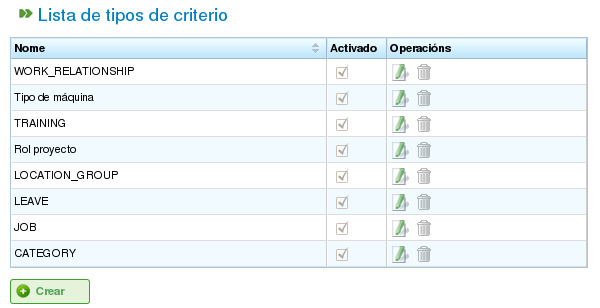

Kriterien
#########

.. contents::

Kriterien sind Elemente, die im Programm verwendet werden, um sowohl Ressourcen als auch Aufgaben zu kategorisieren. Aufgaben erfordern bestimmte Kriterien, und Ressourcen müssen diese Kriterien erfüllen.

Hier ist ein Beispiel dafür, wie Kriterien verwendet werden: Einer Ressource wird das Kriterium „Schweißer" zugewiesen (was bedeutet, dass die Ressource die Kategorie „Schweißer" erfüllt), und eine Aufgabe erfordert das Kriterium „Schweißer", um abgeschlossen zu werden. Wenn Ressourcen mithilfe der generischen Zuteilung (im Gegensatz zur spezifischen Zuteilung) für Aufgaben zugewiesen werden, werden daher Mitarbeiter mit dem Kriterium „Schweißer" berücksichtigt. Weitere Informationen zu den verschiedenen Arten der Zuteilung finden Sie im Kapitel zur Ressourcenzuteilung.

Das Programm ermöglicht mehrere Operationen mit Kriterien:

*   Kriterienverwaltung
*   Zuweisung von Kriterien zu Ressourcen
*   Zuweisung von Kriterien zu Aufgaben
*   Filtern von Entitäten basierend auf Kriterien. Aufgaben und Projektelemente können nach Kriterien gefiltert werden, um verschiedene Operationen im Programm durchzuführen.

Dieser Abschnitt erklärt nur die erste Funktion, die Kriterienverwaltung. Die beiden Arten der Zuteilung werden später behandelt: die Ressourcenzuteilung im Kapitel „Ressourcenverwaltung" und die Filterung im Kapitel „Aufgabenplanung".

Kriterienverwaltung
===================

Die Kriterienverwaltung ist über das Verwaltungsmenü zugänglich:

.. figure:: images/menu.png
   :scale: 50

   Menüregisterkarten auf erster Ebene

Die spezifische Operation zur Verwaltung von Kriterien ist *Kriterien verwalten*. Diese Operation ermöglicht es Ihnen, die im System verfügbaren Kriterien aufzulisten.

   Kriterienliste

Sie können auf das Formular zum Erstellen/Bearbeiten eines Kriteriums zugreifen, indem Sie auf die Schaltfläche *Erstellen* klicken. Um ein vorhandenes Kriterium zu bearbeiten, klicken Sie auf das Bearbeitungssymbol.

.. figure:: images/edicion-criterio.png
   :scale: 50

   Kriterien bearbeiten

Das Kriterienbearbeitungsformular, wie im vorherigen Bild gezeigt, ermöglicht es Ihnen, folgende Operationen durchzuführen:

*   **Den Namen des Kriteriums bearbeiten.**
*   **Angeben, ob mehrere Werte gleichzeitig oder nur ein Wert für den ausgewählten Kriteriumstyp zugewiesen werden können.** Zum Beispiel könnte eine Ressource zwei Kriterien erfüllen: „Schweißer" und „Dreher".
*   **Den Kriteriumstyp angeben:**

    *   **Generisch:** Ein Kriterium, das sowohl für Maschinen als auch für Mitarbeiter verwendet werden kann.
    *   **Mitarbeiter:** Ein Kriterium, das nur für Mitarbeiter verwendet werden kann.
    *   **Maschine:** Ein Kriterium, das nur für Maschinen verwendet werden kann.

*   **Angeben, ob das Kriterium hierarchisch ist.** Manchmal müssen Kriterien hierarchisch behandelt werden. Zum Beispiel bedeutet das Zuweisen eines Kriteriums zu einem Element nicht automatisch, dass es auch Elementen zugewiesen wird, die davon abgeleitet sind. Ein klares Beispiel für ein hierarchisches Kriterium ist „Standort". Zum Beispiel wird eine Person, die mit dem Standort „Bayern" bezeichnet wurde, auch zu „Deutschland" gehören.
*   **Angeben, ob das Kriterium autorisiert ist.** So deaktivieren Benutzer Kriterien. Sobald ein Kriterium erstellt und in historischen Daten verwendet wurde, kann es nicht mehr geändert werden. Stattdessen kann es deaktiviert werden, damit es nicht mehr in Auswahllisten erscheint.
*   **Das Kriterium beschreiben.**
*   **Neue Werte hinzufügen.** Ein Texteingabefeld mit der Schaltfläche *Neues Kriterium* befindet sich im zweiten Teil des Formulars.
*   **Die Namen vorhandener Kriterienwerte bearbeiten.**
*   **Kriterienwerte in der Liste der aktuellen Kriterienwerte nach oben oder unten verschieben.**
*   **Einen Kriterienwert aus der Liste entfernen.**

Das Kriterienverwaltungsformular folgt dem im Einführungskapitel beschriebenen Formularverhalten und bietet drei Aktionen: *Speichern*, *Speichern und Schließen* sowie *Schließen*.
