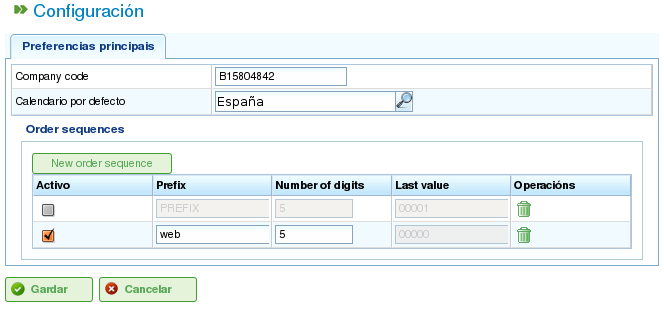

Kalender
########

.. contents::

Kalender sind Entitäten im Programm, die die Arbeitskapazität von Ressourcen definieren. Ein Kalender besteht aus einer Reihe von Tagen im Laufe des Jahres, wobei jeder Tag in verfügbare Arbeitsstunden unterteilt ist.

Beispielsweise hat ein gesetzlicher Feiertag möglicherweise 0 verfügbare Arbeitsstunden. Umgekehrt kann ein typischer Werktag 8 Stunden als verfügbare Arbeitszeit haben.

Es gibt zwei primäre Möglichkeiten, die Anzahl der Arbeitsstunden an einem Tag zu definieren:

*   **Nach Wochentag:** Diese Methode legt eine Standardanzahl von Arbeitsstunden für jeden Wochentag fest. Zum Beispiel könnten Montage typischerweise 8 Arbeitsstunden haben.
*   **Als Ausnahme:** Diese Methode ermöglicht spezifische Abweichungen vom Standard-Wochentagsplan. Zum Beispiel könnte Montag, der 30. Januar, 10 Arbeitsstunden haben, was den Standard-Montagsplan außer Kraft setzt.

Kalenderverwaltung
==================

Das Kalendersystem ist hierarchisch aufgebaut, sodass Sie Basiskalender erstellen und dann neue Kalender daraus ableiten können, die eine Baumstruktur bilden. Ein Kalender, der von einem übergeordneten Kalender abgeleitet ist, erbt dessen Tages- und Ausnahmepläne, sofern sie nicht explizit geändert werden. Um Kalender effektiv zu verwalten, ist es wichtig, die folgenden Konzepte zu verstehen:

*   **Tagesunabhängigkeit:** Jeder Tag wird unabhängig behandelt, und jedes Jahr hat seine eigenen Tage. Zum Beispiel bedeutet ein Feiertag am 8. Dezember 2009 nicht automatisch, dass der 8. Dezember 2010 ebenfalls ein Feiertag ist.
*   **Wochentagsbasierte Arbeitstage:** Standardarbeitstage basieren auf Wochentagen. Wenn Montage zum Beispiel typischerweise 8 Arbeitsstunden haben, dann haben alle Montage in allen Wochen aller Jahre 8 verfügbare Stunden, sofern keine Ausnahme definiert ist.
*   **Ausnahmen und Ausnahmezeiträume:** Sie können Ausnahmen oder Ausnahmezeiträume definieren, um vom Standard-Wochentagsplan abzuweichen.

.. figure:: images/calendar-administration.png
   :scale: 50

   Kalenderverwaltung

Die Kalenderverwaltung ist über das Menü „Verwaltung" zugänglich. Von dort aus können Benutzer die folgenden Aktionen ausführen:

1.  Einen neuen Kalender von Grund auf neu erstellen.
2.  Einen von einem bestehenden abgeleiteten Kalender erstellen.
3.  Einen Kalender als Kopie eines bestehenden erstellen.
4.  Einen vorhandenen Kalender bearbeiten.

Erstellen eines neuen Kalenders
---------------------------------

Um einen neuen Kalender zu erstellen, klicken Sie auf die Schaltfläche „Erstellen". Das System zeigt ein Formular an, in dem Sie Folgendes konfigurieren können:

*   **Registerkarte auswählen:** Wählen Sie die Registerkarte, auf der Sie arbeiten möchten:

    *   **Ausnahmen markieren:** Definieren Sie Ausnahmen vom Standardplan.
    *   **Arbeitsstunden pro Tag:** Definieren Sie die Standard-Arbeitsstunden für jeden Wochentag.

*   **Ausnahmen markieren:** Wenn Sie die Option „Ausnahmen markieren" wählen, können Sie:

    *   Einen bestimmten Tag im Kalender auswählen.
    *   Den Ausnahmetyp auswählen. Die verfügbaren Typen sind: Urlaub, Krankheit, Streik, gesetzlicher Feiertag und Arbeitsfeiertag.
    *   Das Enddatum des Ausnahmezeitraums auswählen.
    *   Die Anzahl der Arbeitsstunden während der Tage des Ausnahmezeitraums definieren.
    *   Zuvor definierte Ausnahmen löschen.

*   **Arbeitsstunden pro Tag:** Wenn Sie die Option „Arbeitsstunden pro Tag" wählen, können Sie:

    *   Die verfügbaren Arbeitsstunden für jeden Wochentag (Montag, Dienstag, Mittwoch, Donnerstag, Freitag, Samstag und Sonntag) definieren.
    *   Verschiedene wöchentliche Stundenverteilungen für zukünftige Zeiträume definieren.
    *   Zuvor definierte Stundenverteilungen löschen.

Diese Optionen ermöglichen es Benutzern, Kalender vollständig an ihre spezifischen Bedürfnisse anzupassen. Klicken Sie auf die Schaltfläche „Speichern", um alle am Formular vorgenommenen Änderungen zu speichern.

.. figure:: images/calendar-edition.png
   :scale: 50

   Kalender bearbeiten

.. figure:: images/calendar-exceptions.png
   :scale: 50

   Eine Ausnahme zu einem Kalender hinzufügen

Abgeleitete Kalender erstellen
--------------------------------

Ein abgeleiteter Kalender wird auf Basis eines vorhandenen Kalenders erstellt. Er erbt alle Eigenschaften des Originalkalenders, kann aber so geändert werden, dass er unterschiedliche Optionen enthält.

Ein häufiger Anwendungsfall für abgeleitete Kalender ist, wenn Sie einen allgemeinen Kalender für ein Land, z. B. Deutschland, haben und einen abgeleiteten Kalender erstellen müssen, um zusätzliche regionsspezifische Feiertage einzuschließen, z. B. für Bayern.

Es ist wichtig zu beachten, dass alle Änderungen am Originalkalender automatisch auf den abgeleiteten Kalender übertragen werden, sofern keine spezifische Ausnahme im abgeleiteten Kalender definiert wurde.

.. figure:: images/calendar-create-derived.png
   :scale: 50

   Abgeleiteten Kalender erstellen

Um einen abgeleiteten Kalender zu erstellen:

*   Gehen Sie zum Menü *Verwaltung*.
*   Klicken Sie auf die Option *Kalenderverwaltung*.
*   Wählen Sie den Kalender aus, den Sie als Basis für den abgeleiteten Kalender verwenden möchten, und klicken Sie auf die Schaltfläche „Erstellen".
*   Das System zeigt ein Bearbeitungsformular mit denselben Eigenschaften wie das Formular zum Erstellen eines Kalenders von Grund auf an, außer dass die vorgeschlagenen Ausnahmen und Arbeitsstunden pro Wochentag auf dem Originalkalender basieren.

Kalender durch Kopieren erstellen
----------------------------------

Ein kopierter Kalender ist ein genaues Duplikat eines vorhandenen Kalenders. Er erbt alle Eigenschaften des Originalkalenders, kann aber unabhängig davon geändert werden.

Der wesentliche Unterschied zwischen einem kopierten Kalender und einem abgeleiteten Kalender besteht darin, wie sie von Änderungen am Original betroffen sind. Wenn der Originalkalender geändert wird, bleibt der kopierte Kalender unverändert. Abgeleitete Kalender hingegen werden durch Änderungen am Original beeinflusst, sofern keine Ausnahme definiert ist.

Um einen kopierten Kalender zu erstellen:

*   Gehen Sie zum Menü *Verwaltung*.
*   Klicken Sie auf die Option *Kalenderverwaltung*.
*   Wählen Sie den Kalender aus, den Sie kopieren möchten, und klicken Sie auf die Schaltfläche „Erstellen".
*   Das System zeigt ein Bearbeitungsformular mit denselben Eigenschaften wie das Formular zum Erstellen eines Kalenders von Grund auf an.

Standardkalender
-----------------

Einer der vorhandenen Kalender kann als Standardkalender festgelegt werden. Dieser Kalender wird automatisch jeder Entität im System zugewiesen, die mit Kalendern verwaltet wird, sofern kein anderer Kalender angegeben ist.

So richten Sie einen Standardkalender ein:

*   Gehen Sie zum Menü *Verwaltung*.
*   Klicken Sie auf die Option *Konfiguration*.
*   Wählen Sie im Feld *Standardkalender* den Kalender aus, den Sie als Standardkalender des Programms verwenden möchten.
*   Klicken Sie auf *Speichern*.

   Einen Standardkalender festlegen

Einen Kalender zu Ressourcen zuweisen
--------------------------------------

Ressourcen können nur aktiviert werden (d. h. verfügbare Arbeitsstunden haben), wenn ihnen ein Kalender mit einem gültigen Aktivierungszeitraum zugewiesen wurde. Wenn einer Ressource kein Kalender zugewiesen ist, wird automatisch der Standardkalender mit einem Aktivierungszeitraum ab dem Startdatum ohne Ablaufdatum zugewiesen.

.. figure:: images/resource-calendar.png
   :scale: 50

   Ressourcenkalender

Sie können jedoch den einer Ressource zuvor zugewiesenen Kalender löschen und einen neuen basierend auf einem vorhandenen erstellen. Dies ermöglicht eine vollständige Anpassung der Kalender für einzelne Ressourcen.

So weisen Sie einer Ressource einen Kalender zu:

*   Gehen Sie zur Option *Ressourcen bearbeiten*.
*   Wählen Sie eine Ressource aus und klicken Sie auf *Bearbeiten*.
*   Wählen Sie die Registerkarte „Kalender".
*   Der Kalender wird zusammen mit seinen Ausnahmen, Arbeitsstunden pro Tag und Aktivierungszeiträumen angezeigt.
*   Jede Registerkarte hat folgende Optionen:

    *   **Ausnahmen:** Definieren Sie Ausnahmen und den Zeitraum, für den sie gelten, z. B. Urlaub, gesetzliche Feiertage oder andere Arbeitstage.
    *   **Arbeitswoche:** Ändern Sie die Arbeitsstunden für jeden Wochentag (Montag, Dienstag usw.).
    *   **Aktivierungszeiträume:** Erstellen Sie neue Aktivierungszeiträume, die das Start- und Enddatum von Verträgen der Ressource widerspiegeln.

*   Klicken Sie auf *Speichern*, um die Informationen zu speichern.
*   Klicken Sie auf *Löschen*, wenn Sie den einer Ressource zugewiesenen Kalender ändern möchten.

.. figure:: images/new-resource-calendar.png
   :scale: 50

   Einer Ressource einen neuen Kalender zuweisen

Kalender Projekten zuweisen
-----------------------------

Projekte können einen anderen Kalender als den Standardkalender haben. So ändern Sie den Kalender für ein Projekt:

*   Öffnen Sie die Projektsliste in der Unternehmensübersicht.
*   Bearbeiten Sie das betreffende Projekt.
*   Öffnen Sie die Registerkarte „Allgemeine Informationen".
*   Wählen Sie den zuzuweisenden Kalender aus dem Dropdown-Menü aus.
*   Klicken Sie auf „Speichern" oder „Speichern und fortfahren".

Kalender Aufgaben zuweisen
----------------------------

Ähnlich wie bei Ressourcen und Projekten können Sie einzelnen Aufgaben spezifische Kalender zuweisen. So weisen Sie einer Aufgabe einen Kalender zu:

*   Öffnen Sie die Planungsansicht eines Projekts.
*   Klicken Sie mit der rechten Maustaste auf die Aufgabe, der Sie einen Kalender zuweisen möchten.
*   Wählen Sie die Option „Kalender zuweisen".
*   Wählen Sie den der Aufgabe zuzuweisenden Kalender aus.
*   Klicken Sie auf *Akzeptieren*.
