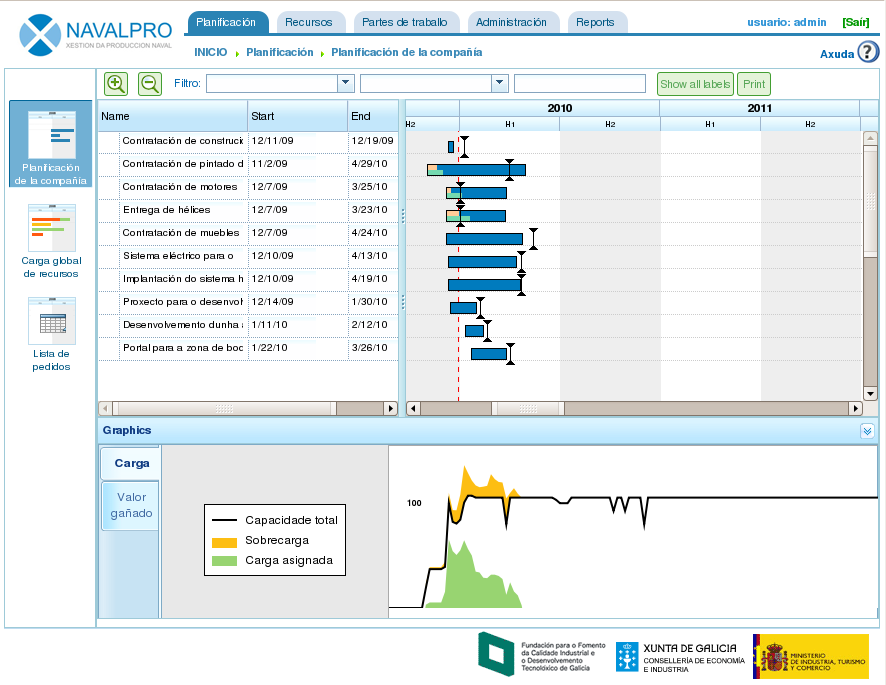
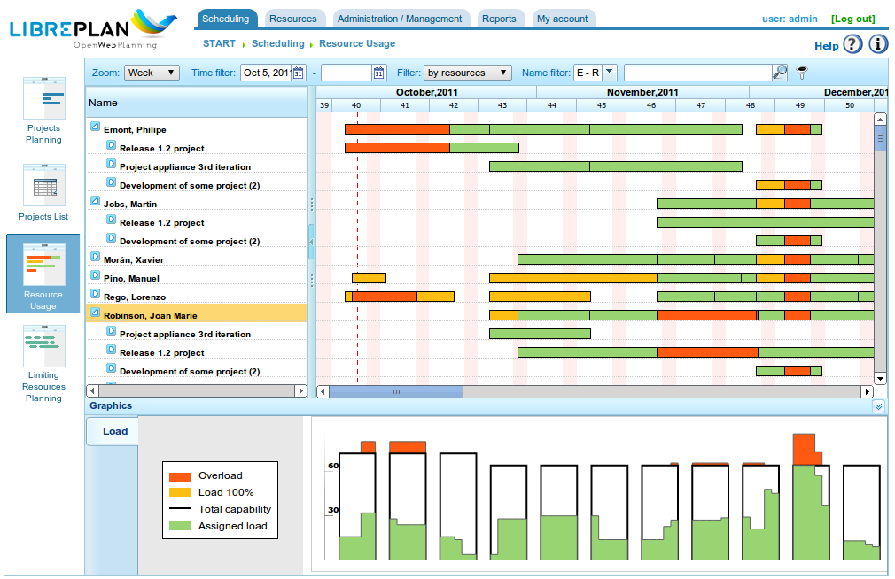

Introduction
#############

.. contents::

The purpose of this document is to describe the features of LibrePlan and provide user information on how to configure and use the application.

LibrePlan is an opensource web application for project planning. Its main goal is to provide a complete solution for company project management.
For any specific information you may need about this software, please contact the development team at http://www.libreplan.org/en/contact

   Company overview

Company overview and view management
====================================================

As can be seen in the program's main screen (shot given previously) and the company overview, users can see the list of planned projects to find out about the company's overall situation in relation to orders and the use of resources. The company overview contains 3 views:

* Planning view: View that combines two points of view:

   * View of orders and the time taken: Each project uses Gantt charts, which indicate the start and end date of the project. This information is combined with the chart showing the agreed deadline and then a comparison is made between a percentage of progress and time that is actually dedicated to each project. This information gives a clear picture of how the company is doing at a given time. This view is the program's opening page.
   * Graph showing the company's use of resources: Graph that searches for information on the allocation of resources to projects, which also gives a summary on the entire company's use of resources: Green indicates that the allocation of resources is under 100%, the black line shows the available load of resources and yellow indicates that allocation of resources is above 100%. It is possible for allocation to be less than available resources and to have over allocation for specific resources at the same time.

* Resource load view: Screen that shows the list of workers in the company and the load of specific allocation to tasks or generic allocation as the resource fulfils a list of criteria. See the following image. You need to click on *Overall load of resources* to access this view.
* Orders administration view. Screen that shows the list of company orders, where the user can carry out the following operations: filter, edit, erase, visualise planning or create a new order. You need to click on *Order list* to access this view.

   Resource overview

.. figure:: images/order_list.png
   :scale: 50

   Order list

The view management commented on previously for the company overview is very similar to the management planned for a single project. A project can be accessed in several ways:

* By right clicking on the Gantt chart for the order and then selecting *Plan*.
* By accessing the order list and clicking on the icon for the Gantt diagrams.
* By creating a new order and changing the current order view.

The program has the following views for an order:

* Planning view. View where the user can visualise the task planning, dependencies, milestones, etc. See the *Planning* section for more information.
* Resource load view. View where the user can check the designated resource load for a project. The colour code is the same for the company overview: Green for a load less than 100%, yellow for a load equal to 100% and red for a load over 100%. The load may come from a task or a list of criteria (generic allocation).
* Editing order view. View where the user can change the details of the order. See the *Orders* section for more information.
* Advanced resource allocation view. View where the user can allocate resources including advanced options: choosing hours per day or the allocated functions to be carried out. See the *Resource allocation* section for more information.

What makes LibrePlan useful?
============================

LibrePlan is an application that has been developed as a general purpose planning tool. It is based on a series of concepts discovered by analysing problems in industrial project planning that were not fully covered by any existing planning tool. Also the motivations for the development of LibrePlan were based on providing a free software alternative, and completely web, for existing privative plannig tools.

The essential concepts used for the program are as follows:

* Company and multi-project overview: LibrePlan is a program that has been developed specifically to provide information about projects that are being carried out in a company to users, therefore it is a multi-project program. It was decided that the program's focus would not be individual to each project. However, it is also possible to have several specific views, individual projects among them.
* View management: The company overview or multi-project view comes with the views on the information that is stored. For example, the company overview enables users to view orders and compare their status, view the company's general resource load and process orders. Users can also view the planning, the resource load, the advanced resource allocation view and the editing order view on the project view.
* Criteria: Criteria are a system entity that enables resources (both humans and machines) and tasks to be classified. Resources must fulfil criteria and tasks require criteria to be fulfilled. These are one of the program's most important aspects, as criteria are the basis of generic allocation in the program and resolve one of the most important problems for the sector: the long time taken in human resources and the difficulty in having long-term company load estimations.
* Resources: There are two different kinds: humans and machines. Human resources are workers in a company that are used to plan, monitor and control the company's load. On the other hand, machines, dependent on the people that manage them, are resources that act in a similar way to human resources.
* Resource allocation: One of the key points of the program is having the possibility of two kinds of designation: specific and generic. Generic allocation is based on criteria that are required to carry out a task and must be fulfilled by resources that are capable of performing them. In order to understand generic allocation, the following case must be understood: John Smith is a welder. Generally, John Smith is allocated to the planned task, but "LibrePlan" offers the possibility of choosing a resource in general among welders in the company, not worrying if John Smith is the person who has been allocated the task.
* Company load control: The program offers the possibility of controlling the company's resource load easily. The control is carried out in the mid and long term as current projects and future projects can be managed by the program. "LibrePlan" has graphics that indicate the use of resources.
* Labels: These are elements that are used to label project tasks. With these labels, the user of the program can group tasks together according to concept, which can then be checked at a later date as a group or after being filtered.
* Filters: As the system naturally has elements that label or characterise tasks and resources, criteria filters or labels can be used. This is very useful to check categorised information or to get specific reports based on criteria or labels.
* Calendars: Calendars determine the available productive hours for different resources. The user may create general calendars for the company or input characteristics for more specific calendars, meaning that calendars for resources and tasks can be made.
* Orders and order elements: Work requested by clients is treated by the application as an order, which is structured in order elements. The order and its elements adhere to a hierarchical structure of *x* levels. This element tree is the basis when planning work.
* Progress: The program can manage several kinds of progress. A project can be measured in a percentage that indicates its progress and also in units, the agreed budget, etc. Deciding what kind of progress is to be used to compare progress at upper stages of the project is the responsibility of the person who is managing the planning.
* Tasks: Tasks are the program's planning elements. They are used to programme works that are to be carried out. The most important characteristics of the tasks are: They have dependencies among themselves and may require criteria to be fulfilled in order to allocate resources.
* Work reports: These are the reports of the companies' workers, which indicate the hours worked and also the tasks allocated to the hours a worker has worked. With this information, the system can calculate how many hours it took to complete a task in relation to the total number of hours that were budgeted. Progress can be compared with the use of actual hours.

On top of the functions offered by the program, there are other features that make it stand out from similar programs:

* Integration with ERP: The program imports information directly from companies' ERPs for orders, human resources, work reports and specific criteria.
* Version management: The program can manage different planning versions and, at the same time, still allows users to check the information on every version.
* History management: The program does not erase information, it only makes it invalid, so users can check older information using date filters.

Usability conventions
==========================

Information about forms
---------------------------------
Before describing the various functions associated with the most important modules, we need to give a general explanation on how to browse and the forms.

Essentially, there are 3 kinds of editing forms:

* Forms with a *Return* button. These forms are part of a wider picture and the changes that are made are stored in the memory. The changes are only applied when the user explicitly stores all the details on the screen from which the form came.
* Forms with the *Save* and *Close* buttons. These forms enable 2 operations to take place. The first one stores and closes the current window and the second one closes without saving the changes.
* Forms with the *Save and continue*, "Save" and "Close" buttons. These forms enable 3 operations to take place. The first one stores and continues the current form. The second one stores and closes the form. Lastly, the third one closes the window without storing changes.

Standard icons and buttons
--------------------------

* Editing: In general, editing records in the program may be done by clicking on an icon consisting of a pencil on a white notebook.
* Left indent: In general, these operations are needed for elements of a tree that intend to move into internal levels. This operation may be done by clicking the icon consisting of a green arrow pointing right.
* Right indent: In general, these operations are needed for elements of a tree that intend to move from internal to external levels. This operation may be done by clicking the icon consisting of a green arrow pointing left.
* Erasing: Users can erase information by clicking on the paper basket icon.
* Search: The magnifying glass is the icon that indicates that the text entry to the left is intended for searching for elements.

Tabs
--------
The program will have content editing and administration forms, which will be represented by graphic components based on tabs. This method is used to organise information from a comprehensive form into different sections that can be accessed by clicking on the names of the different tabs, the others keeping their status. In all cases, the save and cancel options affect the group of sub-forms on the different tabs.

Explicit actions and context help
--------------------------------------

The program contains components that provide additional descriptions about the element when hovering over them for one second.
The actions the user may carry out in the program are stated on the button tabs and in the help texts about them, the browsing menu options and the options on the context menus that open out when right clicking on the planner area.
Furthermore, short cuts are given for the main operations by double clicking the listed elements or by associating key events with cursors and the enter key, which is how to add elements when moving through the forms.

