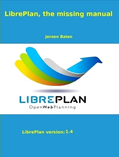

Introduction
#############

`Need more info? Buy the LibrePlan book!`_

.. _Need more info? Buy the LibrePlan book!: http://www.lulu.com/shop/jeroen-baten/libreplan-the-missing-manual/paperback/product-22574974.html

.. contents::

The purpose of this document is to describe the features of LibrePlan and provide information on how to configure and use the application.

LibrePlan is an open source web application for project planning. Its main goal is to provide a complete solution for company project management.
For any specific information you may need about this software, please contact the development team via http://www.libreplan.org/contact/

.. figure:: images/company_view.png
   :scale: 50

   Company overview

Company overview and view management
====================================================

As you can see in the program's main screen (see previous screenshot) and the company overview, users can see the list of planned projects to find out about the company's overall situation in relation to orders and the use of resources. The company overview contains 3 views:

- Planning perspective: View that combines two points of view:

   - View of orders and the time allocated: Each project uses Gantt charts, which indicate the start and end date of the project. This information is combined with the chart showing the agreed deadline. It is also possible to see both the time spent by resources on the project versus the percentage of progress of each project. This information gives you a clear picture of how the company is doing at any given time. This view (perspective) is the main program's page.
   - Graph showing the company's use of resources: Graph that displays information on the allocation of resources to projects, also gives a summary of the entire company's use of resources: Green indicates that the allocation of resources is under 100%, the black line shows the overall available resource capacity and orange indicates the allocation of resources over 100%. It is also possible that allocation is less than the number of available resources and to have overallocation for specific resources at the same time.

- Projects List perspective. This is the projects administration view. It shows the list of company projects, where the user can carry out the following operations: filter, edit, erase, visualise planning or create a new order. You need to click on *Projects list* to access this perspective.

- Resource load perspective: Screen that shows the list of worker resources in the company and the load of specific allocation to tasks or generic allocation as the resource fulfils a list of criteria. See the following image. You need to click on *Resource Usage* to access this perspective.

.. figure:: images/resources_global.png
   :scale: 50

   Resource overview

Working on a single project
===========================

The handling of the company overview perspective is very similar to the handling of a single project. 

A project can be accessed in several ways:

- By right clicking on the Gantt chart for the order and then selecting *Plan*.
- By accessing the order list and clicking on the icon for the Gantt diagrams.
- By creating a new order (clicking on the "+"  icon in the left part of the screen) and changing the current order view.

.. figure:: images/order_list.png
   :scale: 50

   Work Breakdown Structure

The program has the following views for a project:

- Planning perspective. A view where the user can visualise the task planning, dependencies, milestones, etc. See the *Planning* section for more information.
- Resource load perspective. View where the user can check the resource load for a project. The colour code is the same for the company overview: Green for a load less than 100%, orange for a load equal to 100% and red for a load over 100%. The load may come from a task or a set of criteria (generic allocation).
- Editing order perspective. View where the user can change the details of the order. See the *Orders* section for more information.
- Advanced resource allocation perspective. View where the user can allocate resources including advanced options: choosing hours per day or the allocated functions to be carried out. See the *Resource allocation* section for more information.

What makes LibrePlan useful?
============================

LibrePlan is an application that has been developed as a general purpose project planning tool. 
- It is based on a series of concepts discovered by analysing problems in industrial project planning.
- These problems were not fully covered by any existing planning tool. 
- The motivations for the development of LibrePlan was based on providing a free software alternative, completely web-based.

The essential concepts used for the program are as follows:

- Company and multi-project overview: LibrePlan is a multi-project program that has been developed specifically to provide information to users about projects that are being carried out in a company. It was designed so that the program's focus would not be individual to each project. However, it is also possible to have several specific views, individual projects among them.
- View management: The company overview or multi-project view shows the information that is stored. For example, the company overview enables users to view projects and compare their status, view the company's general resource load and process tasks. Users can also view the planning, the resource load, the advanced resource allocation view and the edit-project view.
- Criteria: Criteria are a way that enables resources (both humans and machines) and tasks to be classified. Resources must fulfil criteria and tasks require criteria to be fulfilled. This is one of the program's most important aspects, as criteria are the basis of generic resource allocation and resolve one of the most important project planning challenges: the long time taken in human resources and the difficulty in having long-term company load estimates.
- Resources: There are two different kinds of resources: humans and machines. Human resources are workers in a company where they are used to plan, monitor and control the company's load. On the other hand, machines, dependent on the people that operate them, are resources that act in a similar way to human resources. Ath the same time a machine is limited in that it usually can only perform one task at a time. This makes a machine a queue-based resource.
- Resource allocation: One of the key points of LibrePlan is the possibility of two kinds of resource allocation: specific and generic. Generic allocation is based on criteria that are required to carry out a task and must be fulfilled by resources that are capable of performing them. In order to understand generic allocation, the following case must be understood: John Smith is a welder. Generally, John Smith is allocated to the planned task, but LibrePlan offers the possibility of selecting a "welder" in the company, not worrying who will be allocated for the task.
- Company load control: LibrePlan offers the possibility of controlling the company's resource load easily. The control is carried out in the mid and long term as current projects and future projects can be managed by the program. LibrePlan has graphics that indicate the load on resources.
- Labels: These are elements that are used to label project tasks. With these labels, the LibrePlan user can group tasks together according to concept, which can then be checked at a later date as a group or after being filtered.
- Filters: As the system naturally has elements that label or characterise tasks and resources, criteria filters or labels can be used. This is very useful to check categorised information or to get specific reports based on criteria or labels.
- Calendars: Calendars determine the available productive hours for resources. The user may create general calendars for the company or input characteristics for more specific calendars, meaning that calendars for resources and tasks can be made.
- Projects and tasks: Work requested by clients is treated by the application as a project, which is structured in task elements. The project and its tasks adhere to a hierarchical structure of *x* levels. This task tree is the basis on which to plan a project.
- Progress: The program can manage several kinds of progress. A project can be measured in a percentage that indicates its progress and also in units, the agreed budget, etc. Deciding what kind of progress is to be used to compare progress at higher stages of the project is the responsibility of the project leader.
- Tasks: Tasks are the program's planning elements. They are used to define work that needs to be carried out. The most important characteristics of tasks are: They may have dependencies amongst themselves and may require criteria to be fulfilled in order to allocate resources.
- Work reports: These are the reports of the individual workers, which indicate the hours worked and also the tasks allocated a worker. With this information, the system can calculate how many hours it took to complete a task in relation to the total number of hours that were budgeted. Progress can be compared with the use of actual hours.

On top of the functions offered by LibrePlan, there are more features that make it stand out from similar programs:

- Integration with ERP: The program can import information directly from a companies ERP system for projects, human resources, work reports and specific criteria.
- History management: The program does not erase information, it only makes it invalid, so users can check older information using date filters.

Usability conventions
==========================

Information about forms
---------------------------------
Before describing the various functions associated with the most important modules, we need to give a general explanation on how to browse and use forms.

Essentially, there are 3 kinds of editing forms:

- Forms with a *Return* button. These forms are part of a wider picture and the changes that are made are stored in memory. The changes are only applied when the user explicitly stores all the details on the screen from which the form came.
- Forms with the *Save* and *Close* buttons. These forms enable 2 operations that can take place. The first one stores and closes the current window. The second one closes without saving the changes.
- Forms with the *Save and continue*, *Save* and *Close* buttons. These forms enable 3 operations to take place. The first one stores and continues the current form. The second one stores and closes the form. Lastly, the third one closes the window without storing changes.

Standard icons and buttons
--------------------------

- Editing: In general, editing records in the program may be done by clicking on an icon consisting of a pencil on a white notebook.
- Left indent: In general, these operations are needed for elements of a tree that intend to move into internal levels. This operation may be performed by clicking the icon consisting of a green arrow pointing right.
- Right indent: In general, these operations are needed for elements of a tree that intend to move from internal to external levels. This operation may be performed by clicking the icon consisting of a green arrow pointing left.
- Erasing: Users can erase information by clicking on the paper basket icon.
- Search: The magnifying glass is the icon that indicates that the text entry to the left is intended for searching for elements.

Tabs
--------
The program will have content editing and administration forms, which will be represented by graphic components based on tabs. This method is used to organise information from a comprehensive form into different sections (a.k.a. *perspectives*) that can be accessed by clicking on the names of the different tabs, the others keeping their status. In all cases, the save and cancel options affect the group of sub-forms on the different tabs.

Explicit actions and context help
--------------------------------------

The program contains components that provide additional descriptions about an element when hovering over them for one second.
The actions the user may carry out in LibrePlan are stated on the button tabs and in the help texts about them, the browsing menu options and the options on the context menus that open out when right clicking on the planner area.
Furthermore, short cuts are given for the main operations by double clicking the listed elements or by associating key events with cursors and the enter key, which is how to add elements when moving through the forms.

