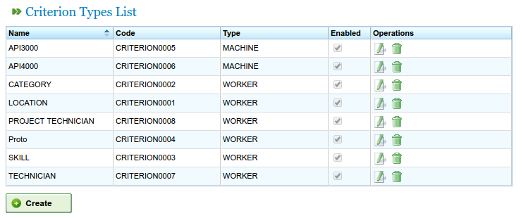

Criteria
#########

.. contents::

Criteria are elements that are used in the program to categorise resources and tasks. Tasks need criteria and the resources fulfil them. The following sequence is an example of how to use criteria: A resource is designated the criterion of "welder" (that is the resource fulfils the "welder" category) and a task requires the "welder" criterion to be carried out. As a result, when resources are allocated to tasks, workers with the "welder" criterion are used when allocating resources generically (not applicable to specific allocation). See the chapter on allocating resources to find out more about the different kinds of allocation.

Several operations can be carried out with criteria in the program:

* Criteria administration
* Allocation of criteria to resources.
* Allocation of criteria to tasks.
* Filtering entities according to criteria. Tasks and order items can be filtered according to criteria to carry out operations in the program.

Only the first function out of the three described above will be explained in this section. The two kinds of allocation will be dealt with later, the allocation of resources in the chapter on "Resource management" and the filtering function in the chapter on "Task planning".

Criteria administration
===========================
Criteria administration can be accessed from the administration menu:

   First level menu tabs

The specific operation to manage criteria is *Manage criteria*. The criteria available in the system can be listed by using this operation.

   List of criteria

The create/edit criterion form can be accessed by clicking on the *Create* button. A criterion can be edited by clicking on the edit icon.

.. figure:: images/edicion-criterio.png
   :scale: 50

   Editing criteria

The following operations can be carried out using the criteria editing form shown in the previous image:

* Editing the name of the criterion
* Indicating whether several values can be allocated at the same time or just one element for the kind of criterion selected. For example, a resource that fulfils two criteria, welder and lathe operator.
* Indicating the kind of criteria:

  * Generic kind: A criterion that may be used for machines or workers alike.
  * Worker kind: A criterion that may be used only for a worker.
  * Machine kind: A criterion that may be used only for a machine.

* Indicating whether the criterion is hierarchical or not. Sometimes criteria must be treated hierarchically, for example, the fact that a criterion has been allocated to an element does not mean that this criterion is automatically allocated to issues that stem from it. A clear example of criteria hierarchy is the location criterion as it is hierarchical, for example, a person who has designated Galicia as their location will belong to Spain.
* Indicating whether the criterion is authorised or not. This is the way users erase criteria. As a criterion cannot be changed once it has been created and used in historic data, the criterion must be on the system. It can be invalidated to avoid the criterion from appearing in different selection elements.
* Describing the criterion.
* Adding new values. A text entry with the *New criterion* button is on the second part of the form.
* Editing the name of existing criteria.
* Moving the criteria up or down the list of current criteria.
* Removing a criteria value from the list.

The criteria administration form responds to the characteristics of the forms described in the introduction as 3 operations (save, save and close, and close).

