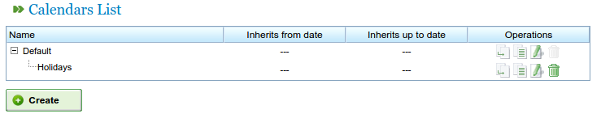
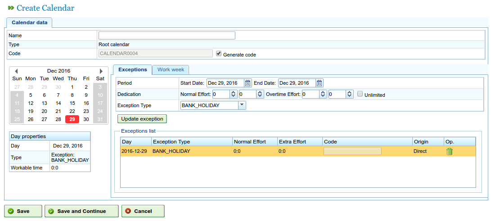
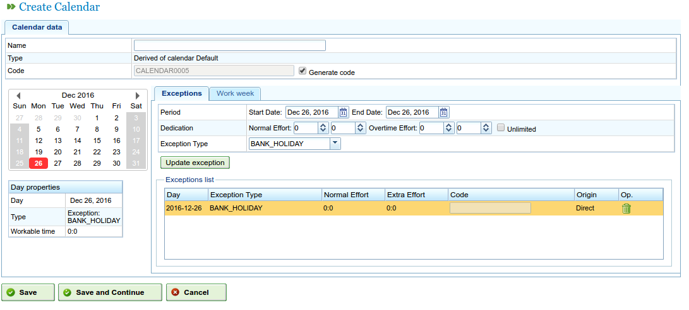
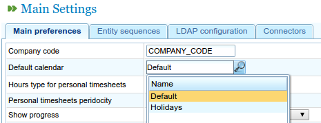
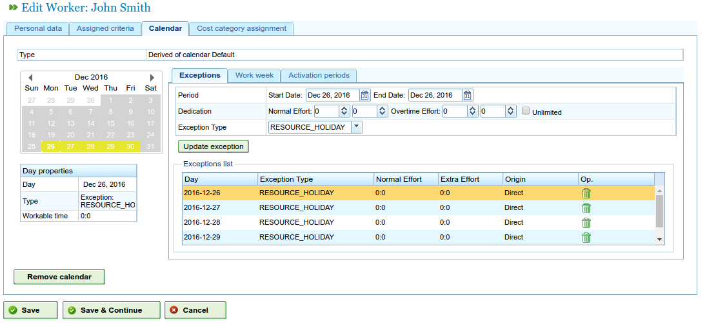
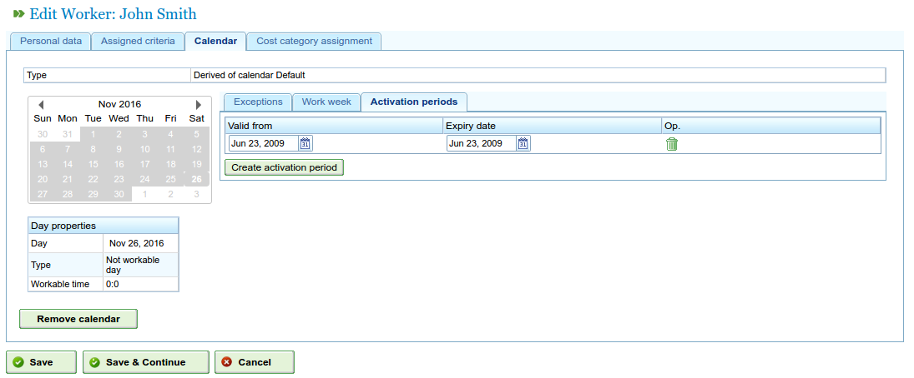

Calendars
#########

.. contents::

Calendars are the program entities that determine the load capacity of different resources.
A calendar consists of a series of days in the year with each day divided into available working hours.

For example, a public holiday may have 0 hours available and, if the working hours in a workday are 8,
this is the number of hours that is designated as available time for that day.

There are two ways of informing the system of how many working hours there are in a day:

* According to weekday. For example, on Mondays people generally work 8 hours.
* According to exceptions. For example, 10 working hours on Monday 30 January.

Administration of calendars
===========================

The calendar system is hierarchical, meaning that base calendars or calendars based on them can be created, thus maintaining a tree structure.
A calendar based on a calendar from a higher level of the tree will take on the daily duties and exceptions, providing that they have not
been explicitly modified for the new calendar. The following concepts must be understood to manage calendars:

* Each day is independent in itself and each year has different days. For example, if 8 December 2009 is a public holiday, this does not mean that 2010 already has 8 December marked as a public holiday.
* Working days are based on weekdays. For example, if it is normal to work 8 hours on Mondays, all the Mondays from all the weeks in the different years will have 8 hours available.
* Exceptions or exception periods can be marked. For example, choosing a specific day or several days which have a different number of hours available than the general rule for those weekdays.

   Administration of calendars

The administration of calendars can be accessed from the procedures on the "Administration" tab. Users can carry out the following procedures from here:

1. Creating a new calendar from scratch.
2. Creating a calendar based on another one.
3. Creating a calendar as a copy of another one.
4. Editing an existing calendar.

Creating a new calendar
-----------------------

In order to create a new calendar, users need to click the "Create" button.
The system then shows a form where users can carry out the following procedures:

* Choosing the tab they want to work on.

   * Marking exceptions.
   * Choosing hours worked per day.

* If users select the marking exceptions option, they can:
   * Select a specific day on the calendar.
   * Select the type of exception. The types available are: holidays, illness, strike, public holiday, working holiday.
   * Select the end date of the exception period (this field does not need to be changed to mark exceptions that only last 1 day).
   * Mark the number of hours worked during the days of the exception period.
   * Delete previous exceptions.

* If users choose to select the number of hours worked per day, they can:

   * Mark the hours available for each weekday (Monday, Tuesday, Wednesday, Thursday, Friday, Saturday and Sunday).
   * Distribute different weekly hours for the future.
   * Delete previous hour distribution lists.

With these procedures, users of the program can fully personalise the calendars according to their needs.
Users need to click the "Save" button to store changes made to the form.

.. figure:: images/calendar-edition.png
   :scale: 50

   Editing calendars

   Adding an exception to calendars

Creating derived calendars
----------------------------------

A derived calendar is a calendar created from another existing one. For example, it has all the features of the original one,
but users can change it to contain other options.

An example of using derived calendars is when there is a general calendar for Spain, and the creation of a derived calendar
to include public holidays in Galicia in additional to the ones defined in the general calendar.

It is important to point out that any change made to the original calendar is made directly to the derived calendar,
 providing that a specific exception against this was not defined. For example, the calendar for Spain has an 8-hour working day on 17 May,
 but the calendar for Galicia (a derived calendar) has no working hours on the very same day, as it is a public holiday.
 If the Spanish calendar was changed to have 4 hours available per day for the week of 17 May, the Galician calendar would also
 change to have 4 hours available for every day on the same week, except 17 May, which would have no working hours for the reason stated above.

   Creating a derived calendar

To create a derived calendar in the program, it is necessary to:

* Go to the *Administration* menu.
* Click the *Calendar administration* procedure.
* Choose one of the calendars to be the basis for a derived calendar and click the "Create" button.
* Once this procedure has been carried out, the system shows an editing form with the same characteristics as the forms used to create forms from scratch, with the difference that the proposed exceptions and the hours per weekday are based on the original calendar.

Creating a calendar by copying
------------------------------

A copied calendar is a calendar created as an exact copy of another existing one. For example, it has all the features of the original one,
but users can also change it to contain other options.

The difference between a copied and a derived calendar is based on the changes in the original. In relation to copies, if the original
is modified, the copy is not affected. However, derived calendars are affected by changes made to the original.

An example of using a copied calendar is having a calendar for "Pontevedra" and needing a calendar for "A Coruña", for which most of
the features would be the same. However, changes on one calendar should not be reflected in the other.

To create a copied calendar in the program, it is necessary to do the following:

* Go to the *Administration* menu.
* Click the Calendar administration procedure.
* Choose one of the calendars to be the basis for a derived calendar and click the "Create" button.
* Once this procedure has been carried out, the system shows an editing form with the same characteristics as the forms used to create forms from scratch, with the difference that the proposed exceptions and the hours per weekday are based on the original calendar.

Default calendar
----------------

One of the existing calendars in the system can be marked as the default calendar.
This calendar is the one that will be designated to any entity in the system that is managed with calendars.

The following must be carried out to set up a default calendar:

* Go to the *Administration* menu.
* Click the *Configuration* procedure.
* Where *Default calendar* appears, select the calendar to be used as the program's default calendar.
* Click *Save*.

   Creating a default calendar

Assigning a calendar to resources
---------------------------------

Resources can only be activated, i.e. available working hours, if they have an assigned calendar with a valid activation period.
If no calendar is assigned to resources, the default calendar is assigned with an activation period that begins on the start
date and does not have an expiry date.

   Calendar of resources

However, users can delete the calendar that has been previously assigned to a resource and create a new calendar based on one that already exists.
Consequently, resources can be fully personalised in relation to calendars.

The following steps have to be carried out to assign a calendar:

* Go to the Edit resources option.
* Choose a resource and click edit.
* Select the "Calendar" tab.
* A calendar with the exceptions, workable hours per day and activation periods will then appear on the previous tab.
* Each tab will have:

   * Exceptions: Users can choose the kind of exception and a period to which it applies in order to include holidays, public holidays, different workdays, etc.
   * Working week: Users can change the hours worked during the different weekdays (Monday, Tuesday, etc.).
   * Activation periods: Users can create new activation periods that reflect the start and end dates of the contracts associated with the resource. See the following image.

* Users need to click *Save* to store information.
* Users can click *Delete* if they want to change the calendar assigned to a resource.

   Assigning new calendars to resources

Assigning calendars to orders
-----------------------------

Projects can have a different calendar to the default calendar. Users need to do the following to change the calendar for the order:

   * Access the order list in the company overview.
   * Edit the order in question.
   * Access the "General information" tab.
   * Select the calendar to be assigned on the drop-down menu.
   * Click "Save" or "Save and continue".

Assigning calendars to tasks
----------------------------
In the same way that calendars can be assigned to resources or orders, users can carry out the same procedure for planned tasks.
This procedure allows specific calendars to be defined for specific stages of a project. To carry out this procedure, it is necessary to:

   * Access the planning of a project.
   * Right click the task to which a calendar is to be assigned.
   * Select the "Assign calendar" procedure.
   * Select the calendar to be assigned to the task.
   * Click *Accept*.

