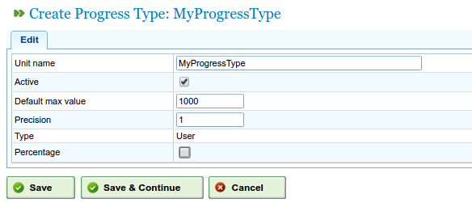
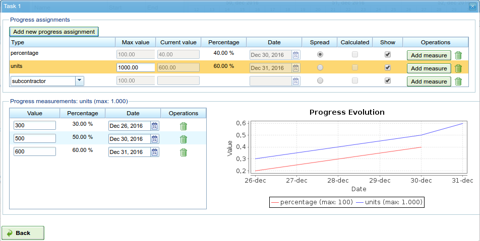
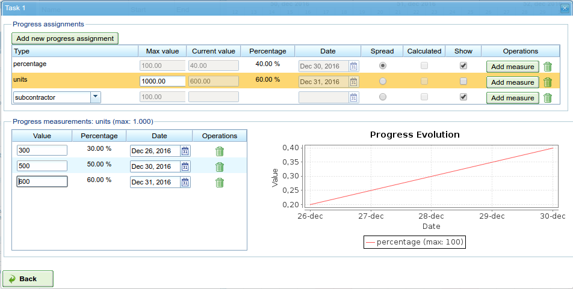

Progress
########

.. contents::

The progress of a project shows the degree to which the estimated time of completion of the project is being fulfilled,
and the progress of a task indicates the degree to which it is being fulfilled in terms of estimated completion.

In general, progress cannot be measured automatically; a member of staff with experience or a checklist has to determine the degree
of completion of a task or project.

It should be noted that there is a significant difference between the use of hours assigned to a task or project and the degree
of progress of that task or project. While the number of used hours may be more or less than they should be, the project may be behind
or ahead of its estimated completion on the day that is being monitored. Several possible situations may arise due to these two measurements:

* Less hours are consumed than expected for the element that is to be measured and, at the same time, the project is more behind than expected because progress is lower than estimated for the day that is being monitored.
* Less hours are consumed than expected for the element that is to be measured and, at the same time, the project is more ahead than expected because progress is lower than estimated for the day that is being monitored.
* More hours are consumed than expected and, at the same time, the project is more behind than expected because progress is lower than estimated for the day that is being monitored.
* More hours are consumed than expected and, at the same time, the project is more ahead than expected because progress is lower than expected for the day that is being monitored.

It is possible to compare these possible situations from the planning itself by using information relating to the degree of progress
made and also the degree to which the hours have been used. This chapter will deal with the entering of information in order to carry out
the monitoring of progress.

The philosophy of the project for monitoring progress is based on the users stating how far they want to monitor the progress of their projects.
As a result, if users want to monitor orders, they only have to enter information for level-1 elements. If they want monitoring to be more precise
in relation to tasks, they have to enter information about progress at lower levels, and it is the system that transmits all of the data upwards
in the hierarchy.

Managing types of progress
==========================

All companies have different needs when monitoring project progress, specifically the tasks they consist of. It was therefore necessary
to consider the existence of entities in the system called “types of progress”. Users can register the different types of progress in the system
to measure a task's progress. For example, a task can be measured in percentage terms, but at the same time, this percentage progress can be
translated to progress in *Tonnes* on the agreed amount with the client.

A type of progress is given a name, a maximum value and a precision value:

* Name: This is a representative name that users must remember so that when selecting the progress designation, they understand what kind of progress is to be measured.
* Maximum value: This is the maximum value that can be established for a task or project as the total progress measurement. For example, when working with *Tonnes*, if we take the normal maximum of tonnes to be 4000 and there are never going to be tasks that need more than 4000 tonnes of any material, this would be the maximum established amount.
* Precision value: The value of the increases allowed for the type of progress created. For example, if progress in *Tonnes* is to be measured in rounded values, 1 could be the precision value. From that moment on, only progress measurements with whole numbers can be entered, for example 1, 2, 300, etc.

The system has two types of default progress:

* Percentage: a type of general progress that enables the progress of a project or task to be measured based on an estimated completion percentage. For example, a task is 30% complete out of the 100% estimated for a specific day.
* Units: a type of general progress that enables the progress to be measured in units without the need to state specific units. For example, a task consists of creating 3000 units and the progress is 500 units out of the total of 3000.

   Administration of types of progress

Users can create new types of progress in the following way:

* Go to the "Administration" section.
* Click the second level menu option "Manage types of progress".
* The system will then show a list of existing types of progress.
* Users may do the following with each type of progress:

  * Edit
  * Delete

* Then users can create a new type of progress.
* When editing or creating, the system shows a form with the following information:

  * Name of the type of progress.
  * Maximum value accepted by the type of progress.
  * Precision value for the type of progress.

Entering progress based on type
===============================

Entering progress is done on order elements, but it can also be done using a short cut from the planning tasks.
The decision on what type of progress users want to associate with each order element is their own responsibility.

Users can enter a unique and default type of progress for the whole order.

Before carrying out progress measurements, users need to associate the chosen type with the order.
For example, progress in percentage terms to measure progress made on the entire task or an agreed progress rate if progress
measurements agreed with the client are to be entered in the future.

   Progress entering screen with graphic visualisation.

The following must be done to enter progress measurements:

* Select the type of progress to which the progress is going to be added.

  * If there is no type of progress, a new type of progress must be added.

* In the form that appears under the "Value" and "Date" fields, enter the absolute value of the measurement and the date that is to be given to the measurement taken.
* The system automatically stores the entered data.

Comparison of progress with an order element
============================================

Users can compare graphically how much progress is being made on the orders with the measurements taken.
All types of progress have a column with a check button (called "Show").
When this is marked, the progress chart of measurements taken is shown on the order element.

   Comparison of several kinds of progress.

