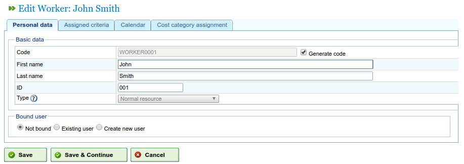
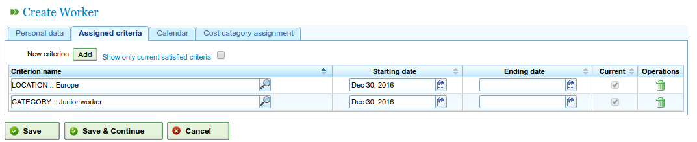
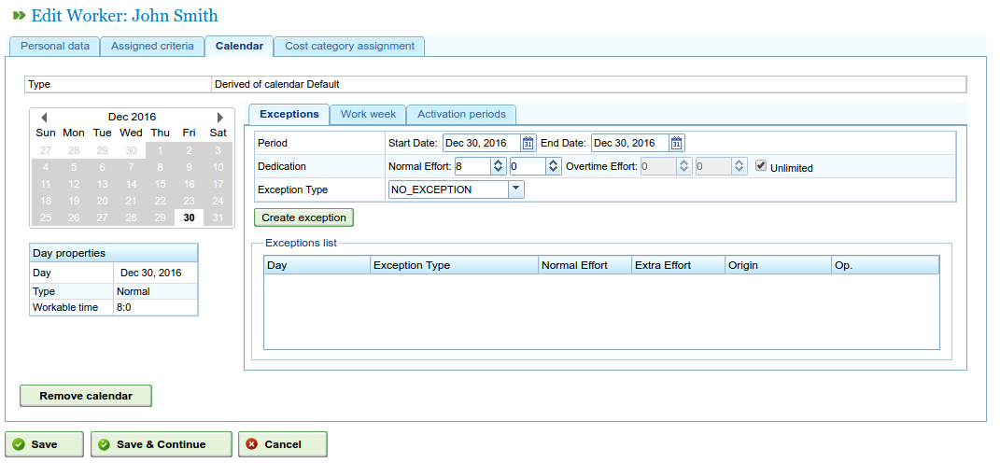
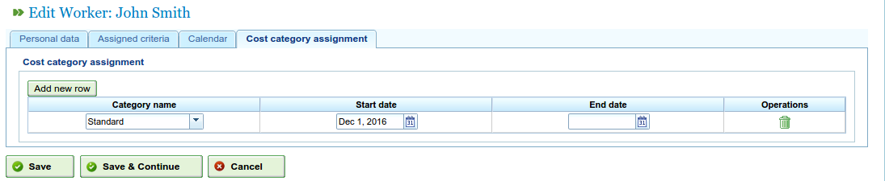
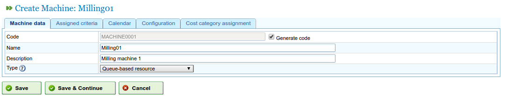
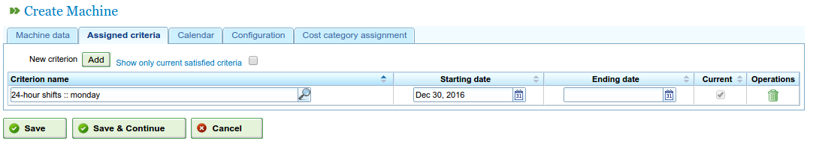
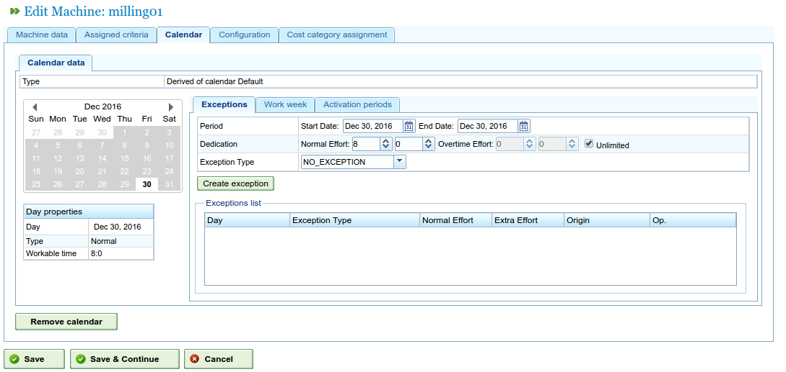
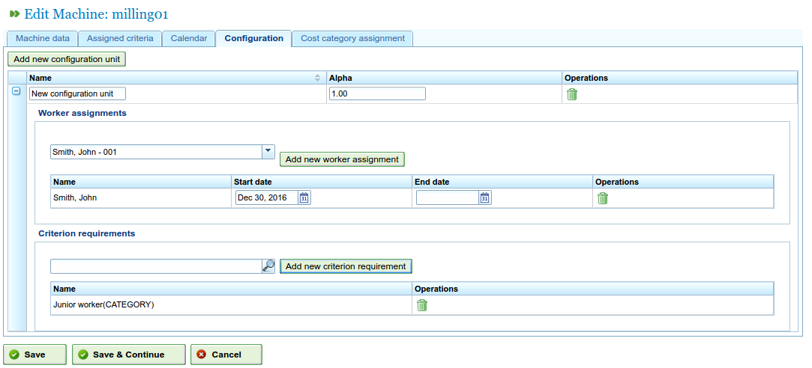
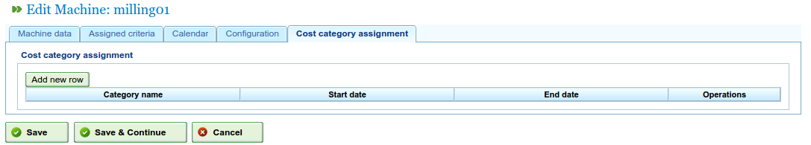

Management of resources
#######################

.. _recursos:
.. contents::

The program manages two different types of resources: staff and machines.

Staff resources are the workers of the companies. Their main characteristics are:

* They fulfil one or several generic or worker criteria.
* They can be specifically assigned to a task.
* They can be assigned, as part of the generic assignment, to a task that requires a resource criterion.
* They have a default or specific calendar if the user so decides.

Machine resources are the machines in the companies. Their main characteristics are:

* They fulfil one or several generic or machine criteria.
* They can be specifically assigned to a task.
* They can be assigned, as part of the generic assignment, to a task that requires a machine criterion.
* They have a default or specific calendar if the user so decides.
* The program will have a configuration screen where an *alpha* value can be set up that represents the machine/worker ratio.

  * The *alpha* value represents how much time a worker is needed to make the machine work. For example, an alpha value of 0.5 means that every 8 hours of machine work requires 4 hours of a worker’s time.
  * Users can assign an *alpha* value specifically to a worker, i.e. selecting the worker who will be assigned to the machine for this percentage of time.
  * Users can also make a generic assignment based on one criterion, so that a percentage of use is assigned to all the criteria that fulfil this criterion and have time available. Generic assignment works in the same way as generic assignment to tasks, which has already been explained.

Users can create, edit and invalidate (never delete definitively) workers from the company by going to the "Resources" tab. This tab has the following features:

* List of workers: Workers will be shown in lists and will be numbered. This is where their details can be managed.
* List of machines: Machines will be shown in lists and will be numbered. This is where their details can be managed.

Management of workers
========================

The management of workers is carried out by going to the "Resources" tab and then the feature "List of workers". Users can edit all of the workers on the resource list by clicking the standard editing icon.

When users are in the editing option of a resource, they can access the following tabs:

1) Worker details tab. This tab lets users edit the basic ID details of workers.

   * Name
   * Surname(s)
   * National ID document (DNI)
   * Limiting resource (see section)

   Editing workers' personal details

2) Criteria tab. This is where the criteria fulfilled by a worker can be configured. Users can assign any worker or generic criteria that they consider suitable to a worker. It is important that the workers fulfil criteria in order for the program to be used to its full extent. Users must do the following to assign criteria:

   i. Click the "Add criteria" button.

   ii. Search for the criterion to be added and select the most appropriate.

   iii. Click the add button.

   iv. Select the start date of the criterion when it becomes applicable.

   v. Select the end date for applying the criterion to the resource. This date is not obligatory if the criterion is shown as being indefinite.

   Associating criteria with workers

3) Calendar tab. This tab can be used to configure a specific calendar for the worker resource. All workers have an assigned default calendar; however, it is possible to assign a specific calendar for each one based on an existing calendar.

   Calendar tab for a resource

4) Cost category tab. This tab can be used to configure the cost category that a resource fulfils in a given time. These details are used to subsequently calculate the costs relating to a worker in a project.

   Cost category tab for a resource

Resource assignment is explained in the resource assignment section.

Management of machines
=======================

Machines are resources for all purposes; therefore, similar to workers, machines can be managed and assigned tasks. Resource assignment is dealt with in the assignment section, in which the specific features of machines will be explained.

Machines are managed from the "Resources" menu entry. This section has an operation called "Machine list", which shows the machines a company has. Users can edit or delete a machine from this list.

When editing machines, the system shows a series of tabs that can be used to manage different details:

1) Machine details tab. This tab can be used to edit the ID details of the machines. The details that can be changed on this tab are:

   i Name.

   ii Machine code.

   iii Description of the machine.

   Editing machine details

2) Criteria tab. As stated in the previous section on worker resources, this tab is used to add criteria that are fulfilled by the different machines on the system. There are two types of criteria that can be assigned to machines: machine or generic. Worker criteria cannot be assigned to machines. Users must do the following to assign criteria:

   i. Click the "Add criteria" button.

   ii. Search for the criterion to be added and select the most appropriate.

   iii. Select the start date for the criterion when it becomes applicable.

   iv. Select the end date for applying the criterion to the resource. This date is not obligatory if the criterion is shown as being indefinite.

   v. Click the "Save and continue" button.

   Assigning criteria to machines

3) Calendar tab. This tab can be used to configure a specific calendar for the machine resource. All workers have an assigned default calendar; however, it is possible to assign a specific calendar for each one based on an existing calendar.

   Assigning calendars to machines

4) Machine configuration tab. On this tab, it is possible to configure the ratio of machines to existing worker resources. A machine has an alpha value that indicates the machine/involved resources ratio. As has already been mentioned, an alpha value of 0.5 indicates that 0.5 people are used for each full day's operation of a machine.  The system, based on an alpha value, automatically assigns workers who are in some way associated with a machine once the machine is assigned to a task. Associating a worker with a machine can be done in two ways:

   i Specifically assigning a range of dates on which the worker is to be assigned to a machine. This is a specific assignment as the system automatically assigns hours to the worker when the machine is planned.

   ii Specifically assigning criteria to be fulfilled by workers who are assigned to machines. This creates a generic assignment of workers who fulfil the criteria.

   Configuration of machines

5) Cost category tab. This tab can be used to configure the cost category fulfilled by a machine in a given time. These details are used to subsequently calculate the costs relating to a worker in a project.

   Assigning cost categories to machines

Virtual worker groups
================================

The program enables users to create resources in the system, which are not real workers but simulated staff that enable production capacity to be increased at a specific time according to the configured settings in the calendar.

Through virtual worker groups, it is possible to check how project planning would be affected by contracting and assigning staff who fulfil the defined criteria, thus facilitating the decision-making process.

The tabs for creating virtual worker groups are the same as the ones to configure workers:

   * General details
   * Assigned criteria
   * Calendars
   * Associated hours

The difference with respect to workers is that virtual worker groups have a name for the group and a quantity, which refers to the number of real people in the group. There is also a field for comments, in which additional information can be provided, for example, which project would require contracting that is equivalent to the virtual worker group.

.. figure:: images/virtual-resources.png
   :scale: 50

   Virtual resources

Limiting resources
================================

Limiting resources are an specific type of productive elements which just can be either not assigned or with a 100% of dedication. What it the same, they are not capable of having more than one task scheduled at the same time nor overassigned.

For each limiting resource a queue is automatically created so the tasks they have scheduled can be managed in an specific manner using the assignment methods provided, creating automatic assignments between the tasks and the queues matching required criteria or moving tasks between queues.
