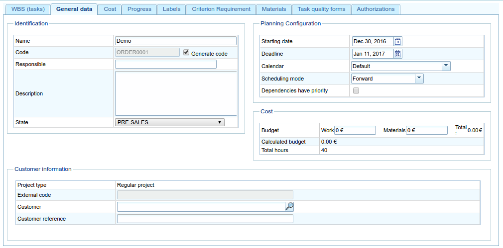

Projects and tasks
##############################

.. contents::

Projects describe the work to be carried out by the users who use the program.
Each project corresponds with the projects that the companies are going to offer their clients.

An project consists of one or several tasks. Each project line corresponds with the planning the works on the project should follow when being implemented. Project lines are organised hierarchically without any limitations on depth. The fact that tasks are organised hierarchically shows how several inheritable features work, such as labels.

The following sections will describe the operations that users can carry out with projects and tasks.

Project
=======

A project is a project or work that a client requests from a company. The project for the planned works identifies the project in the company.  The difference with comprehensive management programs such as LibrePlan is that they only need to use certain project details. These details are:

* Project name
* Project code
* Total budget amount of project
* Estimated start date
* End date
* Person in charge
* Description
* Assigned calendar
* Automatic generation of codes. A field used to instruct the system to automatically generate task and hour group codes.
* Choose the preference between dependencies and restrictions. Users can choose dependencies or restrictions as priorities to apply in the event of conflict.

However, the actual project has other entities that make it more complete:

* Hours assigned to the project
* Progress attributed to the project
* Labels
* Criteria assigned to the project
* Materials
* Quality forms

Editing or creating an project can be carried out from various locations in the program:

* From the "project list" in the company overview.

   * Editing is carried out by clicking the edit button on the chosen project.
   * Creating a new project is carried out by clicking "New project".

* From an project in the Gantt chart and changing to the project details view.

Users can access the following tabs from the editing project option:

* Editing project details. Users can edit basic project details on this screen. Currently these are:

  * Name
  * Code
  * Estimated start date
  * End date
  * Person in charge
  * Client
  * Description

   Editing projects

* Task list. Users can carry out several operations from the task list:

  * Creating new tasks.
  * Raising an task in the hierarchy by one level.
  * Lowering an task in the hierarchy by one level.
  * Indenting an task, which is the same as moving it down the hierarchy, by changing the element's level.
  * Unindenting an task, which is the same as moving it up the hierarchy, by changing the element's level.
  * Filtering tasks.
  * Deleting tasks.
  * Moving an element in the hierarchy by dragging and dropping.

.. figure:: images/order-elements-list.png
   :scale: 40

   Task list

* Assigned hours. A screen that shows the total hours attributed to a project, consisting of a viewing screen where the hours entered in the tasks are grouped.

.. figure:: images/order-assigned-hours.png
   :scale: 50

   Assigning hours attributed to the project by the workers

* Progress. A screen where users can attribute types of progress and progress measurements relating to the project. See the "Progress" section to find out how it works.

* Labels. A screen where users can assign labels to an project and identify previously assigned direct and indirect labels. See the following task editing section for an in-depth description of the label management procedure.

.. figure:: images/order-labels.png
   :scale: 35

   Project labels

* Criteria. A screen where users can assign the criteria they want to apply to all the tasks on an project. These criteria will be applied automatically to all tasks, except those that were explicitly invalidated. The hour groups of tasks, which are grouped by criteria, can also be viewed, enabling users to identify the criteria required for an project.

.. figure:: images/order-criterions.png
   :scale: 50

   Project criteria

* Materials. A screen where users can assign available material to projects. The material can be selected from among the material categories available in the program. Materials are managed in the following way:

   * Users select the tab shown in the lower part of the screen called "Search materials".
   * Users can enter text to search for materials or select the categories for which they want materials.
   * The system then filters the results.
   * Users select the materials they want (users can select more than one material on the list by pressing the "Ctrl" button).
   * Users then click "Assign".
   * The system then shows the list of materials that has already been assigned to the project.
   * Users select the units and the status they want to assign to the project.
   * Users then click "Save" or "Save and continue".
   * If users want to manage the receipt of the material, they can click "Divide" to change the status of a partial quantity of material.

.. figure:: images/order-material.png
   :scale: 50

   Material associated with an project

* Quality. Users can assign a quality form to the project, which would then be completed to ensure that certain activities associated with the project are carried out. See the following section on editing tasks to find out about the management procedure for quality forms.

.. figure:: images/order-quality.png
   :scale: 50

   Quality form associated with the project

Editing tasks
==============================

Editing tasks is carried out from the "Task list" tab by clicking the editing icon, which shows a new screen from which the user can carry out the following:

* Edit information about the task.
* View hours attributed to tasks.
* Manage progress of tasks.
* Manage project labels.
* Manage criteria required by the task.
* Manage materials.
* Manage quality forms.

The following subsections describe each one of the operations in depth.

Editing information about the task
------------------------------------------------

Editing information about the task includes the editing of the following details:

* Task name.
* Task code.
* Start date of the task.
* Estimated end date of the task.
* Total hours of the task. These hours can be calculated from the added hour groups or entered directly into this section, in which the hours have been distributed among the hour groups, and a new one created if the percentages do not coincide with initial percentages.
* Hour groups: It is possible to add one or several hour groups to the task. The **purpose** of these hour groups is to establish the requirements of the resources that will be assigned to carry them out.
* Criteria: It is possible to add criteria that must be fulfilled to enable generic assignment to carry out the task.

.. figure:: images/order-element-edition.png
   :scale: 50

   Editing tasks

Viewing hours attributed to tasks
------------------------------------------------------

The "Assigned hours" tab enables users to view the work reports associated with an task and also how many of the estimated hours have already been carried out.

.. figure:: images/order-element-hours.png
   :scale: 50

   Hours assigned to tasks

The screen is divided into two parts:

* Work report list: Users can view the list of work reports that are associated with an task in project to check the date and time, resource and number of hours devoted to the task.
* Use of estimated hours: The system calculates the total number of hours devoted to a task and compares them with the estimated hours.

Managing progress of tasks
---------------------------------------------

Entering types of progress and the management of task progress has been described in the "Progress" chapter.

Managing project labels
------------------------------

Labels, as described in the chapter on labels, enable users to categorise tasks. Consequently, users can group planning or project information based on them.

Users can assign labels directly to an task or even to a previous task in the hierarchy. From the moment a label from one of the two previous methods is assigned, the task and the related planning task are associated with the label, and used for subsequent filtering.

.. figure:: images/order-element-tags.png
   :scale: 50

   Assigning labels for tasks

As can be seen in the image, users can carry out the following procedures from the **labels** tab:

* View the labels associated with an task that were inherited from an task that was higher in the hierarchy than the one that was directly assigned. The planning task associated with each task has the same associated labels.
* View labels that are directly associated with an task by means of the following assignment form for lower-level labels.
* Assign existing labels: Users can assign labels by searching for a particular one from among the available labels on the form that is lower than the direct label list.  To search for a label, users can click the magnifying glass icon or write the first letters of the label in the text box so that the system can show the available options.
* Create and assign new labels: Users can create new labels associated with a type of existing label from this form. In project to carry out the procedure, it is necessary to select a type of label to be associated and then enter the value of the label for the type selected. The system creates the label automatically and assigns the task when "Create and assign" is clicked.

Managing criteria required by the task and hour groups
--------------------------------------------------------------------------------

Both an project and an task can be assigned criteria that need to be fulfilled for it to be carried out. Criteria can be direct or indirect:

* Direct criteria: These are assigned directly to the task. They are criteria that are required by the hour groups on the task.
* Indirect criteria: These are assigned on tasks that are higher in the hierarchy and are inherited by the element that is being edited.

Apart from the required criterion, one or various hour groups that are part of the task can be defined. It all depends on whether the task contains other tasks as child nodes or if it is a leaf node. In the first case the information about hours and hour groups can only be viewed, but leaf nodes can be edited. The latter case works as follows:

* The system creates an hour group by default, which is associated to the task. The details that can be modified for an hour group are:

   * Code for the hour group if it is not automatically generated.
   * Type of criterion. Users can choose to assign a machine or worker criterion.
   * Number of hours in the hour group.
   * List of criteria to be applied to the hour group. To add new criteria, users have to click "Add criterion" and select one from the search engine, which appears after clicking the button.

* Users can add new hour groups with features that are different from previous hour groups. An example of this would be when an task must be carried out by a welder (30h) and a painter (40h).

.. figure:: images/order-element-criterion.png
   :scale: 50

   Assigning criteria to tasks

Managing materials
------------------------

Materials are managed in the projects as a list associated with each project line or an project in general. The list of materials is made up of the following fields:

* Code
* Date
* Units: Required units.
* Type of unit: Type of unit used to measure the material.
* Price of the unit: Unit price.
* Total price: The price is calculated by multiplying the unit price by the number of units.
* Category: Category to which the material belongs.
* Status: Received, requested, pending, processing, cancelled.

Working with materials is carried out as follows:

* Users select the "Materials" tab on an task.
* The system then shows two sub-tabs: "Materials" and "Search materials".
* If the task did not have assigned materials, the first tab will be empty.
* Users then click on "Search materials" in the lower left-hand part of the window.
* The system then shows the list of available categories and associated materials.

.. figure:: images/order-element-material-search.png
   :scale: 50

   Searching material

* Users select categories to search to refine searches for materials.
* The system shows the materials that belong to the selected categories.
* From the materials list, users select the materials to assign to the task.
* Users click "Assign".
* The system shows the selected list of materials on the "Materials" tab with new fields to complete.

.. figure:: images/order-element-material-assign.png
   :scale: 50

   Assigning materials to tasks

* Users select the units, status and date of assigned materials.

For subsequent monitoring of materials, it is possible to change the status of a unit group of the received material. This procedure is carried out as follows:

* Users click the "Divide" button on the list of materials to the right of each row.
* Users select the number of units they want the row to be divided into.
* The program shows two rows with the material divided.
* Users change the status of the row containing the material.

The advantage of using this dividing tool is the possibility of receiving partial deliveries of material without having to wait to receive it all in project to mark it as received.

Managing quality forms
------------------------------------

Some tasks must certify that certain tasks have been carried out in project for them to be marked as complete. This is why the program has quality forms, which consist of a list of questions that can be considered important if they are answered positively.

It is important to mention that a quality form has to be created previously so that it can be assigned to an task.

To manage quality forms:

* Go to the "Quality forms" tab.

.. figure:: images/order-element-quality.png
   :scale: 50

   Assigning quality forms to tasks

* The program has a search engine for quality forms. There are two types of quality forms: according to element or percentage.

   * Element: Every element is independent.
   * Percentage: Every question increases progress in the task by a percentage. It must be possible for percentages to be increased to 100%.

* Users select one of the forms created in the administration interface and click "Assign".
* The program assigns the form chosen from the list of forms assigned to the task.
* Users click the "Edit" button on the task.
* The program displays the questions from the quality form in the lower list.
* Users mark the questions that have been carried out as achieved.
   * If the quality form is based on percentages, the questions are answered in project.
   * If the quality form is based on elements, the questions can be answered in any project.

