Orders and order elements
##############################

.. contents::

Orders describe the work to be carried out by the users who use the program.
Each order corresponds with the projects that the companies are going to offer their clients.

An order consists of one or several order lines. Each order line corresponds with the planning the works on the order should follow when being implemented. Order lines are organised hierarchically without any limitations on depth. The fact that order lines are organised hierarchically shows how several inheritable features work, such as labels.

The following sections will describe the operations that users can carry out with orders and order lines.

Order
======

An order is a project or work that a client requests from a company. The order for the planned works identifies the project in the company.  The difference with comprehensive management programs such as "NavalPlan" is that they only need to use certain order details. These details are:

* Order name
* Order code
* Total amount of order
* Estimated start date
* End date
* Person in charge
* Description
* Assigned calendar
* Automatic generation of codes. A field used to instruct the system to automatically generate order element and hour group codes.
* Preference between dependencies and restrictions. Users can choose dependencies or restrictions as priorities when applied in the event of conflict.

However, the actual order has other entities that make it more complete:

* Hours assigned to the order
* Progress attributed to the order
* Labels
* Criteria assigned to the order
* Materials
* Quality forms

Editing or creating an order can be carried out from various locations in the program:

* From the "order list" in the company overview.

   * Editing is carried out by clicking the edit button on the chosen order.
   * Creating a new order is carried out by clicking "New order".

* From an order in the Gantt chart and changing to the order details view.

Users can access the following tabs from the editing order option:

* Editing order details. Users can edit basic order details on this screen. Currently these are:

  * Name
  * Code
  * Estimated start date
  * End date
  * Person in charge
  * Client
  * Description

.. figure:: images/order-edition.png
   :scale: 50

   Editing orders

* Order element list. Users can carry out several operations from the order element list:

  * Creating new order elements.
  * Raising an order element in the hierarchy by one level.
  * Lowering an order element in the hierarchy by one level.
  * Indenting an order element, which is the same as moving it down the hierarchy, by changing the element's level.
  * Unindenting an order element, which is the same as moving it up the hierarchy, by changing the element's level.
  * Filtering order elements.
  * Deleting order elements.
  * Moving an element in the hierarchy by dragging and dropping.

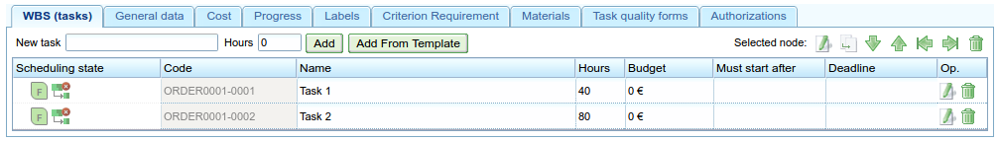

   Order element list

* Assigned hours. A screen that shows the total hours attributed to a project, consisting of a viewing screen where the hours entered in the order elements are grouped.

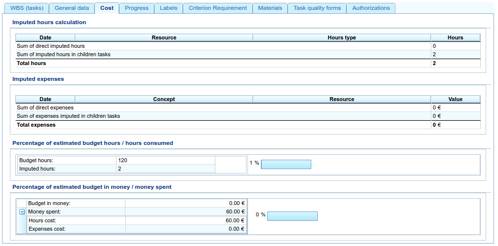

   Assigning hours attributed to the order by the workers

* Progress. A screen where users can attribute types of progress and progress measurements relating to the order. See the "Progress" section to find out how it works.

* Labels. A screen where users can assign labels to an order and identify previously assigned direct and indirect labels. See the following order element editing section for an in-depth description of the label management procedure.

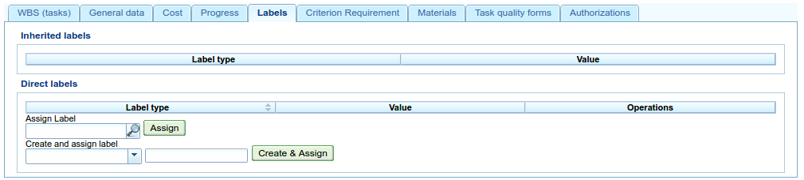

   Order labels

* Criteria. A screen where users can assign the criteria they want to apply to all the tasks on an order. These criteria will be applied automatically to all order elements, except those that were explicitly invalidated. The hour groups of order elements, which are grouped by criteria, can also be viewed, enabling users to identify the criteria required for an order.

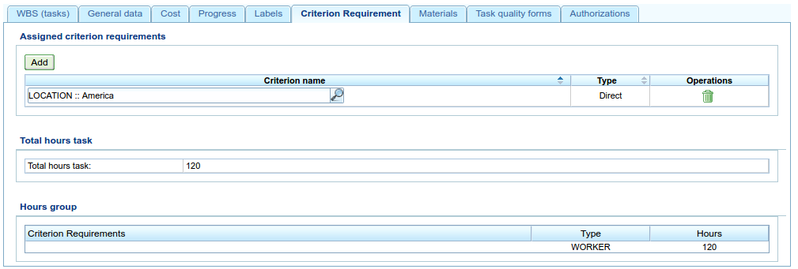

   Order criteria

* Materials. A screen where users can assign available material to orders. The material can be selected from among the material categories available in the program. Materials are managed in the following way:

   * Users select the tab shown in the lower part of the screen called "Search materials".
   * Users can enter text to search for materials or select the categories for which they want materials.
   * The system then filters the results.
   * Users select the materials they want (users can select more than one material on the list by pressing the "Ctrl" button).
   * Users then click "Assign".
   * The system then shows the list of materials that has already been assigned to the order.
   * Users select the units and the status they want to assign to the order.
   * Users then click "Save" or "Save and continue".
   * If users want to manage the receipt of the material, they can click "Divide" to change the status of a partial quantity of material.

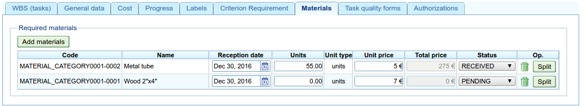

   Material associated with an order

* Quality. Users can assign a quality form to the order, which would then be completed to ensure that certain activities associated with the order are carried out. See the following section on editing order elements to find out about the management procedure for quality forms.

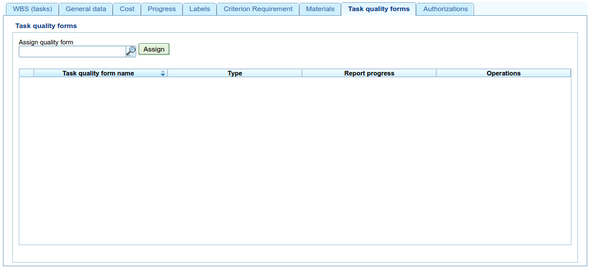

   Quality form associated with the order

Editing order elements
==============================

Editing order elements is carried out from the "Order element list" tab by clicking the editing icon, which shows a new screen from which the user can carry out the following:

* Edit information about the order element.
* View hours attributed to order elements.
* Manage progress of order elements.
* Manage order labels.
* Manage criteria required by the order element.
* Manage materials.
* Manage quality forms.

The following subsections describe each one of the operations in depth.

Editing information about the order element
------------------------------------------------

Editing information about the order element includes the editing of the following details:

* Order element name.
* Order element code.
* Start date of the order element.
* Estimated end date of the order element.
* Total hours of the order element. These hours can be calculated from the added hour groups or entered directly into this section, in which the hours have been distributed among the hour groups, and a new one created if the percentages do not coincide with initial percentages.
* **Hour groups**: It is possible to add one or several hour groups to the order element. **The purpose of these hour groups** is to establish the requirements of the resources that will be assigned to carry them out.
* Criteria: It is possible to add criteria that must be fulfilled to enable generic assignment to carry out the order element.

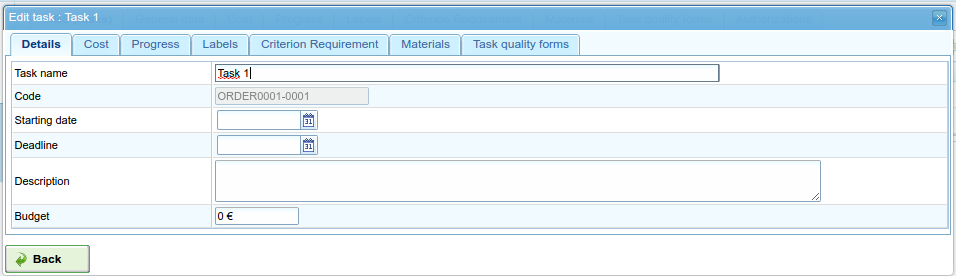

   Editing order elements

Viewing hours attributed to order elements
------------------------------------------------------

The "Assigned hours" tab enables users to view the work reports associated with an order element and also how many of the estimated hours have already been carried out.

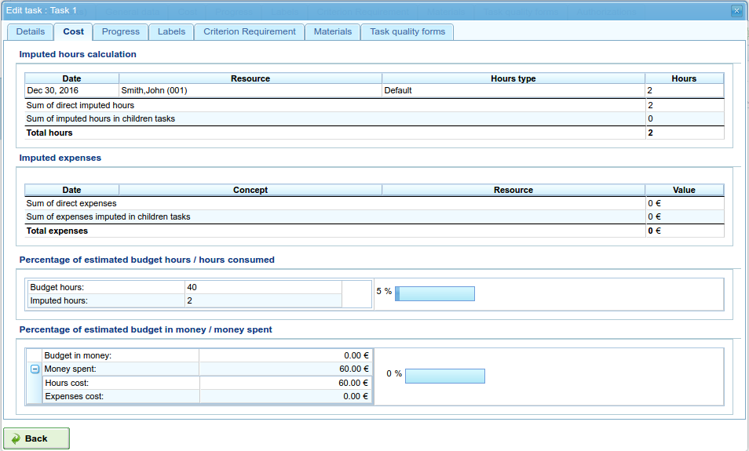

   Hours assigned to order elements

The screen is divided into two parts:

* Work report list: Users can view the list of work reports that are associated with an order element in order to check the date and time, resource and number of hours devoted to the task.
* Use of estimated hours: The system calculates the total number of hours devoted to a task and compares them with the estimated hours.

Managing progress of order elements
---------------------------------------------

Entering types of progress and the management of order element progress has been described in the "Progress" chapter.

Managing order labels
------------------------------

Labels, as described in the chapter on labels, enable users to categorise order elements. Consequently, users can group planning or order information based on them.

Users can assign labels directly to an order element or even to a previous order element in the hierarchy. From the moment a label from one of the two previous methods is assigned, the order element and the related planning task are associated with the label, and used for subsequent filtering.

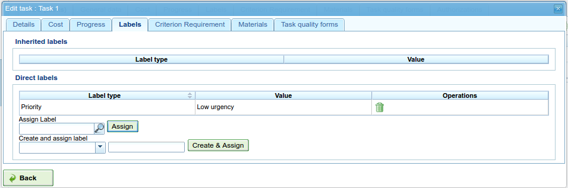

   Assigning labels for order elements

As can be seen in the image, users can carry out the following procedures from the **labels** tab:

* View the labels associated with an order element that were inherited from an order element that was higher in the hierarchy than the one that was directly assigned. The planning task associated with each order element has the same associated labels.
* View labels that are directly associated with an order element by means of the following assignment form for lower-level labels.
* Assign existing labels: Users can assign labels by searching for a particular one from among the available labels on the form that is lower than the direct label list.  To search for a label, users can click the magnifying glass icon or write the first letters of the label in the text box so that the system can show the available options.
* Create and assign new labels: Users can create new labels associated with a type of existing label from this form. In order to carry out the procedure, it is necessary to select a type of label to be associated and then enter the value of the label for the type selected. The system creates the label automatically and assigns the order element when "Create and assign" is clicked.

Managing criteria required by the order element and hour groups
--------------------------------------------------------------------------------

Both an order and an order element can be assigned criteria that need to be fulfilled for it to be carried out. Criteria can be direct or indirect:

* Direct criteria: These are assigned directly to the order element. They are criteria that are required by the hour groups on the order element.
* Indirect criteria: These are assigned on order elements that are higher in the hierarchy and are inherited by the element that is being edited.

Apart from the required criterion, one or various hour groups that are part of the order element can be defined. It all depends on whether the order element contains other order elements as child nodes or if it is a leaf node. In the first case the information about hours and hour groups can only be viewed, but leaf nodes can be edited. The latter case works as follows:

* The system creates an hour group by default, which is associated to the order element. The details that can be modified for an hour group are:

   * Code for the hour group if it is not automatically generated.
   * Type of criterion. Users can choose to assign a machine or worker criterion.
   * Number of hours in the hour group.
   * List of criteria to be applied to the hour group. To add new criteria, users have to click "Add criterion" and select one from the search engine, which appears after clicking the button.

* Users can add new hour groups with features that are different from previous hour groups. An example of this would be when an order element must be carried out by a welder (30h) and a painter (40h).

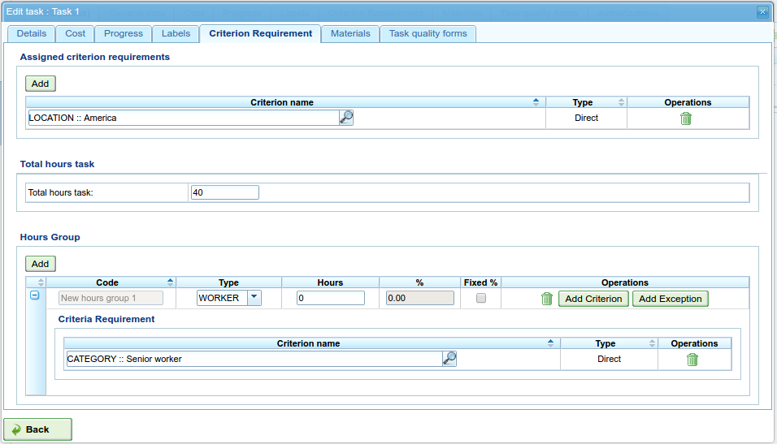

   Assigning criteria to order elements

Managing materials
------------------------

Materials are managed in the projects as a list associated with each order line or an order in general. The list of materials is made up of the following fields:

* Code
* Date
* Units: Required units.
* Type of unit: Type of unit used to measure the material.
* Price of the unit: Unit price.
* Total price: The price is calculated by multiplying the unit price by the number of units.
* Category: Category to which the material belongs.
* Status: Received, requested, pending, processing, cancelled.

Working with materials is carried out as follows:

* Users select the "Materials" tab on an order element.
* The system then shows two sub-tabs: "Materials" and "Search materials".
* If the order element did not have assigned materials, the first tab will be empty.
* Users then click on "Search materials" in the lower left-hand part of the window.
* The system then shows the list of available categories and associated materials.

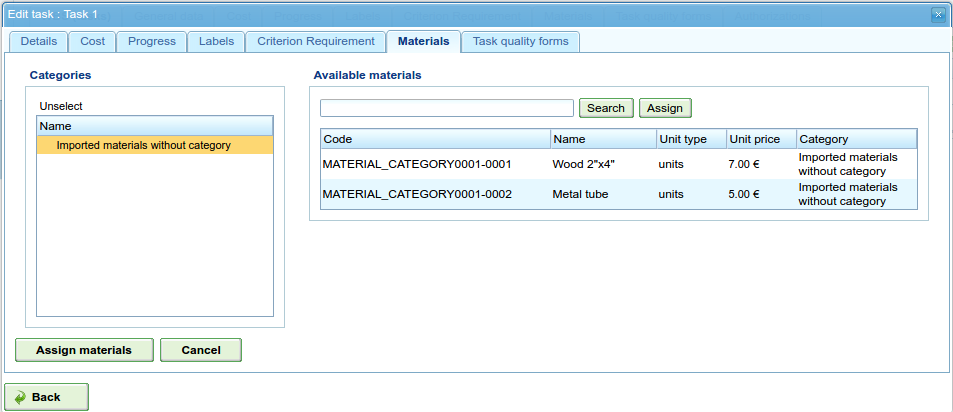

   Searching material

* Users select categories to search to refine searches for materials.
* The system shows the materials that belong to the selected categories.
* From the materials list, users select the materials to assign to the order element.
* Users click "Assign".
* The system shows the selected list of materials on the "Materials" tab with new fields to complete.

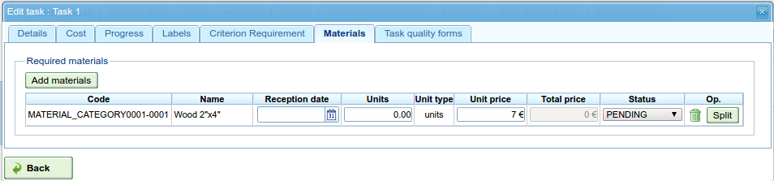

   Assigning materials to order elements

* Users select the units, status and date of assigned materials.

For subsequent monitoring of materials, it is possible to change the status of a unit group of the received material. This procedure is carried out as follows:

* Users click the "Divide" button on the list of materials to the right of each row.
* Users select the number of units they want the row to be divided into.
* The program shows two rows with the material divided.
* Users change the status of the row containing the material.

The advantage of using this dividing tool is the possibility of receiving partial deliveries of material without having to wait to receive it all in order to mark it as received.

Managing quality forms
------------------------------------

Some order elements must certify that certain tasks have been carried out in order for them to be marked as complete. This is why the program has quality forms, which consist of a list of questions that can be considered important if they are answered positively.

It is important to mention that a quality form has to be created previously so that it can be assigned to an order element.

To manage quality forms:

* Go to the "Quality forms" tab.

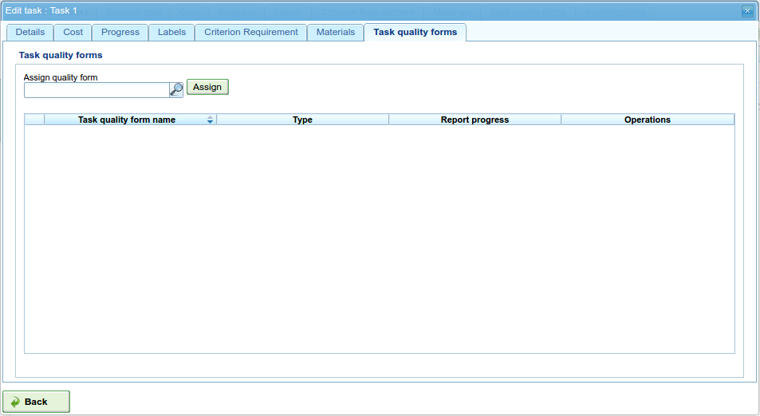

   Assigning quality forms to order elements

* The program has a search engine for quality forms. There are two types of quality forms: according to element or percentage.

   * Element: Every element is independent.
   * Percentage: Every question increases progress in the order element by a percentage. It must be possible for percentages to be increased to 100%.

* Users select one of the forms created in the administration interface and click "Assign".
* The program assigns the form chosen from the list of forms assigned to the order element.
* Users click the "Edit" button on the order element.
* The program displays the questions from the quality form in the lower list.
* Users mark the questions that have been carried out as achieved.
   * If the quality form is based on percentages, the questions are answered in order.
   * If the quality form is based on elements, the questions can be answered in any order.

