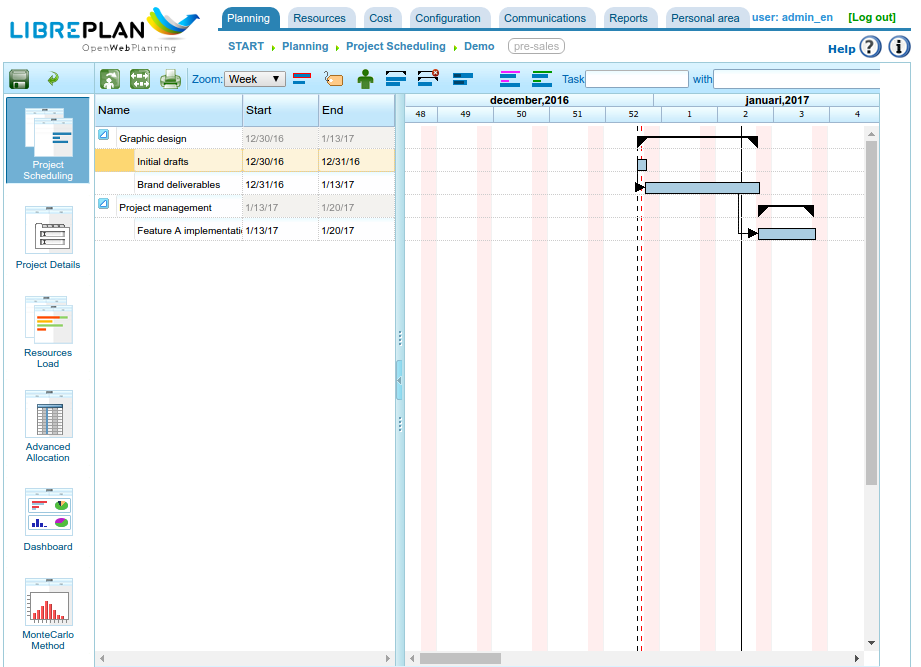

Task planning
#######################

.. _planificacion:
.. contents::

Task planning
=============

Planning in "NavalPlan" is a process that has been described throughout all of the chapters of the user guide, the chapters on orders and the assigning of resources being particularly important in this respect. This chapter describes basic planning procedures after the order and the Gantt charts have been configured properly.

   Work planning view

As with the company overview, the project planning view is divided into several views based on the information it is analysing. The views of a specific project are:

* Planning view
* Resource load view
* Order list view
* Advanced assignment view

Planning view
----------------------
The planning view combines three different views:

* Project planning. Project planning can be viewed in the upper right-hand part of the program. It represents the planning in a Gantt chart. This is the view where users can temporarily move tasks, assign dependencies among them, define milestones and establish restrictions.
* Resource load view. The resource load view is the image on the lower right-hand part, which shows the availability of resources according to the assignments that were carried out, as opposed to the assignments made to tasks. The information shown in the image is as follows:

   * Purple area: Indicating a resource load under 100% of its capacity.
   * Green area: Indicating a resource load under 100%, resulting from the resource being planned for another project.
   * Orange area: Indicating a resource load over 100% as a result of the current project.
   * Yellow area: Indicating a resource load over 100% as a result of other projects.

* Graph view and value gained indicators. These can be viewed from the "Value gained" tab. The generated graph is based on the value gained technique and the indicators that are calculated for each of the workdays of the project. The calculated indicators are:

   * BCWS: accumulative time function for the number of hours planned up to a certain date. It will be 0 at the planned start of the task and the total number of planned hours at the end. As with all accumulative graphs, it will always increase. The function for a task will be the sum of the daily assignments until the calculation day. This function has values for all times, provided that resources have been assigned.
   * ACWP: accumulative time function for the hours attributed in the work reports up to a certain date.  This function will only have a value of 0 before the date of the task's first work report and its value will continue to increase as time passes and work report hours are added. It will have no value after the date of the last work report.
   * BCWP: accumulative time function that includes the resultant value of multiplying task progress by the amount of work that the task was estimated to require for completion. This function's values increase as time passes. Progress values also increase. Progress is multiplied by the total number of estimated hours for all tasks. The BCWP value is the sum of the values for the tasks that are being calculated. Progress is totalled when it is configured.
   * CV: Cost variation CV = BCWP - ACWP
   * SV: Schedule variation SV = BCWP - BCWS
   * BAC: Budget at completion BAC = max (BCWS)
   * EAC: Estimate at completion EAC = (ACWP/ BCWP) * BAC
   * VAC: Variance at completion VAC = BAC - EAC
   * ETC: Estimate to complete ETC = EAC - ACWP
   * CPI: Cost performance index CPI = BCWP / ACWP
   * SPI: Schedule performance index SPI = BCWP / BCWS

In the project planning, users can carry out the following procedures:

   * Assigning dependencies. Right click and choose "Add dependency" and drag the mouse pointer to the tasks that are to be assigned a dependency.

      * To change the type of dependency, right click on the dependency and choose the type to be assigned.

   * Creating a new milestone. Click the task before the milestone that is to be added and select the "Add milestone" option. Milestones can be moved by selecting the task with the mouse pointer and dragging it to the desired position.
   * Moving tasks without disturbing dependencies. Right click the body of the task, and drag it to the desired position. If no restrictions or dependencies are disturbed, the system will update the daily assignment of resources to the task and place the task in the selected date.
   * Assign restrictions. Click the task in question and select the "Task properties" option. A *pop-up* will appear with a "Restrictions" field that can be changed. Restrictions can conflict with dependencies, which is why each order states whether dependencies take priority or not over restrictions. The restrictions that can be established are:

      * *As soon as possible*: Indicating that the task must start as soon as possible.
      * *Not before*. Indicating that the task must not start before a certain date.
      * *Start on a specific date*. Indicating that the task must start on a specific date.

The planning view also offers several procedures that ultimately function as viewing options:

* Zoom level: Users can choose the zoom level they require. There are several zoom levels: annual, four-monthly, monthly, weekly and daily.
* Search filters: Users can filter tasks based on labels or criteria.
* Critical path. As a result of using the *Dijkstra* algorithm to calculate paths on graphs, the critical path was implemented which can be viewed by clicking on the "Critical path" button from the viewing options.
* Show labels: Enabling users to view the labels assigned to tasks in a project, which can be viewed on screen or printed.
* Show resources: Enabling users to view the resources assigned to tasks in a project, which can be viewed on screen or printed.
* Print: Enabling users to print the Gantt chart being viewed at that moment.

Resource load view
--------------------------
The resource load view provides a list of resources that contains a list of tasks or criteria that generate workloads. Each task or criterion is shown as a Gantt chart so that the start and end date of the load can be seen. A different colour is shown depending on whether the resource has a load that is higher or lower than 100%:

* Green: load lower than 100%
* Orange: 100% load
* Red: load over 100%

.. figure:: images/resource-load.png
   :scale: 35

   Resource load view for a specific order

If the mouse pointer is placed on the resource's Gantt chart, the load percentage for the worker will be shown.

Order list view
---------------------------
The order list view allows users to go to the order editing and deleting options. See the "Orders" chapter for more information.

Advanced assignment view
----------------------------
The advanced assignment view is explained in depth in the "Resource assignment" chapter.

