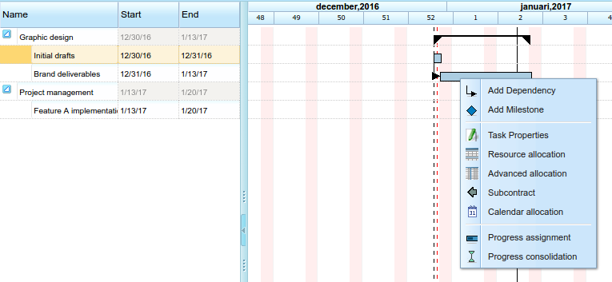
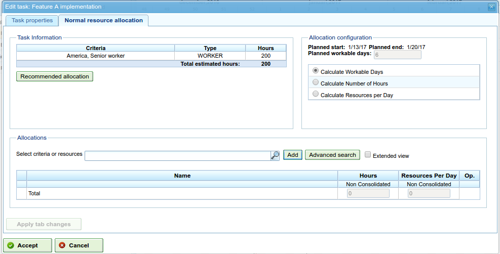
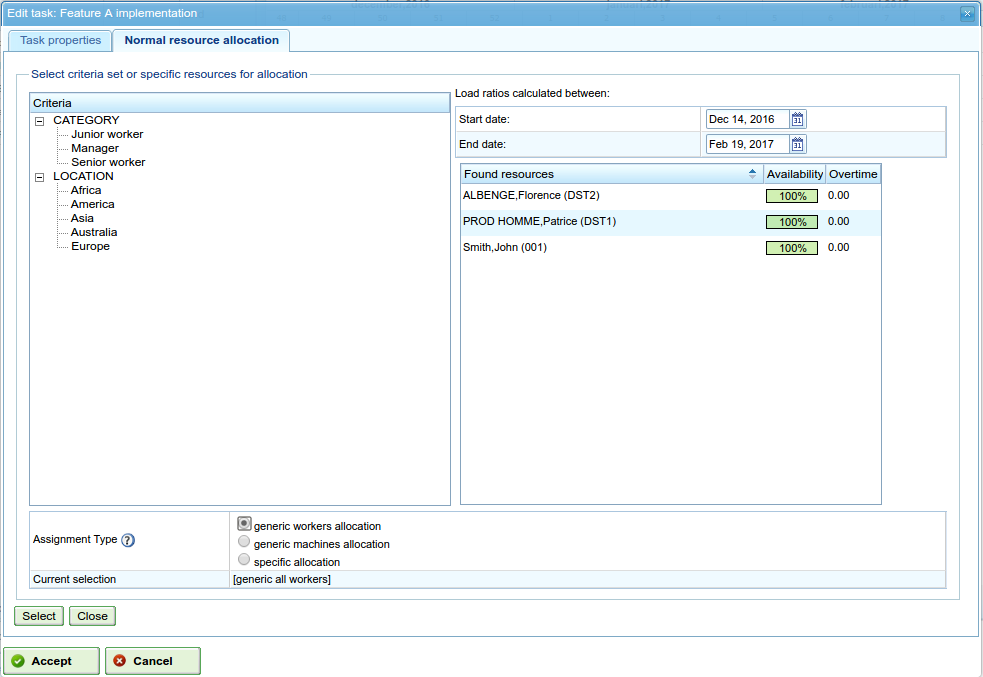
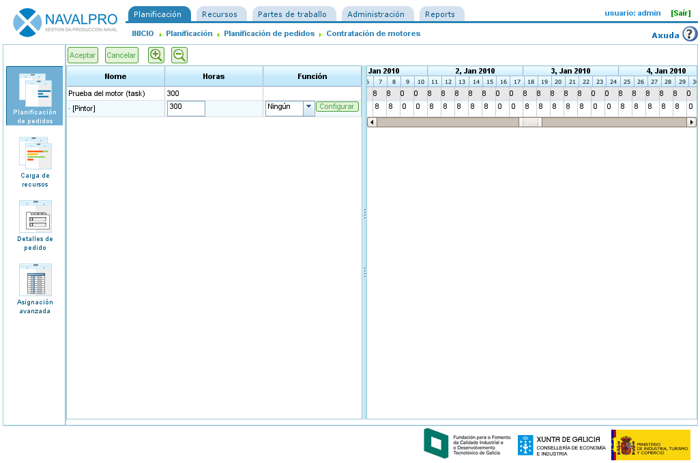
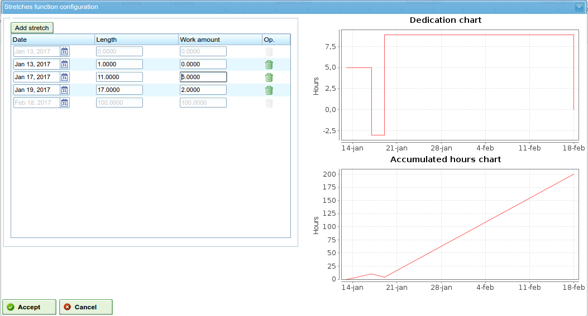

Assignment of resources
########################

.. asigacion_
.. contents::

The assignment of resources is one of the program's most important features, and can be carried out in two different ways:

* Specific assignment.
* Generic assignment.

Both types of assignment are explained in the following sections.

To carry out either of the two types of resource assignment, the following steps are necessary:

* Go to the planning of an order.
* Right click on the task to be planned.

   Resource assignment menu

* The program shows a screen in which the following information can be viewed:

   * List of criteria that must be fulfilled. For each hour group, a list of hour groups is shown, each of which requires a list of criteria.
   * Task information: start and end date of the task.
   * Type of calculation: The system allows users to choose the strategy to be used to calculate assignments:

      * Calculate number of hours: This calculates the number of hours required to be devoted to the assigned resources, which are given an end date and a resource number per day.
      * Calculate end date: This calculates the end date of the task based on the number of task resources and the total number of hours to finish the task.
      * Calculate number of resources: This calculates the number of resources required to finish the task on a specific date and devotes a known number of hours to them.

   * Recommended assignment: This option allows the program to gather criteria that must be fulfilled and the total number of hours from all hour groups, and then recommends a generic assignment. If there was a prior assignment, the system deletes it and replaces it with the new one.
   * Assignments: A list of assignments that have been carried out. This list shows the generic assignments (the number will be the list of fulfilled criteria, and the number of hours and resources per day). Every assignment carried out can be explicitly removed by clicking the delete button.

   Resource assignment

* Users select "Search resources".
* The program shows a new screen consisting of a criteria tree and a list to the right of workers that fulfil the selected criteria:

   Resource assignment search

* Users can select:

   * Specific assignment. See the "Specific assignment" section to find out what is involved when choosing this option.
   * Generic assignment. See the "Generic assignment" section to find out what is involved when choosing this option.

* Users select a list of criteria (generic) or a list of workers (specific). A multiple-choice selection is performed by pressing the "Ctrl" button when clicking each worker/criterion.

* Users then click the "Select" button. It is important to remember that if a generic assignment is not marked, users need to choose a worker or machine to perform an assignment. If this is not done, it is sufficient for users to choose one or several criteria.

* The program then shows the selected criteria or resource list on the list of assignments from the original resource assignment screen.

* Users must choose the hours or resources per day depending on the assignment method used on the program.

Specific assignment
===================

This is the specific assignment of a resource to a project task, i.e. the user decides which specific "name and surname(s)" or "machine" must be assigned to a task.

Specific assignment can be carried out on the screen shown in this image:

.. figure:: images/asignacion-especifica.png
   :scale: 50

   Specific resource assignment

When a resource is specifically assigned, the program creates daily assignments in relation to the percentage of daily assigned resources selected, by previously comparing it with the available resource calendar. For example, an assignment of 0.5 resources for a 32-hour task means that 4 hours per day are assigned to the specific resource to fulfil the task (supposing a working calendar of 8 hours per day).

Specific machine assignment
---------------------------

Specific machine assignment functions in the same way as that for workers. When a machine is assigned a task, the system stores a specific assignment of hours for the chosen machine. The main difference is that the system searches the list of assigned workers or criteria at the moment the machine is assigned:

* If the machine has a list of assigned workers, the program chooses from those that are required by the machine for the assigned calendar. For example, if the machine calendar is 16 hours per day and the resource calendar is 8 hours, two resources are assigned from the list of available resources.
* If the machine has one or several assigned criteria, generic assignments are carried out from among the resources that fulfil the criteria assigned to the machine.

Generic assignment
==================

Generic assignment occurs when users do not choose resources specifically, but leave the decision to the program, which distributes the loads among the company's available resources.

.. figure:: images/asignacion-xenerica.png
   :scale: 50

   Generic resource assignment

The assignment system uses the following assumptions as a basis:

* Tasks have criteria that are required from resources.
* Resources are configured to fulfil criteria.

However, the system does not fail when criteria have not been assigned, but when all resources fulfil the non-requirement of criteria.

The generic assignment algorithm functions in the following way:

* All resources and days are treated as containers where daily assignment of hours fit, based on the maximum assignment capacity in the task calendar.
* The system searches for the resources that fulfil the criterion.
* The system analyses which assignments currently have different resources that fulfil criteria.
* The resources that fulfil the criteria are chosen from those that have sufficient availability.
* If freer resources are not available, assignments are made to the resources that have less availability.
* Over-assignment of resources only starts when all the resources that fulfil the respective criteria are 100% assigned until the total amount required to carry out the task is attained.

Generic machine assignment
--------------------------

Generic machine assignment functions in the same way as worker assignment. For example, when a machine is assigned to a task, the system stores a generic assignment of hours for all machines that fulfil the criteria as described for the resources in general. However, in addition, the system performs the following procedure for machines:

* For all machines chosen for generic assignment:

  * It collects the machine's configuration information: alpha value, assigned workers and criteria.
  * If the machine has an assigned list of workers, the program chooses the number required by the machine depending on the assigned calendar. For example, if the machine calendar is 16 hours per day and the resource calendar is 8 hours, the program assigns two resources from the list of available resources.
  * If the machine has one or several assigned criteria, the program makes generic assignments from among the resources that fulfil the criteria assigned to the machine.

Advanced assignment
===================

Advanced assignments allow users to design assignments that are automatically carried out by the application in order to personalise them. This procedure allows users to manually choose the daily hours that are dedicated by resources to tasks that are assigned or define a function that is applied to the assignment.

The steps to follow in order to manage advanced assignments are:

* Go to the advanced assignment window. There are two ways to access advanced assignments:

   * Go to a specific order and change the view to advanced assignment. In this case, all the tasks on the order and assigned resources (specific and generic) will be shown.
   * Go to the resource assignment window by clicking the "Advanced assignment" button. In this case, the assignments that show the resources (generic and specific) assigned for a task will be shown.

   Advanced resource assignment

* Users can choose the required zoom level they want:

   * If the chosen zoom is more than one day. If users change the assigned hour value to a week, month, four-month or six-month period, the system distributes the hours lineally for all days throughout the chosen period.
   * If the chosen zoom is one day. If users change the assigned hour value to a day, these hours only apply to a day. Consequently, users can decide how many hours they want to assign per day to task resources.

* Users can choose to design an advanced assignment function. In order to do so, users have to:

   * Choose the function on the selection list that appears at the side of each resource and click "Configure".
   * The system shows a new window if the chosen function needs to be specifically configured. Supported functions:

      * Segments: A function that allows users to define segments to which a polynomial function is applied. The function per segment is configured as follows:

         * Date. Date on which the segment ends. If the following value is established (length), the date is calculated, alternatively, length is calculated.
         * Defining the length of each segment. This indicates what percentage of the task's duration is required for the segment.
         * Defining the amount of work. This indicates what workload percentage is expected to be completed in this segment. The quantity of work must be incremental. For example, if there is a 10% segment, the next one must be larger (for example, 20%).
         * Segment graphs and accumulated loads.

   * Users then click "Accept".
   * The program stores the function and applies it to the daily resource assignments.

   Configuration of the segment function

