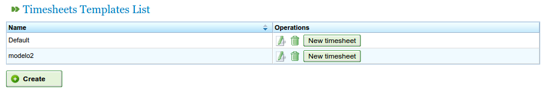
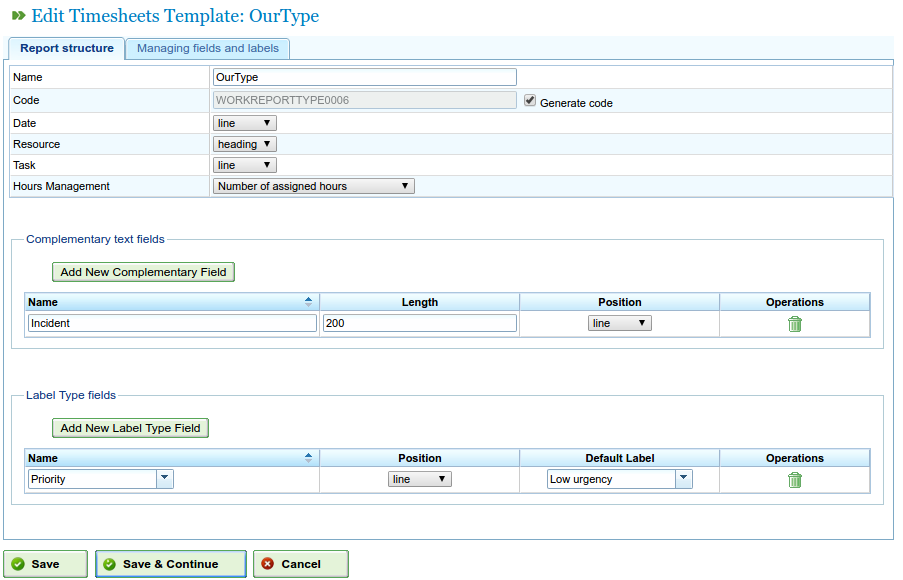
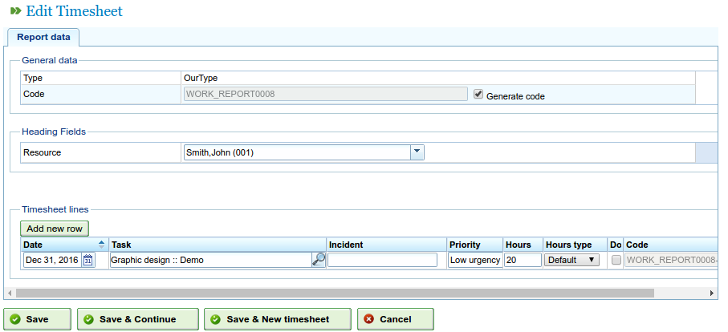

Timesheets
#################

.. contents::

Timesheets enable the monitoring of the hours that existing resources dedicate to the tasks they are assigned to.

The program allows users to configure new forms to enter dedicated hours, specifying the fields that they want to appear in these models, to incorporate reports from tasks that are carried out by workers and to monitor workers.

Before being able to add entries for resources, users must at least specify a timesheet type that defines the structure, including all the rows that are added to it. Users can create as many timesheets on the system as necessary.

Timesheet templates
===================

A timesheet template has a series of fields that are common to the whole report, and a set of timesheet lines with specific values for the fields defined in each row. For example, resources and tasks are common to all reports, however, there can be other new fields such as "incidents", which are not required in all types.

Users can configure different timesheet types so that a company can design its reports to meet its own needs:

   Timesheet types

The administration of the timesheet types allows users to configure this type of feature and add new text fields or optional tags. In the first tab for editing timesheet types, it is possible to configure the type for the obligatory attributes (if they are applicable to the whole report or if they are specified at line level), and add new optional fields.

The mandatory fields that must appear in all timesheets are as follows:

* Name and code: ID fields for the name of the timesheet type and its code.
* Date: Field for the date of the report.
* Resource: Worker or machine appearing on the report or timesheet line.
* Order element: Code for the order element to which the performed work is attributed.
* Hour management: Determining the hour attribution policy to be carried out, which can be:
   * According to assigned hours.
   * According to start and finish times.
   * According to the number of hours and start and finish range (discrepancies are allowed and the number of hours takes priority).

Users can add new fields to the reports:

* Tag type: Users can request the system to show a tag when completing the timesheet. For example, the client tag type, if the user wishes to enter the client, for which the work was carried out, in each report.
* Free fields: Fields where text can be entered freely in the timesheet.

   Creating a timesheet type with personalised fields

Users can configure date, resource and order element fields if they appear in the header of the report, which means they apply to the whole report, or if they are added to each of the rows.

Finally, new additional text fields or tags can be added to the existing ones, in the timesheet header or in each line, by using the "Additional text" and "Tag type" fields respectively. Users can configure the order in which these elements are to be entered in the "Management of additional fields and tags" tab.

Timesheet list
================

As soon as the format of the reports to be incorporated into the system have been configured, users can enter the details in the created form according to the structure defined in the corresponding timesheet type. In order to do this, users need to follow these steps:

* Click the "New timesheet" button associated with the desired report from the list of timesheet types.
* The program then shows the report based on the configurations given for the type. See the following image.

   Structure of the timesheet based on type

* Select all the fields shown for the report:

   * Resource: If the header has been chosen, the resource is only shown once, alternatively, for each line of the report, it is necessary to choose a resource.
   * Task code: Code of the task to which the timesheet is being assigned. Similar to the rest of the fields, if the field is the header, the value is entered once or as many times as necessary on the lines of the report.
   * Date: Date of the report or each line, depending on whether the heading or line is configured.
   * Number of hours. The number of work hours in the project.
   * Start and finish times. Start and finish times for the work in order to calculate definitive work hours. This field only appears in the case of the hour assignment policies, "According to start and finish times" and "According to the number of hours and start and finish range".
   * Type of hours: Enabling users to choose the type of hour, e.g. "Normal", "Extraordinary", etc.

* Click "Save" or "Save and continue".

