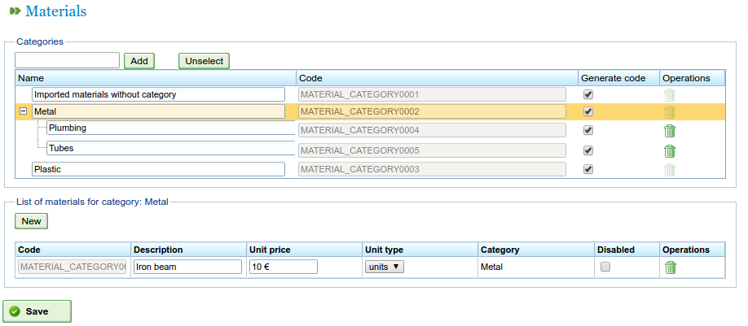

Materials
##########
.. _materiales:
.. contents::

Administration of materials
===========================

Users can manage a basic database of materials, organised by categories.

The categories are containers that can be assigned specific materials and also more categories. They are stored in a tree structure as the materials can belong to leaf or intermediary categories.

Users have to do the following to manage categories:

* Go to the "Administration->Materials" option.
* The program shows a tree of categories.
* The user enters a category name in the text box and then clicks "Add".
* The program adds the category to the tree.

If users want to insert a category into the category tree, they have to first select the parent category in the tree and then click "Add".

   Material administration screen

Users have to do the following to manage materials:

* Select the category to which materials are to be included and click "Add" to the right of "Materials".
* The program adds a new empty row with fields to enter details about the material:

   * Code: Material type code (this can be the external code from an ERP).
   * Description: Description of the material.
   * Price of the unit: Unit price of each piece of material.
   * Unit: Unit that is used to measure each unit of material.
   * Category: Category to which it belongs.
   * Availability: Whether or not the material has been removed.

* Users complete the fields and click "Save".

The assignment of materials to order elements is explained in the chapter on "Orders".

