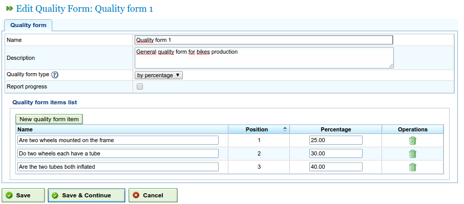

Quality forms
######################

.. _calidad:
.. contents::

Administration of quality forms
===============================

Quality forms consist of a list of questions or sentences that indicate the tasks or processes that should have been completed so that a task can be marked as complete by the company. These forms consist of the following fields:

* Name
* Description
* Type of quality form. The type can have two values:

   * Percentage: Indicating that the questions must have a logical order and affirmative answers to the questions indicate that the task is progressing. For example, a basic process for a task suggests that the task is 15% complete. Users need to answer a question beforehand to be able to go on to the next one.
   * Item: Indicating that the questions are not required to have a logical order and therefore can be answered as desired.

Users must carry out the following steps to manage the quality forms:

* From the "Administration" menu, access the "Quality forms" option.
* Click edit an existing form or "Create".
* The program shows a form with a name, description and type.
* Select the type.
* The program shows the fields that are allowed for each type:

   * Percentage: question and percentage.
   * Item: question.

* Click "Save" or "Save and continue".

   Material administration screen

