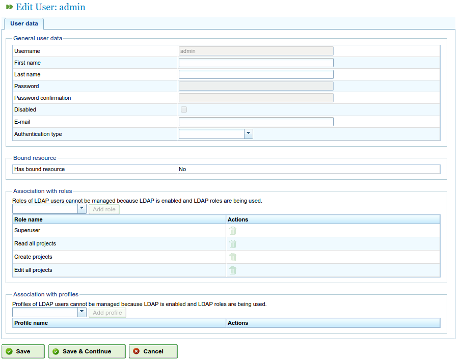
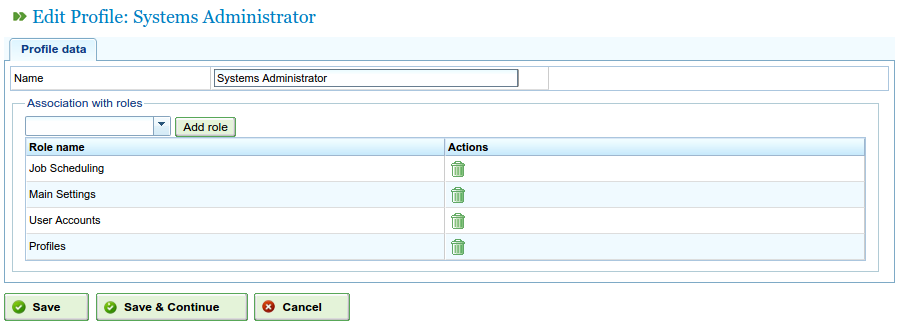

Users
########

.. _tareas:
.. contents::

Managing users
==============

"NavalPlan"'s system enables users to manage profiles, authorisations and users. Users belong to user profiles, which may have a series of predefined roles to access the program. Roles are defined authorisations in "NavalPlan". Examples of roles:

* Administration: A role to which administrators must be assigned in order to be able to carry out administration operations.
* Web service reader: A role that users need to be able to consult the program's web services.
* Web service writer: A role that users need to be able to write via the program's web services.

Roles are predefined in the system. A user profile consists of one or several roles. Users must have certain roles to carry out certain operations.

Users have one or several profiles or one or several roles directly so that specific or generic authorisation can be assigned.

It is necessary to carry out the following steps to manage users:

* Go to "Manage users" on the "Administration" menu.
* The program shows a form with a list of users.
* Click the editing button for the chosen user or click the "Create" button.
* A form will appear with the following fields:

   * User name.
   * Password
   * Authorised/unauthorised.
   * Email
   * List of associated roles. Users need to search for one of the roles shown on the selection list and click "Assign" to add a new role.
   * List of associated profiles. Users need to search for one of the profiles shown on the selection list and click "Assign" to add a new profile.

   Managing users

* Click "Save" or "Save and continue".

Managing profiles
-----------------

Users need to carry out the following steps to manage the program's profiles.

* Go to "Manage user profiles" on the "Administration" menu.
* The program shows a list of profiles.
* Click the editing button for the chosen profile or click "Create".
* A form appears in the program with the following fields:

   * Name
   * List of roles (authorisations) associated with the profile. Users must select a role from the role list and click "Add" to add one that is associated with the profile.

   Managing user profiles

* Click "Save" or "Save and continue" and the system will store the created or modified profile.

