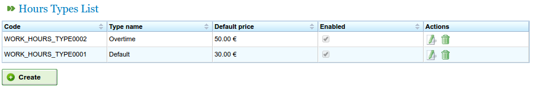
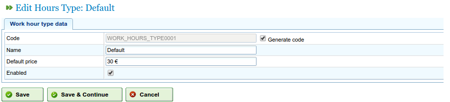
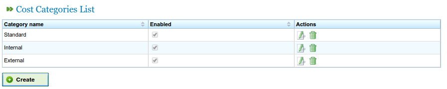

Cost management
###############

.. _costes:
.. contents::

Costs
=====

Cost management allows users to estimate the costs of resources used in a project. In order to manage costs, the following entities have to be determined:

* Hour type worked: These indicate the hour types worked for the resource. Users can include hour types for machines and for workers. Examples of hour types include: Additional hours paid at €20 per hour generically. The following fields can be included in the hour types worked:

   * Code: External code for the hour type.
   * Name: Name of the hour type. For example, additional.
   * Default rate: Basic default rate for the hour type.
   * Activation: Indicating whether the hour type is activated or not.

* Cost categories. Cost categories show categories that are used to define costs according to hour type during certain periods (these periods may be indefinite). For example, the cost of additional hours for first grade skilled workers in the following year is €24 per hour. Cost categories contain:

   * Name: Cost category name.
   * Activation: Indicating whether the category is activated or not.
   * List of hour types assigned to the cost category. They indicate several periods and rates for hour types. For example, as rates change, each year is included on this list as an hour type period, but an hourly rate is maintained for each hour type (which may be different from the default hourly rate included for the hour type).

Managing hour types worked
--------------------------

Users need to carry out the following steps to register hour types worked:

* Select "Manage hour types worked"  on the "Administration" menu.
* The program shows a list of existing hour types.

   Hour type list

* Click "Edit" or "Create".
* The program shows an hour type editing form.

   Editing hour types

* Users can enter or change:

   * The hour type name.
   * The hour type code.
   * The default rate.
   * Hour type activation/de-activation.

* Click "Save" or "Save and continue".

Cost categories
---------------

Users need to carry out the following steps to register cost categories:

* Select "Manage cost categories" on the "Administration" menu.
* The program shows a list of existing categories.

   Cost category list

* Click "Edit" or "Create" button.
* The program shows a cost category editing form.

.. figure:: images/category-cost-edit.png
   :scale: 50

   Editing cost categories

* Users enter or change:

   * The name of the cost category.
   * The activation/de-activation of the hour type.
   * The list of hour types included in the category. All hour types have the following fields:

      * Hour type: Choose one of the existing hour types on the system. If none exist, an hour type has to be created (this process is explained in the previous subsection).
      * Start and finish date (the latter is optional) for the period that applies to the cost category.
      * Hourly rate for this specific category

* Click "Save" or "Save and continue".

The assignment of cost categories to resources is described in the chapter on resources. Go to the "Resources" section.

