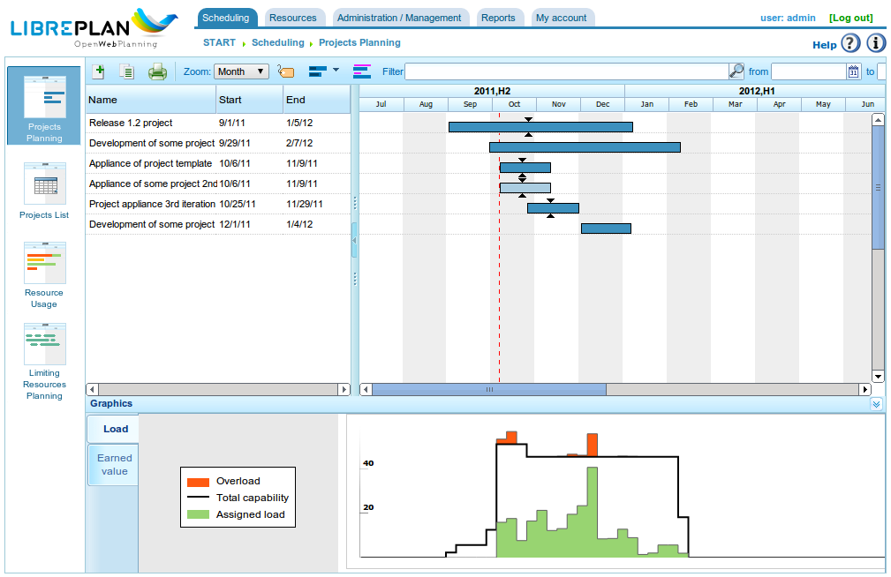
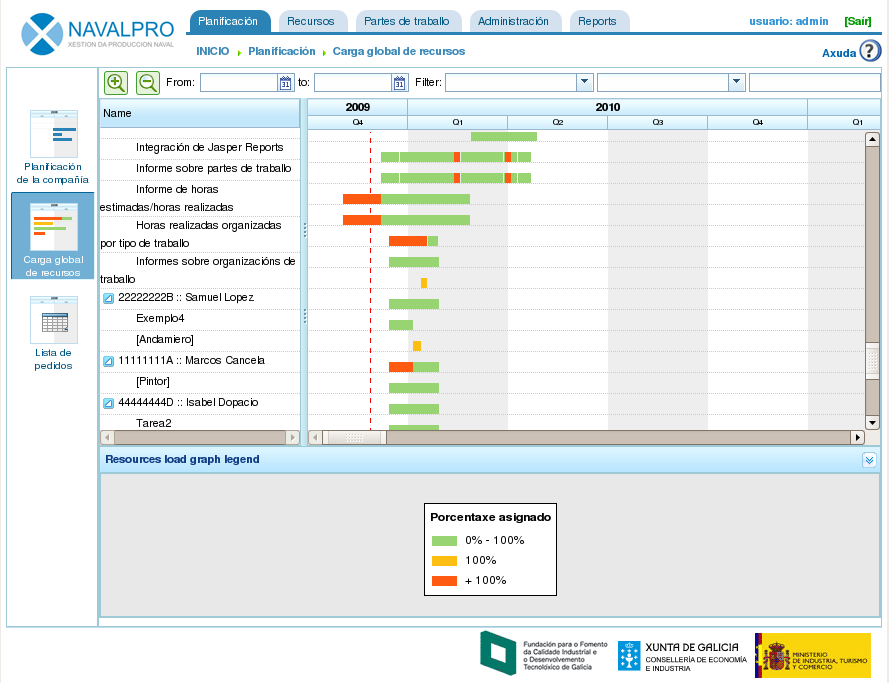
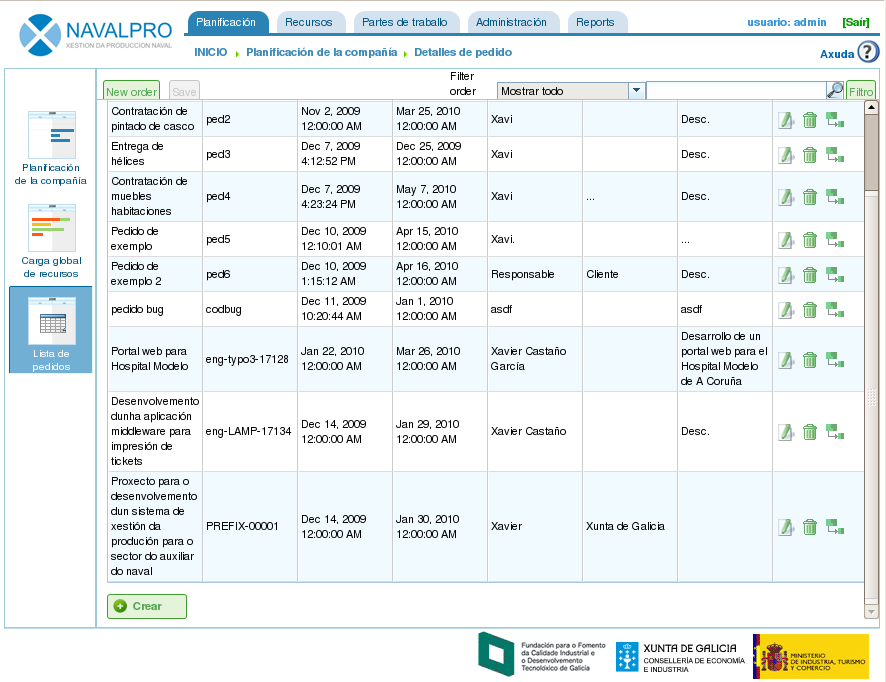

Introducción
############

.. contents::

El propósito de este documento es describir las características de LibrePlan y
proporcionar información a los usuarios sobre cómo configurar y utilizar la
aplicación.

LibrePlan es una aplicación web de código abierto para la planificación de
proyectos. Su objetivo principal es proporcionar una solución completa para la
gestión de los proyectos de la empresa.
Para cualquier información específica que necesites sobre este software, por
favor ponte en contacto con el equipo de desarrollo en
http://www.libreplan.org/es/contacto

   Vista global de empresa

Vista global de la empresa y gestión de perspectivas
====================================================

Como se muestra en la anterior la captura de la pantalla principal de la aplicación y la vista global de la empresa, una vista en la que el usuario puede ver la lista de proyectos planificados para conocer el estado global de la empresa, tanto a nivel de pedidos, como del uso de recursos. La vista global de la empresa está, asimismo, formado por 3 perspectivas:

* Vista de planificación: Vista que combina dos puntos de vista:

   * Vista de los pedidos y su temporalidad: Cada proyecto es una caja de diagramas de Gantt indicando la fecha de comienzo y de fin del proyecto. Además, se combina dicha información con el mostrado de la fecha acordada de finalización (*deadline*) y con un contraste entre porcentaje de avance y horas realmente dedicadas a cada proyecto. Esta información da una visión clara de cómo se encuentra la empresa en un momento dado. Esta vista es la portada de la aplicación.
   * Gráfica de uso de los recursos de la empresa: Gráfica que busca la información de asignaciones de los recursos a los proyectos y que ofrece un resumen de cómo está el uso de los recursos de toda la empresa: el color verde indica asignaciones de recursos por debajo del 100%, la línea negra indica la carga disponible de recursos y el color amarillo indica las asignaciones a recursos que están por encima del 100%. Es posible disponer de menos asignaciones que recursos disponibles y al mismo tiempo contar con sobreasignaciones en recursos concretos.

* Vista de carga de recursos: Pantalla que muestra el listado de trabajadores de la empresa y la carga debido la asignaciones específicas a tareas o asignaciones genéricas debido a que el recurso satisface una lista de criterios. Ver siguiente imagen. Para acceder a esta vista es necesario hacer click en *Carga global de recursos*.
* Vista de administración de pedidos. Pantalla que muestra el listado de pedidos de la empresa donde el usuario pode realizar las siguientes operaciones: filtrar, editar, borrar, visualizar en planificación o crear nuevo pedido. Para acceder a esta vista es necesario hacer click en *Lista de pedidos*.

   Vista global de recursos

   Listado de pedidos

La gestión de perspectivas que se comentó para la vista global de empresa es muy similar a la planteada para un solo proyecto. El acceso a un proyecto se puede realizar de varias formas:

* Presionando en el botón derecho sobre la caja de diagrama de Gantt del pedido y seleccionando en *Planificar*.
* Accediendo al listado de pedidos y haciendo click en el icono simbolizando los diagramas de Gantt.
* Creando un nuevo pedido y cambiar de perspectiva sobre el pedido siendo visualizado.

Sobre un pedido, la aplicación muestra las siguientes perspectivas:

* Vista de planificación. Vista en la que el usuario puede visualizar la planificación de las tareas, dependencias, hitos, etc. Ver sección de *Planificación* para más información.
* Vista de carga de recursos. Vista en la que el usuario puede comprobar la carga de los recursos asignados al proyecto. El código de colores es mismo que en la vista global de empresa: verde para carga menor al 100%, amarillo para carga igual a 100% y rojo para carga mayor a 100%. La carga puede venir dada por una tarea o por una lista de criterios (asignación genérica).
* Vista de edición de pedido. Vista en la que el usuario puede administrar los datos del pedido. Ver sección de *Pedidos* para más información.
* Vista de asignación avanzada de recursos. Vista en la que el usuario puede asignar recursos de manera avanzada, seleccionando las horas por día o las funciones de asignación que desea aplicar. Ver sección de *Asignación de recursos* para más información.

¿Por que es útil LibrePlan?
===========================

LibrePlan es una aplicación que se ha desarrollado como una herramienta de
planificación de propósito general. Se basa en una serie de conceptos
descubiertos mediante el análisis de problemas en la planificación de proyectos
industriales que no estaban completamente cubiertos por ninguna herramienta de
planificación existente. Otras de las motivaciones para el desarrollo de
LibrePlan se basaban en proporcionar una alternativa de software libre, y
complétamente web, a las herramientas de planficación privativas existentes.

Los conceptos esenciales que se utilizan para el programa son los siguientes:

* Vista global de empresa y multiproyecto: LibrePlan es una aplicación orientada específicamente a dotar de información a los usuarios sobre proyectos que se llevan a cabo en una empresa, por lo que la base es multiproyecto. No se determinó que el enfoque del proyecto sea orientado individualmente a cada proyecto. Sin embargo, también é posible posible disponer de varias vistas específicas, entre ellas la de proyectos individuales.
* Gestión de perspectivas: La vista global de empresa o vista multiproyecto se ve complementada con las perspectivas sobre la información que se almacena. Por ejemplo, la vista global de empresa permite visualizar los pedidos y contrastar el estado de los mismos, visualizar la carga general de recursos de la empresa y administrar los pedidos. Por otro lado, en la vista de proyecto, es posible visualizar la planificación, la carga de recursos, la vista de asignación de recursos avanzada y la edición del pedido relacionado.
* Criterios: Los criterios son una entidad del sistema que permiten clasificar los recursos (tanto humanos como máquinas) y las tareas. Desde el punto de vista de los recursos, estos deben satisfacer criterios y, desde el punto de vista de las tareas, estas requiren criterios a ser satisfechos. Se corresponden con uno de los aspectos más importantes de la aplicación, ya que los criterios forman parte de la base de las asignaciones genéricas en la aplicación, resolviendo uno de los problemas más importantes para el sector, la alta temporalidad de los recursos humanos y la dificultad para tener estimaciones de carga de la empresa a largo plazo.
* Recursos: Son de dos tipos diferentes: humanos y máquinas. Los recursos humanos son los trabajadores de la empresa que se utilizan para planificar, monitorizar y controlar la carga de la empresa. Y, por outro lado, las máquinas, dependientes de las persoas que las gestionan, son otros recursos que actúan de modo similar a los recursos humanos.
* Asignación de recursos: Una de las claves es el hecho de ofrecer la posibilidade de dos tipos de asignación: asignación específica y asignación genérica. La genérica es una asignación basada en los criterios que se requieren para realizar una tarea, y que deben ser satisfechos por recursos que tienen la capacidad de realizarlas. Para entender la asignación genérica es necesario entender el siguiente caso: Jonh Smith es soldador, generalmente el propio Jonh Smith es asignado a la tarea planificada, pero "LibrePlan" ofrece la posibilidad de elegir un recurso en general entre los soldadores da empresa, sin preocuparse de si Jonh Smith es el asignado a la tarea.
* Control de carga de la empresa: La aplicación da la posibilidad de tener un control sencillo de la carga de los recursos de la empresa. Este control se realiza a medio y largo plazo ya que se pueden controlar tanto los proyectos presentes como los potenciales proyectos a futuro. "LibrePlan" ofrece gráficos de uso de recursos.
* Etiquetas: Son elementos que se usan para lo etiquetado de las tareas de los proyectos. Con estas etiquetas el usuario de la aplicación puede realizar agrupaciones conceptuales de las tareas para posteriormente poder consultarlas de manera agrupada y filtrada.
* Filtrados: Dado que el sistema dispone de manera natural de elementos que etiquetan o caracterízan tareas y recursos, es posible utilizar filtrado de criterios o etiquetas, lo cual dota de una gran potencia para poder consultar información categorizada o extraer informes específicos en base a criterios o etiquetas.
* Calendarios: Los calendarios determinan las horas productivas disponibles de los diferentes recursos. El usuario puede crear calendarios generales de la empresa y derivar las características para calendarios más concretos, llegando hasta a nivel de calendario por recurso o tarea.
* Pedido y elementos de pedido: Los trabajos solicitados por los clientes tienen un reflejo en la aplicación en forma de pedido, que se estructura en elementos de pedido. El pedido con sus elementos conforman una estructura jerárquica en *n* niveles. Este árbol de elementos es sobre la que se trabaje a la hora de planificar trabajos.
* Avances: La aplicación permite gestionar diversos tipos de avances. Un proyecto puede ser medido en porcentaje de avance, sin embargo, puede ser medido en unidades, presupuesto acordado, etc. Es responsabilidad de la persona que gestiona la planificación decidir que tipo de avance es utilizado para contrastar avances a niveles superiores de proyecto.
* Tareas: Las tareas son los elementos de planificación de la aplicación. Son utilizadas para temporalizar los trabajos a realizar. Las características más importantes de las tareas son: tienen dependencias entre sí y pueden requerir criterios a ser satisfechos para asignar recursos.
* Partes de trabajo: Son los partes de los trabajadores de las empresas, indicando las horas trabajadas y por otro lado las tareas asignadas a las horas que un trabajador realizó. Con esta información, el sistema es capaz de calcular cuantas horas fueron consumidas de una tarea con respeto al total de horas presupuestadas, permitiendo contrastar los avances respeto del consumo de horas real.

A mayores de las funcionalidades que ofrece la aplicación caben destacar otras características que lo distinguen de aplicaciones similares:

* Integración con ERP: La aplicación importa información directamente de los ERP de las empresas para los pedidos, recursos humanos, partes de trabajo y ciertos criterios.
* Gestión de versiones: La aplicación permite la gestión de diversas versiones de planificaciones y al incluso tiempo a posibilidad de consultar la información de cada una de ellas.
* Gestión de históricos: La aplicación no borra información, solo la invalida, por lo que es posible consultar mediante filtrados por fechas la información antigua.

Convenciones de usabilidad
==========================

Comportamiento de los formularios
---------------------------------
Antes de realizar una exposición de las distintas funcionalidades asociadas a los módulos más importantes, es necesario hacer una explicación general de la filosofía de navegación y formularios.

Existen fundamentalmente 3 tipos de formularios de edición:

* Formularios con botón de *Volver*. Estos formularios forman parte de una navegación más completa, y los cambios que se van realizando se van almacenando en memoria. Los cambios sólo se aplican cuando el usuario almacena explícitamente toda los datos de la pantalla desde la que llegó la dicho formulario.
* Formularios con botón de *Guardar* y *Cerrar*. Estos formularios permiten realizar 2 operaciones. La primera de ellas almacena y cierra la ventana actual y la segunda de ellas cierra sin almacenar los cambios.
* Formularios con botón de *Guardar y Continuar*, "Guardar" y "Cerrar". Permiten realizar 3 operaciones. La primera de ellas almacena pero continúa en el formulario actual. La segunda almacena y cierra el formulario. Y la tercera cierra la ventana sin almacenar los cambios.

Iconos y botones estándar
-------------------------
* Edición: La edición de los registros de la aplicación puede ser realizada generalmente a través de un icono formado por un lápiz sobre una libreta blanca.
* Indentado izquierda: Generalmente estas operaciones son necesarias para elementos de un árbol que se desean mover hacia niveles internos. Esta operación puede ser hecha con el icono formado por una flecha hacia derecha de color verde.
* Indentado derecha: Generalmente estas operaciones son necesarias para elementos de un árbol que se desean mover desde niveles internos cara externos. Esta operación puede ser hecha con el icono formado por una flecha hacia izquierda de color verde.
* Borrado: Los borrados pueden ser realizados con el icono de la papelera.
* Búsqueda: La lupa es un icono que indica que la entrada de texto a la izquierda de la misma está pensada para la búsqueda de elementos.

Pestañas
--------
Existirán formularios de edición y administración de contenidos que se encuentran representados mediante componentes gráficos basados en pestañas. Dicha presentación es un mecanismo para organizar la información de un formulario global en diferentes secciones que pueden ser accedidas presionando en los títulos de las diferentes pestañas, manteniendo el estado en el que se encontraban las demás. En todos estos casos, las operaciones de guardar o cancelar que se ejecuten afectan al conjunto de subformularios de las diferentes pestañas.

Acciones explícitas y ayuda contextual
--------------------------------------

Están implementados en la aplicación componentes que proporcionan un texto descriptivo adicional del elemento sobre que se encuentra enfocado al transcurrir un segundo sobre los mismos.
Las acciones que el usuario puede ejecutar en la aplicación están explicitadas tanto en las etiquetas de los botones y en los textos de ayuda que aparecen sobre los mismos, en las opciones del menú de navegación o en las opciones de los menús contextuales que se despliegan el hacer click en el botón derecho en el área del planificador.
Asimismo, también se proporcionan atajos a las operaciones principales haciendo doble click en los elementos que se listan, o asociando los eventos de teclado con los cursores y la tecla de retorno al desplazamiento por los formularios es a la acción de añadir elementos, respectivamente.
