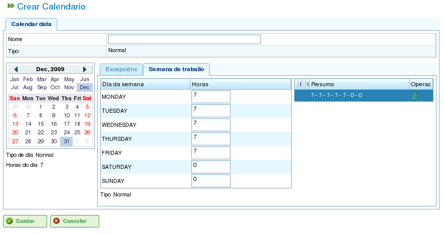

Calendarios
###########

.. contents::

Los calendarios son las entidades de la aplicación que determinan las capacidad de carga de los distintos recursos. Un calendario está formado por una serie de días anuales, donde cada día dispone de horas disponibles para trabajar.

Por ejemplo, un festivo puede tener 0 horas disponibles y, si las horas de trabajo dentro de un día laboral son 8, es este número lo que se asigna como tiempo disponible para ese día.

Existen dos modos de indicar al sistema cuantas horas de trabajo tiene un día:

* Por día de la semana. Por ejemplo, los lunes se trabajan 8 horas generalmente.
* Por excepciones. Por ejemplo, el lunes 30 de Enero se trabajan 10 horas.

Administración de calendarios
=============================

El sistema de calendarios es jerárquico, de modo que se pueden crear calendarios base o calendarios que heredan de dichos calendarios, manteniendo una estructura arbórea. Un calendario que hereda de un calendario de nivel superior del árbol, hereda las dedicaciones diarias y las excepciones, siempre y cuando no sean modificadas explícitamente para el calendario hijo. Además, es necesario entender los siguientes conceptos para administrar calendarios:

* Cada día es independiente entre sí y cada año tiene días diferentes, es decir, si se marca el 8 de Diciembre de 2009 cómo festivo eso no quiere decir que el año 2010 ya tenga el día 8 de Diciembre como festivo.
* Los días laborales se marcan en base a días de la semana, es decir, si se determina que lo normal es trabajar 8 horas los lunes, quedan todos los lunes de todas las semanas de los diferentes años marcados cómo 8 horas disponibles.
* Es posible marcar excepciones o intervalos de excepción, es decir, elegir un día concreto o grupo de días en los que las horas disponibles sean diferentes a la regla general para dichos días de la semana.

.. figure:: images/calendar-administration.png
   :scale: 50

   Administración de calendarios

La administración de calendarios es accesible desde las operaciones de la pestaña de "Administración". Desde dicho punto el usuario puede realizar las siguientes operaciones:

1. Crear un nuevo calendario desde cero.
2. Crear un calendario derivado de otro calendario.
3. Crear un calendario como copia de otro calendario.
4. Editar un calendario existente.

Creación de un nuevo calendario
-------------------------------

Para la creación de un nuevo calendario es necesario presionar en el botón "Crear". El sistema muestra un formulario en el que el usuario puede realizar las siguientes operaciones:

* Elegir la pestaña en la que desea trabajar:

   * Marcado de excepciones.
   * Selección de horas trabajadas por día.

* Si el usuario selecciona el marcado de excepciones:
   * Seleccionar un día específico del calendario.
   * Marcar el tipo de excepción. Los tipos disponibles son: vacaciones, baja, huelga, festivo, festivo trabajable.
   * Seleccionar la fecha de fin del intervalo de excepción (para marcar excepciones de 1 día de duración no se necesita modificar este campo).
   * Marcar el número de horas trabajadas durante los días excepcionales.
   * Borrar excepciones previas.

* Si el usuario elige la selección de horas trabajadas por día:

   * Marcar las horas disponibles para cada día de la semana (lunes, martes, miércoles, jueves, viernes, sábados y domingos).
   * Crear nuevas distribuciones de horas semanales aplicables en el futuro.
   * Borrar distribuciones de horas realizadas previamente.

Con estas operaciones un usuario de la aplicación tiene la capacidad de personalizar los calendarios completamente a sus necesidades. Para almacenar los cambios en el formulario es necesario presionar en el botón "Guardar".

   Edición de calendario

.. figure:: images/calendar-exceptions.png
   :scale: 50

   Inclusión de excepción en calendario

Creación de un calendario derivado
----------------------------------

Un calendario derivado es un calendario que se crea como hijo de un existente, es decir, hereda todas las características del original y al mismo tiempo es posible modificarlo para que contenga sus particularidades.

Un ejemplo de uso de calendarios derivados es la existencia de un calendario general para España, y la creación de un derivado para sólo incluir los festivos gallegos añadidos sobre los que ya estaban definidos en el general.

Es importante destacar que ante cualquier modificación realizada sobre el calendario original el derivado es directamente afectado, siempre y cuando, no se hubiese definido una actuación concreta sobre él mismo. Por ejemplo, en el calendario de España se incluye un día laboral en el 17 de Mayo con 8 horas de trabajo y en el calendario gallego, que se creó como derivación, el día 17 de Mayo es considerado un día de 0 horas de trabajo por ser festivo. Si sobre el calendario español se cambian los días de la semana del 17 Mayo para que las horas disponibles sean 4 diarias, en el gallego lo que sucede es que todos los días de la semana del 17 de Mayo tiene 4 horas disponibles excepto el día 17 que tiene 0 horas, tal y como explícitamente se había establecido antes.

.. figure:: images/calendar-create-derived.png
   :scale: 50

   Creación de calendario derivado

Para crear un calendario derivado en la aplicación, es necesario hacer el siguiente:

* Acceder al menú de *Administración*.
* Presionar en la operación de *Administración de calendarios*.
* Elegir uno de los calendarios sobre el que se desea realizar un derivado y presionar en el botón "Crear".
* Una vez realizada esta operación el sistema muestra un formulario de edición con las mismas características que los formularios para crear calendarios desde cero, con la diferencia de que las excepciones y las horas por día de la semana se proponen en base al calendario original.

Creación de un calendario por copia
-----------------------------------

Un calendario copiado es un calendario que se crea como copia exacta de otro existente, es decir, que recibe todas las características del original y, al mismo tiempo, es posible modificarlo para que contenga sus particularidades.

La diferencia entre copiar y derivar un calendario radica en los cambios en el original. En el caso de copias, si el original es modificado, no afecta a la copia, sin embargo, cuando se deriva, sí afecta al hijo.

Un ejemplo de uso de calendario por copia es el disponer de un calendario para "Pontevedra" y necesitar un calendario para "A Coruña" donde la mayoría de las características son las mismas, sin embargo, no se espera que los cambios en uno afecten al otro.

Para crear un calendario copiado en la aplicación, es necesario hacer el siguiente:

* Acceder al menú de *Administración*.
* Presionar en la operación de administración de calendarios.
* Elegir uno de los calendarios sobre lo que se desea realizar un derivado y presionar en el botón "Crear".
* Una vez realizada esta operación el sistema muestra un formulario de edición con las mismas características que los formularios para crear calendarios desde cero, con la diferencia de que las excepciones y las horas por día de la semana se proponen en base al calendario original.

Calendario por defecto
----------------------

Uno de los calendarios existentes en el sistema puede ser dado de alta como por defecto. Este calendario es lo que se asigna a cualquier entidad que en el sistema sea gestionado con calendarios.

Para configurar el calendario por defecto se debe realizar el siguiente:

* Acceder al menú de *Administración*.
* Presionar en la operación *Configuración*.
* Donde aparece el texto *Calendario por defecto*, seleccionar el que se desee establecer como calendario por defecto de la aplicación.
* Presionar en *Guardar*.

.. figure:: images/default-calendar.png
   :scale: 50

   Creación de calendario por defecto

Asignación de calendario a recursos
-----------------------------------

Los recursos sólo tienen activación, es decir, horas disponibles para trabajar, si disponen de un calendario asignado con un período válido de activación. Si no se le asignó ningún calendario a los recursos, los recursos tienen asignado el calendario por defecto con un período de activación que comienza en la fecha de alta y sin fecha de caducidad.

.. figure:: images/resource-calendar.png
   :scale: 50

   Calendario de recursos

Sin embargo, es posible eliminar el calendario asignado previamente a un recurso y crear un calendario nuevo a partir de un existente. De este modo hay recursos que puedan ser completamente personalizados a nivel de calendario.

Para asignar un calendario a un recurso es necesario dar los siguientes pasos:

* Acceder a la edición de recursos.
* Elegir un recurso y presionar en editar.
* Seleccionar la pestaña de "Calendario".
* A partir de la pestaña anterior aparece un calendario con las excepciones, las horas trabajables por día y los períodos de activación.
* Para cada pestaña:

   * Excepciones: Es posible elegir el tipo de excepción y un período en el que se aplica para poder incluir las vacaciones, días festivos, laborables diferentes, etc.
   * Semana de trabajo: Es posible modificar las horas trabajadas durante los distintos días de la semana (lunes, martes, etc.).
   * Períodos de activación: Es posible crear nuevos períodos de activación que refleja las fechas de inicio y fin de los contratos asociados al recurso. Ver la siguiente imagen.

* Para almacenar es necesario presionar en *Guardar*.
* El usuario puede presionar en *Borrar* se desea cambiar el calendario asignado al recurso.

.. figure:: images/new-resource-calendar.png
   :scale: 50

   Asignación de nuevo calendario a recurso

Asignación de calendario a pedidos
----------------------------------

Los proyectos pueden disponer de un calendario diferente al calendario por defecto. Para cambiar el calendario del pedido es necesario:

   * Acceder al listado de pedidos dentro de la vista global de empresa.
   * Editar el pedido en cuestión.
   * Acceder a la pestaña de "Datos generales".
   * Seleccionar en el desplegable de selección el calendario que se desea asignar.
   * Presionar en "Guardar" o "Guardar y Continuar".

Asignación de calendario a tareas
----------------------------------
Al igual que se permite asignar calendarios a recursos o pedidos, es posible realizar la misma operación para tareas planificadas. Esta operación permite definir calendarios específicos para momentos concretos de un proyecto. Para realizar esta operación es necesario:

   * Acceder a la planificación de un proyecto.
   * Presionar en el botón derecho sobre la tarea a la que se desea asignar calendario.
   * Seleccionar la operación "Asignación de calendario".
   * Elegir el calendario que se desea asignar a la tarea.
   * Presionar en "Aceptar".

