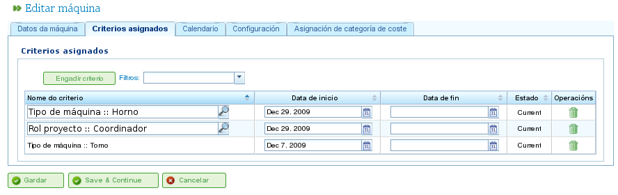

Gestión de recursos
###################

.. _recursos:
.. contents::

La aplicación gestiona dos tipos de recursos diferentes: recursos trabajadores y recursos máquinas.

Los recursos trabajadores representan los trabajadores de las empresas. Las características principales son:

* Satisfacen uno o varios criterios de tipo genérico o tipo trabajador.
* Son asignables específicamente a una tarea.
* Son asignables como parte de la asignación genérica a una tarea que requiera un criterio de tipo recurso.
* Dispondrán de un calendario por defecto o específico si así lo decide el usuario.

Los recursos máquina representan las máquinas de las empresas. Las características principales son:

* Satisfacen uno o varios criterios de tipo genérico o tipo máquina.
* Son asignables específicamente a una tarea.
* Son asignables como parte de la asignación genérica a una tarea que requiera un criterio de tipo máquina.
* Dispondrán de un calendario por defecto o específico si así lo decide el usuario.
* Contará con una pantalla de configuración en la que se podrá establecer un valor *alfa* que represente la relación entre máquina y trabajador.

  * El *alfa* representa cuanto tiempo de un trabajador es necesario para que la máquina funcione. Por ejemplo, un alfa de 0.5 indica que de cada 8 horas de máquina son necesarias 4 de un trabajador.
  * Es posible asignar un *alfa* de manera específica a un trabajador, es decir, se elige el trabajador que estará ocupado ese porcentaje de su tiempo con la máquina.
  * O bien, es posible hacer una asignación genérica en base a un criterio, de modo que se asigna un porcentaje del uso a todos los criterios que satisfacen ese criterio y tienen tiempo disponible. El funcionamiento de la asignación genérica es la misma que la explicada para asignaciones genéricas a tareas.

El usuario puede crear, editar e invalidar (nunca borrar definitivamente) trabajadores de la empresa desde la pestaña de "Recursos". Desde dicha pestaña existen las siguientes operaciones:

* Listado de trabajadores: Los trabajadores se mostrarán listados y paginados, desde donde pueden gestionar sus datos.
* Listado de máquinas: Las máquinas se mostrarán listados y paginados, desde donde pueden gestionar sus datos.

Gestión de trabajadores
========================

La gestión de trabajadores se realiza desde la pestaña de "Recursos" y la operación de "Lista de trabajadores". Desde la lista de recursos es posible editar cada uno de los trabajadores presionando en el icono estándar de edición.

Una vez en la edición de un recurso, el usuario puede acceder a las siguientes pestañas:

1) Pestaña de datos de trabajador. Esta pestaña permite editar los datos básicos de identificación del trabajador.

   * Nombre
   * Apellidos
   * DNI
   * Recursos limitantes (ver sección)

.. figure:: images/worker-personal-data.png
   :scale: 50

   Edición de datos personales de trabajador

2) Pestaña de criterios. Desde este punto se podrá configurar los criterios que un trabajador satisface. El usuario puede asignar cualquier valor de criterio de tipo trabajador o genérico que así considere a un trabajador. ES importante, para que la aplicación sea utilizada en todo su valor, que los trabajadores satisfagan criterios. Para asignar criterios el usuario debe:

   i. Presionar en el botón "Añadir criterio".

   ii. Buscar el criterio que desea añadir y seleccionar lo que encaje con su búsqueda.

   iii. Presionar en el botón de añadir.

   iv. Seleccionar fecha de inicio del criterio desde el momento que se aplica.

   v. Seleccionar la fecha de fin de aplicación del criterio al recurso. Dicha fecha no es obligatoria indicando que el criterio es indefinido.

.. figure:: images/worker-criterions.png
   :scale: 50

   Asociación de criterios a trabajador

3)  Pestaña de calendario. Pestaña desde la que se puede configurar un calendario específico para el recurso trabajador. Cada trabajador dispone de un calendario por defecto asignado, sin embargo, es posible asignar un calendario específico para cada uno a partir de uno existente.

.. figure:: images/worker-calendar.png
   :scale: 50

   Pestaña de calendario para un recurso

4)  Pestaña de categoría de coste. Pestaña desde la que se puede configurar la categoría de coste que satisface un recurso en un período dado. Estos datos son utilizados para posteriormente calcular los costes asociados al trabajador en un proyecto.

.. figure:: images/worker-costcategory.png
   :scale: 50

   Pestaña de categoría de coste para recurso

La asignación de recursos se explica en la sección de asignación de recursos.

Gestión de máquinas
===================

Las máquinas son recursos a todos los efectos, por lo cual, tal y como sucede con los trabajadores, las máquinas son administrables y asignables a tareas. La asignación de recursos se tratará en la sección de asignación. En este punto se explicarán las características específicas de las máquinas.

Las máquinas son administradas desde la entrada de menú "Recursos". En dicha sección existe una operación llamada "Listado de máquinas" que permite la visualización de las máquinas que disponen en una empresa. A partir de este listado se podrá editar o borrar una máquina.

En la edición de una máquina el sistema muestra una serie de pestañas desde las cuáles se permite administrar diferentes datos:

1) Pestaña de datos de la máquina. Pestaña para la edición de datos identificativos de las máquinas. Los datos modificables en esta pestaña son:

   i Nombre.

   ii Código de la máquina.

   iii Descripción de la máquina.

.. figure:: images/machine-data.png
   :scale: 50

   Edición de datos de máquina

2) Pestaña de criterios. Tal y como se comentó en la anterior sección de recursos trabajadores, esta es la pestaña en la que se pueden añadir criterios que satisfacen las diversas máquinas del sistema. Los criterios que son asignables a las máquinas son los de criterios de tipo máquina o genéricos. No se pueden asignar criterios de trabajadores. Para asignar criterios, el usuario debe:

   i. Presionar en el botón "Añadir criterio".

   ii. Buscar el criterio que desea añadir y seleccionar lo que encaje con su búsqueda.

   iii. Seleccionar fecha de inicio del criterio desde el momento que deba aplicarse.

   iv. Seleccionar la fecha de fin de aplicación del criterio al recurso. Dicha fecha no es obligatoria indicando que el criterio es indefinido.

   v. Presionar en el botón de "Guardar y Continuar".

   Asignación de criterios a máquinas

3) Pestaña de calendario. Pestaña desde la que se puede configurar un calendario específico para el recurso máquina. Cada trabajador dispone de un calendario por defecto asignado, sin embargo, es posible asignar un calendario específico para cada uno a partir de un existente.

.. figure:: images/machine-calendar.png
   :scale: 50

   Asignación de calendario a máquina

4) Pestaña de configuración de máquinas: Desde esta pestaña es posible configurar la relación de las máquinas con los recursos trabajadores existentes. Una máquina dispone de un alfa que indica la relación entre la máquina y los recursos implicados, tal y como ya se comentó, un alfa de 0.5 indica que se consume trabajo de 0.5 personas para cada jornada completa de máquina. El sistema, a partir de un alfa, crea automáticamente asignaciones a los trabajadores que estén de alguna manera relacionados con la máquina una vez se asigna una máquina a una tarea. La forma de relacionar un trabajador con una máquina se puede hacer de dos maneras:

   i Asignando específicamente un rango de fechas en las que el trabajador se desea asignar a una máquina. Es una asignación específica de modo que el sistema asigna automáticamente horas al trabajador cuando se planifique la máquina.

   ii Asignando específicamente criterios que se desea satisfagan los trabajadores que sean asignados a las máquinas. De este modo se hará una asignación genérica a los trabajadores que satisfacen los criterios.

.. figure:: images/machine-configuration.png
   :scale: 50

   Configuración de máquina

5) Pestaña de categoría de coste. Pestaña desde la que se puede configurar la categoría de coste que satisface una máquina en un período dado. Estos datos son utilizados para posteriormente calcular los costes asociados al trabajador en un proyecto.

.. figure:: images/machine-costcategory.png
   :scale: 50

   Asignación de categoría de coste a máquina

Grupos de trabajadores virtuales
================================

La aplicación permite la creación de recursos en el sistema, los cuales no son trabajadores reales, sino que son personal simulado  que permite aumentar la capacidad productiva en un momento determinado según las configuraciones que se definan de su calendario.

Mediante los grupos de trabajadores virtuales es posible comprobar cómo se vería afectada la planificación de los proyectos, contratando y asignando personal que satisfaga los criterios que se definan, ayudando de este modo en el proceso de toma de decisiones.

Las pestañas de las que consta el formulario de creación de grupos de trabajadores virtuales son las mismas que las que permiten configurar los trabajadores, y decir:

   * Datos generales
   * Criterios asignados
   * Calendarios
   * Horas asociadas

La diferencia con respeto a los trabajadores, es que en los grupos de trabajadores virtuales se especifica un nombre para el grupo y una cantidad que se corresponde con el número de personas reales que forman este grupo. Adicionalmente existe un campo de observaciones en el que se puede aportar información adicional como, por ejemplo, para que proyecto estaría prevista la contratación del equivalente del grupo de recursos virtuales, etc.

.. figure:: images/virtual-resources.png
   :scale: 50

   Recursos virtuales

Recursos limitantes
================================

Los recursos limitantes son un tipo especial de elementos productivos que sólamente pueden encontrarse no asignados o con un 100% de dedicación. Lo que es lo mismo, no pueden de tener más de una tarea asignada al mismo tiempo o encontrarse sobreplanificados.

Por cada recurso limitante se crea automáticamente una cola para que las tareas que tiene planificadas puedan ser gestionadas de forma específica mediante los métodos de asignación proporcionados, realizando asignaciones automáticas de las tareas a las colas que cumplan los criterios que requieren o moviendo tareas entre colas.
