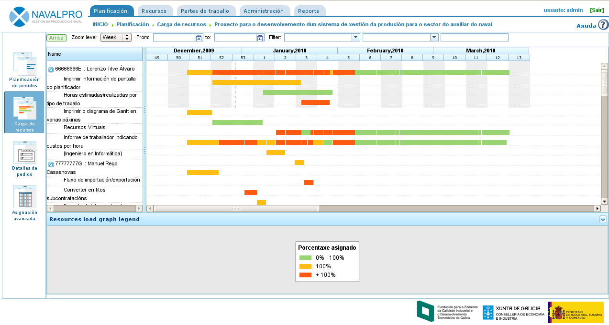

Planificación de tareas
#######################

.. _planificacion:
.. contents::

Planificación de tareas
========================

La planificación en "LibrePlan" es un proceso que se describe a lo largo de todos los capítulos del documento de usuario, entre los cuales destacan los capítulos de pedidos y de asignación de recursos. En este capítulo se tratan las operaciones básicas de planificación, una vez el pedido está correctamente configurado y la interacción con los diagramas de Gantt.

.. figure:: images/planning-view.png
   :scale: 35

   Vista de planificación de un trabajo

Tal y como sucede con la vista global de la empresa, la vista de planificación de un proyecto se divide en varias perspectivas que se muestran en base a la información que se está analizando del mismo. Las perspectivas de un proyecto concreto son:

* Vista de planificación
* Vista de carga de recursos
* Vista de listado de pedidos
* Vista de asignación avanzada

Vista de planificación
----------------------
La perspectiva de planificación combina tres vistas diferentes:

* Planificación del proyecto. La planificación del proyecto se visualiza en la zona superior derecha de la aplicación. Se representa la planificación en diagramación de Gantt. Es la vista en la que se permite mover temporalmente las tareas, asignar dependencias entre ellas, definir hitos o establecer restricciones.
* Vista de carga de recursos. La vista de carga de recursos es el gráfico inferior derecho en el que se muestra la disponibilidad de recursos según las asignacións que se realizaron, contrastada con las asignaciones realizadas a tareas. La información que se muestra en el gráfico es:

   * Zona violeta: Indica la carga de recursos por debajo del 100% de su capacidad.
   * Zona verde: Indica la carga de recursos por debajo del 100% derivado de que el recurso está planificado en otro proyecto.
   * Zona naranja: Indica la carga de recursos por encima de su 100% debido al proyecto actual.
   * Zona amarilla: Indica la carga de recursos por encima de su 100% debido a otros proyectos.

* Vista de gráfico e indicadores do valor ganado. Visible desde la pestaña de "Valor Ganado". Gráfico que se genera en base a la técnica del valor ganado y os indicadores calculados cada uno de los días de trabajo del proyecto. Los indicadores calculados son:

   * BCWS: función acumulativa en el tiempo del número de horas planificadas hasta una fecha. En el inicio planificado de la tarea será 0 y al final será el total de horas planificadas. Como toda gráfica acumulativa, esta siempre será creciente. La función para una tarea tendrá la suma de las asignaciones de día hasta el día de cálculo. Esta función tiene valores para todos los momentos en el tiempo siempre que tengamos asignación de recursos.
   * ACWP: función acumulativa en el tiempo de las horas imputadas en los partes de trabajo hasta una fecha. Esta función solo tendrá valores iguales a 0 antes de la fecha del promer parte de trabajo de la tarea e irá incrementando su valor a medida que avanza el tiempo y se incorporen horas de partes de trabajo. No tendrá valor después de la fecha del último parte de trabajo.
   * BCWP: función acumulativa en el tiempo que incorpora el valor resultante de multiplicar el avance de las tareas por la cantidad de trabajo que se estimaba que llevaría la tarea. Esta función tiene valores incrementales a medida que se incrementa el tiempo y tenemos valores de avance que se van incrementando. El avance se multiplica por el total de horas estimadas de cada una de las tareas. Y el valor de BCWP es la sume de estos valores para las tareas que es están calculando. Un avance se suma en el momento de tiempo que se configuró.
   * CV: Variación en coste CV = BCWP - ACWP
   * SV: Variación en planificación SV = BCWP - BCWS
   * BAC: Total coste planificado BAC = max (BCWS)
   * EAC: Estimación de coste total actual EAC = (ACWP/ BCWP) * BAC
   * VAC: Desviación al coste final VAC = BAC - EAC
   * ETC: Estimado del coste pendiente ETC = EAC - ACWP
   * CPI: Índice de eficiencia de coste CPI = BCWP / ACWP
   * SPI: Índice de eficiencia da planificación SPI = BCWP / BCWS

Dentro de la planificación del proyecto el usuario puede realizar las siguientes operaciones:

   * Asignar dependencias. Para realizar dicha operación es necesario pulsar con el botón derecho y elegir "Añadir dependencia", arrastrar el puntero del ratón para la tarea destinataria de la dependencia.

      * Para cambiar el tipo de dependencia, pulsar con el botón derecho sobre la dependencia y elegir el tipo que se desea asignar.

   * Crear nuevo hito. Pulsar sobre la tarea anterior al hitoque se desea añadir y seleccionar la operación "Añadir hito". Los hitos pueden ser movidos selecionando con el puntero sobre la tarea y arrastrando con el ratón el hito a la posición deseada.
   * Mover tareas sin violar dependencias. Presionar con el ratón sobre el cuerpo de la tarea y sin soltar el ratón, arrastrar la tarea hacia la posición en la que se desea colocar. Si no se violan restricciones o dependencias el sistema actualiza las asignaciones de recursos diarias a la tarea y coloca la tarea en la fecha seleccionada.
   * Asignar restricciones. Presionar sobre la tarea en cuestión y seleccionar la operación "Propiedades de la tarea". Aparecerá un *pop-up* con un campo modificable que es "Restricciones". Las restricciones pueden entrar en conflicto con las dependencias, por lo que será en cada pedido donde se indique si las dependencias tienen prioridad o no sobre las restricciones. Las que se pueden establecer son:

      * *Tan pronto como sea posible*: Indica que la tarea debe comenzar tan pronto como sea posible.
      * *No antes de*. Indica que la tarea no debe comenzar antes de una fecha.
      * *Comenzar en fecha fija*. Indica que la tarea debe comenzar en fecha fija.

A mayores, dentro da perspectiva de planificación se ofrecen varias operaciones, que finalmente actuarán como opciones de visualización:

* Nivel de zoom: Es posible seleccionar el nivel de zoom que le interese al usuario. Existen varios niveles de zoom: por año, cuatrimestres, mensuales, semanales y diarios.
* Filtros de búsqueda: Es posible filtrar tareas en base a etiquetas o criterios.
* Camino crítico. Utilizando el algoritmo de *Dijkstra* para cálculo de caminos en grafos se implementó el camino crítico que se visualiza si se presiona en el botón "Camino crítico" de las opciones de visualización.
* Mostrar etiquetas: Permite mostrar las etiquetas asignadas a las tareas del proyecto en visualización e impresión.
* Mostrar recursos: Permite mostrar los recursos asignados a las tareas del proyecto en visualización e impresión.
* Imprimir: Permite imprimir el diagrama de Gantt que se está visualizando en el momento.

Vista de carga de recursos
--------------------------
La vista de carga de recursos ofrece una lista de recursos que contiene una lista de tareas o criterios que generan carga de trabajo. Cada tarea o criterio es mostrado en modo diagrama de Gantt para dar visibilidad a la fecha de comienzo y final de dicha carga. Según un recurso tiene una carga superior o inferior al 100% se muestra un color:

* Color verde: carga inferior al 100%
* Color naranja: carga del 100%
* Color roja: carga superior al 100%

   Vista de carga de recursos para un pedido concreto

Si se coloca el ratón sobre una zona del diagrama de Gantt de un recurso se mostrará el porcentaje de carga del trabajador en ese momento dado.

Vista de listado de pedidos
---------------------------
La vista de listado de pedidos permite acceder a la edición y borrado de pedidos. Ver el capítulo de "Pedidos".

Vista de asignación avanzada
----------------------------
La vista de asignación avanzada se explica en profundidad en el capítulo de "Asignación de recursos".

