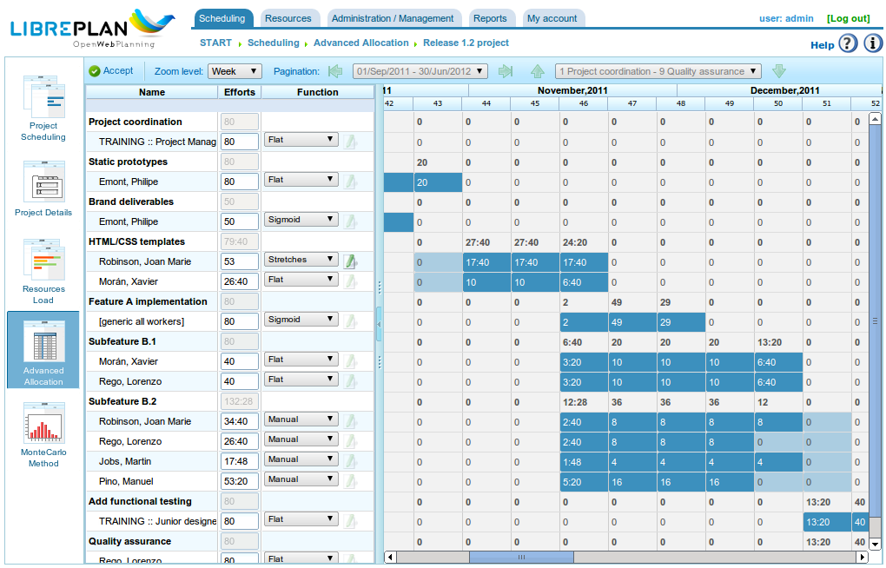

Asignación de recursos
######################

.. asigacion_
.. contents::

La asignación de recursos es una de las partes más importantes de la aplicación. La asignación de recursos puede realizarse de dos maneras diferentes:

* Asignaciones específicas.
* Asignaciones genéricas.

Cada una de las asignaciones es explicada en las siguientes secciones.

Para realizar cualquiera de las dos asignaciones de recursos es necesario dar los siguientes pasos:

* Acceder a la planificación de un pedido.
* Presionar con el botón derecho sobre la tarea que se desea planificar.

.. figure:: images/resource-assignment-planning.png
   :scale: 50

   Menú de asignación de recursos

* La aplicación muestra una pantalla en la que se puede visualizar la siguiente información.

   * Listado de criterios que deben ser satisfechos. Por cada grupo de horas, se muestra un listado de grupos de horas y cada grupo de horas exige su listado de criterios.
   * Información de la tarea: fecha de inicio y fecha de fin de la tarea.
   * Tipo de cálculo: El sistema permite elegir la estrategia que se desea llevar a cabo para calcular las asignaciones:

      * Calcular número de horas: Calcula el número de horas que haría falta que dedicaran los recursos asignados dados una fecha de fin y un número de recursos por día.
      * Calcular fecha fin: Calcula la fecha de fin de la tarea a partir de los número de recursos de la tarea y de las horas totales dedicar para finalizar la tarea.
      * Calcular número de recursos: Calcula el número de recursos necesarios para finalizar la tarea en una fecha específica y dedicando una serie de horas conocidas.

   * Asignación recomendada: Opción que le permite a la aplicación recoger los criterios que deben ser satisfechos y las horas totales de cada grupo de horas y hace una propuesta de asignación genérica recomendada. Si había una asignación previa, el sistema elimina dicha asignación sustituyéndola por la nueva.
   * Asignaciones: Listado de asignaciones realizadas. En este listado se podrán ver las asignaciones genéricas (el nombre sería la lista de criterios satisfecha, horas y número de recursos por día). Cada asignación realizada puede ser borrada explícitamente presionando en el botón de borrar.

.. figure:: images/resource-assignment.png
   :scale: 50

   Asignación de recursos

* El usuario selecciona "Búsqueda de recursos".
* La aplicación muestra una nueva pantalla formada por un árbol de criterios y un listado a la derecha de los trabajadores que cumplen los criterios seleccionados:

.. figure:: images/resource-assignment-search.png
   :scale: 50

   Búsqueda de asignación de recursos

* El usuario puede seleccionar:

   * Asignación específica. Ver sección "Asignación específica" para conocer que significa elegir esta opción.
   * Asignación genérica. Ver sección "Asignación genérica" para conocer que significa elegir esta opción.

* El usuario selecciona una lista de criterios (genérica) o una lista de trabajadores (específica). La elección múltiple se realiza presionando en el botón "Crtl" a la hora de pulsar en cada trabajador o criterio.

* El usuario presiona en el botón "Seleccionar". Es importante tener en cuenta que, si no se marca asignación genérica, es necesario escoger un trabajador o máquina para poder realizar una asignación, en caso contrario llega con elegir uno o varios criterios.

* La aplicación muestra en el listado de asignaciones de la pantalla original de asignación de recursos a lista de criterios o recursos seleccionados.

* El usuario debe elegir las horas o los recursos por día dependiendo de la estrategia de asignación que le solicitó llevar a cabo a la aplicación.

Asignación específica
=====================

La asignación específica es aquella asignación de un recurso de modo concreto y específica a una tarea de un proyecto, es decir, el usuario de la aplicación está decidiendo qué "nombre y apellidos" o qué "máquina" concreta debe ser asignada a una tarea.

La asignación específica es realizable desde la pantalla que se puede ver en la imagen:

.. figure:: images/asignacion-especifica.png
   :scale: 50

   Asignación específica de recursos

La aplicación, cuando un recurso es asignado específicamente, crea asignaciones diarias en relación al porcentaje de recurso diario que se eligió para asignación, contrastando previamente con el calendario disponible del recurso. Ejemplo: una asignación de 0.5 recursos para una tarea de 32 horas implica que se asignen al recurso específico (suponiendo un calendario laboral de 8 horas diarias) 4 horas diarias para realizar la tarea.

Asignación específica de máquinas
---------------------------------

La asignación específica de máquinas actúa igual que la de trabajadores, es decir, cuando se asigna una máquina a una tarea, el sistema almacena una asignación de horas específica a la máquina elegida. La diferencia principal es que en el momento de asignar una máquina, el sistema busca el listado de trabajadores o criterios asignados a la máquina:

* Si la máquina tenía un listado de trabajadores asignados, elige entre el número de ellos que requiera la máquina para el calendario asignado. Por ejemplo, si el calendario de la máquina es de 16 horas diarias y de los recursos de 8, asigna dos recursos de la lista de recursos disponibles.
* Si la máquina tenía un criterio o varios asignados, realiza asignaciones genéricas entre los recursos que satisfacen los criterios asignados a la máquina.

Asignación genérica
===================

La asignación genérica es aquella asignación donde el usuario no elige los recursos concretamente dejando la decisión a la aplicación, eligiendo ésta como reparte las cargas entre los recursos disponibles de la empresa.

.. figure:: images/asignacion-xenerica.png
   :scale: 50

   Asignación genérica de recursos

El sistema de asignación utiliza como base los siguientes supuestos:

* Las tareas cuentan con criterios requeridos a los recursos.
* Los recursos están configurados para que satisfagan los criterios.

Sin embargo, el sistema no falla en aquellos casos en los que no se asignen criterios sino que todos los recursos satisfacen el no requirimiento de criterios.

El algoritmo de asignación genérica actúa del siguiente modo:

* Cada recurso y día es tratado como un contenedor donde caben asignaciones diarias de horas, basándose la capacidad máxima de asignación en el calendario de la tarea.
* El sistema busca los recursos que satisfacen el criterio.
* El sistema analiza qué asignaciones tienen actualmente los diferentes recursos que cumplen los criterios.
* De entre los que satisfacen los criterios se escogen los recursos que tienen disponibilidad suficiente.
* Si los recursos más libres van siendo ocupados, se siguen realizando asignaciones en los recursos que tenían menor disponibilidad.
* Sólo cuando todos los recursos que satisfacen los criterios correspondientes están asignados al 100% se comienza con la sobreasignación de recursos hasta completar el total necesario para realizar la tarea.

Asignación genérica de máquinas
-------------------------------

La asignación genérica de máquinas actúa de igual modo que la de trabajadores, es decir, cuando se asigna una máquina a una tarea, el sistema almacena una asignación de horas genérica a cada una de las máquinas que satisfacen los criterios, tal y como se describió genericamente para los recursos en general. Sin embargo, tratándose de máquinas el sistema realiza la siguiente operación a mayores:

* Para cada máquina elegida para la asignación genérica:

  * Recoge la información de configuración de la máquina, es decir, alfa, trabajadores y criterios asignados.
  * Si la máquina tenía un listado de trabajadores asignados, elige entre el número de ellos que requiera la máquina dependiendo del calendario asignado. Por ejemplo, si el calendario de la máquina es de 16 horas diarias y de los recursos de 8, asigna dos recursos de la lista de recursos disponibles.
  * Si la máquina tenía un criterio o varios asignados, realiza asignaciones genéricas entre los recursos que satisfacen los criterios asignados a la máquina.

Asignación avanzada
===================

La asignación avanzada permite diseñar las asignaciones que se realizan automáticamente por la aplicación de manera más personalizada. Esta operación permite elegir manualmente las horas diarias que dedican los recursos a las tareas que están asignadas o definir una función que se le aplica a dichas asignaciones.

Para gestionar la asignación avanzada los pasos a dar son los siguientes:

* Acceder a la ventana de asignación avanzada. Existen dos modos de acceder a la asignación avanzada:

   * Accediendo a un pedido concreto y cambiar de perspectiva para asignación avanzada. En este caso se mostrarán todas las tareas del pedido y los recursos asignados (tanto específicos cómo genéricos).
   * Accediendo a la asignación de recursos y presionando en el botón "Asignación avanzada". En este caso se mostrarán las asignaciones de la tarea para la que se está asignando recursos (se muestran tanto las genéricas como las específicas).

   Asignación avanzada de recursos

* El usuario puede acceder al zoom que desee:

   * Si el zoom elegido es un zoom superior a día. Si el usuario modifica el valor de horas asignado a la semana, mes, cuatrimestre o semestre, el sistema reparte las horas de manera lineal durante todos los días del período elegido.
   * Si el zoom elegido es un zoom de día. Si el usuario modifica el valor de horas asignado al día, estas horas sólo aplican al día. De este modo el usuario puede decidir cuantas horas se asignan diariamente a los recursos de la tarea.

* El usuario puede elegir diseñar una función de asignación avanzada. Para realizarlo:

   * Elegir la función en la lista de selección que aparece al lado de cada recurso y presionar en "Configurar".
   * El sistema muestra una nueva ventana si la función elegida requiere de configuración específica. Las funciones soportadas son:

      * Tramos: Función que permite definir tramos en los que se aplica una función polinómica. La función por tramos se configura del siguiente modo:

         * Fecha. Fecha en la que finaliza el tramo. Si se establece el siguiente valor (longitud) la fecha es calculada, en caso contrario, se calcula la longitud.
         * Definición de la longitud de cada tramo. Indica que porcentaje de duración de la tarea se desea para el tramo.
         * Definición de la cantidad de trabajo. Indica que porcentaje de carga de trabajo se espera tener hecho en ese tramo. La cantidad de trabajo debe ser incremental, de modo que si hay un tramo del 10% el siguiente tramo debe ser superior (por ejemplo, 20%).
         * Gráficas de tramos y carga acumulada.

   * El usuario presiona en "Aceptar".
   * La aplicación almacena la función y la aplica en las asignaciones diarias del recurso.

.. figure:: images/stretches.png
   :scale: 40

   Configuración de función por tramos

