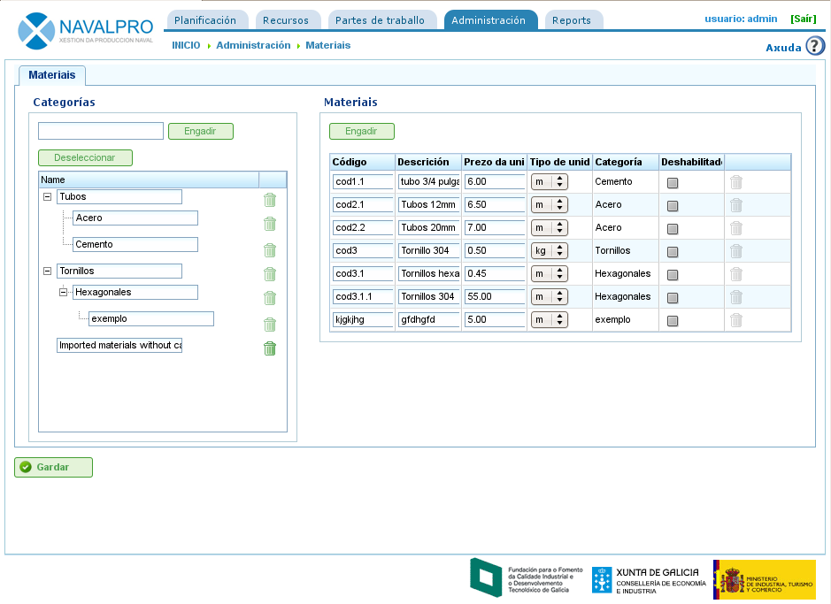

Materiales
##########
.. _materiales:
.. contents::

Administración de materiales
============================

Es posible gestionar una base de datos de materiales básica organizados por categorías.

Las categorías son contedores a los que se pueden asignar materiales concretos y al mismo tiempo más categorías. Se almacenan en modo arbóreo de suerte que los materiales pueden pertenecer a categorías hoja o categorías intermedias.

Para administrar categorías:

* El usuario accede a la operación de "Administración->Materiales".
* La aplicación muestra un árbol de categorías.
* El usuario introduce un nombre de categoría dentro de la entrada de texto con un botón "Añadir" y presiona en el botón.
* La aplicación añade la categoría en el árbol de categorías.

Si el usuario desea posicionar una categoría dentro del árbol de categorías debe seleccionar previamente la categoría padre en dicho árbol para después presionar en "Añadir".

   Pantalla de administración de materiales

Para administrar materiales:

* El usuario selecciona la categoría para la que desea incluir materiales y presiona en el botón "Añadir" en la zona derecha de "Materiales".
* La aplicación añade una nueva fila vacía con campos para introducir los datos del material:

   * Código: Código del tipo de material (puede ser el código externo proveniente de un ERP).
   * Descripción: Descripción del material.
   * Precio de la unidad: Precio unitario de cada elemento de material.
   * Unidad: Unidad en la que se desea medir cada unidad de material.
   * Categoría: Categoría a la que pertenece.
   * Deshabilitado: Si el material está borrado o no.

* El usuario llena los campos y presiona en el botón "Guardar".

La asignación de materiales a elementos de pedidos se explica en el capítulo de "Pedidos".

