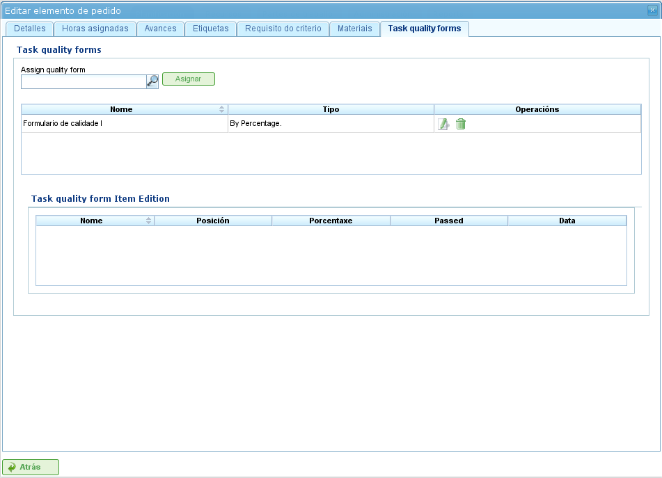

پروژه‌ها و عناصر پروژه
######################

.. contents::

پروژه‌ها نمایانگر کارهایی هستند که باید توسط کاربران برنامه انجام شوند. هر پروژه با یک پروژه‌ای که شرکت به مشتریان خود ارائه خواهد داد مطابقت دارد.

یک پروژه از یک یا چند عنصر پروژه تشکیل می‌شود. هر عنصر پروژه نمایانگر بخش خاصی از کار انجام‌شدنی است و مشخص می‌کند که چگونه کار روی پروژه باید برنامه‌ریزی و اجرا شود. عناصر پروژه به صورت سلسله‌مراتبی سازماندهی می‌شوند.

پروژه‌ها
========

یک پروژه نمایانگر یک پروژه یا کار درخواست‌شده توسط مشتری از شرکت است. LibrePlan تنها به جزئیات کلیدی خاصی برای یک پروژه نیاز دارد. این جزئیات عبارتند از:

*   **نام پروژه:** نام پروژه.
*   **کد پروژه:** یک کد منحصربه‌فرد برای پروژه.
*   **مبلغ کل پروژه:** ارزش مالی کل پروژه.
*   **تاریخ شروع تخمینی:** تاریخ شروع برنامه‌ریزی‌شده برای پروژه.
*   **تاریخ پایان:** تاریخ تکمیل برنامه‌ریزی‌شده برای پروژه.
*   **مسئول:** فردی که مسئول پروژه است.
*   **توضیحات:** توضیحاتی درباره پروژه.
*   **تقویم اختصاص‌یافته:** تقویم مرتبط با پروژه.
*   **تولید خودکار کدها:** تنظیمی برای دستور دادن به سیستم جهت تولید خودکار کدها برای عناصر پروژه و گروه‌های ساعت.
*   **ترجیح بین وابستگی‌ها و محدودیت‌ها:** کاربران می‌توانند انتخاب کنند که وابستگی‌ها یا محدودیت‌ها در صورت تعارض اولویت داشته باشند.

یک پروژه کامل همچنین شامل موجودیت‌های مرتبط دیگری است:

*   **ساعات اختصاص‌یافته به پروژه**
*   **پیشرفت منتسب به پروژه**
*   **برچسب‌ها**
*   **معیارهای اختصاص‌یافته به پروژه**
*   **مواد**
*   **فرم‌های کیفیت**

ایجاد یا ویرایش یک پروژه می‌تواند از چندین مکان در برنامه انجام شود:

*   **از «فهرست پروژه‌ها» در نمای کلی شرکت:**

    *   **ویرایش:** روی دکمه ویرایش برای پروژه مورد نظر کلیک کنید.
    *   **ایجاد:** روی «پروژه جدید» کلیک کنید.

*   **از یک پروژه در نمودار گانت:** به نمای جزئیات پروژه تغییر دهید.

هنگام ویرایش یک پروژه، کاربران می‌توانند به برگه‌های زیر دسترسی داشته باشند:

*   **ویرایش جزئیات پروژه:** این صفحه به کاربران امکان می‌دهد جزئیات اساسی پروژه را ویرایش کنند:

    *   نام
    *   کد
    *   تاریخ شروع تخمینی
    *   تاریخ پایان
    *   مسئول
    *   مشتری
    *   توضیحات

    .. figure:: images/order-edition.png
       :scale: 50

       ویرایش پروژه‌ها

*   **فهرست عناصر پروژه:** این صفحه به کاربران امکان می‌دهد چندین عملیات روی عناصر پروژه انجام دهند:

    *   ایجاد عناصر پروژه جدید.
    *   ارتقای یک عنصر پروژه یک سطح به بالا در سلسله‌مراتب.
    *   تنزیل یک عنصر پروژه یک سطح به پایین در سلسله‌مراتب.
    *   تورفتگی یک عنصر پروژه (انتقال به پایین سلسله‌مراتب).
    *   بیرون‌تورفتگی یک عنصر پروژه (انتقال به بالا سلسله‌مراتب).
    *   فیلتر کردن عناصر پروژه.
    *   حذف عناصر پروژه.
    *   جابجایی یک عنصر در سلسله‌مراتب با کشیدن و رها کردن.

    .. figure:: images/order-elements-list.png
       :scale: 40

       فهرست عناصر پروژه

*   **ساعات اختصاص‌یافته:** این صفحه کل ساعات منتسب به پروژه را نمایش می‌دهد.

    .. figure:: images/order-assigned-hours.png
       :scale: 50

       اختصاص ساعات منتسب به پروژه توسط کارکنان

*   **پیشرفت:** این صفحه به کاربران امکان می‌دهد انواع پیشرفت را اختصاص دهند و اندازه‌گیری‌های پیشرفت برای پروژه وارد کنند.

*   **برچسب‌ها:** این صفحه به کاربران امکان می‌دهد برچسب‌هایی به یک پروژه اختصاص دهند.

    .. figure:: images/order-labels.png
       :scale: 35

       برچسب‌های پروژه

*   **معیارها:** این صفحه به کاربران امکان می‌دهد معیارهایی اختصاص دهند که برای تمام وظایف درون پروژه اعمال می‌شوند.

    .. figure:: images/order-criterions.png
       :scale: 50

       معیارهای پروژه

*   **مواد:** این صفحه به کاربران امکان می‌دهد مواد را به پروژه‌ها اختصاص دهند.

    .. figure:: images/order-material.png
       :scale: 50

       مواد مرتبط با یک پروژه

*   **کیفیت:** کاربران می‌توانند یک فرم کیفیت به پروژه اختصاص دهند.

    .. figure:: images/order-quality.png
       :scale: 50

       فرم کیفیت مرتبط با پروژه

ویرایش عناصر پروژه
====================

عناصر پروژه از برگه «فهرست عناصر پروژه» با کلیک بر روی نماد ویرایش ویرایش می‌شوند. این یک صفحه جدید باز می‌کند که در آن کاربران می‌توانند:

*   اطلاعات درباره عنصر پروژه را ویرایش کنند.
*   ساعات منتسب به عناصر پروژه را مشاهده کنند.
*   پیشرفت عناصر پروژه را مدیریت کنند.
*   برچسب‌های پروژه را مدیریت کنند.
*   معیارهای مورد نیاز توسط عنصر پروژه را مدیریت کنند.
*   مواد را مدیریت کنند.
*   فرم‌های کیفیت را مدیریت کنند.

ویرایش اطلاعات درباره عنصر پروژه
----------------------------------

*   **نام عنصر پروژه**
*   **کد عنصر پروژه**
*   **تاریخ شروع**
*   **تاریخ پایان تخمینی**
*   **کل ساعات**
*   **گروه‌های ساعت**
*   **معیارها**

.. figure:: images/order-element-edition.png
   :scale: 50

   ویرایش عناصر پروژه

مشاهده ساعات منتسب به عناصر پروژه
------------------------------------

برگه «ساعات اختصاص‌یافته» به کاربران امکان می‌دهد گزارش‌های کاری مرتبط با یک عنصر پروژه را مشاهده کنند.

.. figure:: images/order-element-hours.png
   :scale: 50

   ساعات اختصاص‌یافته به عناصر پروژه

مدیریت برچسب‌های پروژه
------------------------

.. figure:: images/order-element-tags.png
   :scale: 50

   اختصاص برچسب‌ها برای عناصر پروژه

مدیریت معیارهای مورد نیاز توسط عنصر پروژه و گروه‌های ساعت
------------------------------------------------------------

.. figure:: images/order-element-criterion.png
   :scale: 50

   اختصاص معیارها به عناصر پروژه

مدیریت مواد
-----------

مواد در پروژه‌ها به صورت فهرستی مرتبط با هر عنصر پروژه مدیریت می‌شوند. فهرست مواد شامل فیلدهای زیر است:

*   **کد:** کد مواد.
*   **تاریخ:** تاریخ مرتبط با مواد.
*   **واحدها:** تعداد واحدهای مورد نیاز.
*   **نوع واحد:** نوع واحد مورد استفاده برای اندازه‌گیری مواد.
*   **قیمت واحد:** قیمت هر واحد.
*   **قیمت کل:** قیمت کل.
*   **دسته:** دسته‌ای که مواد به آن تعلق دارد.
*   **وضعیت:** وضعیت مواد (مثلاً دریافت‌شده، درخواست‌شده، در انتظار، در حال پردازش، لغو شده).

.. figure:: images/order-element-material-search.png
   :scale: 50

   جستجوی مواد

.. figure:: images/order-element-material-assign.png
   :scale: 50

   اختصاص مواد به عناصر پروژه

مدیریت فرم‌های کیفیت
---------------------

   اختصاص فرم‌های کیفیت به عناصر پروژه

*   برنامه دارای یک موتور جستجو برای فرم‌های کیفیت است. دو نوع فرم کیفیت وجود دارد: بر اساس عنصر یا بر اساس درصد.

    *   **عنصر:** هر عنصر مستقل است.
    *   **درصد:** هر سوال پیشرفت عنصر پروژه را به درصد افزایش می‌دهد. درصدها باید بتوانند تا ۱۰۰٪ جمع شوند.
