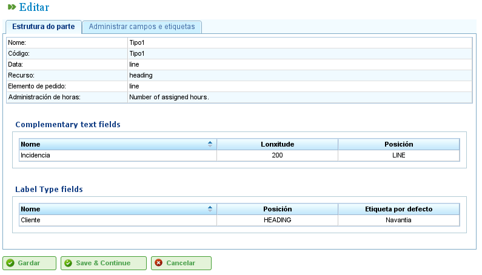

گزارش‌های کاری
##############

.. contents::

گزارش‌های کاری نظارت بر ساعاتی که منابع به وظایف اختصاص‌یافته به آن‌ها اختصاص می‌دهند را ممکن می‌سازند.

برنامه به کاربران امکان می‌دهد فرم‌های جدیدی برای ورود ساعات اختصاص‌یافته پیکربندی کنند و فیلدهایی که می‌خواهند در این فرم‌ها ظاهر شوند را مشخص کنند.

قبل از اینکه کاربران بتوانند ورودی‌هایی برای منابع اضافه کنند، باید حداقل یک نوع گزارش کاری تعریف کنند.

انواع گزارش کاری
================

یک گزارش کاری از مجموعه‌ای از فیلدهای مشترک برای کل گزارش و مجموعه‌ای از خطوط گزارش کاری با مقادیر خاص برای فیلدهای تعریف‌شده در هر ردیف تشکیل می‌شود.

.. figure:: images/work-report-types.png
   :scale: 40

   انواع گزارش کاری

فیلدهای اجباری که باید در تمام گزارش‌های کاری ظاهر شوند به شرح زیر است:

*   **نام و کد:** فیلدهای شناسایی برای نام نوع گزارش کاری و کد آن.
*   **تاریخ:** فیلد برای تاریخ گزارش.
*   **منبع:** کارمند یا ماشینی که در گزارش یا خط گزارش کاری ظاهر می‌شود.
*   **عنصر پروژه:** کد عنصر پروژهی که کار انجام‌شده به آن منتسب می‌شود.
*   **مدیریت ساعت:** خط‌مشی انتساب ساعت مورد استفاده را تعیین می‌کند:

    *   **بر اساس ساعات اختصاص‌یافته:** ساعات بر اساس ساعات اختصاص‌یافته منتسب می‌شوند.
    *   **بر اساس زمان‌های شروع و پایان:** ساعات بر اساس زمان‌های شروع و پایان محاسبه می‌شوند.
    *   **بر اساس تعداد ساعات و محدوده شروع و پایان:** تفاوت‌ها مجاز هستند و تعداد ساعات اولویت دارد.

کاربران می‌توانند فیلدهای جدیدی به گزارش‌ها اضافه کنند:

*   **نوع برچسب:** کاربران می‌توانند از سیستم بخواهند هنگام تکمیل گزارش کاری یک برچسب نمایش دهد.
*   **فیلدهای آزاد:** فیلدهایی که در آن‌ها می‌توان متن را آزادانه در گزارش کاری وارد کرد.

   ایجاد نوع گزارش کاری با فیلدهای شخصی‌سازی‌شده

فهرست گزارش کاری
=================

پس از پیکربندی فرمت گزارش‌هایی که باید در سیستم وارد شوند، کاربران می‌توانند جزئیات را در فرم ایجاد‌شده وارد کنند:

*   روی دکمه «گزارش کاری جدید» مرتبط با گزارش مورد نظر از فهرست انواع گزارش کاری کلیک کنید.
*   برنامه سپس گزارش را بر اساس پیکربندی‌های داده‌شده برای نوع نمایش می‌دهد.

   ساختار گزارش کاری بر اساس نوع

*   تمام فیلدهای نشان‌داده‌شده برای گزارش را انتخاب کنید:

    *   **منبع:** اگر سربرگ انتخاب شده باشد، منبع فقط یک بار نشان داده می‌شود.
    *   **کد وظیفه:** کد وظیفه‌ای که گزارش کاری به آن اختصاص داده می‌شود.
    *   **تاریخ:** تاریخ گزارش یا هر خط.
    *   **تعداد ساعات:** تعداد ساعات کاری در پروژه.
    *   **زمان‌های شروع و پایان:** زمان‌های شروع و پایان کار برای محاسبه ساعات کاری قطعی.
    *   **نوع ساعت:** به کاربران امکان می‌دهد نوع ساعت را انتخاب کنند، مثلاً «عادی»، «اضافه‌کاری» و غیره.

*   روی «ذخیره» یا «ذخیره و ادامه» کلیک کنید.
