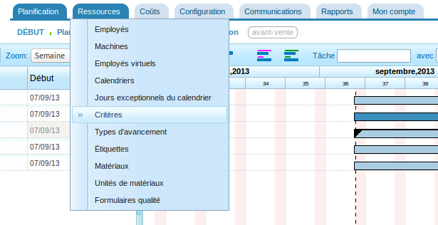
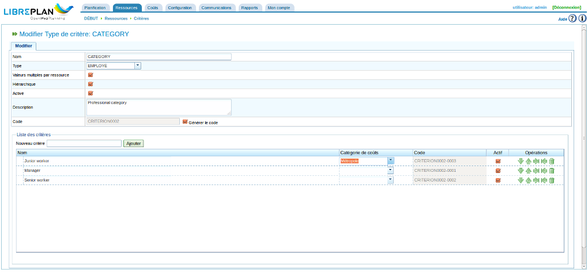

Critères
#########

.. contents::

Les critères sont des éléments qui sont utilisés pour catégoriser les ressources et les tâches. Les tâches nécessitent des critères et les ressources les satisfont. Voici un exemple d'utilisation des critères : une ressource est dotée du critère "soudeur" (c'est-à-dire que la ressource satisfait à la catégorie "soudeur") et une tâche nécessite le critère "soudeur" pour être menée à bien. Au résultat, quand les ressources sont affectées aux tâches, les employés dotés du critère "soudeur" sont utilisés lorsqu'on procède à une affectation générique (ce n'est pas applicable pour une affectation spécifique). Voir le chapitre concernant l'affectation des ressources pour en savoir plus sur les différentes sortes d'affectation.

Plusieurs opérations peuvent être réalisées à l'aide des critères :

* Administration des critères
* Affectation de critères à des ressources
* Affectation de critères à des tâches
* Filtrage d'entités selon les critères. Les tâches et les projets peuvent être filtrés selon des critères en vue de réaliser une opération.

Seule la première de ces opérations sera expliquée dans cette section. Les deux sortes d'affectations seront traitées ultérieurement, l'affectation de ressources dans le chapitre "gestion des ressources" et la fonction de filtrage dans le chapitre "planification des tâches".

Administration des critères
===========================
On accède à l'administration des critères depuis le menu *Ressources*, sous-menu *Critères* :

   Onglets du menu de premier niveau

.. figure:: images/lista-criterios.png
   :scale: 50

   Liste des critères

On accède au formulaire de création/modification en cliquant sur le bouton *Créer*. Un critère peut être modifié en cliquant sur l'icône de modification.

   Modifier un critère

Les opérations suivantes peuvent être réalisées en utilisant le formulaire de modification des critères montré dans l'image précédente :

* Modifier le nom du critère
* Indiquer le type du critère :

  * type générique : le critère peut être utilisé aussi bien pour les machines que pour les employés.
  * type employé : le critère ne peut être utilisé que pour les employés.
  * type machine : le critère ne peut être utilisé que pour les machines.

* Indiquer si, pour le type de critère sélectionné, plusieurs valeurs peuvent être affectées en même temps ou si on est limité à une seule. Par exemple, une ressource qui remplirait deux critères : soudeur et opérateur tourneur.
* Indiquer si le critère est hiérarchique ou non. Si c'est le cas, un critère affecté à un élément est également affecté aux sous-éléments. Un bon exemple est le critère de localisation: un employé auquel on attribue le critère de localisation ``Paris`` possédera automatiquement le critère de localisation ``France``. 
* Indiquer si le critère est activé ou ou pas. C'est de cette manière que l'on peut supprimer des critères. Étant donné qu'un critère ne peut pas être modifié une fois qu'il a été créé et qu'il est utilisé dans les données historisées, le critère doit rester dans le système. Il peut être désactivé pour éviter qu'il n'apparaisse dans les différents éléments de choix lors de nouvelles affectations.
* Décrire le critère
* Ajouter de nouvelles valeurs. Une entrée texte suivie du bouton *Ajouter* se trouve dans la seconde partie du formulaire.

Dans la liste qui suit, on peut :

* monter ou descendre un critère dans la liste des critères actuels avec les icônes flèches gauche et droite ou par drag'n'drop
* décaler le critère vers un niveau supérieur ou inférieur si le type de critère est hiérarchique à l'aide des icônes flèches avec barre droite et gauche ou par drag'n'drop.
* supprimer une valeur de critère de la liste.

Le formulaire de gestion des critères se comporte comme les formulaires dotés des 3 opérations (*enregistrer*, *enregistrer et continuer*, *fermer*) décrits dans l'introduction.

