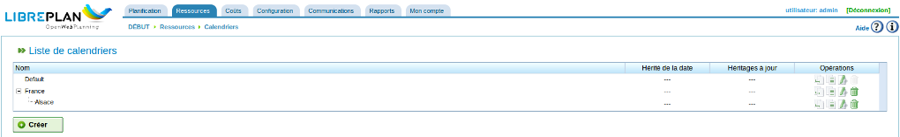
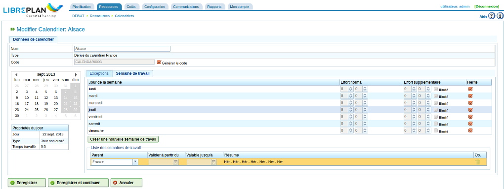
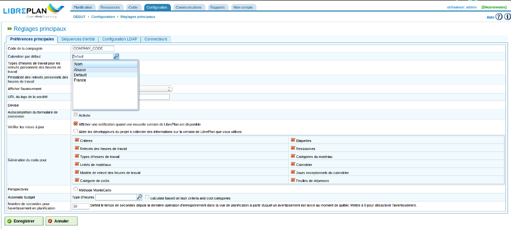
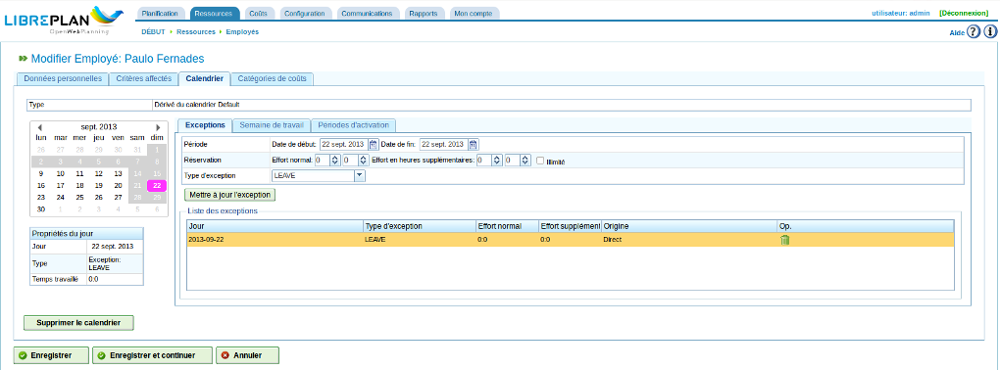
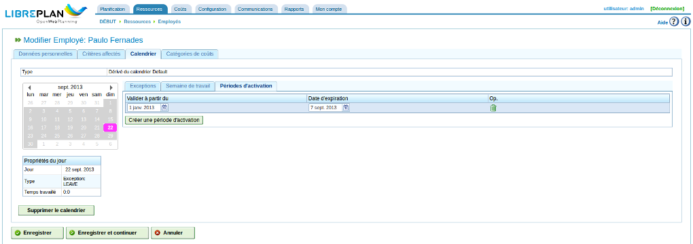

Calendriers
###########

.. contents::

Les calendriers sont des entités du programme qui définissent la capacité de charge des différentes ressources. Un calendrier comprend une série de jours de l'année, chaque jour étant divisé en heures de travail.

Par exemple, un jour férié peut avoir 0 heures de disponibles tandis que si le nombre d'heures de travail d'un jour ouvré est 8, ce sera ce nombre d'heures qui sera indiqué comme temps disponible pour ce jour-là.

Il existe deux façon d'informer le système du nombre d'heures disponibles pour un jour donné :

* Selon le jour de la semaine. Par exemple, le lundi, les gens travaillent généralement 8 heures.
* Selon des exceptions. Par exemple, 10 heures de travail le lundi 30 janvier.

Gestion des calendriers
=======================

Le système de calendrier est hiérarchique, ce qui signifie que des calendriers de base ou des calendriers basés sur eux peuvent être créés, par le biais d'une structure hiérarchique. Un calendrier basé sur un calendrier de plus haut niveau dans l'arborescence prendra en compte les attendus journaliers et les exceptions sauf s'ils ont été explicitement modifiés pour ce calendrier. Les concepts suivants doivent être compris pour gérer les calendriers :

* chaque jour est indépendant et chaque année possède des jours différents. Par exemple, si le 8 décembre 2009 est férié, ceci ne signifie pas qu'en 2010, le 8 décembre sera signalé a priori comme jour férié.
* les jours ouvrés sont basés sur les jours de la semaine. Par exemple, s'il est normal de travailler 8 heures le lundi, tous les lundis de toutes les semaines de toutes les années auront 8 heures de disponibles.
* des exceptions ou des périodes d'exception peuvent être indiquées. Par exemple, il est possible d'affecter un nombre d'heures disponibles différent de la règle générale pour ce jour de la semaine à un ou plusieurs jours particuliers.

   Gestion des calendriers

On peut accéder à la gestion des calendriers via le menu *Ressources*, sous-menu *Calendriers*. On peut alors :

1. Créer un nouveau calendrier à partir de zéro.
2. Créer un calendrier basé sur un autre.
3. Créer un calendrier copie d'un autre.
4. Modifier un calendrier existant.

Créer un nouveau calendrier
---------------------------

De façon à créer un nouveau calendrier, cliquer sur le bouton "Créer". Le système affiche alors un formulaire dans lequel on renseigne le nom de calendrier choisi puis on sélectionne l'onglet sur lequel on veut travailler :

* Exceptions : pour signaler des exceptions

   * Choisir un jour du calendrier (Date de début) soit en saisissant la date, soit en cliquant dans le calendrier à gauche
   * Choisir la date de fin de la période d'exception (qui peut être identique à celle de la date de début si l'exception ne dure qu'un seul jour).
   * Indiquer le nombre d'heures et minutes travaillés (Réservation / Effort normal)
   * Indiquer le nombre d'heures supplémentaires autorisé si la case à cocher *Illimitée* n'est pas cochée
   * Choisir le type d'exception. Les types disponibles sont : vacances, maladie, grève, jour férié, demi-journée de vacances, jour de travail et jour non travaillé (RESOURCE_HOLIDAY, LEAVE, STRIKE, BANK_HOLIDAY, HALF_DAY_HOLIDAY, WORKING_DAY et NOT_WORKING_DAY). Le type NO_EXCEPTION ne peut pas être choisi.
   * Enregistrer en cliquant sur *Créer une exception*. Le calendrier à gauche et la liste en dessous sont mis à jour.
   * Supprimer jour par jour des exceptions existantes depuis la liste en cliquant sur l'icône poubelle. Le calendrier à gauche et la liste sont mis à jour.

* *Semaine de travail* : pour choisir les heures travaillées par jour de la semaine

   * Indiquer les heures et minutes disponibles pour chaque jour de la semaine (lundi, mardi, mercredi, jeudi, vendredi, samedi et dimanche).
   * Indiquer les heures et minutes d'heures supplémentaires disponibles pour chaque jour de la semaine (lundi, mardi, mercredi, jeudi, vendredi, samedi et dimanche) si la case *Illimitée* n'est pas cochée.
   * Enregistrer en cliquant sur *Créer une nouvelle semaine de travail* : renseigner au moins, soit la date de début d'applicabilité, soit la date de fin d'applicabilité puis cliquer sur *Créer* (ou *Annuler* éventuellement). La plage apparaît alors dans la liste en dessous.
   * Modifier les dates d'applicabilité dans les champs date de la liste.
   * Supprimer des listes de distributions d'heures existantes depuis la liste en cliquant sur l'icône poubelle.

De cette façon, il est possible de personnaliser totalement les calendriers selon ses besoins. Il faut cliquer sur le bouton *Enregistrer* ou *Enregistrer et continuer* pour conserver les modifications faites dans le formulaire.

   Modifier des calendriers

.. figure:: images/calendar-exceptions.png
   :scale: 50

   Ajouter une exception aux calendriers

Créer des calendriers dérivés
-----------------------------

Un calendrier dérivé est un calendrier créé à partir d'un calendrier existant. Cela signifie qu'il possède toutes les caractéristiques d'un original, mais qu'il peut ensuite être modifié de façon à en adapter certaines.

Par exemple, il est possible de créer un calendrier de base pour la France puis un calendrier dérivé pour inclure les jours fériés spécifiques de l'Alsace en plus de ceux définis dans le calendrier de base.

Il est important de signaler que toute modification faite dans le calendrier originel sera immédiatement répercutée sur les calendriers dérivés sauf si ces calendriers dérivés définissent eux-mêmes des exceptions qui surchargent ces modifications. Admettons que le calendrier France possède un jour de travail de 8 heures le 29 mars 2013 alors que le calendrier Alsace (calendrier dérivé) n'a pas d'heures de travail ce jour là car c'est un jour férié. Si le calendrier France était modifié pour n'avoir plus que 4 heures tous les jours de la semaine du 25 au 29 mars 2013, le calendrier Alsace serait également modifié de sorte de n'avoir plus que 4 heures de disponibles par jour pour cette semaine, sauf pour le 29 mars qui n'aurait aucune heure de travail pour la raison expliquée plus haut.

.. figure:: images/calendar-create-derived.png
   :scale: 50

   Créer un calendrier dérivé

Pour créer un calendrier dérivé, il faut :

* Aller dans le menu *Ressources*
* Cliquer le sous-menu *Calendriers* 
* Choisir un des calendriers comme étant la base d'un calendrier dérivé et cliquer sur l'icône *Créer un calendrier dérivé* : s'affiche un formulaire de modification similaire à celui de création d'un calendrier sauf qu'il contient des exceptions et des heures par jour de la semaine identiques à ceux du calendrier originel.

Créer un calendrier par copie
-----------------------------

Un calendrier copié est un calendrier créé comme une copie exacte d'un autre calendrier existant. Il possède les mêmes données mais il est possible de les modifier ensuite.

La différence entre un calendrier copié et un calendrier dérivé tient aux modifications apportées à l'original. Si l'original est modifié, la copie n'est pas affectée. A l'inverse, les calendriers dérivés sont affectés par les modifications faites à l'original.

Pour créer un calendrier copié dans le programme, il faut faire ce qui suit :

* Aller dans le menu *Ressources*
* Cliquer le sous-menu *Calendriers* 
* Choisir un des calendriers à copier cliquer sur l'icône *Créer une copie* : s'affiche un formulaire de modification similaire à celui de création d'un calendrier sauf qu'il contient des exceptions et des heures par jour de la semaine identiques à ceux du calendrier copié.

Calendrier par défaut
---------------------

L'un des calendriers existants du système peut être défini comme le calendrier par défaut qui s'appliquera à toute entité faisant appel à des calendriers (ressources, projets et tâches).

Ce qui suit doit être fait pour configurer un calendrier par défaut :

* Aller au menu *Configuration*
* Cliquer sur le sous-menu *Réglages principaux*
* Renseigner le champ *Calendrier par défaut* en saisissant le nom du calendrier et en s'aidant de la liste déroulante qui apparaît (ou en la faisant apparaître en cliquant sur l'icône loupe).
* Cliquer sur *Enregistrer*.

   Créer un calendrier par défaut

Affecter un calendrier à des ressources
---------------------------------------

Les ressources ne peuvent être utilisées, c'est-à-dire disposer d'heures de travail disponibles, que si un calendrier activé sur la période considérée lui a été affecté. Si ce n'est pas fait explicitement, c'est le calendrier par défaut qui est affecté avec une période d'activation qui démarre à la création de la ressource et sans date d'expiration.

   Calendrier des ressources

Il reste cependant possible de supprimer le calendrier affecté par défaut et d'en choisir un autre, puis de le personnaliser totalement sous forme d'un calendrier dérivé.

Les étapes suivantes doivent être effectuées pour affecter un calendrier :

* Dans le menu *Ressources*, choisir le sous-menu correspondant à la ressource concernée (employés ou machines)
* Cliquer sur le nom de la ressource dans la liste ou cliquer sur l'icône Modifier.
* Choisir l'onglet "Calendrier"
* Un calendrier avec des onglets relatifs aux exceptions (onglet actif), à la semaine de travail et aux périodes d'activation va ensuite apparaître :

   * exceptions : choisir le type d'exception et une période à laquelle elle s'applique de façon à inclure des vacances, des jours fériés, des jours de travail différents, etc.
   * semaine de travail : modifier les heures travaillées durant les différents jours de la semaine (lundi, mardi, etc.).
   * périodes d'activation : créer de nouvelles périodes d'activation qui reflètent les dates de début et de fin des contrats associés aux ressources. Voir l'image suivante.

* Cliquer sur *Enregistrer* pour conserver les modifications.
* Cliquer sur *Supprimer le calendrier* pour changer le calendrier par défaut dont la ressource hérite. Apparaît alors la liste des calendriers disponibles. En choisir un et cliquer sur *Enregistrer*. 

   Affecter un nouveau calendrier à des ressources

Affecter des calendriers à des projets
--------------------------------------

Les projets peuvent avoir un calendrier différent du calendrier par défaut. Procéder comme suit :

   * Accéder à la liste des projets dans la vue globale de la compagnie.
   * Modifier le projet en question (en cliquant dessus ou sur l'icône Modifier).
   * Accéder à l'onglet *Informations générales*, zone "Configuration du calendrier" en haut à droite.
   * Choisir le calendrier à affecter via le menu déroulant "Calendrier".
   * Cliquer sur l'icône en forme de disquette pour enregistrer la modification.

Affecter des calendriers à des tâches
-------------------------------------

De la même façon que des calendriers peuvent être affectés à des ressources ou des projets, ils peuvent également être affectés à des tâches planifiées. Ceci permet de définir des calendriers spécifiques pour des étapes particulières d'un projet. Pour ce faire, il est nécessaire de :

   * Accéder à la planification d'un projet.
   * Faire un clic droit sur la tâche à laquelle un calendrier doit être affecté.
   * Choisir le menu "Affecter un calendrier".
   * Choisir le calendrier à affecter à la tâche.
   * Cliquer sur *Valider*.

