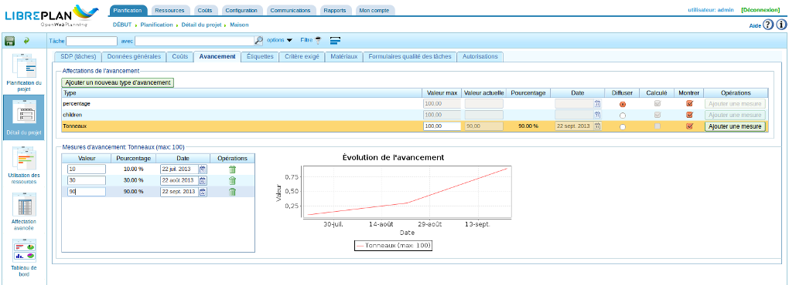
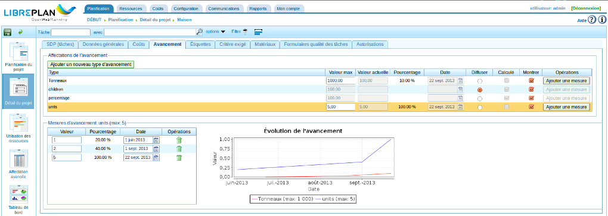

Avancement
##########

.. contents::

L'avancement d'un projet ou d'une tâche permet d'estimer la façon dont sera respectée la date d'achèvement estimée.

En général, l'avancement ne peut pas être mesuré automatiquement; le degré d'achèvement d'une tâche ou du projet pourra être déterminé en ayant recours à l'expertise d'un membre aguerri de l'équipe à l'aide d'une check-list.

Il faut noter qu'il existe une différence significative entre la consommation des heures affectées à une tâche ou un projet et le degré d'avancement de cette tâche ou de ce projet. Même si le nombre d'heures consommées peut correspondre peu ou prou à ce qu'il devrait être, le projet peut être en avance ou en retard par rapport au degré d'avancement prévu le jour où il est évalué. Plusieurs situations peuvent être rencontrées :

* Moins d'heures que prévu ont été consommées et, dans le même temps, le projet est en retard par rapport à ce qui avait été prévu parce que l'avancement est moindre que prévu au moment du contrôle.
* Moins d'heures que prévu ont été consommées et, dans le même temps, le projet est en avance par rapport à ce qui avait été prévu parce que l'avancement est supérieur aux estimations au moment du contrôle.
* Plus d'heures que prévu ont été consommées et, dans le même temps, le projet est en retard par rapport à ce qui avait été prévu au moment du contrôle.
* Plus d'heures que prévu ont été consommées et, dans le même temps, le projet est en avance par rapport à ce qui avait été prévu au moment du contrôle.

Il est possible de détecter ces situations à partir de la planification et des informations relatives à l'avancement et à la consommation effective des heures. Ce chapitre a pour objet d'expliquer la façon de saisir ces informations afin de pouvoir contrôler l'avancement d'un projet.

Le contrôle de l'avancement repose sur la façon dont les utilisateurs veulent procéder et jusqu'à quel niveau de détail ils veulent aller. Si les utilisateurs ne veulent contrôler que l'avancement global du projet, ils ne saisiront que les informations relatives aux tâches de premier niveau. S'ils veulent une surveillance plus fine tenant compte des relations entre les tâches, ils devront saisir des informations d'avancement de granularité plus fine, charge au système de remonter ces informations aux niveaux supérieurs.

Gérer les types d'avancement
============================

Toutes les compagnies ont des besoins différents au moment de surveiller l'avancement des projets, et plus encore quand il s'agit des tâches qui les composent. C'est la raison pour laquelle ont été introduits les "types d'avancement". Ils offrent la possibilité de mesurer l'avancement des tâches différentes façons. Par exemple, une tâche peut être mesurée en terme de pourcentage, mais dans le même temps, ce pourcentage d'avancement peut être converti en avancement en *tonnes* par rapport au poids sur lequel on s'est entendu avec le client.

Un type d'avancement reçoit un nom, une valeur maximum par défaut et une valeur de précision :

* Nom : c'est un nom significatif qui permet aux utilisateurs de faire leur choix en fonction de ce qu'ils veulent mesurer.
* Valeur maximum : c'est la valeur maximum d'avancement qui peut être affectée à une tâche ou un projet. Par exemple, en travaillant avec des *tonnes*, si le nombre maximal nominal de tonnes à produire est 4000, et qu'aucune tâche n'aura besoin de plus de 4000 tonnes d'un quelconque matériau, la valeur maximum sera fixée à 4000. 
* Valeur de précision : la valeur des incréments autorisés pour le type d'avancement à créer. Par exemple, si l'avancement en *tonnes* doit être mesuré en valeurs arrondies, la valeur de précision devra être fixée à 1. A partir de ce moment, seules des mesures d'avancement avec des nombres entiers pourront être saisies, par exemple 1, 2, 300, etc.

Il existe 3 types d'avancement par défaut:

* Pourcentage : un type d'avancement général qui permet de mesurer l'avancement d'un projet ou d'une tâche sur la base d'un pourcentage d'achèvement estimé. Par exemple, une tâche est complétée à 30% sur les 100% estimés pour un jour donné.
* Unité : un type d'avancement générique qui permet de mesurer l'avancement en unités sans avoir besoin de définir plus précisément ces unités. Par exemple, pour une tâche consistant à créer 3000 unités, l'avancement pourrait être de 500 unités sur un total de 3000.
* Sous-traitant : mesure fournie par un sous-traitant.

.. figure:: images/tipos-avances.png
   :scale: 50

   Gestion des types d'avancement

Il est possible de créer de nouveaux types d'avancement de la façon suivante :

* Cliquer sur le menu *Ressources*
* Cliquer sur le sous-menu *Types d'avancement* 
* La liste des types d'avancement s'affiche. Cliquer sur le nom du type d'avancement ou sur l'icône Modifier pour effectuer une modification ou cliquer sur le bouton *Créer* pour en créer un nouveau.
* Un formulaire contenant les informations suivantes apparaît :

  * Nom du type d'avancement.
  * Case à cocher ``Activé`` qui permet de supprimer un type d'avancement si elle est décochée. Dans ce cas Ce type n'apparaît plus dans les choix proposés.
  * Valeur maximum par défaut acceptée par le type d'avancement.
  * Valeur de précision pour le type d'avancement.
  * Une information non modifiable précisant s'il s'agit d'un avancement prédéfini par LibrePlan (predefined) ou créé par l'utilisateur (user). Seuls les seconds sont modifiables.
  * Une case à cocher indiquant que l'avancement doit figurer en pourcentages.

Saisir l'avancement à une date donnée
=====================================

Comme indiqué plus haut, les mesures d'avancement peuvent être saisies au niveau du projet ou des tâches. Le choix est de la responsabilité des utilisateurs.

Avant de s'occuper des mesures d'avancement, il faut d'abord associer le type d'avancement choisi avec le projet considéré. Par exemple, un avancement en pourcentage pour mesurer les progrès faits sur la tâche entière ou un taux d'avancement entériné avec le client si les mesures d'avancement entérinées avec le client doivent être saisies dans le futur.

   Écran de saisie de l'avancement avec visualisation d'un graphique.

Ce qui suit doit être fait pour saisir des mesures d'avancement :

* Pour un projet, cliquer sur le projet depuis la liste des projets : menu *Planification*, sous-menu *Projets*. Cliquer sur le projet puis sur l'onglet *Avancement*.
* Pour une tâche, faire un clic droit sur la tâche dans la perspective planification et choisir le sous-menu *Affecter un avancement*.

Ensuite, il faut :

* Si nécessaire, cliquer sur *Ajouter un nouveau type d'avancement*, choisir le type et adapter les réglages si nécessaire.
* Sélectionner l'avancement choisi dans le tableau s'il y en a plusieurs.
* Cliquer sur *Ajouter une mesure*
* Renseigner la valeur et modifier éventuellement la date.
* Le système enregistre automatiquement les données saisies.

Comparaison des avancement pour un projet
=========================================

Il est possible de comparer visuellement les différents types d'avancement d'un projet sur la base des mesures prises. Cliquer sur le projet concerné depuis la liste des projets : menu *Planification*, sous-menu *Projets*. Puis aller dans l'onglet *Avancement*.

Tous les types d'avancements associés sont affichés dans le tableau. En cochant la case "Montrer" correspondante, la courbe de ce type d'avancement apparaît sur le graphique.

   Comparaison de plusieurs types d'avancement.

