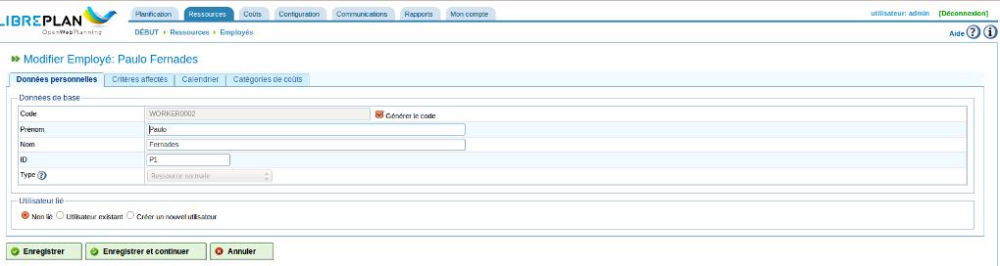
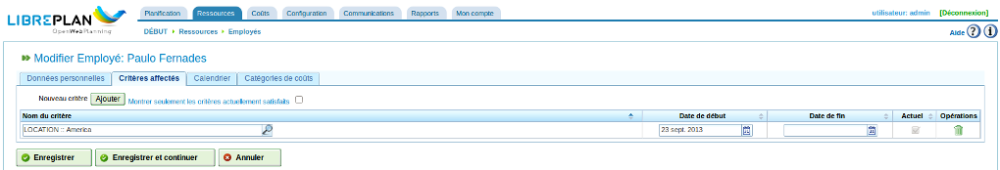
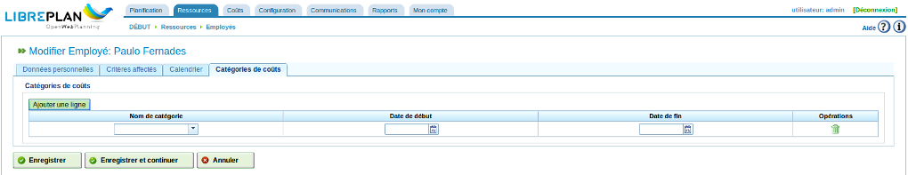
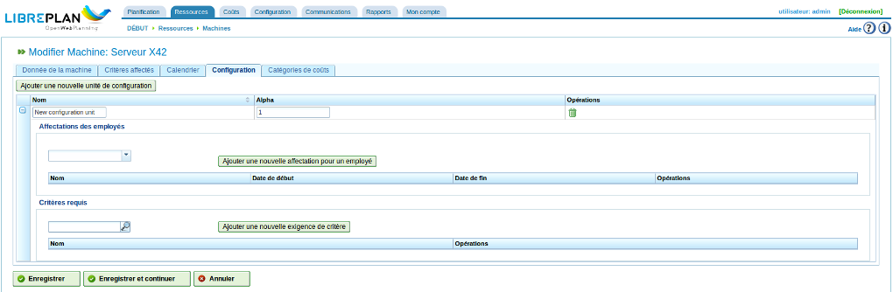
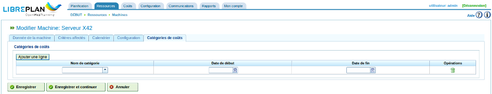
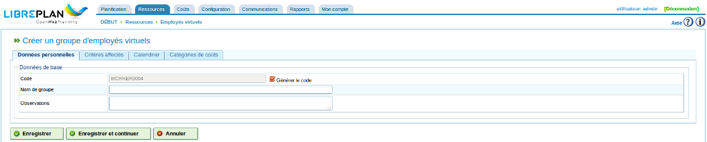

Gestion des ressources
#######################

.. _recursos:
.. contents::

Le programme gère deux types différents de ressources : les employés et les machines.

Les employés sont ceux de la compagnie qui réalisent des tâches. Leurs principales caractéristiques sont :

* Ils satisfont à un ou plusieurs critères génériques ou d'employés.
* Ils peuvent être spécifiquement affectés à une tâche.
* Ils peuvent être affectés, via une affectation générique, à une tâche qui requiert un critère de ressource qu'ils détiennent.
* Ils peuvent avoir un calendrier par défaut ou spécifique si nécessaire.

Les ressources machines sont les machines de l'entreprise. Leurs principales caractéristiques sont :

* Elles satisfont à un ou plusieurs critères génériques ou de machine.
* Elles peuvent être spécifiquement affectées à une tâche.
* Elles peuvent être affectées, via une affectation générique, à une tâche qui requiert un critère de machine qu'elles détiennent.
* Elles ont un calendrier par défaut ou spécifique si nécessaire.
* Elles sont dotées d'une valeur *alpha* configurable qui représente le ratio machine/employé à appliquer pour les mettre en oeuvre.

  * la valeur *alpha* représente le temps humain consommé pour faire fonctionner la machine. Par exemple, une valeur alpha de 0,5 signifie que 8 heures de fonctionnement de la machine nécessitent 4 heures du temps d'un employé.
  * il est possible d'affecter spécifiquement une valeur *alpha* à un employé, c'est-à-dire en sélectionnant l'employé qui sera affecté à la machine pour ce pourcentage de temps.
  * il est également possible d'effectuer une affectation générique via un critère, de telle façon que le pourcentage d'utilisation sera affecté à tout employé qui remplit le critère et est disponible. Cette affectation générique fonctionne de la même façon que l'affectation générique des tâches qui a déjà été expliquée.

Il est possible de créer, modifier et désactiver (jamais supprimer définitivement) des employés ou des machines en allant dans l'onglet "Ressources". Cet onglet possède les sous-menus suivants :

* Employés : affiche la liste des employés à partir de laquelle il est possible de les créer ou de les modifier.
* Machines : affiche la liste des machines à partir de laquelle il est possible de les créer ou de les modifier.

Gestion des employés
====================

La gestion des employés est réalisée en allant dans l'onglet "Ressources", sous-menus "Employés". Il est alors possible de modifier chaque employé en cliquant sur l'icône "Modifier" correspondante de la liste qui s'affiche alors.

Ceci fait, les onglets suivants sont accessibles :

1) Onglet *Données personnelles* de l'employé. Cet onglet permet de modifier les détails de base identifiant l'employé.

   * Code si la case à cocher "Générer le code" n'est pas activée
   * Prénom
   * Nom
   * Identifiant
   * Type de ressource (normale ou limitante) modifiable seulement lors de la création (voir la section correspondante).

Vient ensuite la possibilité de lier cet employé à un utilisateur existant ou à créer en modifiant les boutons radio.
Dans le premier cas, un filtre de recherche permettra d'identifier l'utilisateur concerné. Dans le second, il faudra saisir :

   * le nom d'utilisateur à créer
   * son mot de passe et la confirmation associée
   * l'adresse de messagerie associée.

   Modification des détails personnels de l'employé

2) Onglet *Critère d'affectation*. C'est là que les critères remplis par l'employé peuvent être affectés. Il est important que l'employé satisfasse vraiment les critères indiqués pour que le programme soit utilisé au mieux. Procéder comme suit pour affecter des critères :

   i. Cliquer sur le bouton "Ajouter un critère".

   ii. Chercher le critère à ajouter et choisir le plus approprié.

   iii. Choisir la date de début du critère à laquelle il devient applicable.

   iv. Choisir la date de fin d'applicabilité du critère. Cette date n'est pas obligatoire.

   v. Cliquer sur le bouton "Enregistrer et continuer".

Cliquer sur l'icône "Supprimer" (poubelle) pour supprimer l'affectation du critère correspondant.

La case à cocher permet de limiter l'affichage des critères à ceux qui sont actuellement détenus.

   Associer des critères à des employés

3) Onglet *Calendrier*. Cet onglet peut être utilisé pour configurer un calendrier spécifique à l'employé. Tous les employés ont un calendrier affecté par défaut; cependant, il est possible d'affecter un calendrier spécifique à chacun en dérivant un calendrier existant puis en apportant les modifications nécessaires.

.. figure:: images/worker-calendar.png
   :scale: 50

   Onglet calendrier pour une ressource

4) Onglet *Catégories de coût*. Cet onglet peut être utilisé pour configurer la catégorie de coût à laquelle un employé correspond à un moment donné. Ces informations sont utilisés ensuite pour calculer les coûts relatifs à un employé dans un projet.

   Onglet catégorie de coût pour une ressource

L'affectation de ressource est expliquée dans la section affectation des ressources.

Gestion des machines
====================

Les machines sont des ressources permettant de remplir tous types d'objectifs; de plus, comme pour les employés, les machines peuvent être gérées et affectées à des tâches. L'affectation de ressources est décrite dans la section affectation des ressources où les spécificités des machines sont expliquées.

Les machines sont gérées via l'entrée de menu "Ressources", sous-menu "Machines". S'affiche alors la liste des machines de la compagnie. À partir de cette liste, il est possible de créer, de modifier ou de supprimer une machine.

Quand on modifie des machines, s'affiche une série d'onglets qui peuvent être utilisés pour gérer différents aspects :

1) Onglet détails des machines. Cet onglet peut être utilisé pour modifier les détails d'identification des machines. Les détails qui peuvent être modifiés sur cet onglet sont :

   * Code de la machine si la case à cocher "Générer le code" n'est pas activée
   * Nom de la machine
   * Description de la machine
   * Type de ressource (normale ou limitante) modifiable seulement lors de la création (voir la section correspondante).

.. figure:: images/machine-data.png
   :scale: 50

   Modifier les détails de la machine

2) Onglet *Critères d'affectation*. Comme expliqué dans la section précédente relatives aux employés, cet onglet est utilisé pour ajouter des critères qui sont remplis par la machine. Il existe deux types de critères qui peuvent être affectés aux machines : machine ou générique. Les critères des employés ne peuvent pas être affectés aux machines. Procéder comme suit pour affecter des critères :

   i. Cliquer sur le bouton "Ajouter".

   ii. Chercher le critère à ajouter et choisir le plus approprié.

   iii. Choisir une date de début d'application du critère.

   iv. Choisir une date de fin d'application du critère. Cette date n'est pas obligatoire.

   v. Cliquer sur le bouton "Enregistrer et continuer".

Cliquer sur l'icône "Supprimer" (poubelle) pour supprimer l'affectation du critère correspondant.

La case à cocher permet de limiter l'affichage des critères à ceux qui sont actuellement détenus.

.. figure:: images/machine-criterions.png
   :scale: 50
   
   Affecter des critères aux machines

3) Onglet *Calendrier*. Cet onglet peut être utilisé pour affecter un calendrier spécifique à une ressource machine. Toutes les machines possèdent un calendrier par défaut; il est cependant possible d'affecter un calendrier spécifique à chacune en se basant sur un calendrier existant.

.. figure:: images/machine-calendar.png
   :scale: 50

   Affecter des calendriers à des machines

4) Onglet *Configuration*. Sur cet onglet, il est possible de configurer le ratio machine / employés. Une machine possède une valeur alpha qui indique le ratio machine/ressources impliquées. Comme cela a déjà été mentionné, une valeur alpha de 0,5 indique que 0,5 heures d'un employé sont utilisées pour chaque heure complète de fonctionnement d'une machine. Le système, en s'appuyant sur la valeur alpha, affecte automatiquement des employés qui sont en quelque sorte associés avec une machine une fois que celle-ci a été affectée à une tâche. Associer un employé à une machine peut être fait de 2 façons :

   i. en affectant spécifiquement une plage de dates durant lesquelles un employé est affecté à cette machine. C'est une affectation spécifique qui fait que le système affecte automatiquement des heures à l'employé quand l'utilisation de la machine est planifiée.

   ii. en affectant spécifiquement des critères à remplir par les employés qui sont affectés aux machines. Ceci permet une affectation générique d'employés qui satisfont aux critères.

   Configuration des machines

5) Onglet *Catégories de coût*. Cet onglet peut être utilisé pour configurer la catégorie de coûts à laquelle correspond la machine à un moment donné. Ces détails sont utilisés ensuite pour calculer les coûts liés à une machine dans un projet.

   Affecter des catégories de coûts à des machines

Groupes d'employés virtuels
===========================

Le programme permet de créer des ressources qui ne sont pas des employés réels mais des groupes d'employés virtuels qui permettent aux capacités de production d'être accrues à un moment donné en fonction des réglages effectués dans le calendrier.

Via ces groupes d'employés virtuels, il est possible de contrôler comment la planification du projet serait affectée en embauchant et en affectant des personnes qui remplissent les critères définis, facilitant ainsi le processus de prise de décision.

Les onglets pour créer des groupes d'employés virtuels sont accessibles via l'onglet *Ressources*, sous-menu *Groupes d'employés virtuels* et sont les mêmes que ceux utilisés pour configurer les employés :

   * Données personnelles
   * Critères d'affectation
   * Calendrier
   * Catégories de coût

Les différences par rapport aux employés sont que : 

   * dans l'onglet *Données personnelles*, les groupes d'employés virtuels n'ont que les champs ``code`` et ``nom de groupe`` auxquels est ajouté un champ ``observations`` dans lequel des informations additionnelles peuvent être fournies, comme par exemple, le projet qui a besoin de faire appel à ce groupe d'employés virtuels.
   * dans l'onglet *Calendrier*, un champ capacité (valant 1 par défaut) qui fait référence au nombre de personnes dans le groupe. 

   Ressources virtuelles

Ressources limitantes
=====================

Les ressources limitantes sont un type spécifique de ressources qui ne peuvent être à un moment donné que dans deux états possibles : non affectées ou affectées à 100%. Autrement dit, les ressources limitantes ne peuvent pas être affectées à plus d'une tâche au même moment ni être sur-affectées.

Pour chaque ressource limitante, une file est automatiquement créée de telle façon que les tâches qui ont été programmées peuvent être gérées d'une manière spécifique en utilisant les méthodes d'affectation fournies, en créant des affectations automatiques aux tâches depuis ces files conformément aux critères indiqués ou en déplaçant des tâches entre les files.

Le caractère limitant d'une ressource est indiqué lors de sa création.
