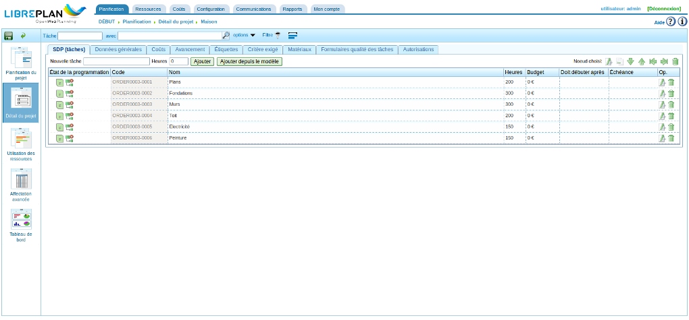
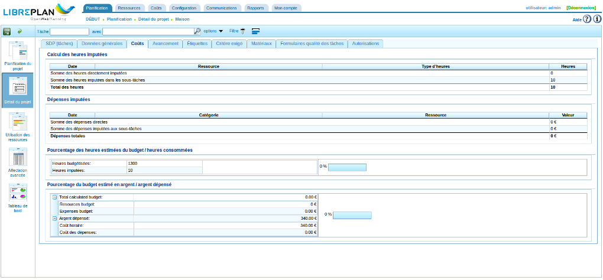
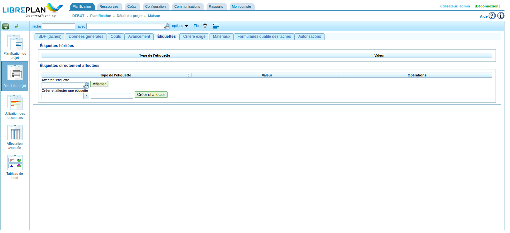
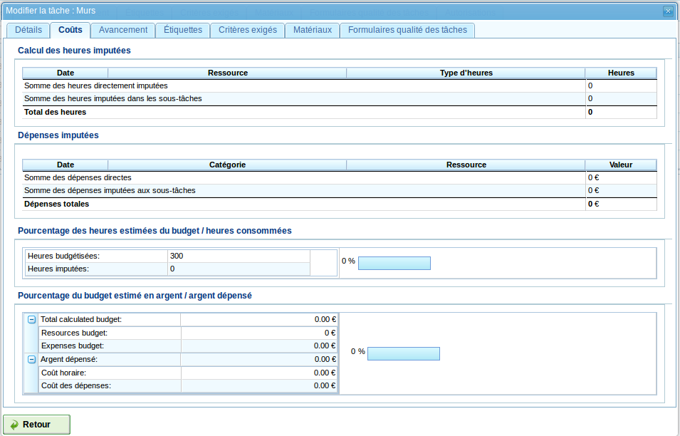
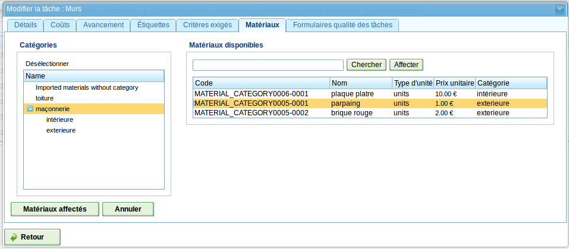
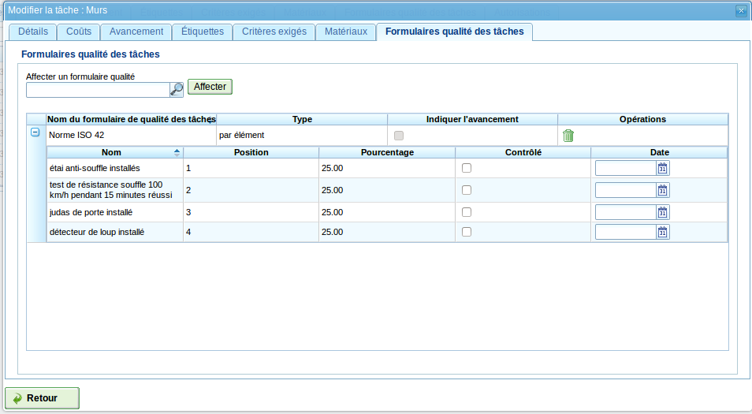

Projets et tâches
#################

.. contents::

Les projets décrivent le travail à mener par les utilisateurs. 
Chaque projet est une prestation délivrée par la compagnie à un client (qui peut être elle-même).

Un projet comporte une ou plusieurs tâches. Chaque tâche s'inscrit dans une planification de projet. Les tâches sont organisées de manière hiérarchique sans aucune limitation de profondeur. Le fait que les tâches soient organisées hiérarchiquement explique le comportement par héritage de plusieurs fonctionnalités telles que les étiquettes.

Les sections suivantes vont décrire les opérations que les utilisateurs peuvent effectuer sur les projets et les tâches.

Projet
======

Un projet est un travail qu'un client demande à une compagnie. Pour identifier ce projet au sein de la compagnie, on n'a besoin que de quelques informations :

* Nom du projet
* Code du projet
* Montant total du projet 
* Date estimée de début
* Date de fin
* Personne responsable
* Description
* Calendrier affecté
* Génération automatique de code. Un champ utilisé pour indiquer au système de générer automatiquement les codes des tâches et des groupes horaires.
* Préférence entre les dépendances et les restrictions. Les utilisateurs peuvent décider si ce sont les dépendances ou les restrictions qui seront prises en compte en priorité en cas de conflit.

Cependant, les vrais projets réels nécessitent d'autres entités pour être complets :

* Heures affectées au projet 
* Avancement attribué au projet
* Étiquettes
* Critères affectés au projet
* Matériaux
* Formulaires qualité

Modifier ou créer un projet peut être réalisé à partir de différents endroits du programme :

* À partir de la "liste des projets" dans la vue globale de la compagnie.

  * Cliquer sur le nom du projet ou sur l'icône de modification correspondante pour modifier un projet.
  * Cliquer sur l'icône "Créer un nouveau projet" en haut à gauche pour créer un nouveau projet. 

* À partir d'un projet dans le diagramme de Gantt et en allant dans la vue des détails du projet.

Ceci fait, on dispose alors de plusieurs onglets :

* *SDP (tâches)* : il s'agit de la liste arborescente des tâches du projet à partir de laquelle on peut : 

  * Créer ou modifier une tâche.
  * Remonter une tâche dans la hiérarchie d'un rang. 
  * Descendre une tâche dans la hiérarchie d'un rang.
  * Indenter une tâche, ce qui est la même chose que de la descendre d'un niveau dans la hiérarchie.
  * Désindenter une tâche, ce qui est la même chose que de le monter d'un niveau dans la hiérarchie.
  * Filtrer les tâches.
  * Supprimer des tâches.
  * Déplacer en rang ou en niveau une tâche dans la hiérarchie par drag'n'drop (glisser-déposer).
  * Créer un modèle de tâche à partir d'une tâche.

   Liste des tâches du projet

* *Données générales* : permet de modifier les détails du projet. Actuellement, il s'agit de :

  * Nom
  * Code
  * Responsable
  * Description
  * État
  * Client et référence
  * Date de début
  * Échéance
  * Calendrier
  * Mode de planification : vers l'avant (depuis la date de début) ou à rebours (depuis la date d'échéance)
  * Choix donnant la priorité aux dépendances durant la planification
  * Le budget alloué au travail et aux matériaux

.. figure:: images/order-edition.png
   :scale: 50

   Modification du projet

* *Coûts* : écran qui présente les heures et les coûts imputés groupés par ressource et par type et les compare aux prévisions.

   Coûts constatés du projet

* *Avancement* : un écran où il est possible d'affecter des types d'avancement et de saisir des mesures d'avancements pour le projet. Voir la section "Avancement" pour voir comment cela fonctionne.

* Étiquettes. Un écran où l'on peut affecter des étiquettes à un projet et identifier des étiquettes affectées précédemment de manière directe ou indirecte. Voir la section suivante relative à la modification des tâches pour une description en détail de la façon de procéder pour gérer ces étiquettes.

   Étiquettes du projet

* *Critères* : écran dans lequel il est possible d'affecter des critères à l'ensemble des tâches du projet. Ces critères vont s'appliquer automatiquement à toutes les tâches, à l'exception de celles où ils sont explicitement invalidés. Les heures des tâches, regroupées par critère, sont également affichées, ce qui permet d'identifier les critères requis pour un projet.

.. figure:: images/order-criterions.png
   :scale: 50

   Critères du projet

* *Matériaux* : écran où il est possible d'indiquer les matériaux nécessaires au projet. Ces matériaux peuvent être choisis dans les catégories de matériaux disponibles. Les matériaux sont gérés de la façon suivante :

   * Sélectionner un matériau dans la liste affichée à droite. 
   * Pour retrouver plus facilement un matériel, on peut restreindre la liste à une catégorie à l'aide de l'arborescence de gauche. On peut aussi saisir une partie du nom dans le champ texte puis cliquer sur *Chercher*. La recherche se fera sur la catégorie sélectionnée.
   * Il est possible de sélectionner plusieurs matériaux en une fois en appuyant sur la touche "Ctrl" (Contrôle).
   * Cliquer ensuite sur *Affecter*.
   * Le système affiche alors la liste des matériaux qui ont déjà été affectés au projet. Dans l'écran précédent, cliquer sur *Annuler* pour arriver directement à cette liste.
   * Dans la liste des matériaux affectés, on peut alors indiquer la date de réception, le nombre d'unités et le prix unitaire.
   * Si un même matériau possède des lots ayant des caractéristiques différentes (livraison partielle par exemple), on peut cliquer sur "Différencier" pour créer deux lignes permettant de prendre en compte ces différences.
   * Cliquer sur *Ajouter des matériaux* pour revenir à l'écran précédent.

.. figure:: images/order-material.png
   :scale: 50

   Matériaux associés au projet

* Formulaires qualité de tâche : écran qui permet d'affecter un formulaire qualité au projet, lequel devra ensuite être complété pour s'assurer que certaines activités associées au projet ont été réalisées. Voir la section suivante relative à la modification des tâches pour la façon de gérer ces formulaires qualité.

.. figure:: images/order-quality.png
   :scale: 50

   Formulaires qualité associés au projet

* *Autorisations* : écran qui permet d'affecter des droits en lecture et/ou écriture aux utilisateurs et aux profils.

Modifier les tâches
===================

La modification des tâches est réalisé à partir de l'onglet "SDP (tâches)" en cliquant sur l'icône de modification correspondant à la tâche, ou en double-cliquant sur la tâche. S'affiche alors un nouvel écran comportant plusieurs onglets à partir desquels on peut effectuer les actions suivantes :

* Modifier les informations concernant la tâche.
* Voir les coûts associés à la tâche.
* Gérer l'avancement de la tâche.
* Gérer les étiquettes de la tâche.
* Gérer les critères requis par la tâche et les groupes d'heures.
* Gérer les matériaux requis par la tâche.
* Gérer les formulaires qualité.

Les sous-sections suivantes décrivent chacune de ces opérations en détail.

Modifier les informations concernant la tâche
---------------------------------------------

L'onglet *Détails* permet de modifier les informations concernant la tâche :

* Nom de la tâche
* Code de la tâche (lecture seule)
* Date de début de la tâche
* Date d'échéance
* Description
* Budget pour la tâche

.. figure:: images/order-element-edition.png
   :scale: 50

   Modifier une tâche

Voir les coûts affectés à la tâche
----------------------------------

L'onglet "Coûts" permet de consulter les heures et les coûts dépensées pour la tâche, directement ou indirectement, par groupe et ressource et de les comparer aux prévisions.

   Coûts d'une tâche

L'écran est divisé en deux parties :

* Calcul des heures et des dépenses imputées regroupées respectivement par ressource et type d'heures d'une part et par catégorie et par ressource d'autre part.
* Utilisation par rapport aux estimations : heures consommées par rapport aux heures budgétisées d'une part, et dépenses par rapport au budget financier d'autre part. On trouve également le coût horaire et le coût des dépenses. Ces informations sont également présentées sous forme de pourcentages. 

Gérer l'avancement des tâches
-----------------------------

La saisie des types d'avancement et la gestion des avancements des tâches a été décrit dans le chapitre "Avancement".

Gérer les étiquettes des projets
--------------------------------

Les étiquettes, telles que décrites dans le chapitre sur les étiquettes, permettent de catégoriser les tâches. Ainsi, elles permettent de regrouper des informations de planification ou de projet.

Il est possible d'affecter des étiquettes à une tâche, soit directement, soit par héritage en les affectant à une tâche de plus haut niveau. Une fois cette affectation réalisée à l'aide de l'une ou l'autre de ces méthodes, la tâches et ses sous-tâches sont associées à cette étiquette qui peut alors être utilisée pour tout filtrage ultérieur.

.. figure:: images/order-element-tags.png
   :scale: 50

   Affecter des étiquettes à une tâche

Comme on peut le voir dans l'image, il est possible de réaliser les actions suivantes dans l'onglet **étiquettes** :

* Voir la liste des étiquettes affectées à la tâche par héritage d'une tâche de plus haut niveau. Toute tâche associée à une tâche de plus haut niveau hérite des étiquettes de cette dernière.
* Voir la liste des étiquettes affectée directement à la tâche via le formulaire situé juste en dessous. Ces étiquettes seront également affectées aux tâches de niveaux inférieurs.
* Affecter des étiquettes existantes : il est possible d'affecter des étiquettes en en cherchant une parmi celles qui sont disponibles dans le formulaire qui est sous la liste des étiquettes affectées directement. Pour chercher une étiquette, cliquer sur l'icône loupe ou écrire les premières lettres du nom de l'étiquette dans le champ texte, les valeurs possibles vont alors être affichées. Une fois choisie, cliquer sur *Affecter*.
* Créer et affecter de nouvelles étiquettes : il est également possible de créer de nouvelles étiquettes associées avec un type existant d'étiquettes à partir de ce formulaire. On commence par choisir un type d'étiquette à associer, puis il faut entrer le nom de l'étiquette à créer. Quand on clique sur *Créer et affecter*, l'étiquette est automatiquement créée et associée à la tâche.
* Supprimer une étiquette affectée directement en cliquant sur l'icône *supprimer* (poubelle) de la ligne correspondante.

Gérer les critères requis pour les tâches et les groupes d'heures
-----------------------------------------------------------------

Les projets et les tâches peuvent de la même façon se voir affecter des critères à remplir afin qu'ils puissent être menés à bien. Les critères peuvent être directs ou indirects :

* Critères directs : ceux-ci sont affectés directement à la tâche. Ce sont des critères qui sont requis par les groupes d'heures de la tâche.
* Critères indirects : ceux-là sont affectés sur les tâches de plus haut niveau. La tâche que l'on modifie en hérite.

Il est alors possible :

* d'ajouter un critère direct à la tâche entière en cliquant sur le bouton *Ajouter*. Choisir alors le critère dans la liste qui apparaît.
* de supprimer un critère direct en cliquant sur l'icône ``Supprimer`` présente à la fin de la ligne correspondante.
* d'invalider un critère hérité en cliquant sur le bouton *Invalider*
* de valider à nouveau un critère hérité précédemment invalidé en cliquant sur le bouton *Valider*

Se trouve ensuite le total des heures de la tâche. Ces heures peuvent être calculées à partir des groupes d'heures ajoutés ou saisies directement dans ce champ. Dans ce cas, les heures seront distribuées entre les groupes d'heures existant et, si les pourcentages ne coïncident pas, un nouveau groupe d'heures sera créé.

Enfin, il est possible, si la tâche ne possède pas de sous-tâches, de définir un ou plusieurs groupes d'heures faisant partie de la tâche. Ces groupes d'heures doivent être renseignés pour permettre une affectation générique. Si la tâche possède des sous-tâches, il ne sera possible que de consulter les informations relatives aux heures et aux groupes d'heures. À l'inverse, si la tâche n'a pas de sous-tâche, on procède comme suit :

* Par défaut, un groupe d'heures associé à la tâche est créé automatiquement en même temps que la tâche. Ce groupe d'heures possède les caractéristiques modifiables suivantes :

   * Code pour le groupe d'heures s'il n'a pas été automatiquement généré.
   * Type de critère. Les utilisateurs peuvent choisir d'affecter un critère de machine ou d'employé.
   * Nombre d'heures dans le groupe d'heures si la case "% fixe" n'est pas cochée. La sommes des heures des différents groupes est répercutée dans le champ *Total des heures de la tâche*.
   * Pourcentage d'heures du groupe d'heures par rapport au total des heures de la tâche si la case "% fixe" est cochée.
   * Choix d'une saisie en pourcentage (cochée) ou en nombre d'heures (non cochée, état par défaut). 
   * Liste des critères à appliquer au groupe d'heures. Pour ajouter un nouveau critère, cliquer sur "Ajouter un critère" et en choisir un à partir du moteur de recherche qui apparaît alors. Ce critère pourra être supprimé en cliquant sur l'icône 'Supprimer' (poubelle) situé en fin de ligne. Le critère aura le type 'Direct'.
   * Liste des exceptions à appliquer au groupe d'heures. Pour ajouter une nouvelle exception, cliquer sur "Ajouter une exception" et en choisir une à partir du moteur de recherche qui apparaît alors. Ce critère pourra être supprimé en cliquant sur l'icône 'Supprimer' (poubelle) situé en fin de ligne. L'exception aura le type 'Exception héritée'.

* Il est possible d'ajouter d'autres groupes d'heures différents les uns des autres. Ceci peut être utile, par exemple, pour une tâche de 70 heures nécessitant 30h de travail d'un soudeur et 40h d'un peintre.

.. figure:: images/order-element-criterion.png
   :scale: 50

   Affecter des critères à la tâche

Gérer les matériaux
-------------------

Les matériaux sont gérés sous forme d'une liste associée à chaque tâche du projet ou globalement au projet en général. Les matériaux comportent les caractéristiques suivantes :

* Code
* Date de réception
* Nom
* Nombre d'unités requis (nombre ou quantité selon le type d'unité)
* Type d'unité : le type d'unité utilisée pour mesurer le matériau
* Prix unitaire
* Prix total : le prix est calculé en multipliant le prix unitaire par le nombre d'unités
* Unités: unités requises
* État : reçu, commandé, en attente, en cours, annulé
* Catégorie : la catégorie à laquelle le matériau appartient.

Travailler avec les matériaux se fait de la façon suivante :

* Choisir l'onglet "Matériaux" d'une tâche.
* Apparaît alors le formulaire de recherche des matériaux avec la liste des catégories à gauche et celle des matériaux à droite. 

   Recherche d'un matériau

* Choisir une catégorie pour affiner les recherches de matériaux.
* On peut aussi saisir le début du nom du matériau dans le champ texte puis cliquer sur le bouton *Chercher*. 
* Sélectionner un ou plusieurs matériaux (via la touche CTRL)
* Cliquer sur *Affecter*.

.. figure:: images/order-element-material-assign.png
   :scale: 50

   Affecter des matériaux à la tâche

* Renseigner alors la date de réception éventuelle, la quantité, le prix unitaire et l'état.

Pour le suivi ultérieur des matériaux, il est possible de ne modifier l'état que d'une partie du matériel reçu. Procéder comme suit :

* Cliquer sur le bouton "Répartir" dans la liste des matériaux à droite de chaque ligne.
* Choisir le nombre d'unités qu'on veut traiter de manière différenciée.
* On a maintenant deux lignes pour le matériau en question.
* Modifier l'état de la ligne qui vient d'être ajoutée.

L'avantage d'utiliser cet outil de répartition est la possibilité de recevoir des livraisons partielles de matériau sans devoir attendre de tout recevoir pour l'indiquer. Ceci permet d'exécuter des tâches qui n'auraient pas besoin de la totalité du matériel commandé.

Gérer les formulaires qualité
-----------------------------

Pour certaines tâches, il peut s'avérer nécessaire de devoir procéder à certaines vérifications avant de pouvoir les déclarer comme étant terminées. C'est la raison d'être des formulaires qualités qui sont en fait des listes de questions auxquelles on doit répondre positivement pour pouvoir déclarer les tâches associées comme étant terminées.

Avant de pouvoir affecter un formulaire qualité à une tâche, il faut le créer en utilisant le menu *Ressources*, sous-menu *Formulaires qualité*. Ceci ne peut pas être fait en même temps que l'affectation à la tâche.

Pour gérer des formulaires de qualité :

* Aller dans l'onglet "Formulaires qualité des tâches" de la tâche considérée.

   Affecter des formulaires qualité à une tâche

* Il existe deux types de formulaires qualité : par élément ou en pourcentage.

   * Élément : chaque élément est indépendant.
   * Pourcentage : chaque question augmente l'avancement de la tâche d'un certain pourcentage pour finir par une question ayant 100% comme pourcentage, signalant que la tâche est achevée.

* Utiliser le formulaire de recherche pour chercher le formulaire qualité souhaité, si besoin en saisissant le début de son nom.
* Une fois le formulaire sélectionné, cliquer sur *Affecter*.
* Le formulaire apparaît dans la liste affichée en dessous.
* Cliquer sur l'icône ``plus`` au début de la ligne pour afficher les questions du formulaire.
* Renseigner alors au fur et à mesure les lignes réalisées :
   * Si le formulaire qualité est basé sur les pourcentages, les questions sont posées dans l'ordre. Cocher la case ``Contrôlé`` et renseigner la date. La ligne suivante devient accessible.
   * Si le formulaire qualité est basé sur les éléments, on peut répondre aux questions dans n'importe quel ordre. Cocher la case ``Contrôlé`` et renseigner la date. 

Pour supprimer un formulaire qualité, cliquer sur l'icône poubelle en fin de ligne correspondante.

