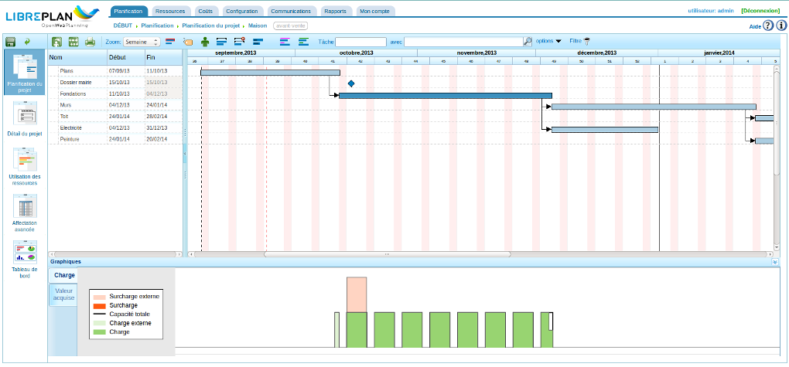
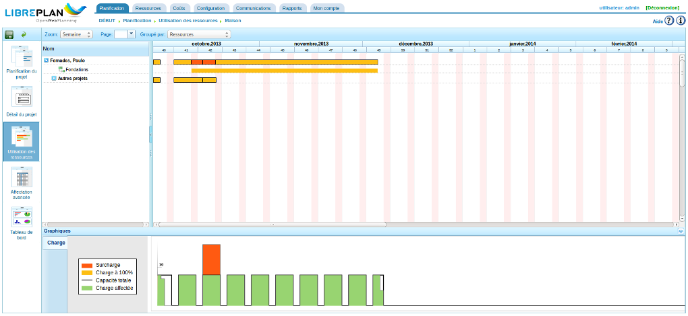

Planification des tâches
########################

.. _planificacion:
.. contents::

Planification des tâches
========================

La planification dans "LibrePlan" est un processus qui a été décrit dans tous les chapitres de ce guide utilisateur, les chapitres sur les projets et l'affectation de ressources étant particulièrement importants à cet égard. Ce chapitre décrit les procédures de base de la planification une fois les projets et les diagrammes de Gantt correctement configurés.

   Vue de planification d'un projet

Comme pour la vue globale de la compagnie, la vue de planification de projet est divisée en plusieurs perspectives selon l'information analysée. Les perspectives pour un projet donné sont :

* planification du projet
* détail du projet
* utilisation des ressources
* affectation avancée
* tableau de bord

La perspective planification
----------------------------
La perspective de planification comporte trois parties différentes :

* La planification projet proprement dite. Présente dans la partie supérieure, c'est la plus grande. Elle représente la planification sous forme d'un diagramme de Gantt. Pour chaque ligne figure dans la partie gauche une ligne correspondante avec le nom de la tâche et ses dates de début et d'échéance. C'est ici qu'on pourra déplacer des tâches, créer des dépendances entre elles, définir des jalons et établir des restrictions.

* Le graphique d'utilisation des ressources (onglet *Charge* affiché par défaut). C'est l'image dans la partie inférieure droite qui montre la disponibilité des ressources en fonction de leurs éventuelles affectations à des tâches. Les informations affichées sont les suivantes :

   * Zone violette : indique une charge de ressource inférieure à 100% de ses capacités.
   * Zone verte    : indique une charge de ressource inférieure à 100% en tenant compte des affectations planifiées à des tâches d'autres projets
   * Zone orange   : indique une charge de ressource supérieure à 100% du fait des affectations planifiées à des tâches de ce projet.
   * Zone rouge    : indique une charge de ressource supérieure à 100% du fait d'autres projets.

* Le graphique *Valeur acquise*. Il présente les courbes de différents indicateurs qui peuvent être consultés en cliquant sur l'onglet "Valeur gagnée". Le graphe généré est basé sur la méthode de la valeur acquise (*Earned Value*) et ses indicateurs qui sont calculés pour chaque jour travaillé du projet. Les indicateurs calculés pour une date donnée (la date du jour par défaut) modifiable en partie gauche sont :

   * BCWS (Budgeted Cost Work Scheduled ou CBTP: Coût Budgétisé du Travail Planifié) : fonction cumulative du temps pour le nombre d'heures planifiées jusqu'à une certaine date. Il vaudra 0 au début planifié de la tâche et le nombre total d'heures planifiées à la fin. Comme avec toutes les graphiques cumulatifs, il augmentera toujours. La fonction associée effectue la somme des affectations journalières aux tâches jusqu'au jour du calcul. La fonction possède tout le temps des valeurs du moment que des ressources ont été affectées.
   * ACWP (Actual Cost Work Performed ou CRTE : Coût Réel du Travail Effectué) : fonction cumulative du temps pour les heures attribuées aux travaux jusqu'à une certaine date. Cette fonction aura une valeur nulle avant la date du premier rapport de travail de tâche et ses valeurs continueront à augmenter au fur et à mesure que le temps passe et que des heures de rapport de travail sont ajoutées. Elle n'aura pas de valeur après la date du dernier rapport de travail.
   * BCWP (Budget Cost Work Performed ou Earned Value ou Valeur acquise ou CBTE : Coût Budgétisé du Travail Effectué) : fonction cumulative du temps qui inclut la valeur résultat obtenue en multipliant l'avancement de la tâche par le volume de travail estimé pour achever cette tâche. Les valeurs de cette fonction augmentent au fur et à mesure que le temps passe. Les valeurs d'avancement augmentent aussi. L'avancement est multiplié par le nombre total d'heures estimées pour toutes les tâches. La valeur BCWP est la somme des valeurs des tâches qui sont calculées. L'avancement est totalisé quand il est indiqué.
   * CV (Cost Variation ou VC : variation de coût) : CV = BCWP - ACWP ou VC = CBTE - CRTE
   * SV (Schedule Variation ou VP : variation de prévision) : SV = BCWP - BCWS ou VP = CBTE - CBTP
   * BAC (Budget at completion  ou BAA : Budget à l'achèvement) : BAC = max (BCWS) ou BAA = max (CBTP)
   * EAC (Estimate at completion, EAA : estimation à l'achèvement) : EAC = (ACWP/ BCWP) * BAC ou EAA = (CRTE/CBTE) * BAA
   * VAC (Variance at completion, VAA : variance à l'achèvement) : VAC = BAC - EAC ou VAA = BAA - EAA
   * ETC (Estimate to complete, EPA : estimation pour achèvement) : ETC = EAC - ACWP ou EPA = EAA - CRTE
   * CPI (Cost performance Index, ICP : indicateur coût performance, "ce que nous avons fait / ce que nous avons dépensé") : CPI = BCWP / ACWP ou ICP = CBTE / CRTE
   * SPI (Schedule performance Index, IPP : indicateur de performance par rapport aux prévisions, "ce que nous avons fait / ce que nous aurions du faire à cette date") : SPI = BCWP / BCWS ou IPP = CBTE / CBTP

Dans cette perspective *Planification de projet*, on peut réaliser les opérations suivantes :

   * Affecter une dépendance à une tâche. Faire un clic droit sur la tâche et choisir "Ajouter une dépendance" puis tirer le curseur vers la tâche qui doit dépendre de la tâche sur laquelle on a cliqué.
   * Faire un clic droit sur une dépendance (le curseur prend la forme d'une croix au moment du survol) permet de :

      * supprimer la dépendance
      * ajuster le début de la tâche dépendante sur la fin de la tâche dont elle dépend
      * changer la valeur de début de la tâche dépendante pour qu'elle soit la même que celle de la tâche dont elle dépend
      * faire correspondre les achèvements des deux tâches

   * Créer un nouveau jalon. Faire un clic droit sur la tâche positionnée avant le jalon à créer puis choisir le menu "Ajouter un jalon". 
   * Déplacer des tâches (ou des jalons) sans modifier les dépendances. Faire un clic droit sur le corps de la tâche et tirez la à la position désirée. Si aucune restriction ou dépendance n'a été perturbée, le système va mettre à jour l'affectation journalière des ressources de la tâche et placer la tâche à la date choisie.
   * Affecter une contrainte à la tâche. Cliquer sur la tâche concernée et choisir l'option "Propriétés de la tâche". Dans la fenêtre qui apparaît se trouve une liste déroulante "Contrainte" qui peut être modifiée. Les contraintes peuvent entrer en conflit avec les dépendances, c'est pourquoi il existe une option de configuration des projets permettant d'indiquer qui des dépendances ou des contraintes aura priorité en cas de conflit. Les types de contrainte proposés sont :

      * *démarre dès que possible* 
      * *ne démarre pas avant le* : indique que la tâche ne doit pas démarrer avant la date qu'il faut indiquer dans le champ date qui apparaît alors.
      * *démarre le* : indique que la tâche doit démarrer à la date qu'il faut indiquer dans le champ date qui apparaît alors.
      * *démarre aussi tard que possible*
      * *ne finit pas plus tard que le* : indique que la tâche ne doit pas finir après la date qu'il faut indiquer dans le champs date qui apparaît.

La perspective offre également plusieurs options de visualisation :

* Niveau de zoom : permet de choisir le niveau de zoom dont on a besoin : année, trimestre, mois, semaine et jour.
* Filtres de recherche : les utilisateurs peuvent filtrer les tâches en se basant sur :

   * une partie de son nom à saisir dans le champ texte *Tâche*,  
   * des critères ou des étiquettes séparés par des points virgules ou sélectionnés au fur et à mesure à l'aide l'outil de recherche (loupe) 
   * en limitant les résultats aux tâches dans une plage de dates données ou ayant les critères et étiquettes cherchés directement affecté (sans héritage) par le biais du menu *options*.

Cliquer sur *filtre* (icône entonnoir) si nécessaire.

* Montrer / Cacher le chemin critique : affiche le chemin critique en entourant les tâches concernées en rouge. Il est obtenu par application de l'algorithme de *Dijkstra*.
* Montrer / Cacher les étiquettes : permet de voir et les étiquettes affectées aux tâches du projet. Ces étiquettes apparaîtront également sur les impressions.
* Montrer / Cacher les ressources : permet de voir les ressources affectées aux tâches du projet. Ces ressources apparaîtront également sur les impressions.
* Déplier / Replier tout : permet d'afficher toutes les sous-tâches du projet.
* Liste à plat / Arborescence : affiche les tâches sous forme d'une liste à plat en lieu et place de l'arborescence.
* Montrer / Cacher l'avancement : permet d'afficher l'avancement des tâches sous forme d'une jauge directement sur chaque tâche.
* Montrer / Cacher les heures comptabilisées.
* Montrer / Cacher la barre de coût monétaire.

Il est également possible, via les icônes les plus à gauche de :

* Enregistrer les modifications réalisées
* Annuler les dernières modifications

ainsi que de :

* Procéder à une réaffectation
* Adapter la planification conformément aux relevés des heures de travail
* Imprimer : permet d'imprimer le diagramme de Gantt en tenant compte des informations affichées à ce moment là, comme vu précédemment.

Perspective détail du projet
-----------------------------
La perspective détail du projet permet d'accéder aux options de modification des caractéristiques du projet et des tâches associées. Voir le chapitre "Projets" pour davantage d'informations.

Perspective utilisation des ressources
-------------------------------------------
La perspective utilisation des ressources affiche la liste des ressources du projet avec, en regard, un graphique de leur utilisation dans le temps. Les tâches et les critères qui sont la cause de cette utilisation sont affichés avec leurs dates de début et de fin, qu'ils appartiennent au projet ou à d'autres. Des couleurs différentes sont utilisées selon que la ressource possède une charge supérieure ou inférieure à 100% :

* Vert : charge inférieure à 100%
* Orange : charge à 100%
* Rouge : charge supérieure à 100%

   Vue de la charge des ressources pour un projet donné

Si le pointeur de la souris est placé sur le diagramme de Gantt des ressources, le pourcentage d'utilisation de la ressource sera affiché.

En dessus figure également le graphique récapitulatif de charge de l'ensemble des ressources en fonction du temps.

Perspective affectation avancée
-------------------------------

La perspective *affectation avancée* est expliquée en détail dans le chapitre "Affectation des ressources".

Perspective tableau de bord
---------------------------

Cette perspective affiche des informations relatives au projet et à ses tâches selon 4 axes : avancement, coûts, ressources et temps.
