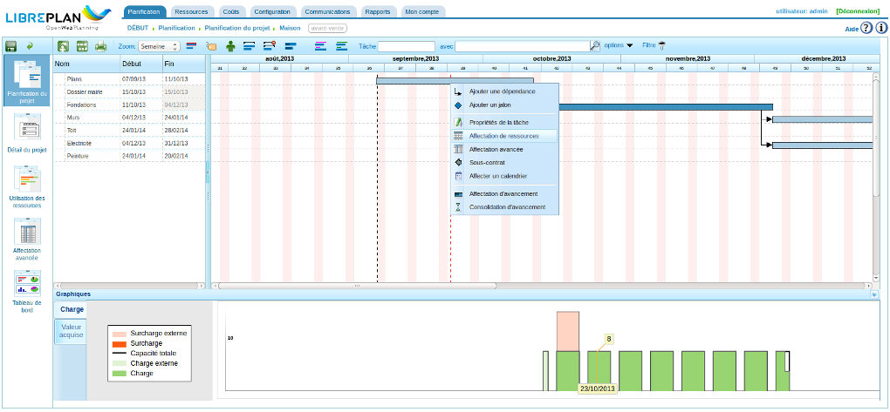
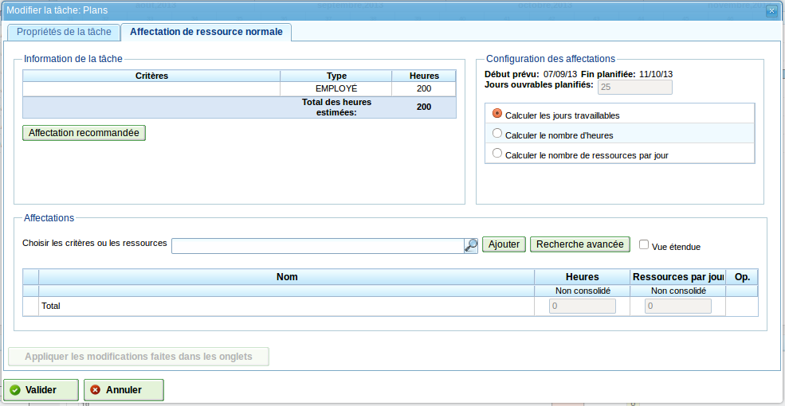
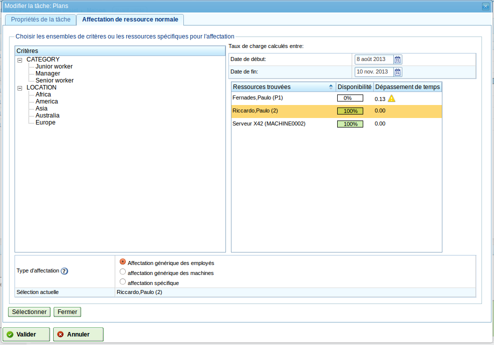
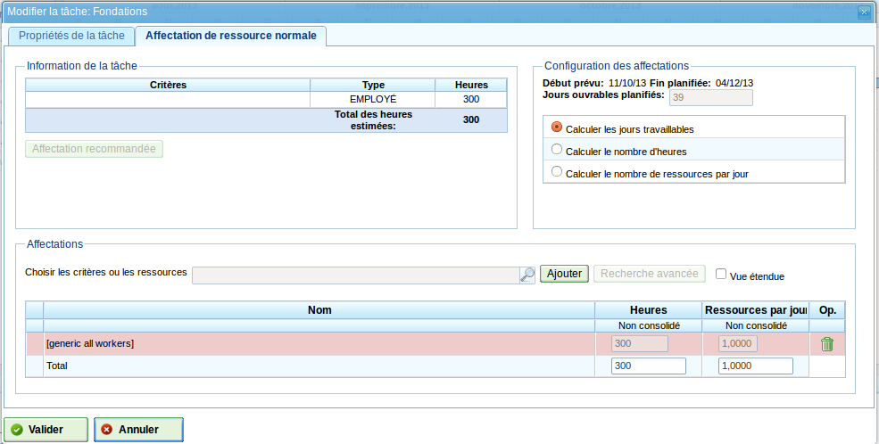
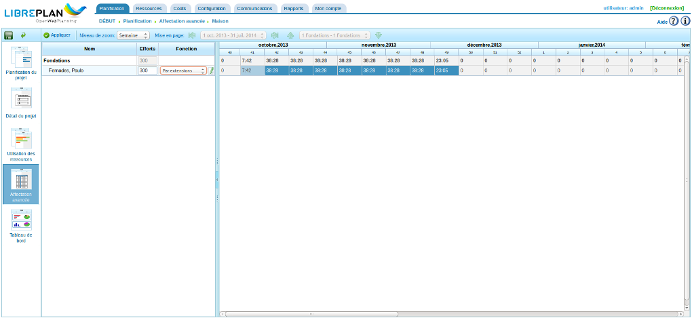
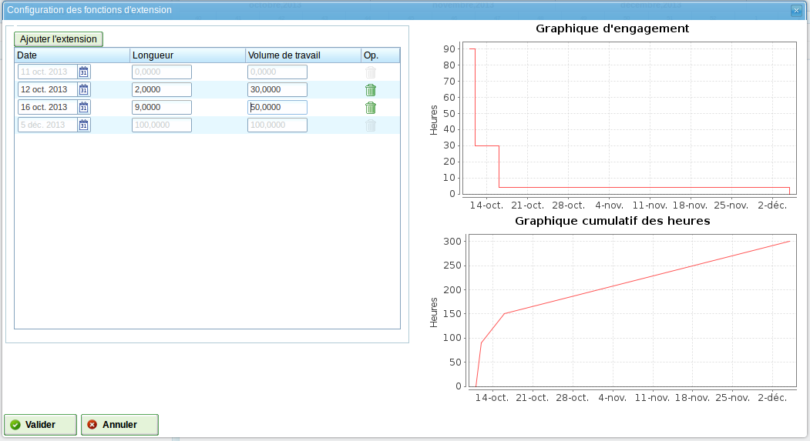

Affectation des ressources
##########################

.. asigacion_
.. contents::

L'affectation des ressources est l'une des fonctionnalités les plus importantes du programme
et peut être réalisée de deux façons différentes :

* Affectation spécifique.

* Affectation générique.

Ces deux types d'affectations sont expliqués dans les sections suivantes.

Pour réaliser l'un ou l'autre de ces deux types d'affectation de ressources, procéder comme suit :

* Aller sur la planification d'un projet.

* Faire un clic droit sur la tâche à planifier et choisir le menu *Affectation de ressources*.

   Menu d'affectation de ressources

* S'affiche un écran dans lequel figurent les blocs suivants :

  * Information de la tâche : 

     * Liste des critères que la tâche doit voir satisfaits avec le type et le nombre d'heures associés. 
     * Affectation recommandée : cette option permet au programme de collecter les critères qui doivent être satisfaits et le nombre total d'heures de tous les groupes d'heures puis recommande une affectation générique. S'il existe une affectation antérieure, le système la supprime et la remplace avec la nouvelle.

  * Configuration d'affectation. Cet bloc contient :

     * Date de début et de fin de la tâche, 
     * Nombre de jours ouvrés,
     * Type de calcul : le système permet aux utilisateurs de choisir la stratégie à utiliser pour calculer les affectations :

        * calculer les jours de travail
        * calculer le nombre d'heures : calcule le nombre d'heures nécessaires à dédier aux ressources affectées étant donné la date de fin et le nombre de ressources disponibles par jour.
        * Calculer le nombre de ressources par jour : calcule le nombre de ressources nécessaires pour finir la tâche à la date prévue et dédie à cette dernière le nombre d'heures correspondant.
        
  * Affectations, bloc contenant : 

     * Un champ de recherche des critères et des ressources, un bouton *Ajouter* et un bouton *Recherche avancée* décrits plus loin.
     * Case à cocher *vue étendue*. En cochant cette case, la liste des affectations décrite ci-dessous est enrichie d'informations complémentaires : heures à l'origine, au total et consolidées et nombre de ressources total et consolidé.
     * La liste des affectations qui ont été réalisées. Cette liste montre les affectations génériques avec le nombre non consolidé d'heures et de ressources par jour. Chaque affectation réalisée peut explicitement être retirée en cliquant sur le bouton supprimer correspondant.

     * Saisir tout ou partie du nom d'un critère ou d'une ressource
     * Cliquer sur *Ajouter*.
     * En mode *Calculer les jours de travail*, il est alors possible de modifier le nombre total d'heures non consolidées et chaque nombre de ressources non consolidées par jour.
     * En mode *Calculer le nombre d'heures*, seuls le nombre de ressources non consolidées est modifiable.
     * En mode *Calculer le nombre de ressources par jour*, seul le nombre d'heures non consolidé est modifiable.

   Affectation de ressources

Pour réaliser une affectation en mode avancé, cliquer sur *Recherche avancée*.

En bas de l'écran, il est possible de choisir :

* affectation générique des employés (par défaut) 
* affectation générique des machines
* affectation spécifique

Voir les sections "affectation générique" et "affectation spécifique" pour voir ce que ce choix implique.

* Le programme affiche un nouvel écran comportant à gauche l'arbre de critères et à droite la liste des employés (respectivement des machines ou des employés et des machines selon le type choisi précédemment) qui remplissent les critères sélectionnés (il est possible d'en sélectionner plusieurs à l'aide de la touche CTRL). La liste affiche également le taux de disponibilité et les dépassements de temps. Le taux d'utilisation est calculé entre les dates modifiables indiquées au-dessus.

.. figure:: images/resource-assignment-search.png
   :scale: 50

   Recherche des affectations de ressource

* Cliquer alors sur *Sélectionner*. Dans le cas d'une affectation spécifique, il faut obligatoirement choisir un ou plusieurs employés ou machines, sinon aucune affectation ne sera réalisée.

* Le programme affiche alors les ressources sélectionnées (par critère générique ou par valeurs spécifiques) dans la liste des affectations de l'écran originel d'affectation des ressources.

* On peut alors choisir les heures ou le nombre de ressources par jour comme indiqué précédemment selon le mode de calcul choisi.

Affection spécifique
====================

C'est l'affectation spécifique d'une ressource à une tâche projet, i.e. on décide quel "nom et prénom(s)" ou "machine" doit être affecté à une tâche.

L'affectation spécifique peut être réalisée sur l'écran affiché ci-après :

   Affectation de ressource spécifique

Quand une ressource est spécifiquement affectée, le programme crée des affectations journalières en relation avec le pourcentage de ressources journalières affectées choisies en les comparant au préalable avec le calendrier des ressources disponibles. Par exemple, une affectation de 0,5 ressource pour une tâche de 32 heures signifie que 4 heures par jour sont affectées à une ressource spécifique pour remplir la tâche (en supposant un calendrier de 8 heures par jour).

Affectation spécifique d'une machine
------------------------------------

L'affectation spécifique d'une machine fonctionne de la même façon que celle d'un employé. Quand une machine est affectée à une tâche, le système enregistre une affectation spécifique d'heures pour la machine choisie. La principale différence est que le système recherche la liste des employés ou des critères affectés au moment où la machine est affectée :

* Si la machine possède une liste d'employés affectés, le programme choisit parmi eux ce qui est nécessaire pour la machine pour le calendrier affecté. Par exemple, si le calendrier de la machine est de 16 heures par jour et que le calendrier des ressources est de 8 heures par jour, deux ressources sont affectées depuis la liste des ressources disponibles.

* Si la machine possède un ou plusieurs critères affectés, des affectations génériques sont réalisées parmi les ressources qui satisfont les critères affectés à la machine.

Affectation générique
=====================

L'affectation générique se produit quand on ne choisit pas les ressources spécifiquement, mais qu'on laisse la décision au programme qui distribue alors la charge entre les ressources de la compagnie qui sont disponibles.

   Affectation générique de ressources

Le système d'affectation utilise les hypothèses suivantes :

* Les tâches ont des critères qui sont demandés aux ressources.

* Les ressources sont configurées pour remplir ces critères.

Cependant, le système n'échoue pas quand les critères n'ont pas été affectés, mais quand toutes les ressources remplissent la non satisfaction de ces critères.

L'algorithme d'affectation générique fonctionne de la manière suivante :

* Toutes les ressources et les jours sont traités comme des conteneurs dans lesquels les affectations quotidiennes d'heures entrent, en se basant sur la capacité d'affectation maximum du calendrier des tâches.

* Le système cherche les ressources qui remplissent le critère.

* Le système analyse quelles affectations possèdent actuellement différentes ressources qui remplissent les critères.

* Les ressources qui remplissent les critères sont choisies parmi celles qui possèdent une disponibilité suffisante.

* Si des ressources libres ne sont pas disponibles, les affectations sont faites pour les ressources qui ont moins de disponibilité.

* Une sur-affectation des ressources ne démarre que quand toutes les ressources qui remplissent les critères respectifs sont affectées à 100% et jusqu'à ce que le nombre total requis pour réaliser la tâche soit atteint.

Affectation générique de machine
--------------------------------

L'affectation générique de machine fonctionne de la même façon que celle des employés. Par exemple, quand une machine est affectée à un tâche, le système enregistre une affectation générique d'heures pour toutes les machines qui remplissent les critères comme décrit pour les ressources en général. Cependant, le système réalise en plus la procédure suivante pour les machines :

* Pour toutes les machines choisies pour l'affectation générique :

  * On collecte les informations de configuration des machines : valeur alpha, employés affectés et critères.

  * Si la machine possède une liste d'employés affectés, le programme choisit le nombre requis par la machine en fonction du calendrier affecté. Par exemple, si le calendrier de la machine est de 16 heures par jour et le calendrier des ressources est de 8 heures, le programme affecte deux ressources à partir de la liste des ressources disponibles.

  * Si la machine possède un ou plusieurs critères affectés, le programme fait des affectations génériques parmi les ressources qui remplissent ces critères affectés à la machine.

Affectation avancée
===================

Les affectations avancées permettent de personnaliser la façon dont les affectations automatiques sont réalisées. Cette procédure permet de choisir manuellement les heures d'un jour qui sont dédiées par les ressources aux tâches auxquelles elles sont affectées ou de définir une fonction qui est utilisée lors de cette affectation.

Les étapes à suivre pour gérer les affectations avancées sont :

* Aller à la fenêtre de l'affectation avancée. Il y a deux façon d'accéder aux affectations avancées :

  * Aller sur un projet particulier et choisir la perspective *affectation avancée*. Dans ce cas, toutes les tâches du projet et toutes les ressources affectées (spécifiques et génériques) seront affichées.

  * Aller à la fenêtre d'affectation avancée en cliquant sur le bouton "Affectation avancée". Dans ce cas, seules les affectations impliquant les ressources (génériques et spécifiques) affectées à cette tâche seront affichées.

   Affectation de ressource avancée

* Il est possible de choisir le niveau de zoom nécessaire :

  * Si le zoom choisi est supérieur à un jour, si on change la valeur horaire affectée à une semaine, un mois, un trimestre ou un semestre, le système distribue les heures linéairement sur tous les jours de la période choisie.

  * Si le zoom choisi est un jour, si on change la valeur horaire affectée à un jour, ces heures ne s'appliquent qu'à ce jour. En conséquence, il est possible de décider combien d'heures on veut affecter par jour aux ressources des tâches.

* On peut choisir de paramétrer une fonction d'affectation avancée. Pour ce faire, il faut :

  * Choisir la fonction dans la liste de choix qui apparaît à côté de chaque ressource et cliquer sur "Configurer" si la fonction le permet :

     * linéaire 
     * manuelle
     * par extension : configurable
     * par interpolations : configurable
     * sigmoïde

  * Dans le cas des fonctions par extension ou interpolations, s'affiche une nouvelle fenêtre quand on clique sur *Configurer*. On peut alors ajouter une extension via le bouton du même nom. La ligne ajoutée permet de configurer les éléments suivants :

    * Date : Date à laquelle le segment se termine. Si ce champ est modifié, la longueur (champ suivant) est automatiquement mis à jour, et vice-versa.

    * Longueur : Définir la longueur du segment, i.e. le pourcentage de la durée de la tâche pour ce segment. Si ce champ est modifié, la date de fin (champ précédent) est automatiquement mis à jour, et vice-versa.
    * Volume de travail : le pourcentage de charge devant être réalisé durant ce segment. Ce pourcentage doit être incrémental. Par exemple, s'il y a un segment à 10%, le suivant doit être plus grand (20% par exemple).

    * Dans cette fenêtre, à droite, on trouvera un graphique d'engagement et un graphique des heures cumulées correspondant aux réglages effectués.

  * Cliquer sur "Accepter" : la fonction est enregistrée et appliquée aux affectations de ressources quotidiennes.

   Configuration d'une fonction d'affectation avancée

