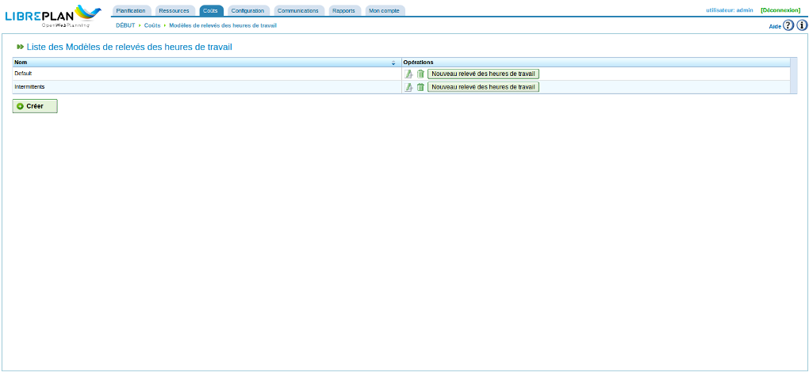
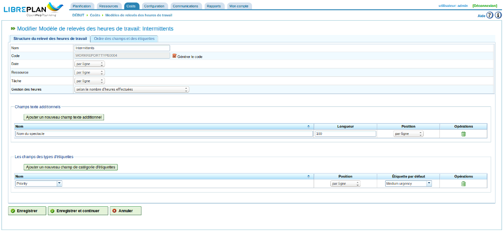
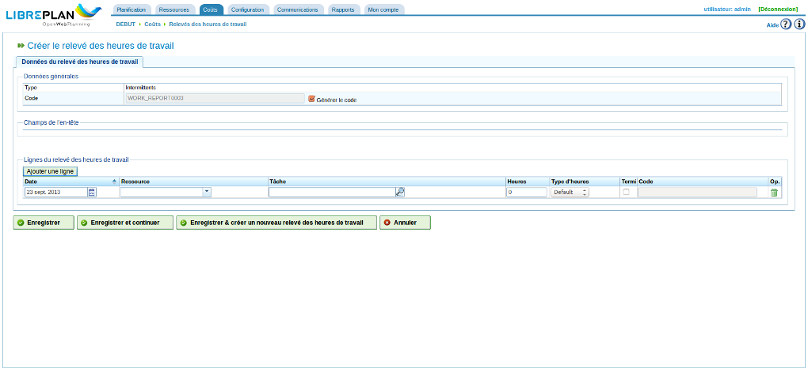

Relevés des heures de travail
#############################

.. contents::

Les relevés des heures de travail (Timesheet) permettent de suivre les heures de travail que les ressources ont consacrées aux tâches planifiées.

Le programme permet de configurer de nouveaux modèles de relevé des heures de travail en indiquant les champs qu'on veut voir apparaître afin de pouvoir y renseigner les relevés relatifs aux tâches qui sont réalisées par les employés dont on peut ainsi suivre l'activité.

Avant de pouvoir saisir un relevé d'heures de travail pour une ressource, il faut au minimum préciser le modèle de relevé des heures de travail qui en définit la structure qui contiendra toutes les lignes qui lui seront ajoutées. Il est possible de créer autant de relevés d'heures de travail que nécessaire.

Modèle de relevé des heures de travail
======================================

Un relevé des heures de travail possède une série de champs qui s'appliquent à l'ensemble du rapport et une série de lignes de relevé d'heures de travail possédant des valeurs spécifiques pour ces champs. Par exemple, les ressources et les tâches sont communes à tous les rapports mais on peut trouver de nouveaux champs tels que "incidents" que l'on ne retrouvera pas nécessairement dans tous les modèles.

Il est possible de définir différents modèles de relevés des heures de travail pour correspondre aux besoins de la compagnie.

   Modèles de relevés des heures de travail

La gestion des modèles de relevés des heures de travail permet de configurer ces caractéristiques et d'ajouter de nouveaux champs texte ou des étiquettes additionnels. Dans le premier onglet de modification des modèles de relevé des heures de travail, accessible via le menu *Coûts*, sous-menu *Modèles des relevés des heures de travail*, il est possible de préciser le type des attributs obligatoires (c'est-à-dire s'ils s'appliquent à l'ensemble du relevé ou s'ils doivent être renseignés ligne par ligne). On peut également ajouter des champs et des étiquettes additionnels.

Les champs obligatoires qui doivent apparaître dans tous les relevés des heures de travail sont les suivants :

* Nom et code : Nom et code du modèle de relevé des heures de travail
* Date : champ pour la date du relevé des heures de travail
* Ressource : employé ou machine apparaissant dans le relevé ou la ligne du relevé des heures de travail.
* Tâche : code de la tâche à laquelle le travail réalisé est attribué.
* Gestion des heures (détermine la politique d'attribution des heures réalisées) qui peut être :
   * selon le nombre d'heures effectuées.
   * selon les heures de début et de fin.
   * selon le nombre d'heures effectuées et les heures de début et de fin (les interruptions sont autorisées et le nombre d'heures l'emporte).

Il est possible d'ajouter de nouveaux champs au relevé des heures de travail :

* Catégorie d'étiquettes : permet de demander de préciser une étiquette lors de la saisie d'un relevé ou d'une ligne de relevé des heures de travail. Par exemple, la catégorie "Client" pour permettre d'indiquer le client pour lequel le travail a été effectué. 

* Champs texte additionnels : champs dans lesquels du texte peut être saisi librement.

   Créer un modèle de relevé des heures de travail avec des données personnalisées

On peut configurer les champs date, ressource et tâche de façon à ce qu'ils apparaissent dans l'en-tête du relevé des heures de travail, ce qui signifie qu'ils s'appliquent globalement au relevé entier, ou bien pour qu'ils doivent être renseignés pour chaque ligne du relevé des heures de travail.

De même, les champs texte et les étiquettes additionnels qui peuvent être ajoutés au relevé des heures de travail peuvent s'appliquer au relevé dans sa globalité ou devoir être renseignés pour chaque ligne. Il est également possible de configurer l'ordre dans lequel ils apparaissent via l'onglet "Ordre des champs texte et des étiquettes additionnels".

Un modèle ne peut plus être modifié à partir du moment où des relevés lui sont attachés.

Liste des relevés des heures de travail
=======================================

Dès que le format des relevés des heures de travail a été configuré, il est possible de saisir des informations dans des formulaires correspondant à ce format de la façon suivante :

* Cliquer sur le bouton "Nouveau relevé des heures de travail" associé au modèle de relevé souhaité dans la liste accessible via le menu *Coûts*, sous-menu *Modèles des relevés des heures de travail*.
* S'affiche alors un relevé conforme à la configuration du modèle dont il est issu. Voir l'image suivante :

   Structure du relevé des heures de travail conforme au modèle associé

* Renseigner tous les champs affichés pour le relevé :

   * Ressource : si ce champ est configuré pour apparaître dans l'en-tête, la ressource n'est affichée qu'une fois. Dans le cas contraire, il faut sélectionner une valeur pour chaque ligne du relevé.
   * Date : date du relevé ou de chaque ligne, selon que la date est configurée pour apparaître dans l'en-tête ou sur chaque ligne.
   * nombre d'heures : le nombre d'heures de travail effectuées par la ressource à la date indiquée pour la tâche considérée (mode de calcul selon le nombre d'heures effectuées ou selon le nombre d'heures effectuées et les heures de début et de fin).
   * Heures de début et de fin : Les heures (heures et minutes) de début et de fin du travail de façon à calculer le nombre d'heures de travail effectuées. Ce champ n'apparaît que dans le cas des politiques d'affectation des heures "Selon les heures de début et de fin" et "Selon le nombre d'heures effectuées et les heures de début et de fin".
   * Type d'heures : permet aux utilisateurs de choisir le type d'heures, par exemple "par défaut", "heures supplémentaires", etc.
   * Terminée : si la case est cochée, signale que cette ligne de relevé des heures de travail marque l'achèvement de la tâche concernée.
   * Code de la tâche : est renseigné automatiquement quand la ressource est indiquée, soit une seule fois si le champ doit apparaître dans l'en-tête, soit à chaque ligne dans le cas contraire.

* Cliquer sur "Enregistrer", "Enregistrer et continuer" ou "Enregistrer et créer un nouveau relevé des heures de travail".

