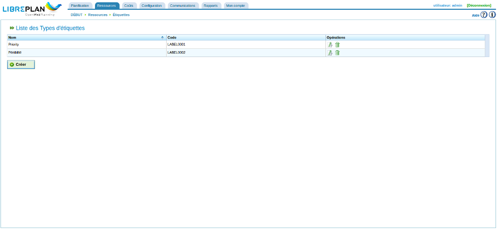
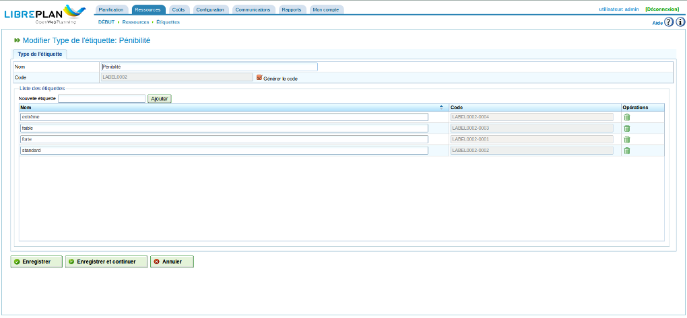

Étiquettes
##########

.. contents::

Les étiquettes sont des entités utilisées dans le programme pour organiser conceptuellement les tâches.

Les étiquettes sont organisées par catégorie. Une étiquette ne peut appartenir qu'à une seule catégorie d'étiquettes mais il est possible de créer des étiquettes de même nom dans deux catégories différentes.

Catégories d'étiquettes
=======================

Les catégories d'étiquettes sont utilisées pour grouper les étiquettes qu'on veut utiliser. Voici quelques exemples de catégories d'étiquettes possibles :

On peut vouloir étiqueter les tâches ou les projets :

i. Client : selon les clients à l'origine des travaux ou qui en seront les bénéficiaires.
ii. Zone :  selon les zones géographiques dans lesquelles ils sont réalisés.

Les catégories d'étiquettes sont gérées via le menu *Ressources*, sous-menu *Étiquettes*. C'est à partir de là que l'on peut modifier les catégories d'étiquettes, en créer de nouvelles ou ajouter des étiquettes à ces catégories. Les étiquettes sont également accessibles à partir de cet écran.

   Liste des catégories d'étiquettes

À partir de la liste des catégories d'étiquettes, on peut :

i. Créer une nouvelle catégorie d'étiquettes.
ii. Modifier une catégorie d'étiquettes existante.
iii. Supprimer une catégorie d'étiquettes avec toutes les étiquettes qui lui sont associées.

À partir de ce formulaire, il est possible de donner un nom au type d'étiquettes, créer ou supprimer des étiquettes et enregistrer les modifications. Procéder comme suit :

i. Choisir une catégorie d'étiquettes à modifier ou cliquer sur le bouton *Créer* pour en créer une nouvelle.
ii. Le système affiche le formulaire avec un champ texte pour saisir le nom d'une nouvelle étiquette et une liste de lignes avec chacune un champ texte pour les étiquettes déjà existantes.
iii. Pour ajouter une nouvelle étiquette, saisir son nom dans le champ *Nouvelle étiquette*  et cliquer sur le bouton *Ajouter*. 
iv. Le système affiche une nouvelle ligne dans la liste avec une boîte de texte contenant le nom qui vient d'être saisi, ce qui permet de le modifier.
v. Cliquer sur "Enregistrer" ou "Enregistrer et continuer" pour continuer à modifier le formulaire.

   Modifier les types d'étiquettes

Étiquettes
==========

Les étiquettes sont des entités qui sont rattachées à une catégorie d'étiquettes. Ces entités peuvent être affectées aux tâches. Affecter une étiquette à une tâche signifie que toutes les sous-tâches de cette tâche vont hériter de cette étiquette. Cette étiquette peut alors être utilisée pour filtrer les résultats des recherches de tâches suivantes :

i. Recherche de tâches dans le diagramme de Gantt.
ii. Recherche de tâches depuis la liste des tâches.
iii. Recherche dans les relevés des heures de travail et les rapports.

L'affectation des étiquettes aux tâches est décrite dans le chapitre relatif aux projets.

