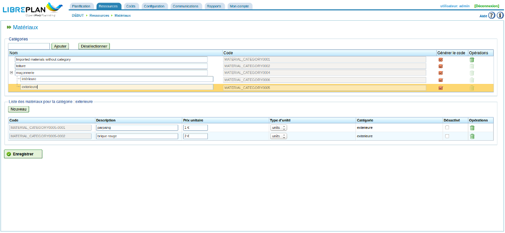

Matériaux
#########
.. _materiales:
.. contents::

Gestion des matériaux
=====================

On peut gérer une base de données rudimentaire de matériaux organisés par catégories.

Les catégories sont des conteneurs auxquels on peut affecter des matériaux spécifiques ainsi que d'autres catégories. Elles sont enregistrées dans une structure arborescente et les matériaux peuvent appartenir à une feuille ou à des catégories intermédiaires.

Procéder comme suit pour gérer les catégories :

* Utiliser le menu *Ressources*, sous-menu *Matériaux*.
* Le programme affiche un arbre des catégories des matériaux.
* Sélectionner éventuellement une catégorie dans l'arbre puis saisir un nom de catégorie dans le champs texte.
* Cliquer sur le bouton *Ajouter*.

La catégorie est alors ajoutée dans l'arbre, comme sous-catégorie de la catégorie sélectionnée ou comme catégorie de premier niveau sinon.
Cliquer le bouton *Désélectionner* pour ne plus avoir de catégorie sélectionnée.

   Écran de gestion des matériaux

Pour gérer les matériaux proprement dit, procéder comme suit :

* Choisir la catégorie dans laquelle inclure les matériaux puis cliquer sur "Nouveau" en haut de la seconde liste.
* Le programme ajoute une nouvelle ligne vide avec des champs pour saisir les détails relatifs à ce nouveau matériau :

   * Code : code du type de matériau (qui peut être un code externe provenant d'un ERP ou un code généré automatiquement par le système; dans le premier cas, la case "Générer le code" est décochée dans l'arbre des catégories).
   * Description : description du matériau.
   * Prix de l'unité : prix unitaire de chaque unité de matériau.
   * Unité : unité qui est utilisée pour mesurer la quantité de matériau.
   * Catégorie : catégorie à laquelle il appartient (lecture seule).
   * Désactivé : si la case est cochée, le matériau ne sera pas disponible.

* Cliquer sur *Enregistrer* une fois les champs renseignés.

L'affectation des matériaux aux tâches est expliquée dans le chapitre "Projets".

