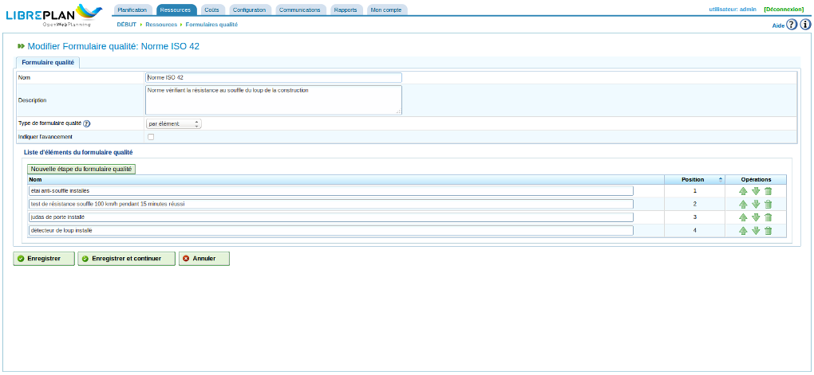

Formulaires qualité
###################

.. _calidad:
.. contents::

Gestion des formulaires qualité
===============================

Les formulaires qualité sont composés d'une liste de questions destinées à vérifier que les différentes étapes nécessaires pour qu'une tâche puisse être considérée comme achevée par la compagnie ont été correctement réalisées. Ces formulaires comprennent les champs suivants :

* Nom
* Description
* Type de formulaire qualité. Le type peut prendre deux valeurs :

   * pourcentage : indique que les questions doivent avoir un ordre logique et des réponses affirmatives aux questions indiquent que la tâche avance. Par exemple, une étape simple pour une tâche indique suggère que celle-ci est complétée à 15%. Il faut cocher la case correspondant à cette étape avant de pouvoir passer à la suivante.
   * Élément : indique que les questions ne nécessitent pas d'avoir un ordre logique et, de ce fait, il est possible d'y répondre dans l'ordre que l'on souhaite.

* Case à cocher indiquant si l'avancement doit être rapporté.

Suivre les étapes suivantes pour gérer les formulaires qualité :

* À partir du menu *Ressources*, accéder au sous-menu *Formulaires qualité*.
* Cliquer sur modifier pour modifier un formulaire existant sur le bouton "Créer" pour en créer un nouveau.
* Le programme affiche un formulaire avec un nom, une description, un type et la case à cocher pour rapporter l'avancement.
* Choisir le type.

* Cliquer sur *Nouvelle étape du formulaire qualité* : les champs requis pour le type choisi s'affichent :

   * par pourcentage : question et pourcentage.
   * par élément : question.

* Cliquer sur "Enregistrer" ou "Enregistrer et continuer".

   Gestion des formulaires qualité

