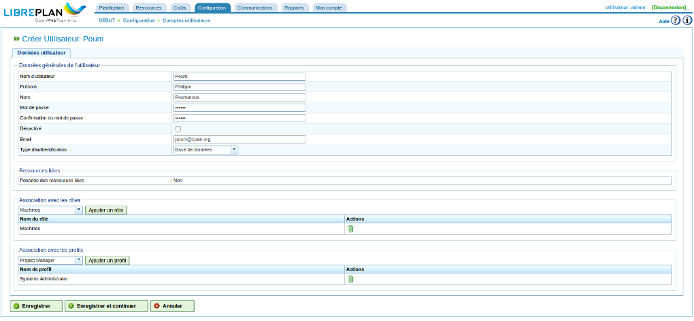

Utilisateurs
############

.. _tareas:
.. contents::

Gestion des utilisateurs
=========================

"LibrePlan" permet de gérer des profils, des autorisations et des utilisateurs. Les utilisateurs appartiennent à des profils utilisateurs qui peuvent disposer d'une série de rôles prédéfinis pour accéder aux fonctions du programme. Les rôles sont des autorisations définies dans "LibrePlan". Exemples de rôles :

* Administration : un rôle auxquels les administrateurs doivent être affectés de façon à pouvoir réaliser des opérations d'administration.
* Lecteur de web service : un rôle pour les utilisateurs qui ont besoin de pouvoir consulter des informations via les web services du programme.
* Rédacteur de web service : un rôle pour les utilisateurs qui ont besoin d'écrire des informations dans LibrePlan via les web services du programme.

Les rôles sont prédéfinis dans le système. Le profil d'un utilisateur comporte un ou plusieurs rôles. Les utilisateurs doivent avoir certains rôles pour réaliser certaines opérations.

Les utilisateurs ont un ou plusieurs profils ou directement un ou plusieurs rôles de sorte que des autorisations spécifiques ou génériques peuvent être affectées.

Il est nécessaire de réaliser les étapes suivantes pour gérer les utilisateurs :

* Aller à "Comptes utilisateurs" dans le menu "Configuration".
* Le programme affiche un formulaire avec la liste des utilisateurs.
* Cliquer sur le bouton "Modifier" pour modifier un utilisateur choisi ou cliquer sur le bouton "Créer".
* Un formulaire va apparaître avec les champs suivants :

   * Nom d'utilisateur : l'identifiant de connexion
   * Prénom
   * Nom
   * Mot de passe et confirmation du mot de passe
   * Désactivé : si la case est cochée, le compte utilisateur correspondant est bloqué
   * Adresse de messagerie
   * Type d'authentification: choisir entre "Base de données" pour une gestion par LibrePlan et "LDAP" pour déléguer cette fonction à un annuaire LDAP (cf. le chapitre LDAP).
   * Ressource liée : nom d'employé éventuellement associé à cet utilisateur
   * Liste des rôles associés : chercher l'un des rôles affichés dans la liste déroulante et cliquer sur "Ajouter un rôle" pour associer ce rôle à l'utilisateur.
   * Liste des profils associés : chercher l'un des profils affichés dans la liste déroulante et cliquer sur "Ajouter un profil" pour ajouter un nouveau profil.

   Gestion des utilisateurs

* Cliquer sur "Enregistrer" ou "Enregistrer et continuer".

Gérer les profils
-----------------

Suivre les étapes suivantes pour gérer les profils du programme.

* Utiliser le menu *Configuration*, sous-menu *Profils* : s'affiche la liste des profils.
* Le programme affiche une liste de profils.
* Cliquer sur le bouton modifier pour modifier le profil correspondant ou cliquer sur "Créer".
* Un formulaire apparaît avec les champs suivants :

   * Nom : le nom du profil
   * Liste des rôles (autorisations) associés au profil. Choisir un rôle dans la liste des rôles et cliquer sur "Ajouter un rôle" pour ajouter ce rôle au profil.

.. figure:: images/manage-user-profile.png
   :scale: 50

   Gérer les profils utilisateur

* Cliquer sur "Enregistrer" ou "Enregistrer et continuer".

