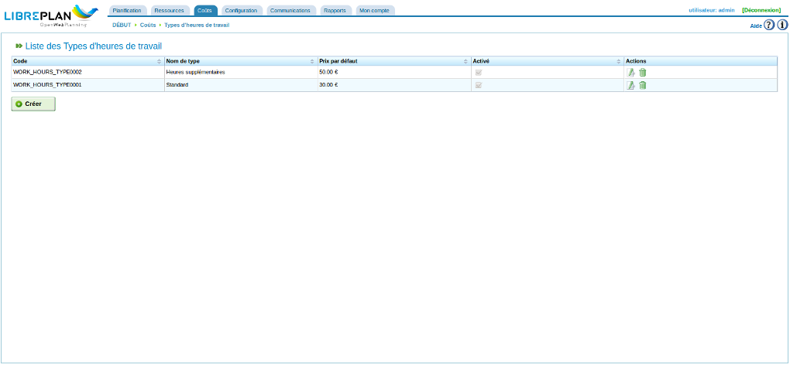
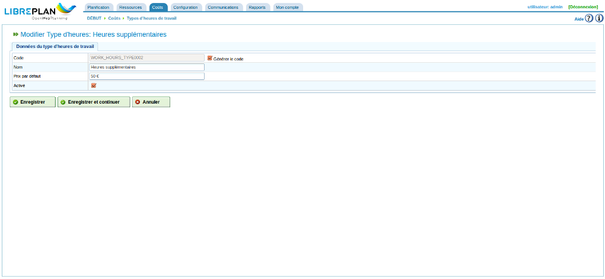

Gestion des coûts
#################

.. _costes:
.. contents::

Coûts
=====

La gestion des coûts permet aux utilisateurs d'estimer les coûts des ressources utilisées dans un projet. De façon à gérer ces coûts, les entités suivantes doivent être indiquées :

* type d'heures de travail : ceci indique le type d'heures de travail pour la ressource. On peut ajouter des types d'heures pour les machines et les employés. Un exemple de type d'heures pourrait être : heures supplémentaires, payées généralement 20€. Les champs suivant définissent les types d'heures de travail :

   * Code : code pour le type d'heures, modifiable s'il n'est pas généré automatiquement
   * Nom : nom du type d'heures. Par exemple, "supplémentaire".
   * Prix par défaut : prix par défaut pour le type d'heures.
   * Activé : indique si le type d'heures est activé ou pas.

* Catégories de coûts : indiquent les catégories de coûts à utiliser pour calculer les coûts en fonction du type d'heures et de la période (ces périodes peuvent ne pas être limitées dans le temps). Par exemple, le coûts des heures supplémentaires pour des employés de première catégorie de qualification pour l'année à venir est de 24€ par heure. Les catégories de coûts comportent les informations suivantes :

   * Nom : nom de la catégorie de coûts.
   * Activé : indique si la catégorie de coûts est activée ou non.
   * Liste des types d'heures affectés aux catégories de coûts. Elle contient plusieurs périodes et le prix associé pour ces types d'heures. Par exemple, comme les prix changent, on pourra trouver une période couvrant chaque année associée à un type d'heures et un prix horaire différent pour chacune (qui pourra être différent du prix par défaut associé au type d'heures concerné).

Gestion des types d'heures de travail
-------------------------------------

Pour gérer les types d'heures de travail, procéder comme suit :

* Choisir le menu *Coûts*, sous-menu *Types d'heures de travail*. 
* Le programme affiche une liste des types d'heures existants.

   Liste des types d'heures de travail

* Cliquer sur "Modifier" ou "Créer".
* Le programme affiche un formulaire de modification du type d'heures de travail.

   Modifier les types d'heures de travail

* Saisir ou modifier :

   * le nom du type d'heures de travail.
   * le code du type d'heures si ce code n'est pas généré automatiquement.
   * le prix par défaut.
   * l'activation/désactivation du type d'heures de travail.

* Cliquer sur "Enregistrer" ou "Enregistrer et continuer".

Catégories de coûts
-------------------

Procéder comme suit pour créer ou modifier une catégorie de coûts :

* Choisir le menu *Coûts*, sous-menu *Catégories de coûts*.
* Le programme affiche une liste des catégories de coûts existantes.

.. figure:: images/category-cost-list.png
   :scale: 50

   Liste des catégories de coûts

* Cliquer sur le bouton "Modifier" ou "Créer".
* Le programme affiche un formulaire de modification d'une catégorie de coûts.

.. figure:: images/category-cost-edit.png
   :scale: 50

   Modifier une catégorie de coûts

* Saisir ou modifier :

   * Le code s'il n'est pas généré automatiquement.
   * Le nom de la catégorie de coûts.
   * L'activation/désactivation de la catégorie de coût.
   * La liste des types d'heures inclus dans la catégorie. Tous les types d'heures possèdent les champs suivants :

      * Type d'heures : choisir l'un des types d'heures existant dans le système. Il doit exister au moins un type avant de procéder (la création des types d'heures est expliquée dans la sous-section précédente).
      * Prix horaire associé.
      * Date de début et de fin (cette dernière est facultative) pour la période durant laquelle s'applique la catégorie de coûts.

* Cliquer sur "Enregistrer" ou "Enregistrer et continuer".

L'affectation des catégories de coûts aux ressources est décrite dans le chapitre "Ressources".

